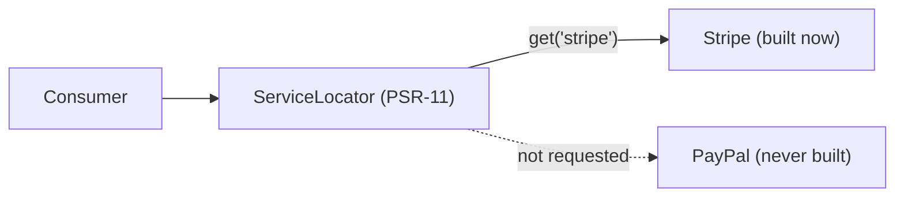

# Service Locators

!!! tip "In a nutshell"
    A service locator is a small PSR-11 container holding a fixed, declared set of
    services it builds **lazily** on `get()` — the sanctioned alternative to
    injecting the whole container. Highest-yield fact: build one with
    `#[AutowireLocator]`, or subscribe via `ServiceSubscriberInterface` +
    `ServiceMethodsSubscriberTrait` (not the deprecated `ServiceSubscriberTrait`).

!!! example "Real-world analogy"
    A service locator is the specials board: a short, fixed list of dishes the
    kitchen *can* make on request. Nothing is cooked until you point at one
    (`get('stripe')`) — order the Stripe special and only that pan is lit; the
    PayPal one stays cold. Point at a dish that isn't chalked up and the kitchen
    tells you it doesn't exist (a not-found error), because the board is finalised
    ahead of service.

!!! abstract "Learning objectives"
    By the end of this chapter you can:

    - [ ] Explain what a `ServiceLocator` is and how it differs from injecting all
          services.
    - [ ] Build one with `#[AutowireLocator]`.
    - [ ] Implement a service subscriber with `ServiceSubscriberInterface` /
          `#[SubscribedService]`.

    **Syllabus:** `Dependency Injection → Service Locators` ·
    **Level:** Expert ·
    **Est. time:** 35 min ·
    **Prerequisites:** [Tags](tags.md)

    **Examen Symfony 8 :** OUI

---

## Pour les nuls

### L'idée en une phrase
Un service locator est une petite boîte contenant un ensemble fixe de services, construits **paresseusement** seulement quand tu les demandes.

### Imagine dans la vraie vie
Un service locator est le tableau des suggestions du jour : une liste courte et fixe de plats que la cuisine *peut* faire sur demande. Rien n'est cuisiné tant que tu ne pointes pas vers un plat (`get('stripe')`) — commande le spécial Stripe et seule cette poêle s'allume ; celle de PayPal reste froide.

### Dans Symfony
Un service qui doit choisir parmi plusieurs passerelles de paiement selon la config n'a pas besoin d'injecter les 5 passerelles à chaque fois — un service locator n'en construit qu'une seule, celle réellement utilisée.

### Exemple simple
```php
public function __construct(
    #[AutowireLocator(['stripe' => StripeGateway::class, 'paypal' => PaypalGateway::class])]
    private ServiceLocator $passerelles,
) {}
```

### Comment le mémoriser 🧠
C'est **l'alternative sanctionnée** à l'injection du container entier — jamais injecter `ContainerInterface` directement dans un service applicatif, c'est un anti-pattern classique repéré par l'examen.

---

## Theory

A **service locator** is a small, container-like object holding a *fixed, declared*
set of services that it instantiates **lazily** on `get()`. It is the sanctioned
answer to "I might need one of several services, but not all, and not eagerly."
Unlike injecting the whole container (an anti-pattern), a locator exposes only an
explicit whitelist — dependencies stay honest and analysable.

!!! question "Predict first"
    You call `$locator->get($key)` with a key that was never declared in the
    locator. Do you get `null` or an exception?

??? note "Reveal"
    An **exception** (`ServiceNotFoundException`) — a locator's set is fixed at
    compile time and has no "null on miss" mode. Check `has($key)` before `get()`
    when the key is dynamic or user-supplied.

## Deep Dive — how it works internally

### `ServiceLocator`

`Symfony\Component\DependencyInjection\ServiceLocator` implements PSR-11
`Psr\Container\ContainerInterface`. Its `get($id)` builds the service on first
access and caches it; `has($id)` checks membership. Because the set is declared at
compile time, the container knows exactly which services the locator can reach —
they are *not* removed as "unused", and each is created only if actually requested.

```php
use Psr\Container\ContainerInterface;
use Symfony\Component\DependencyInjection\ServiceLocator;

/** @var ServiceLocator $locator — implements PSR-11 ContainerInterface */
$locator instanceof ContainerInterface; // true

$locator->has('stripe');                // has($id): membership, builds nothing
$gateway = $locator->get('stripe');     // get($id): built on FIRST access
$same = $locator->get('stripe');        // cached — same instance returned
```

### Locator vs injecting everything

Injecting all candidate services eagerly instantiates them, even the ones you never
use in a given request. A locator defers construction until `get()`. This matters
when candidates are heavy (DB clients, HTTP clients) and only one is chosen per
request — e.g. a payment gateway selected by name.



### Service subscribers

A **service subscriber** declares the services it *may* need via
`Symfony\Contracts\Service\ServiceSubscriberInterface::getSubscribedServices()`,
and the container injects a locator into a `$container` property (via
`ServiceMethodsSubscriberTrait` or a constructor arg — the older
`ServiceSubscriberTrait` was **deprecated in 7.1**, use
`ServiceMethodsSubscriberTrait`). In Symfony 8 you annotate methods
with `#[SubscribedService]` and use the trait — the return type of the method is
the service type. This is how the base `AbstractController` gets `twig`, `router`,
etc. lazily.

```php
use Symfony\Contracts\Service\Attribute\SubscribedService;
use Symfony\Contracts\Service\ServiceMethodsSubscriberTrait; // NOT ServiceSubscriberTrait (deprecated 7.1)
use Symfony\Contracts\Service\ServiceSubscriberInterface;

final class Dashboard implements ServiceSubscriberInterface
{
    // Provides getSubscribedServices() and the $container locator property.
    use ServiceMethodsSubscriberTrait;

    // Return type = service type; fetched lazily,
    // like AbstractController does for twig / router.
    #[SubscribedService]
    private function twig(): \Twig\Environment
    {
        return $this->container->get(__FUNCTION__);
    }
}
```

### `#[AutowireLocator]`

The modern shortcut: `#[AutowireLocator([...])]` on a constructor parameter builds a
locator from a list of service ids/classes or from a **tag** (see [Tags](tags.md)),
optionally keyed by an index. No interface to implement.

!!! note "Source reference"
    `Symfony\Component\DependencyInjection\ServiceLocator` &
    `Symfony\Contracts\Service\ServiceSubscriberInterface` —
    [symfony/symfony `8.0`](https://github.com/symfony/symfony/blob/8.0/src/Symfony/Component/DependencyInjection/ServiceLocator.php).

### Null behavior

A locator's set is fixed at compile time, so asking for an id it does not hold
**throws**
`Symfony\Component\DependencyInjection\Exception\ServiceNotFoundException` — it never
returns `null`. Guard first: `has($id)` returns a bool, so the safe pattern is
`$this->locator->has($id) ? $this->locator->get($id) : $fallback`. `get()` only
builds and returns a *declared* service; there is no "null on miss" mode as there is
on the main container. The common bug is calling `get($userSuppliedKey)` on an
untrusted value and getting an exception for keys outside the whitelist — validate
against `has()` (or the known key list) before fetching.

```php
$this->locator->get('unknown'); // throws ServiceNotFoundException — never null

// Safe pattern for dynamic / user-supplied keys: has() before get().
$gateway = $this->locator->has($id)
    ? $this->locator->get($id)  // declared: built (or reused) and returned
    : $fallback;
```

!!! note "Null in real life"
    Asking the specials board for a dish that was never chalked up gets you "no such
    thing" (exception), not an empty plate (null) — so read the board (`has()`)
    before you order.

## Configuration & code

=== "AutowireLocator"

    ```php
    <?php
    declare(strict_types=1);

    namespace App\Payment;

    use Psr\Container\ContainerInterface;
    use Symfony\Component\DependencyInjection\Attribute\AutowireLocator;

    final class PaymentProcessor
    {
        public function __construct(
            #[AutowireLocator([
                'stripe' => StripeGateway::class,
                'paypal' => PayPalGateway::class,
            ])]
            private readonly ContainerInterface $gateways,
        ) {}

        public function charge(string $name, int $amount): void
        {
            // Only the chosen gateway is instantiated.
            $this->gateways->get($name)->charge($amount);
        }
    }
    ```

=== "Service subscriber"

    ```php
    <?php
    declare(strict_types=1);

    namespace App\Payment;

    use Psr\Log\LoggerInterface;
    use Symfony\Contracts\Service\Attribute\SubscribedService;
    use Symfony\Contracts\Service\ServiceSubscriberInterface;
    use Symfony\Contracts\Service\ServiceMethodsSubscriberTrait;

    final class Reporter implements ServiceSubscriberInterface
    {
        use ServiceMethodsSubscriberTrait;

        #[SubscribedService]
        private function logger(): LoggerInterface
        {
            return $this->container->get(__FUNCTION__);
        }

        public function report(): void
        {
            $this->logger()->info('Report generated'); // lazily fetched
        }
    }
    ```

=== "YAML"

    ```yaml
    # config/services.yaml
    services:
        App\Payment\PaymentProcessor:
            arguments:
                $gateways: !service_locator
                    stripe: '@App\Payment\StripeGateway'
                    paypal: '@App\Payment\PayPalGateway'
    ```

## Best practices & anti-patterns

| ✅ Do | ❌ Avoid |
|---|---|
| Locator for pick-one-of-many | Injecting the whole container |
| Declare an explicit id list/tag | Hidden, undeclared dependencies |
| Use for heavy, rarely-used deps | Locator when you always use all |
| `#[AutowireLocator]` for brevity | Boilerplate subscriber when not needed |

## When (not) to use it / alternatives

Use a locator when only *one* of several services is needed per call and building
all would be wasteful, or to break a construction-time dependency cycle. If you
always iterate every service, inject a [`tagged_iterator`](tags.md). If you need
exactly one dependency, inject it directly — a locator adds needless indirection.

!!! danger "Certification traps"
    - A locator is **lazy**: services are built on `get()`, not up front.
    - It implements **PSR-11** (`Psr\Container\ContainerInterface`), not the
      Symfony container interface.
    - Its service set is **fixed at compile time** — you cannot fetch an id not in
      the list (throws not-found).
    - `getSubscribedServices()` declares *what may be needed*; the locator is
      injected, not the whole container.

!!! warning "Common mistakes"
    - Injecting `Symfony\..\ContainerInterface` to grab arbitrary services (the
      service-locator anti-pattern).
    - Expecting a locator to expose services you never declared.
    - Using a locator where a single constructor injection would do.

## Exercises

1. **(Expert)** Wire a `PaymentProcessor` that can build either a Stripe or PayPal
   gateway on demand, instantiating only the chosen one.
2. **(Expert)** Convert a class that eagerly injects `LoggerInterface` and `Twig`
   but rarely uses Twig into a service subscriber.

??? success "Solutions"

    **1.** Use `#[AutowireLocator(['stripe' => StripeGateway::class, 'paypal' =>
    PayPalGateway::class])] ContainerInterface $gateways`, then
    `$this->gateways->get($name)->charge(...)`. Only the requested gateway is built.

    **2.** Implement `ServiceSubscriberInterface` with
    `ServiceMethodsSubscriberTrait`, add `#[SubscribedService]` methods returning
    `LoggerInterface` and `Environment`, and fetch via `$this->container->get(...)`
    only when needed — Twig is never built unless used.

## Certification questions

*Question d'entraînement inspirée du syllabus — jamais une question officielle de l'examen.*

??? question "Q1. How is a `ServiceLocator` different from injecting the container?"
    - [x] A. It exposes only a declared, whitelisted set of services ✅
    - [ ] B. It is eager, the container is lazy
    - [ ] C. It cannot instantiate services
    - [ ] D. There is no difference

    **Why:** A locator's set is explicit and analysable; injecting the whole
    container hides dependencies. **Ref:** [Service subscribers & locators](https://symfony.com/doc/8.0/service_container/service_subscribers_locators.html).

??? question "Q2. When are locator services instantiated?"
    - [ ] A. All at construction
    - [x] B. Lazily, on `get()` ✅
    - [ ] C. At compile time
    - [ ] D. On kernel boot

    **Why:** A locator defers construction until a service is actually requested.
    **Ref:** [Service locators](https://symfony.com/doc/8.0/service_container/service_subscribers_locators.html#service-locators).

??? question "Q3. What does `getSubscribedServices()` return?"
    - [x] A. A map/list of services the subscriber may lazily use ✅
    - [ ] B. Instantiated services
    - [ ] C. Compiler passes
    - [ ] D. The whole container

    **Why:** It declares the whitelist; the container injects a matching locator.
    **Ref:** [Service subscribers](https://symfony.com/doc/8.0/service_container/service_subscribers_locators.html).

??? question "Q4. `ServiceLocator` implements which interface?"
    - [x] A. `Psr\Container\ContainerInterface` (PSR-11) ✅
    - [ ] B. `Symfony\...\ContainerInterface`
    - [ ] C. `IteratorAggregate` only
    - [ ] D. `CompilerPassInterface`

    **Why:** It is a PSR-11 container exposing `get()`/`has()`.
    **Ref:** [Service locators](https://symfony.com/doc/8.0/service_container/service_subscribers_locators.html#service-locators).

## Key takeaways

- A locator lazily builds a fixed, declared set of services (PSR-11).
- Prefer it over injecting the whole container.
- `#[AutowireLocator]` is the quick way; subscribers declare via
  `getSubscribedServices()` / `#[SubscribedService]`.
- Use for pick-one-of-many or heavy, rarely-used deps.

## Last-minute revision

!!! tip "Cheat sheet"
    - `#[AutowireLocator([...])]` → PSR-11 `ContainerInterface`.
    - `!service_locator` in YAML.
    - Subscriber: `ServiceSubscriberInterface` + `ServiceMethodsSubscriberTrait` +
      `#[SubscribedService]`.
    - Lazy, whitelisted, not the whole container.

## Connections

- **Depends on:** [Tags](tags.md) — a `tagged_locator` builds a locator from a tag.
- **Reused in:** [Controllers — AbstractController](../controllers/abstract-controller.md),
  [Messenger](../messenger/index.md) — the base controller and handler
  wiring lean on subscribers/locators.
- **Confused with:** [The Service Container](container.md) — a locator is a small
  PSR-11 whitelist, not the whole container.

## Official References
- [Official Symfony docs — Service Subscribers & Locators](https://symfony.com/doc/8.0/service_container/service_subscribers_locators.html)
- [Symfony source — ServiceLocator](https://github.com/symfony/symfony/blob/8.0/src/Symfony/Component/DependencyInjection/ServiceLocator.php)

## Video references

!!! tip "Watch & learn"
    These are official, continuously-updated video channels — search them for
    "dependency injection" to reinforce this chapter. We link stable channels rather than
    individual videos so the references never rot.

    - [SymfonyCasts screencasts](https://symfonycasts.com/tracks/symfony) — scripted, code-along tutorials.
    - [Symfony official YouTube](https://www.youtube.com/@SymfonyOfficial) — SymfonyCon conference talks & keynotes.
    - [Official docs for this topic](https://symfony.com/doc/8.0/service_container/service_subscribers_locators.html) — some Symfony doc pages embed a screencast.

## Confidence check

I'm ready when I can:

- [ ] explain **why** a locator beats injecting the whole container
- [ ] build one with `#[AutowireLocator]` or a service subscriber in Symfony 8
- [ ] debug a `get()` on an undeclared key that throws instead of returning null
- [ ] spot that a locator is lazy, PSR-11, and fixed at compile time
- [ ] explain why `ServiceSubscriberTrait` is deprecated for the Methods trait

---

<small>Related: [Tags](tags.md) · [Autowiring](autowiring.md) ·
[The Service Container](container.md)</small>
