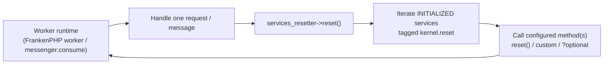

# Resettable Services & the Services Resetter

!!! tip "In a nutshell"
    Dans les runtimes longue durée (mode worker de FrankenPHP, workers
    `messenger:consume`), le container **survit** d'une request/d'un message à
    l'autre — tout état mémoïsé par un service fuit donc dans le suivant.
    Taguez un service `kernel.reset` avec un `method`, ou implémentez
    `Symfony\Contracts\Service\ResetInterface` (l'autoconfiguration le tague
    pour vous), et le service `services_resetter` appelle cette méthode sur
    chaque service tagué **déjà instancié** entre les requests/messages.

!!! example "Real-world analogy"
    Un runtime worker est une chambre d'hôtel louée à l'heure au lieu d'être
    reconstruite pour chaque client : les murs et le mobilier (le container et
    ses services) restent, mais le service d'étage doit changer les draps et
    vider la poubelle entre deux clients. Le `services_resetter` est la
    check-list du service d'étage : chaque équipement de la chambre qui
    accumule des traces du client (un service tagué `kernel.reset`) a une
    consigne de nettoyage imprimée (l'attribut `method`), et seules les
    chambres réellement utilisées (les services instanciés) sont nettoyées.

!!! abstract "Learning objectives"
    À la fin de ce chapitre, vous saurez :

    - [ ] Expliquer pourquoi les runtimes worker ont besoin de resets d'état
          par request/par message et ce qui fuit sans eux.
    - [ ] Rendre un service resettable via `ResetInterface` ou le tag
          `kernel.reset` avec un `method` personnalisé.
    - [ ] Décrire ce que `services_resetter` fait en interne (services
          initialisés uniquement, garde `?method`) et comment les options
          `--no-reset` et `--limit` de Messenger s'y rattachent.

    **Syllabus:** `Dependency Injection → Service Reset` ·
    **Level:** Expert ·
    **Est. time:** 20 min ·
    **Prerequisites:** [The Service Container](container.md)

---

## Theory

Le PHP-FPM classique vous offre un superpouvoir gratuit : **le processus meurt
après chaque request**, donc aucun état de service ne peut fuir. Les runtimes
worker échangent cela contre de la vitesse — le mode worker de FrankenPHP
garde le kernel démarré et le container en mémoire et y rejoue les requests ;
un worker Messenger (`messenger:consume`) traite des milliers de messages dans
un seul processus. Désormais, chaque morceau d'**état lié à la request**
qu'un service shared détient (un utilisateur courant mémoïsé, un tableau de
cache par request, des données de profiler collectées, des enregistrements de
log bufferisés) est une fuite prête à corrompre la request *suivante*.

La réponse de Symfony est un contrat plus un tag :

- **`Symfony\Contracts\Service\ResetInterface`** — une unique méthode
  `reset()` qui signifie « reviens à ton état tout juste construit ». Avec
  l'autoconfiguration par défaut, l'implémenter tague le service
  automatiquement.
- **Le tag `kernel.reset`** — la forme explicite : `{ name: 'kernel.reset',
  method: 'reset' }`. L'attribut `method` permet aux classes legacy de
  participer sans implémenter l'interface (n'importe quel nom de méthode
  fonctionne).
- **Le service `services_resetter`** — itère sur chaque service tagué qui a
  réellement été instancié pendant la request et appelle sa ou ses méthodes de
  reset configurées. Les runtimes longue durée l'invoquent entre les requests ;
  le worker Messenger réinitialise les services du container entre les
  messages (désactivable avec l'option `--no-reset` de `messenger:consume`).

```yaml
# config/services.yaml
services:
    # Implements Symfony\Contracts\Service\ResetInterface (a single reset()
    # method): autoconfiguration adds the kernel.reset tag automatically.
    App\Pricing\ExchangeRateMemoizer: ~

    # Explicit tag — the "method" attribute lets any method name work:
    App\Legacy\ConnectionPool:
        tags:
            - { name: 'kernel.reset', method: 'closeIdleConnections' }

# Between requests/messages the services_resetter service calls these methods.
# A Messenger worker does it per message: messenger:consume (--no-reset disables).
```

Le cœur de Symfony regorge d'exemples : le `Stopwatch` implémente
`ResetInterface`, les data collectors du profiler sont réinitialisés pour que
les panneaux d'une request n'affichent pas les données d'une autre, et les
services qui bufferisent/mémoïsent (buffers de log, caches par request)
suivent conceptuellement le même pattern.

```php
use Symfony\Component\Stopwatch\Stopwatch;
use Symfony\Contracts\Service\ResetInterface;

$stopwatch = new Stopwatch();
$stopwatch instanceof ResetInterface; // true — a resettable core service
$stopwatch->reset();                  // drops all recorded events between requests
```

## Deep Dive — how it works internally

Le resetter lui-même est minuscule.
`Symfony\Component\HttpKernel\DependencyInjection\ServicesResetter` reçoit
deux choses du container compilé : un itérateur lazy sur les services
resettables **initialisés**, et une map id de service → nom(s) de méthode de
reset. Appeler `reset()` boucle dessus et invoque chaque méthode. Deux détails
internes valent des points à l'examen :

1. **Seuls les services instanciés sont réinitialisés.** L'itérateur saute les
   services jamais construits pendant cette request — sinon la
   réinitialisation *forcerait* l'instanciation de chaque service tagué,
   ruinant la laziness du container.
2. **Méthodes optionnelles avec `?`.** Une méthode de reset configurée comme
   `"?flush"` n'est appelée que si elle existe sur la classe — le `?` de tête
   est retiré et gardé par un `method_exists()` dans les sources.

```php
// Conceptually what ServicesResetter::reset() does:
foreach ($this->resettableServices as $id => $service) { // INITIALIZED only
    foreach ($this->resetMethods[$id] as $method) {
        if (str_starts_with($method, '?')) {             // "?flush" = optional
            $method = substr($method, 1);
            if (!method_exists($service, $method)) {
                continue;                                // guarded, skipped
            }
        }
        $service->$method();                             // e.g. reset()
    }
}
```



!!! question "Predict first"
    Cinquante services sont tagués `kernel.reset`, mais un message handler
    donné n'a provoqué l'instanciation que de trois d'entre eux. Après le
    message, combien d'appels `reset()` `services_resetter` fait-il —
    cinquante ou trois ?

??? note "Reveal"
    **Trois.** Le resetter n'itère que sur les services *initialisés* ; les 47
    autres n'ont jamais été construits, ne détiennent aucun état, et les
    instancier juste pour les réinitialiser gâcherait la laziness que le
    container s'est donné tant de mal à préserver.

Notez que le resetter nettoie **l'état des services**, pas l'état du
processus : il ne peut pas dé-fuiter la mémoire retenue par des propriétés
statiques, des tableaux sans limite ou des extensions PHP. C'est pourquoi les
workers Messenger associent le reset à une **stratégie de redémarrage** —
`messenger:consume --limit=100` (ou `--time-limit`, `--memory-limit`) laisse
le processus se terminer périodiquement pour qu'un superviseur le relance à
neuf. Le reset assure la *justesse* entre les messages ; le recyclage du
processus gère les *fuites* que le reset ne peut pas atteindre.

```console
$ php bin/console messenger:consume async --limit=100        # exit after 100 messages
$ php bin/console messenger:consume async --time-limit=3600  # or after one hour
$ php bin/console messenger:consume async --memory-limit=128M # or past 128 MB
```

!!! note "Source reference"
    `Symfony\Component\HttpKernel\DependencyInjection\ServicesResetter` — la
    boucle sur les services initialisés et la garde `?method` —
    [symfony/symfony `8.0`](https://github.com/symfony/symfony/blob/8.0/src/Symfony/Component/HttpKernel/DependencyInjection/ServicesResetter.php).

## Configuration & code

=== "ResetInterface (PHP)"

    ```php
    <?php
    declare(strict_types=1);

    namespace App\Pricing;

    use Symfony\Contracts\Service\ResetInterface;

    /**
     * Memoizes exchange rates for the CURRENT request/message only.
     * Autoconfiguration tags this service with kernel.reset automatically.
     */
    final class ExchangeRateMemoizer implements ResetInterface
    {
        /** @var array<string, float> */
        private array $rates = [];

        public function rateFor(string $currency): float
        {
            return $this->rates[$currency] ??= $this->fetchRate($currency);
        }

        public function reset(): void
        {
            $this->rates = [];
        }

        private function fetchRate(string $currency): float
        {
            // Imagine a real HTTP/DB lookup here.
            return 'EUR' === $currency ? 1.0 : 1.1;
        }
    }
    ```

=== "YAML tag (custom method)"

    ```yaml
    # config/services.yaml
    services:
        # A legacy class that cannot implement ResetInterface:
        # any public method can act as the reset hook.
        App\Legacy\ConnectionPool:
            tags:
                - { name: 'kernel.reset', method: 'closeIdleConnections' }
    ```

=== "Messenger worker (CLI)"

    ```bash
    # Services tagged kernel.reset are reset between messages by default;
    # --no-reset disables that. Recycle the process as the leak backstop:
    php bin/console messenger:consume async --limit=100 --memory-limit=128M

    # Opt out of per-message resets (rarely what you want):
    php bin/console messenger:consume async --no-reset
    ```

## Best practices & anti-patterns

| ✅ Do | ❌ Avoid |
|---|---|
| Implémenter `ResetInterface` sur tout ce qui mémoïse un état par request | Supposer la sémantique PHP-FPM (« l'état meurt de toute façon ») dans du code worker |
| Faire en sorte que `reset()` ramène le service à son état tout juste construit | Faire un travail lourd (reconnexions, warm-ups) dans `reset()` |
| Utiliser l'attribut de tag `method` pour les classes legacy | Forker une hiérarchie de classes juste pour ajouter un nom `reset()` |
| Associer les resets à des redémarrages `--limit`/`--memory-limit` | Traiter le resetter comme un correctif de fuite mémoire — il n'en est pas un |

## When (not) to use it / alternatives

Si votre application ne tourne jamais qu'en PHP-FPM classique, les resets ne
vous coûtent rien mais ne vous rapportent pas grand-chose — la destruction du
processus réinitialise tout. Écrivez quand même des services resettables quand
l'état est lié à la request : cela vous garde **portable entre runtimes**
(passer aux workers FrankenPHP ou ajouter un consumer Messenger plus tard ne
corrompra pas l'état) et cela garde honnêtes les tests fonctionnels de type
« reboot du kernel ». L'alternative pour un état qui ne doit *jamais* être
partagé n'est pas le reset mais **ne pas le stocker dans un service** du
tout : dérivez-le de la `Request`/du message à chaque fois, ou utilisez un
service non shared quand une instance fraîche par injection est acceptable.

!!! danger "Certification traps"
    - Le tag est **`kernel.reset`** et son attribut `method` nomme la méthode
      à appeler — implémenter `ResetInterface` obtient cela via
      l'autoconfiguration.
    - `services_resetter` réinitialise **uniquement les services instanciés**
      pendant la request/le message — jamais tous les services tagués.
    - Le worker de Messenger réinitialise les services **entre les messages
      par défaut** ; `--no-reset` désactive cela.
      `--limit`/`--time-limit`/`--memory-limit` *redémarrent le processus*, ce
      qui est un mécanisme différent.
    - La réinitialisation ne remplace **pas** l'instance du service — le même
      objet reste dans le container ; seule votre méthode s'exécute dessus.
    - Une méthode de reset préfixée par `?` dans le tag n'est appelée que si
      elle existe.

!!! warning "Common mistakes"
    - Mémoïser « l'utilisateur/le tenant/la locale courant(e) » dans un champ
      de service sans `reset()` — la première request du worker le fige pour
      toutes les suivantes.
    - S'attendre à ce que `reset()` s'exécute au milieu d'une request — il
      s'exécute *entre* les requests/messages.
    - Compter sur le reset pour corriger une mémoire qui grossit dans un
      worker au lieu d'une stratégie de redémarrage.

## Exercises

1. **(Expert)** En mode worker FrankenPHP, des utilisateurs signalent voir
   les taux de change *de quelqu'un d'autre*. `ExchangeRateMemoizer` met en
   cache les taux dans un tableau privé indexé par devise, mais les taux sont
   re-récupérés par session utilisateur. Diagnostiquez et corrigez avec le
   plus petit changement possible.
2. **(Expert)** Une classe tierce `ConnectionPool` (que vous ne pouvez pas
   modifier) a une méthode `closeIdleConnections()` qui devrait s'exécuter
   entre les messages. Branchez-la sans toucher à la classe.

??? success "Solutions"

    **1.** Le memoizer est un service shared dans un processus longue durée :
    son tableau `$rates` survit d'une request à l'autre, donc l'utilisateur B
    lit les taux de l'utilisateur A. Implémentez `ResetInterface` avec un
    `reset()` qui vide le tableau (voir l'onglet ci-dessus) —
    l'autoconfiguration le tague `kernel.reset`, et l'appel du runtime à
    `services_resetter` le vide entre les requests.

    **2.** Taguez-la en YAML :
    `tags: [{ name: 'kernel.reset', method: 'closeIdleConnections' }]`.
    L'attribut `method` existe précisément pour que les classes qui
    n'implémentent pas `ResetInterface` puissent participer au cycle de reset.

## Certification questions

??? question "Q1. What does the `services_resetter` service do between requests in a worker runtime?"
    - [x] A. Calls the configured reset method on every *initialized* `kernel.reset`-tagged service ✅
    - [ ] B. Destroys and rebuilds the container
    - [ ] C. Re-runs the constructor of every service
    - [ ] D. Clears the var/cache directory

    **Why:** Il itère uniquement sur les services tagués instanciés et invoque
    leur(s) méthode(s) de reset ; le container et les instances survivent.
    **Ref:** [dic tags — kernel.reset](https://symfony.com/doc/current/reference/dic_tags.html#kernel-reset).

??? question "Q2. How does a service become resettable with zero configuration?"
    - [x] A. Implement `Symfony\Contracts\Service\ResetInterface` — autoconfiguration adds the `kernel.reset` tag ✅
    - [ ] B. Add `#[Resettable]` to the class
    - [ ] C. Name a method `__reset()`
    - [ ] D. Declare the service as `shared: false`

    **Why:** Le framework autoconfigure les implémenteurs de `ResetInterface`
    avec le tag `kernel.reset` (méthode `reset`).
    **Ref:** [dic tags — kernel.reset](https://symfony.com/doc/current/reference/dic_tags.html#kernel-reset).

??? question "Q3. In `messenger:consume`, what is the role of `--limit=100` relative to service resetting?"
    - [x] A. It stops the worker after 100 messages so a supervisor restarts a fresh process — a backstop for leaks reset cannot fix ✅
    - [ ] B. It resets services every 100 messages instead of every message
    - [ ] C. It limits how many services may be tagged `kernel.reset`
    - [ ] D. It disables the services resetter

    **Why:** Le reset gère l'état par message ; le recyclage du processus
    (`--limit`/`--time-limit`/`--memory-limit`) gère la croissance mémoire et
    l'état non réinitialisable.
    **Ref:** [Messenger](https://symfony.com/doc/current/messenger.html).

??? question "Q4. A service tagged `kernel.reset` was never instantiated during the request. What happens at reset time?"
    - [x] A. Nothing — the resetter only touches initialized services ✅
    - [ ] B. It is instantiated, then reset
    - [ ] C. An exception is thrown
    - [ ] D. Its definition is removed from the container

    **Why:** Forcer l'instanciation juste pour réinitialiser ruinerait la
    laziness ; l'itérateur du resetter ne produit que les services qui
    existent.
    **Ref:** [dic tags — kernel.reset](https://symfony.com/doc/current/reference/dic_tags.html#kernel-reset).

## Key takeaways

- Les runtimes worker réutilisent le container → l'état lié à la request dans
  des services shared fuit s'il n'est pas réinitialisé.
- `ResetInterface` + autoconfiguration, ou `kernel.reset` avec `method:`,
  rendent un service resettable ; `services_resetter` exécute les méthodes
  entre les requests/messages.
- Seuls les services **initialisés** sont réinitialisés ; l'instance
  elle-même survit.
- Reset ≠ restart : utilisez `--limit`/`--memory-limit` de Messenger
  (recyclage du processus) contre les fuites hors de portée de `reset()`.

## Last-minute revision

!!! tip "Cheat sheet"
    - Interface : `Symfony\Contracts\Service\ResetInterface::reset()`.
    - Tag : `{ name: 'kernel.reset', method: 'myMethod' }` (`?method` =
      seulement si elle existe).
    - Service : `services_resetter`
      (`Symfony\Component\HttpKernel\DependencyInjection\ServicesResetter`).
    - Réinitialise uniquement les services initialisés, entre les
      requests/messages.
    - Messenger : reset par message par défaut, `--no-reset` pour désactiver,
      `--limit`/`--time-limit`/`--memory-limit` pour recycler le processus.

## Connections

- **Depends on:** [The Service Container](container.md) — ce sont les
  instances shared qui rendent la fuite possible ; [Tags](tags.md) —
  `kernel.reset` est un simple tag consommé par une pass du cœur.
- **Reused in:** [Built-in Services](built-in-services.md) — des services du
  cœur comme le Stopwatch et les collectors du profiler sont eux-mêmes
  resettables.
- **Confused with:** [Lazy Services & Native Lazy Objects](lazy-services.md)
  — la laziness retarde la *construction* ; le reset nettoie l'*état* d'une
  instance déjà construite. À ne pas confondre non plus avec `shared: false`,
  qui crée de nouvelles instances au lieu d'en nettoyer une.

## Official References

- [Official Symfony docs — Service Container](https://symfony.com/doc/current/service_container.html)
- [Official Symfony docs — Built-in Symfony Service Tags (`kernel.reset`)](https://symfony.com/doc/current/reference/dic_tags.html#kernel-reset)
- [Symfony source — ServicesResetter](https://github.com/symfony/symfony/blob/8.0/src/Symfony/Component/HttpKernel/DependencyInjection/ServicesResetter.php)

## Video references

!!! tip "Watch & learn"
    Ce sont des chaînes vidéo officielles, mises à jour en continu — cherchez-y
    "dependency injection" pour consolider ce chapitre. Nous lions des chaînes
    stables plutôt que des vidéos individuelles pour que les références ne
    périment jamais.

    - [SymfonyCasts screencasts](https://symfonycasts.com/tracks/symfony) — tutoriels scénarisés à suivre en codant.
    - [Symfony official YouTube](https://www.youtube.com/@SymfonyOfficial) — conférences et keynotes SymfonyCon.
    - [Official docs for this topic](https://symfony.com/doc/current/service_container.html) — certaines pages de la doc Symfony intègrent un screencast.

## Confidence check

Je suis prêt quand je peux :

- [ ] expliquer **pourquoi** les runtimes worker ont besoin de resets
      (réutilisation du container entre requests/messages)
- [ ] rendre un service resettable via `ResetInterface` *et* via l'attribut
      `method` du tag
- [ ] énoncer que seuls les services initialisés sont réinitialisés, et
      pourquoi
- [ ] relier les options `--no-reset` et `--limit` de Messenger au resetter
- [ ] écrire un `reset()` qui ramène vraiment un service à un état vierge

---

<small>Related: [The Service Container](container.md) · [Tags](tags.md) ·
[Lazy Services & Native Lazy Objects](lazy-services.md)</small>
