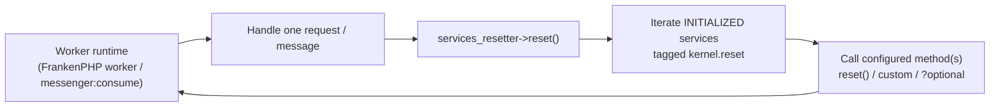

# Resettable Services & the Services Resetter

!!! tip "In a nutshell"
    In long-running runtimes (FrankenPHP worker mode, `messenger:consume`
    workers) the container **survives** across requests/messages — so any state
    a service memoizes leaks into the next one. Tag a service `kernel.reset`
    with a `method`, or implement
    `Symfony\Contracts\Service\ResetInterface` (autoconfiguration tags it for
    you), and the `services_resetter` service calls that method on every
    **already-instantiated** tagged service between requests/messages.

!!! example "Real-world analogy"
    A worker runtime is a hotel room rented by the hour instead of rebuilt for
    each guest: the walls and furniture (the container and its services) stay,
    but housekeeping must strip the sheets and empty the bin between guests.
    The `services_resetter` is housekeeping's checklist: every room feature
    that accumulates guest traces (a service tagged `kernel.reset`) has a
    printed cleaning instruction (the `method` attribute), and only rooms that
    were actually used (instantiated services) get cleaned.

!!! abstract "Learning objectives"
    By the end of this chapter you can:

    - [ ] Explain why worker runtimes need per-request/per-message state
          resets and what leaks without them.
    - [ ] Make a service resettable via `ResetInterface` or the
          `kernel.reset` tag with a custom `method`.
    - [ ] Describe what `services_resetter` does internally (initialized
          services only, `?method` guard) and how Messenger's `--no-reset`
          and `--limit` relate.

    **Syllabus:** `Dependency Injection → Service Reset` ·
    **Level:** Expert ·
    **Est. time:** 20 min ·
    **Prerequisites:** [The Service Container](container.md)
    **Examen Symfony 8 :** OUI
---

## Pour les nuls

### L'idée en une phrase
Dans un runtime longue durée (worker Messenger, FrankenPHP), le container survit entre les requêtes — donc l'état mémorisé d'un service peut "fuir" vers la requête suivante si on ne le réinitialise pas.

### Imagine dans la vraie vie
Un runtime worker est une chambre d'hôtel louée à l'heure plutôt que reconstruite pour chaque client : les murs et meubles (le container et ses services) restent, mais le ménage doit changer les draps entre deux clients. Le `services_resetter` est la checklist du ménage.

### Dans Symfony
Un service qui accumule un cache interne (`private array $cacheLocal = []`) dans un worker Messenger doit être réinitialisé entre chaque message — sinon le cache grossit indéfiniment et peut mélanger les données de deux messages différents.

### Exemple simple
```php
#[AsTaggedItem('kernel.reset', method: 'reinitialiser')]
class ServiceAvecEtat implements ResetInterface {
    public function reset(): void { $this->cacheLocal = []; }
}
```

### Comment le mémoriser 🧠
Seuls les services **déjà instanciés** sont réinitialisés — un service jamais utilisé pendant le cycle n'a rien à nettoyer, donc `services_resetter` ne le touche même pas.

---

## Theory

Classic PHP-FPM gives you a free superpower: **the process dies after every
request**, so no service state can leak. Worker runtimes trade that away for
speed — FrankenPHP worker mode keeps the booted kernel and container in memory
and replays requests through it; a Messenger worker (`messenger:consume`)
handles thousands of messages in one process. Now every piece of
**request-scoped state** a shared service holds (a memoized current user, a
per-request cache array, collected profiler data, buffered log records) is a
leak waiting to corrupt the *next* request.

Symfony's answer is a contract plus a tag:

- **`Symfony\Contracts\Service\ResetInterface`** — a single `reset()` method
  meaning "return to your just-constructed state". With default
  autoconfiguration, implementing it tags the service automatically.
- **The `kernel.reset` tag** — the explicit form: `{ name: 'kernel.reset',
  method: 'reset' }`. The `method` attribute lets legacy classes participate
  without implementing the interface (any method name works).
- **The `services_resetter` service** — iterates every tagged service that was
  actually instantiated during the request and calls its configured reset
  method(s). Long-running runtimes invoke it between requests; the Messenger
  worker resets container services between messages (disable with the
  `--no-reset` option of `messenger:consume`).

```yaml
# config/services.yaml
services:
    # Implements Symfony\Contracts\Service\ResetInterface (a single reset()
    # method): autoconfiguration adds the kernel.reset tag automatically.
    App\Pricing\ExchangeRateMemoizer: ~

    # Explicit tag — the "method" attribute lets any method name work:
    App\Legacy\ConnectionPool:
        tags:
            - { name: 'kernel.reset', method: 'closeIdleConnections' }

# Between requests/messages the services_resetter service calls these methods.
# A Messenger worker does it per message: messenger:consume (--no-reset disables).
```

Symfony core is full of examples: the `Stopwatch` implements `ResetInterface`,
profiler data collectors are reset so one request's panels don't show another
request's data, and buffering/memoizing services (log buffers, request-scoped
caches) conceptually follow the same pattern.

```php
use Symfony\Component\Stopwatch\Stopwatch;
use Symfony\Contracts\Service\ResetInterface;

$stopwatch = new Stopwatch();
$stopwatch instanceof ResetInterface; // true — a resettable core service
$stopwatch->reset();                  // drops all recorded events between requests
```

## Deep Dive — how it works internally

The resetter itself is tiny. `Symfony\Component\HttpKernel\DependencyInjection\ServicesResetter`
receives two things from the compiled container: a lazy iterator over the
**initialized** resettable services, and a map of service id → reset method
name(s). Calling `reset()` loops over them and invokes each method. Two
internals are exam-worthy:

1. **Only instantiated services are reset.** The iterator skips services that
   were never built during this request — resetting would otherwise *force*
   instantiation of every tagged service, defeating container laziness.
2. **Optional methods with `?`.** A reset method configured as `"?flush"` is
   only called if it exists on the class — the leading `?` is stripped and
   guarded with `method_exists()` in the source.

```php
// Conceptually what ServicesResetter::reset() does:
foreach ($this->resettableServices as $id => $service) { // INITIALIZED only
    foreach ($this->resetMethods[$id] as $method) {
        if (str_starts_with($method, '?')) {             // "?flush" = optional
            $method = substr($method, 1);
            if (!method_exists($service, $method)) {
                continue;                                // guarded, skipped
            }
        }
        $service->$method();                             // e.g. reset()
    }
}
```



!!! question "Predict first"
    Fifty services are tagged `kernel.reset`, but a given message handler only
    caused three of them to be instantiated. After the message, how many
    `reset()` calls does `services_resetter` make — fifty or three?

??? note "Reveal"
    **Three.** The resetter iterates only *initialized* services; the other 47
    were never built, hold no state, and instantiating them just to reset them
    would waste the laziness the container worked hard to preserve.

Note the resetter cleans **service state**, not process state: it cannot
un-leak memory held by static properties, unbounded arrays or PHP extensions.
That is why Messenger workers pair resetting with a **restart strategy** —
`messenger:consume --limit=100` (or `--time-limit`, `--memory-limit`) lets the
process exit periodically so a supervisor restarts it fresh. Reset handles
*correctness* between messages; recycling the process handles *leaks* that
reset cannot reach.

```console
$ php bin/console messenger:consume async --limit=100        # exit after 100 messages
$ php bin/console messenger:consume async --time-limit=3600  # or after one hour
$ php bin/console messenger:consume async --memory-limit=128M # or past 128 MB
```

!!! note "Source reference"
    `Symfony\Component\HttpKernel\DependencyInjection\ServicesResetter` — the
    loop over initialized services and the `?method` guard —
    [symfony/symfony `8.0`](https://github.com/symfony/symfony/blob/8.0/src/Symfony/Component/HttpKernel/DependencyInjection/ServicesResetter.php).

## Configuration & code

=== "ResetInterface (PHP)"

    ```php
    <?php
    declare(strict_types=1);

    namespace App\Pricing;

    use Symfony\Contracts\Service\ResetInterface;

    /**
     * Memoizes exchange rates for the CURRENT request/message only.
     * Autoconfiguration tags this service with kernel.reset automatically.
     */
    final class ExchangeRateMemoizer implements ResetInterface
    {
        /** @var array<string, float> */
        private array $rates = [];

        public function rateFor(string $currency): float
        {
            return $this->rates[$currency] ??= $this->fetchRate($currency);
        }

        public function reset(): void
        {
            $this->rates = [];
        }

        private function fetchRate(string $currency): float
        {
            // Imagine a real HTTP/DB lookup here.
            return 'EUR' === $currency ? 1.0 : 1.1;
        }
    }
    ```

=== "YAML tag (custom method)"

    ```yaml
    # config/services.yaml
    services:
        # A legacy class that cannot implement ResetInterface:
        # any public method can act as the reset hook.
        App\Legacy\ConnectionPool:
            tags:
                - { name: 'kernel.reset', method: 'closeIdleConnections' }
    ```

=== "Messenger worker (CLI)"

    ```bash
    # Services tagged kernel.reset are reset between messages by default;
    # --no-reset disables that. Recycle the process as the leak backstop:
    php bin/console messenger:consume async --limit=100 --memory-limit=128M

    # Opt out of per-message resets (rarely what you want):
    php bin/console messenger:consume async --no-reset
    ```

## Best practices & anti-patterns

| ✅ Do | ❌ Avoid |
|---|---|
| Implement `ResetInterface` on anything that memoizes per-request state | Assuming PHP-FPM semantics ("state dies anyway") in worker code |
| Make `reset()` return the service to its just-constructed state | Doing heavy work (reconnects, warm-ups) inside `reset()` |
| Use the `method` tag attribute for legacy classes | Forking a class hierarchy just to add a `reset()` name |
| Pair resets with `--limit`/`--memory-limit` restarts | Treating the resetter as a memory-leak fix — it is not |

## When (not) to use it / alternatives

If your app only ever runs under classic PHP-FPM, resets cost you nothing but
buy you little — the process teardown resets everything. Write resettable
services anyway when the state is request-scoped: it keeps you
**runtime-portable** (moving to FrankenPHP workers or adding a Messenger
consumer later won't corrupt state) and it keeps kernel-reboot–style
functional tests honest. The alternative for state that must *never* be shared
is not resetting but **not storing it in a service** at all: derive it from
the `Request`/message each time, or use a non-shared service where a fresh
instance per injection is acceptable.

!!! danger "Certification traps"
    - The tag is **`kernel.reset`** and its `method` attribute names the method
      to call — implementing `ResetInterface` gets this via autoconfiguration.
    - `services_resetter` resets **only services that were instantiated**
      during the request/message — never all tagged services.
    - Messenger's worker resets services **between messages by default**;
      `--no-reset` turns it off. `--limit`/`--time-limit`/`--memory-limit`
      *restart the process*, which is a different mechanism.
    - Resetting does **not** replace the service instance — the same object
      stays in the container; only your method runs on it.
    - A reset method prefixed with `?` in the tag is called only if it exists.

!!! warning "Common mistakes"
    - Memoizing the "current user/tenant/locale" in a service field with no
      `reset()` — the first worker request pins it for all subsequent ones.
    - Expecting `reset()` to run in the middle of a request — it runs
      *between* requests/messages.
    - Relying on reset to fix growing memory in a worker instead of a restart
      strategy.

## Exercises

1. **(Expert)** In FrankenPHP worker mode, users report seeing *someone
   else's* currency rates. `ExchangeRateMemoizer` caches rates in a private
   array keyed by currency, but rates are re-fetched per user session.
   Diagnose and fix with the smallest change.
2. **(Expert)** A third-party `ConnectionPool` class (you cannot edit it) has
   a `closeIdleConnections()` method that should run between messages. Wire it
   up without touching the class.

??? success "Solutions"

    **1.** The memoizer is a shared service in a long-running process: its
    `$rates` array survives across requests, so user B reads user A's rates.
    Implement `ResetInterface` with `reset()` clearing the array (see the tab
    above) — autoconfiguration tags it `kernel.reset`, and the runtime's call
    to `services_resetter` empties it between requests.

    **2.** Tag it in YAML:
    `tags: [{ name: 'kernel.reset', method: 'closeIdleConnections' }]`.
    The `method` attribute exists precisely so classes that don't implement
    `ResetInterface` can participate in the reset cycle.

## Certification questions

*Question d'entraînement inspirée du syllabus — jamais une question officielle de l'examen.*

??? question "Q1. What does the `services_resetter` service do between requests in a worker runtime?"
    - [x] A. Calls the configured reset method on every *initialized* `kernel.reset`-tagged service ✅
    - [ ] B. Destroys and rebuilds the container
    - [ ] C. Re-runs the constructor of every service
    - [ ] D. Clears the var/cache directory

    **Why:** It iterates only instantiated tagged services and invokes their
    reset method(s); the container and instances survive.
    **Ref:** [dic tags — kernel.reset](https://symfony.com/doc/8.0/reference/dic_tags.html#kernel-reset).

??? question "Q2. How does a service become resettable with zero configuration?"
    - [x] A. Implement `Symfony\Contracts\Service\ResetInterface` — autoconfiguration adds the `kernel.reset` tag ✅
    - [ ] B. Add `#[Resettable]` to the class
    - [ ] C. Name a method `__reset()`
    - [ ] D. Declare the service as `shared: false`

    **Why:** The framework autoconfigures `ResetInterface` implementors with
    the `kernel.reset` tag (method `reset`).
    **Ref:** [dic tags — kernel.reset](https://symfony.com/doc/8.0/reference/dic_tags.html#kernel-reset).

??? question "Q3. In `messenger:consume`, what is the role of `--limit=100` relative to service resetting?"
    - [x] A. It stops the worker after 100 messages so a supervisor restarts a fresh process — a backstop for leaks reset cannot fix ✅
    - [ ] B. It resets services every 100 messages instead of every message
    - [ ] C. It limits how many services may be tagged `kernel.reset`
    - [ ] D. It disables the services resetter

    **Why:** Reset handles per-message state; process recycling
    (`--limit`/`--time-limit`/`--memory-limit`) handles memory growth and
    unresettable state.
    **Ref:** [Messenger](https://symfony.com/doc/8.0/messenger.html).

??? question "Q4. A service tagged `kernel.reset` was never instantiated during the request. What happens at reset time?"
    - [x] A. Nothing — the resetter only touches initialized services ✅
    - [ ] B. It is instantiated, then reset
    - [ ] C. An exception is thrown
    - [ ] D. Its definition is removed from the container

    **Why:** Forcing instantiation just to reset would defeat laziness; the
    resetter's iterator yields only services that exist.
    **Ref:** [dic tags — kernel.reset](https://symfony.com/doc/8.0/reference/dic_tags.html#kernel-reset).

## Key takeaways

- Worker runtimes reuse the container → request-scoped state in shared
  services leaks unless reset.
- `ResetInterface` + autoconfiguration, or `kernel.reset` with `method:`, make
  a service resettable; `services_resetter` runs the methods between
  requests/messages.
- Only **initialized** services are reset; the instance itself survives.
- Reset ≠ restart: use Messenger's `--limit`/`--memory-limit` (process
  recycling) against leaks that `reset()` can't reach.

## Last-minute revision

!!! tip "Cheat sheet"
    - Interface: `Symfony\Contracts\Service\ResetInterface::reset()`.
    - Tag: `{ name: 'kernel.reset', method: 'myMethod' }` (`?method` = only if
      it exists).
    - Service: `services_resetter`
      (`Symfony\Component\HttpKernel\DependencyInjection\ServicesResetter`).
    - Resets initialized services only, between requests/messages.
    - Messenger: reset per message by default, `--no-reset` to disable,
      `--limit`/`--time-limit`/`--memory-limit` to recycle the process.

## Connections

- **Depends on:** [The Service Container](container.md) — shared instances are
  what make leaking possible; [Tags](tags.md) — `kernel.reset` is a plain tag
  consumed by a core pass.
- **Reused in:** [Built-in Services](built-in-services.md) — core services
  like the Stopwatch and profiler collectors are themselves resettable.
- **Confused with:** [Lazy Services & Native Lazy Objects](lazy-services.md)
  — laziness delays *construction*; reset cleans *state* of an already-built
  instance. Also not the same as `shared: false`, which creates new instances
  instead of cleaning one.

## Official References

- [Official Symfony docs — Service Container](https://symfony.com/doc/8.0/service_container.html)
- [Official Symfony docs — Built-in Symfony Service Tags (`kernel.reset`)](https://symfony.com/doc/8.0/reference/dic_tags.html#kernel-reset)
- [Symfony source — ServicesResetter](https://github.com/symfony/symfony/blob/8.0/src/Symfony/Component/HttpKernel/DependencyInjection/ServicesResetter.php)

## Video references

!!! tip "Watch & learn"
    These are official, continuously-updated video channels — search them for
    "dependency injection" to reinforce this chapter. We link stable channels rather than
    individual videos so the references never rot.

    - [SymfonyCasts screencasts](https://symfonycasts.com/tracks/symfony) — scripted, code-along tutorials.
    - [Symfony official YouTube](https://www.youtube.com/@SymfonyOfficial) — SymfonyCon conference talks & keynotes.
    - [Official docs for this topic](https://symfony.com/doc/8.0/service_container.html) — some Symfony doc pages embed a screencast.

## Confidence check

I'm ready when I can:

- [ ] explain **why** worker runtimes need resets (container reuse across
      requests/messages)
- [ ] make a service resettable via `ResetInterface` *and* via the tag's
      `method` attribute
- [ ] state that only initialized services are reset, and why
- [ ] relate Messenger's `--no-reset` and `--limit` options to the resetter
- [ ] write a `reset()` that truly returns a service to pristine state

---

<small>Related: [The Service Container](container.md) · [Tags](tags.md) ·
[Lazy Services & Native Lazy Objects](lazy-services.md)</small>
