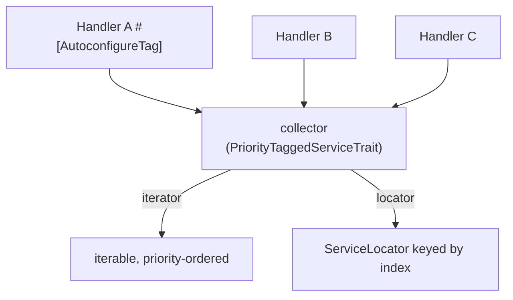

# Tags

!!! tip "In a nutshell"
    Un tag est une étiquette apposée à la compilation sur un service ; à lui seul,
    il ne fait rien tant qu'un collecteur ne le consomme pas. Utilisez
    `tagged_iterator` / `#[AutowireIterator]` pour des instances, ou
    `tagged_locator` / `#[AutowireLocator]` pour un ensemble lazy indexé par clé.
    Fait le plus rentable : **une `priority` plus élevée = plus tôt** dans l'iterator.

!!! example "Real-world analogy"
    Un tag, c'est un autocollant sur une fiche recette — « menu brunch ».
    L'autocollant seul ne fait rien ; un collecteur (le chef qui compose le service
    brunch) rassemble toutes les fiches portant cet autocollant sur un même plateau.
    `tagged_iterator` apporte tous les plats déjà dressés ; `tagged_locator` vous
    remet un plateau étiqueté dans lequel vous cuisinez un emplacement à la fois.
    La `priority` détermine la position de chaque fiche sur le plateau.

!!! abstract "Learning objectives"
    À la fin de ce chapitre, vous saurez :

    - [ ] Taguer des services et les consommer via `tagged_iterator` /
          `#[AutowireIterator]`.
    - [ ] Construire une collection indexée avec `tagged_locator` / `#[AutowireLocator]`.
    - [ ] Ordonner et indexer les services tagués avec `priority` et une méthode
          d'index, et autoconfigurer une interface vers un tag.

    **Syllabus:** `Dependency Injection → Tags` ·
    **Level:** Advanced / Expert ·
    **Est. time:** 35 min ·
    **Prerequisites:** [Service Registration](registration.md)

---

## Theory

Un **tag** est une étiquette attachée à une définition de service (par ex.
`app.handler`). Les tags sont de pures métadonnées de compilation : à eux seuls,
ils ne font rien. Quelque chose — soit un [compiler pass](compiler-passes.md),
soit les types d'argument intégrés `tagged_iterator`/`tagged_locator` — collecte
tous les services portant un tag et les injecte en groupe. C'est ainsi que Symfony
câble « tous les voters », « tous les event subscribers », « tous les handlers
Messenger ».

```yaml
services:
    App\Handler\EmailHandler:
        tags: ['app.handler']       # inert label until something collects it

    App\HandlerRunner:
        arguments:
            # Collectors: all instances vs a lazy keyed set.
            $handlers: !tagged_iterator app.handler
            $locator: !tagged_locator app.handler
```

!!! question "Predict first"
    Vous injectez `#[AutowireLocator('app.handler')]` mais rien n'implémente
    l'interface taguée. À l'exécution, vous appelez `get('missing')` sur le locator.
    Résultat vide ou erreur ?

??? note "Reveal"
    Collecter un tag que rien ne porte produit un iterator/locator **vide** (un
    `foreach` ne fait simplement rien) — jamais `null`. Mais `locator->get('missing')`
    pour une clé absente lève une `ServiceNotFoundException` ; protégez-vous d'abord
    avec `has()`.

## Deep Dive — how it works internally

### Collection vs locator

- **`tagged_iterator`** injecte un *iterable* de services **déjà instanciés**
  portant le tag. Utilisez-le quand vous les parcourez toujours tous.
- **`tagged_locator`** injecte un `Symfony\Component\DependencyInjection\ServiceLocator`
  indexé par un nom, de sorte que les services sont instanciés de façon **lazy** à
  l'accès. Utilisez-le quand vous en choisissez un par clé.

Les deux sont résolus à la compilation en définitions d'argument concrètes ; le
`PriorityTaggedServiceTrait` collecte, ordonne et indexe les services.

```php
use Symfony\Component\DependencyInjection\Attribute\AutowireIterator;
use Symfony\Component\DependencyInjection\Attribute\AutowireLocator;
use Symfony\Component\DependencyInjection\ServiceLocator;

public function __construct(
    // tagged_iterator: already-instantiated services, iterated in order.
    #[AutowireIterator('app.handler')]
    private iterable $handlers,
    // tagged_locator: a lazy ServiceLocator, one service built per get().
    #[AutowireLocator('app.handler')]
    private ServiceLocator $locator,
) {}
// At compile time PriorityTaggedServiceTrait collects, orders and keys both.
```

### Priority and indexing

- **`priority`** sur le tag ordonne la collection — **la priorité la plus élevée
  vient en premier** dans l'iterator.
- **`index_by`** (locator) attribue une clé à chaque service. La clé provient d'un
  attribut du tag, ou d'une **méthode statique** nommée par `default_index_method`
  (généralement `getDefaultName()`/`getDefaultIndexName()`), ou d'un attribut
  `#[AsTaggedItem(index: '...', priority: N)]` sur la classe.

```php
use Symfony\Component\DependencyInjection\Attribute\AsTaggedItem;

// index + priority in one attribute (higher priority = earlier in iterator):
#[AsTaggedItem(index: 'email', priority: 10)]
final class EmailHandler implements HandlerInterface
{
    // Alternative index source, named by default_index_method — e.g.
    // !tagged_locator { tag: app.handler, index_by: key,
    //                   default_index_method: getDefaultName }
    public static function getDefaultName(): string   // or getDefaultIndexName()
    {
        return 'email';
    }
}
```



### Autoconfiguring an interface to a tag

Avec `autoconfigure: true`, implémenter une interface connue ajoute automatiquement
le tag correspondant — vous ne taguez jamais à la main. Dans le `Kernel` ou un
bundle, vous enregistrez la correspondance via
`ContainerBuilder::registerForAutoconfiguration(HandlerInterface::class)->addTag('app.handler')`,
ou vous placez `#[AutoconfigureTag('app.handler')]` sur l'interface. Toute classe
qui l'implémente est alors taguée automatiquement.

!!! note "Source reference"
    `Symfony\Component\DependencyInjection\Compiler\PriorityTaggedServiceTrait` &
    le value object `TaggedIteratorArgument` —
    [symfony/symfony `8.0`](https://github.com/symfony/symfony/blob/8.0/src/Symfony/Component/DependencyInjection/Compiler/PriorityTaggedServiceTrait.php).

### Null behavior

Collectez un tag que **rien ne porte** et vous obtenez un iterator/locator *vide*,
pas `null` — un `foreach` dessus fait simplement zéro itération ; ne vérifiez donc
la vacuité (`iterator_count()`, ou `count()` sur un tableau matérialisé) que si
« aucun handler » est en soi une erreur à signaler. Un `tagged_locator` se comporte
comme n'importe quel locator : `get($key)` pour une clé **absente** lève une
`ServiceNotFoundException`, donc vérifiez `has($key)` d'abord quand la clé est
dynamique. Si `default_index_method` / `index_by` résout la *même* clé pour deux
services, le dernier gagne silencieusement — une surprise « mon handler a disparu »
qui ressemble à un null mais est un écrasement. Le bug classique consiste à
s'attendre à ce qu'une collection vide soit `null` et à appeler une méthode dessus.

!!! note "Null in real life"
    Un plateau de brunch vide (aucune fiche étiquetée) reste un plateau que vous
    pouvez porter — il ne contient simplement rien ; c'est plonger la main dans un
    emplacement étiqueté jamais rempli (`locator->get('x')`) qui constitue l'erreur.

!!! info "Expert note"
    Un tag à lui seul ne fait *rien* — c'est une métadonnée inerte tant qu'un
    collecteur (un argument `tagged_iterator`/`tagged_locator` ou un compiler pass)
    ne le consomme pas. Si deux services résolvent la *même* clé d'index, le dernier
    écrase silencieusement le premier : un bug « mon handler a disparu » qui
    ressemble à un null mais est un écrasement.

??? example "Debugging story"
    **Symptôme :** un nouveau handler n'était jamais invoqué alors qu'il était
    tagué. **Diagnostic :** son `getName()` renvoyait la même chaîne qu'un handler
    existant ; il y a donc eu collision sur la clé d'index du locator et le dernier
    a gagné. **Correction :** lui donner un index unique
    (`#[AsTaggedItem(index: '...')]` ou un `getName()` distinct).
    **À éviter :** traitez les clés d'index comme des clés primaires — uniques sur
    tout l'ensemble tagué.

??? abstract "Source-code tour"
    - `Symfony\Component\DependencyInjection\Compiler\PriorityTaggedServiceTrait` —
      collecte, ordonne par priorité et indexe les services tagués.
    - `Symfony\Component\DependencyInjection\Argument\TaggedIteratorArgument` — le
      value object vers lequel `!tagged_iterator` / `#[AutowireIterator]` compile.
    - `Symfony\Component\DependencyInjection\ServiceLocator` — ce que devient un
      `tagged_locator` : un ensemble lazy PSR-11 indexé par la clé d'index.
    - `ContainerBuilder::registerForAutoconfiguration()` /
      `#[AutoconfigureTag]` — tague automatiquement chaque implémenteur d'une
      interface.

## Configuration & code

=== "PHP Attributes"

    ```php
    <?php
    declare(strict_types=1);

    namespace App\Handler;

    use Symfony\Component\DependencyInjection\Attribute\AutoconfigureTag;
    use Symfony\Component\DependencyInjection\Attribute\AutowireIterator;
    use Symfony\Component\DependencyInjection\Attribute\AutowireLocator;
    use Psr\Container\ContainerInterface;

    #[AutoconfigureTag('app.handler')]
    interface HandlerInterface
    {
        public static function getName(): string;
        public function handle(string $payload): void;
    }

    final class HandlerRegistry
    {
        public function __construct(
            // All tagged services, priority-ordered:
            #[AutowireIterator('app.handler')]
            private readonly iterable $handlers,
            // Same services keyed by getName(), lazily instantiated:
            #[AutowireLocator('app.handler', defaultIndexMethod: 'getName')]
            private readonly ContainerInterface $locator,
        ) {}

        public function run(string $name, string $payload): void
        {
            $this->locator->get($name)->handle($payload);
        }
    }
    ```

=== "YAML"

    ```yaml
    # config/services.yaml
    services:
        _instanceof:
            App\Handler\HandlerInterface:
                tags: ['app.handler']

        App\Handler\HandlerRegistry:
            arguments:
                $handlers: !tagged_iterator app.handler
                $locator: !tagged_locator { tag: app.handler, index_by: key, default_index_method: getName }
    ```

=== "Console"

    ```console
    $ php bin/console debug:container --tag app.handler
    ```

## Best practices & anti-patterns

| ✅ Do | ❌ Avoid |
|---|---|
| Autoconfigurer un tag sur l'interface | Taguer chaque classe à la main |
| `tagged_iterator` quand vous les utilisez tous | Un locator quand vous itérez toujours |
| `tagged_locator` pour un accès par clé | Tout instancier pour n'en choisir qu'un |
| Définir `priority` pour un ordre déterministe | Se fier à l'ordre des fichiers |

## When (not) to use it / alternatives

Utilisez les tags pour « collecter tous les services d'un même genre » — le pattern
plugin/handler/strategy. Si vous n'avez jamais qu'une seule implémentation, un
[alias](registration.md) est plus simple. Si vous devez *transformer* des
définitions (pas seulement collecter), il vous faut un
[compiler pass](compiler-passes.md) ; le pass peut appeler lui-même
`findTaggedServiceIds('app.handler')`.

!!! danger "Certification traps"
    - Un tag seul ne fait rien — un collecteur (type d'argument ou pass) doit le
      consommer.
    - `tagged_iterator` fournit des **instances** ; `tagged_locator` fournit un
      `ServiceLocator` **lazy**.
    - Une `priority` plus élevée = **plus tôt** dans l'iterator.
    - La clé d'index vient de l'attribut `index_by` ou de la méthode statique
      `default_index_method`, pas de l'id du service par défaut.

!!! warning "Common mistakes"
    - S'attendre à ce que les services du locator soient instanciés immédiatement —
      ils sont lazy.
    - Oublier `_instanceof` / l'autoconfiguration et ne rien taguer.
    - Utiliser le nom de classe comme clé du locator sans configurer l'indexation.

## Exercises

1. **(Advanced)** Autoconfigurez chaque implémentation de `HandlerInterface` avec
   le tag `app.handler`, puis injectez-les toutes en tant qu'iterable.
2. **(Expert)** Exposez les mêmes handlers via un locator indexé par un
   `getName()` statique et récupérez-en un par clé.

??? success "Solutions"

    **1.** Placez `#[AutoconfigureTag('app.handler')]` sur l'interface (ou
    `_instanceof` en YAML), puis injectez avec
    `#[AutowireIterator('app.handler')] iterable $handlers`.

    **2.** Injectez `#[AutowireLocator('app.handler', defaultIndexMethod: 'getName')]
    ContainerInterface $locator` et appelez `$locator->get($name)`. Seul le handler
    demandé est instancié.

## Certification questions

??? question "Q1. What does `tagged_locator` inject?"
    - [ ] A. An array of instances
    - [x] B. A lazy `ServiceLocator` keyed by an index ✅
    - [ ] C. A compiler pass
    - [ ] D. The raw tag string

    **Why:** Le locator instancie les services à la demande, indexés par la clé
    d'index.
    **Ref:** [Service subscribers & locators](https://symfony.com/doc/current/service_container/service_subscribers_locators.html).

??? question "Q2. Higher `priority` on a tag means the service is…"
    - [x] A. Earlier in the tagged iterator ✅
    - [ ] B. Later in the iterator
    - [ ] C. Made public
    - [ ] D. Ignored

    **Why:** Les collections taguées sont triées par priorité décroissante.
    **Ref:** [Tags with priority](https://symfony.com/doc/current/service_container/tags.html#tagged-services-with-priority).

??? question "Q3. How can every implementation of an interface get a tag automatically?"
    - [x] A. `#[AutoconfigureTag]` on the interface or `_instanceof` in YAML ✅
    - [ ] B. It happens with no configuration
    - [ ] C. Only via a compiler pass
    - [ ] D. Using `#[AsTaggedItem]`

    **Why:** L'autoconfiguration associe une interface à un tag pour tous les
    implémenteurs.
    **Ref:** [Autoconfiguring tags](https://symfony.com/doc/current/service_container/tags.html).

## Key takeaways

- Les tags sont des étiquettes de compilation ; un collecteur doit les consommer.
- `tagged_iterator` = instances ; `tagged_locator` = locator lazy indexé par clé.
- `priority` ordonne (le plus élevé en premier) ; index via `default_index_method` /
  `#[AsTaggedItem]`.
- Autoconfigurez un tag sur une interface pour éviter le tagging manuel.

## Last-minute revision

!!! tip "Cheat sheet"
    - Attributs : `#[AutowireIterator('tag')]`, `#[AutowireLocator('tag', defaultIndexMethod:)]`,
      `#[AutoconfigureTag('tag')]`, `#[AsTaggedItem(index:, priority:)]`.
    - YAML : `!tagged_iterator`, `!tagged_locator`, `_instanceof`.
    - Inspecter : `debug:container --tag <name>`.

## Connections

- **Depends on:** [Service Registration](registration.md) — l'autoconfiguration
  ajoute le tag à chaque implémenteur.
- **Reused in:** [Security](../security/voters.md),
  [Messenger](../miscellaneous/messenger.md), [Console](../console/events.md) —
  voters, handlers et event subscribers sont tous collectés par tag.
- **Confused with:** [Service Locators](service-locators.md) — `tagged_locator`
  *construit* un locator ; le locator est la primitive générale d'ensemble lazy.

## Official References
- [Official Symfony docs — Service Tags](https://symfony.com/doc/current/service_container/tags.html)
- [Official Symfony docs — Subscribers & Locators](https://symfony.com/doc/current/service_container/service_subscribers_locators.html)
- [Symfony source — PriorityTaggedServiceTrait](https://github.com/symfony/symfony/blob/8.0/src/Symfony/Component/DependencyInjection/Compiler/PriorityTaggedServiceTrait.php)

## Video references

!!! tip "Watch & learn"
    Ce sont des chaînes vidéo officielles, mises à jour en continu — recherchez-y
    "dependency injection" pour consolider ce chapitre. Nous lions des chaînes
    stables plutôt que des vidéos individuelles afin que les références ne se
    périment jamais.

    - [SymfonyCasts screencasts](https://symfonycasts.com/tracks/symfony) — tutoriels scénarisés à suivre en codant.
    - [Symfony official YouTube](https://www.youtube.com/@SymfonyOfficial) — conférences et keynotes SymfonyCon.
    - [Official docs for this topic](https://symfony.com/doc/current/service_container/service_subscribers_locators.html) — certaines pages de la doc Symfony intègrent un screencast.

## Confidence check

Je suis prêt quand je peux :

- [ ] expliquer **pourquoi** les tags permettent le pattern « collecter tout d'un
  même genre »
- [ ] câbler `tagged_iterator` et `tagged_locator` dans Symfony 8
- [ ] déboguer une collection vide ou un écrasement de clé d'index en doublon
- [ ] repérer qu'un tag seul ne fait rien et qu'une `priority` plus élevée vient
  plus tôt
- [ ] expliquer comment `PriorityTaggedServiceTrait` ordonne et indexe les services

---

<small>Related: [Service Locators](service-locators.md) ·
[Compiler Passes](compiler-passes.md) · [Autowiring](autowiring.md)</small>
