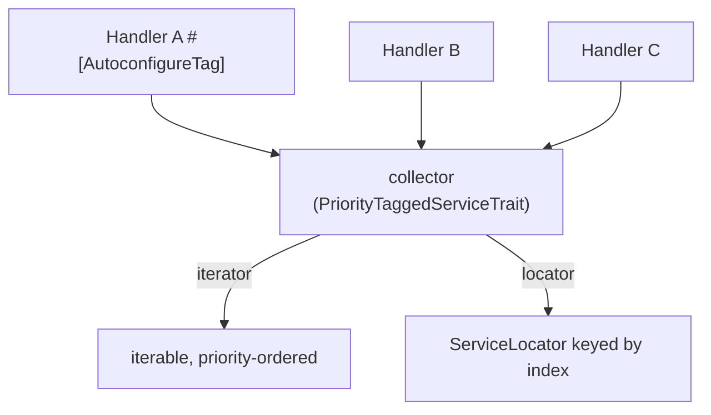

# Tags

!!! tip "In a nutshell"
    A tag is a build-time label on a service; on its own it does nothing until a
    collector consumes it. Use `tagged_iterator` / `#[AutowireIterator]` for
    instances, or `tagged_locator` / `#[AutowireLocator]` for a lazy keyed set.
    Highest-yield fact: **higher `priority` = earlier** in the iterator.

!!! example "Real-world analogy"
    A tag is a sticker on a recipe card — "brunch menu". The sticker alone does
    nothing; a collector (the chef assembling the brunch service) gathers every card
    wearing that sticker into one tray. `tagged_iterator` brings all the dishes out
    already plated; `tagged_locator` hands you a labelled tray you cook from one slot
    at a time. `priority` is where each card sits in the tray.

!!! abstract "Learning objectives"
    By the end of this chapter you can:

    - [ ] Tag services and consume them via `tagged_iterator` /
          `#[AutowireIterator]`.
    - [ ] Build a keyed collection with `tagged_locator` / `#[AutowireLocator]`.
    - [ ] Order and index tagged services with `priority` and an index method, and
          autoconfigure an interface to a tag.

    **Syllabus:** `Dependency Injection → Tags` ·
    **Level:** Advanced / Expert ·
    **Est. time:** 35 min ·
    **Prerequisites:** [Service Registration](registration.md)

---

## Theory

A **tag** is a label attached to a service definition (e.g. `app.handler`).
Tags are pure build-time metadata: on their own they do nothing. Something —
either a [compiler pass](compiler-passes.md) or the built-in
`tagged_iterator`/`tagged_locator` argument types — collects all services with a
tag and injects them as a group. This is how Symfony wires "all voters", "all
event subscribers", "all Messenger handlers".

!!! question "Predict first"
    You inject `#[AutowireLocator('app.handler')]` but nothing implements the tagged
    interface. At runtime you `get('missing')` on the locator. Empty result or error?

??? note "Reveal"
    Collecting a tag nothing carries yields an **empty** iterator/locator (a
    `foreach` just does nothing) — never `null`. But `locator->get('missing')` for a
    key not present throws `ServiceNotFoundException`; guard with `has()` first.

## Deep Dive — how it works internally

### Collection vs locator

- **`tagged_iterator`** injects an *iterable* of **already-instantiated** services
  with the tag. Use it when you always iterate all of them.
- **`tagged_locator`** injects a `Symfony\Component\DependencyInjection\ServiceLocator`
  keyed by a name, so services are instantiated **lazily** on access. Use it when
  you pick one by key.

Both are resolved at compile time into concrete argument definitions; the
`PriorityTaggedServiceTrait` collects, orders and keys the services.

### Priority and indexing

- **`priority`** on the tag orders the collection — **higher priority comes
  first** in the iterator.
- **`index_by`** (locator) keys each service. The key comes from a tag attribute,
  or from a **static method** named by `default_index_method`
  (commonly `getDefaultName()`/`getDefaultIndexName()`), or a
  `#[AsTaggedItem(index: '...', priority: N)]` attribute on the class.



### Autoconfiguring an interface to a tag

With `autoconfigure: true`, implementing a known interface auto-adds the matching
tag — you never tag manually. In `Kernel` or a bundle you register the mapping via
`ContainerBuilder::registerForAutoconfiguration(HandlerInterface::class)->addTag('app.handler')`,
or put `#[AutoconfigureTag('app.handler')]` on the interface. Then any class
implementing it is tagged automatically.

!!! note "Source reference"
    `Symfony\Component\DependencyInjection\Compiler\PriorityTaggedServiceTrait` &
    the `TaggedIteratorArgument` value object —
    [symfony/symfony `8.0`](https://github.com/symfony/symfony/blob/8.0/src/Symfony/Component/DependencyInjection/Compiler/PriorityTaggedServiceTrait.php).

### Null behavior

Collect a tag that **nothing carries** and you get an *empty* iterator/locator, not
`null` — a `foreach` over it simply does zero iterations, so only check emptiness
(`iterator_count()`, or `count()` on a materialised array) if "no handlers" is
itself an error worth reporting. A `tagged_locator` behaves like any locator:
`get($key)` for a key **not present** throws `ServiceNotFoundException`, so check
`has($key)` first when the key is dynamic. If `default_index_method` / `index_by`
resolves the *same* key for two services, the later one silently wins — a "my
handler vanished" surprise that looks like a null but is an overwrite. The common
bug is expecting an empty collection to be `null` and calling a method on it.

!!! note "Null in real life"
    An empty brunch tray (no cards stickered) is still a tray you can carry — it
    just holds nothing; reaching into a labelled slot that was never filled
    (`locator->get('x')`) is the error.

!!! info "Expert note"
    A tag on its own does *nothing* — it is inert metadata until a collector (a
    `tagged_iterator`/`tagged_locator` argument or a compiler pass) consumes it. If
    two services resolve the *same* index key, the later one silently overwrites the
    earlier: a "my handler vanished" bug that looks like a null but is an overwrite.

??? example "Debugging story"
    **Symptom:** a new handler was never invoked even though it was tagged.
    **Diagnosis:** its `getName()` returned the same string as an existing handler,
    so it collided on the locator index key and the later one won. **Fix:** give it a
    unique index (`#[AsTaggedItem(index: '...')]` or a distinct `getName()`).
    **Avoid:** treat index keys like primary keys — unique across the tagged set.

??? abstract "Source-code tour"
    - `Symfony\Component\DependencyInjection\Compiler\PriorityTaggedServiceTrait` —
      collects, priority-orders and index-keys tagged services.
    - `Symfony\Component\DependencyInjection\Argument\TaggedIteratorArgument` — the
      value object `!tagged_iterator` / `#[AutowireIterator]` compiles to.
    - `Symfony\Component\DependencyInjection\ServiceLocator` — what a
      `tagged_locator` becomes: a lazy PSR-11 set keyed by index.
    - `ContainerBuilder::registerForAutoconfiguration()` /
      `#[AutoconfigureTag]` — auto-tag every implementer of an interface.

## Configuration & code

=== "PHP Attributes"

    ```php
    <?php
    declare(strict_types=1);

    namespace App\Handler;

    use Symfony\Component\DependencyInjection\Attribute\AutoconfigureTag;
    use Symfony\Component\DependencyInjection\Attribute\AutowireIterator;
    use Symfony\Component\DependencyInjection\Attribute\AutowireLocator;
    use Psr\Container\ContainerInterface;

    #[AutoconfigureTag('app.handler')]
    interface HandlerInterface
    {
        public static function getName(): string;
        public function handle(string $payload): void;
    }

    final class HandlerRegistry
    {
        public function __construct(
            // All tagged services, priority-ordered:
            #[AutowireIterator('app.handler')]
            private readonly iterable $handlers,
            // Same services keyed by getName(), lazily instantiated:
            #[AutowireLocator('app.handler', defaultIndexMethod: 'getName')]
            private readonly ContainerInterface $locator,
        ) {}

        public function run(string $name, string $payload): void
        {
            $this->locator->get($name)->handle($payload);
        }
    }
    ```

=== "YAML"

    ```yaml
    # config/services.yaml
    services:
        _instanceof:
            App\Handler\HandlerInterface:
                tags: ['app.handler']

        App\Handler\HandlerRegistry:
            arguments:
                $handlers: !tagged_iterator app.handler
                $locator: !tagged_locator { tag: app.handler, index_by: key, default_index_method: getName }
    ```

=== "Console"

    ```console
    $ php bin/console debug:container --tag app.handler
    ```

## Best practices & anti-patterns

| ✅ Do | ❌ Avoid |
|---|---|
| Autoconfigure a tag on the interface | Tagging every class by hand |
| `tagged_iterator` when you use all | Locator when you always iterate |
| `tagged_locator` for keyed lookup | Instantiating all to pick one |
| Set `priority` for deterministic order | Relying on file order |

## When (not) to use it / alternatives

Use tags for "collect all services of a kind" — the plugin/handler/strategy
pattern. If you only ever have one implementation, an [alias](registration.md) is
simpler. If you must *transform* definitions (not just collect), you need a
[compiler pass](compiler-passes.md); the pass can call
`findTaggedServiceIds('app.handler')` itself.

!!! danger "Certification traps"
    - A tag alone does nothing — a collector (argument type or pass) must consume it.
    - `tagged_iterator` yields **instances**; `tagged_locator` yields a **lazy**
      `ServiceLocator`.
    - Higher `priority` = **earlier** in the iterator.
    - Index key comes from `index_by` attribute or the `default_index_method`
      static method, not the service id by default.

!!! warning "Common mistakes"
    - Expecting locator services to be instantiated eagerly — they are lazy.
    - Forgetting `_instanceof` / autoconfiguration and tagging nothing.
    - Using the class name as the locator key without configuring indexing.

## Exercises

1. **(Advanced)** Autoconfigure every `HandlerInterface` implementation with the
   tag `app.handler`, then inject them all as an iterable.
2. **(Expert)** Expose the same handlers as a locator keyed by a static
   `getName()` and fetch one by key.

??? success "Solutions"

    **1.** Put `#[AutoconfigureTag('app.handler')]` on the interface (or
    `_instanceof` in YAML), then inject with
    `#[AutowireIterator('app.handler')] iterable $handlers`.

    **2.** Inject `#[AutowireLocator('app.handler', defaultIndexMethod: 'getName')]
    ContainerInterface $locator` and call `$locator->get($name)`. Only the requested
    handler is instantiated.

## Certification questions

??? question "Q1. What does `tagged_locator` inject?"
    - [ ] A. An array of instances
    - [x] B. A lazy `ServiceLocator` keyed by an index ✅
    - [ ] C. A compiler pass
    - [ ] D. The raw tag string

    **Why:** The locator instantiates services on demand, keyed by the index.
    **Ref:** [Service subscribers & locators](https://symfony.com/doc/current/service_container/service_subscribers_locators.html).

??? question "Q2. Higher `priority` on a tag means the service is…"
    - [x] A. Earlier in the tagged iterator ✅
    - [ ] B. Later in the iterator
    - [ ] C. Made public
    - [ ] D. Ignored

    **Why:** Tagged collections are sorted by descending priority.
    **Ref:** [Tags with priority](https://symfony.com/doc/current/service_container/tags.html#tagged-services-with-priority).

??? question "Q3. How can every implementation of an interface get a tag automatically?"
    - [x] A. `#[AutoconfigureTag]` on the interface or `_instanceof` in YAML ✅
    - [ ] B. It happens with no configuration
    - [ ] C. Only via a compiler pass
    - [ ] D. Using `#[AsTaggedItem]`

    **Why:** Autoconfiguration maps an interface to a tag for all implementers.
    **Ref:** [Autoconfiguring tags](https://symfony.com/doc/current/service_container/tags.html).

## Key takeaways

- Tags are build-time labels; a collector must consume them.
- `tagged_iterator` = instances; `tagged_locator` = lazy keyed locator.
- `priority` orders (higher first); index via `default_index_method` /
  `#[AsTaggedItem]`.
- Autoconfigure a tag onto an interface to avoid manual tagging.

## Last-minute revision

!!! tip "Cheat sheet"
    - Attrs: `#[AutowireIterator('tag')]`, `#[AutowireLocator('tag', defaultIndexMethod:)]`,
      `#[AutoconfigureTag('tag')]`, `#[AsTaggedItem(index:, priority:)]`.
    - YAML: `!tagged_iterator`, `!tagged_locator`, `_instanceof`.
    - Inspect: `debug:container --tag <name>`.

## Connections

- **Depends on:** [Service Registration](registration.md) — autoconfiguration adds
  the tag to every implementer.
- **Reused in:** [Security](../security/voters.md),
  [Messenger](../miscellaneous/messenger.md), [Console](../console/events.md) —
  voters, handlers and event subscribers are all collected by tag.
- **Confused with:** [Service Locators](service-locators.md) — `tagged_locator`
  *builds* a locator; a locator is the general lazy-set primitive.

## Official References
- [Official Symfony docs — Service Tags](https://symfony.com/doc/current/service_container/tags.html)
- [Official Symfony docs — Subscribers & Locators](https://symfony.com/doc/current/service_container/service_subscribers_locators.html)
- [Symfony source — PriorityTaggedServiceTrait](https://github.com/symfony/symfony/blob/8.0/src/Symfony/Component/DependencyInjection/Compiler/PriorityTaggedServiceTrait.php)

## Video references

!!! tip "Watch & learn"
    These are official, continuously-updated video channels — search them for
    "dependency injection" to reinforce this chapter. We link stable channels rather than
    individual videos so the references never rot.

    - [SymfonyCasts screencasts](https://symfonycasts.com/tracks/symfony) — scripted, code-along tutorials.
    - [Symfony official YouTube](https://www.youtube.com/@SymfonyOfficial) — SymfonyCon conference talks & keynotes.
    - [Official docs for this topic](https://symfony.com/doc/current/service_container/service_subscribers_locators.html) — some Symfony doc pages embed a screencast.

## Confidence check

I'm ready when I can:

- [ ] explain **why** tags enable the collect-all-of-a-kind pattern
- [ ] wire `tagged_iterator` and `tagged_locator` in Symfony 8
- [ ] debug an empty collection or a duplicate index-key overwrite
- [ ] spot that a tag alone does nothing and higher `priority` is earlier
- [ ] explain how `PriorityTaggedServiceTrait` orders and keys services

---

<small>Related: [Service Locators](service-locators.md) ·
[Compiler Passes](compiler-passes.md) · [Autowiring](autowiring.md)</small>
