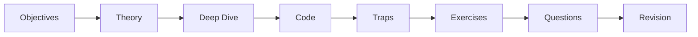

# Comment utiliser cette plateforme

Un déroulé qui transforme la lecture en **connaissances retenues, prêtes pour
l'examen**. La plateforme est construite autour du rappel actif, de la répétition
espacée et de l'apprentissage par les pièges — utilisez-la ainsi, pas comme un livre
à lire une seule fois.

!!! abstract "The short version"
    Étudiez dans l'ordre de la [Roadmap](../roadmap.md) → tentez chaque exercice et
    chaque question intégrée *avant* de révéler → auto-évaluez-vous avec la
    [banque de quiz](../revision/quiz.md) → entraînez-vous sur le
    [Revision Hub](../revision/index.md) à l'approche de l'examen.

## 1. Follow the Roadmap, not the A–Z nav

La navigation de gauche liste les domaines de A à Z, mais la [Roadmap](../roadmap.md)
donne l'**ordre optimisé** dans lequel chaque concept s'appuie sur le précédent.
Commencez par là. Débutez chaque domaine par son `index.md`, qui précise les
prérequis, la difficulté et la priorité de révision.

## 2. Read a chapter actively

Chaque micro-chapitre a la même forme. Travaillez-le, ne vous contentez pas de le
parcourir :

- **Objectives** — lisez-les en premier ; ce sont vos critères de réussite.
- **Theory + Deep Dive** — pour le niveau Expert, le Deep Dive (mécanismes internes,
  FQCNs, ordre d'exécution) est là où vivent les questions difficiles. Ne le sautez pas.
- **Traps & common mistakes** — ce sont les distracteurs favoris de l'examen.
- **Exercises & questions** — tentez-les **avant** de déplier la solution masquée.
  Le rappel actif est tout l'enjeu.

## 3. Test yourself

- Utilisez les **certification questions** intégrées à chaque chapitre comme
  premier contrôle.
- Lancez la **[banque de quiz](../revision/quiz.md)** avec
  [certificationy-cli](https://github.com/certificationy/certificationy-cli) pour
  un entraînement répété et noté automatiquement. Relancez-la ; suivez vos
  domaines faibles.

## 4. Space your repetition

Ne bachotez pas. Revisitez la **cheat sheet** et les **key takeaways** de chaque
domaine selon un calendrier de plus en plus espacé (le lendemain, quelques jours
plus tard, une semaine plus tard). Laissez le
[Revision Hub](../revision/index.md) tout agréger pour les derniers passages.

## 5. Pick a track

- **Advanced :** concentrez-vous sur Theory, Code et Traps ; survolez les Deep Dives.
- **Expert :** lisez chaque Deep Dive et chaque note de source ;
  l'[index des pièges](../revision/traps.md) est obligatoire.

Voir [Advanced vs Expert](levels.md) pour choisir.

## 6. Study on your phone

Les chapitres sont volontairement courts (150–450 lignes), avec des tableaux étroits
et de petits diagrammes. Mettez à profit les moments creux — trajets, pauses — pour
un micro-chapitre et ses questions.

!!! tip "A realistic weekly rhythm"
    - **En semaine :** 1–2 micro-chapitres + leurs questions intégrées.
    - **Le week-end :** terminez un domaine, lancez son quiz, relisez sa cheat sheet.
    - **La dernière semaine :** arrêtez tout nouveau contenu ; entraînez-vous sur le
      Revision Hub et les quiz.

## 7. Do a timed dry run

Avant le véritable examen, simulez-le : 75 questions, 90 minutes. Entraînez les
[tactiques du jour J](strategy.md) — budget de temps, élimination, marquage des
questions — jusqu'à ce qu'elles soient automatiques.

---

<small>Related: [Roadmap](../roadmap.md) · [Exam-Day Strategy](strategy.md) · [Revision Hub](../revision/index.md)</small>

## Official References

- [Official Symfony Certification](https://certification.symfony.com/)
- [Certification syllabus](https://certification.symfony.com/exams/symfony.html)
