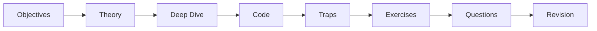

# How to Use This Platform

A workflow that turns reading into **retained, exam-ready knowledge**. The platform
is built around active recall, spaced repetition, and trap-driven learning — use it
that way, not as a book to read once.

!!! abstract "The short version"
    Study in the [Roadmap](../roadmap.md) order → attempt every exercise and inline
    question *before* revealing → self-test with the [quiz bank](../revision/quiz.md)
    → drill the [Revision Hub](../revision/index.md) as the exam approaches.

## 🧠 Pour les nuls

**C'est quoi cette page ?** Le mode d'emploi de la plateforme elle-même — comment étudier avec ce site pour retenir vraiment, pas juste lire une fois et oublier.

**Pourquoi ça existe ?** Lire passivement un chapitre du début à la fin donne l'illusion d'avoir appris, mais la mémoire s'évapore vite. Cette page explique la méthode qui fonctionne vraiment (rappel actif, répétition espacée).

**🏠 Analogie de la vraie vie :** Apprendre à nager en lisant un livre sur la natation versus s'entraîner réellement dans l'eau. Lire les chapitres, c'est le livre ; faire les exercices et quiz avant de regarder la solution, c'est nager réellement.

**Symfony dans la vraie vie :** Essaie de répondre à une question de certification **avant** de dérouler la réponse cachée (`??? question`) — c'est ce test actif, pas la simple lecture, qui fixe l'information en mémoire.

**⚠️ Erreur fréquente :** lire la navigation de A à Z au lieu de suivre le [Roadmap](../roadmap.md) — l'ordre alphabétique ignore complètement les prérequis entre domaines.

**🧠 Comment le mémoriser :** "Ne lis pas — teste-toi. La mémoire se construit en se rappelant, pas en relisant."

## 1. Follow the Roadmap, not the A–Z nav

The left navigation lists areas A–Z, but the [Roadmap](../roadmap.md) gives the
**optimized order** where each concept builds on the last. Start there. Begin every
area at its `index.md`, which states prerequisites, difficulty, and revision
priority.

## 2. Read a chapter actively

Each micro-chapter has the same shape. Work it, don't just scan it:

- **Objectives** — read them first; they are your success test.
- **Theory + Deep Dive** — for Expert, the Deep Dive (internals, FQCNs, execution
  order) is where the hard questions live. Do not skip it.
- **Traps & common mistakes** — these are the exam's favourite distractors.
- **Exercises & questions** — attempt them **before** expanding the hidden
  solution. Retrieval is the point.

## 3. Test yourself

- Use the inline **certification questions** in each chapter as a first check.
- Run the **[quiz bank](../revision/quiz.md)** with
  [certificationy-cli](https://github.com/certificationy/certificationy-cli) for
  repeated, machine-scored practice. Re-run it; track weak areas.

## 4. Space your repetition

Do not cram. Revisit each area's **cheat sheet** and **key takeaways** on a widening
schedule (next day, a few days later, a week later). Let the
[Revision Hub](../revision/index.md) aggregate everything for the final passes.

## 5. Pick a track

- **Advanced:** focus on Theory, Code, and Traps; skim Deep Dives.
- **Expert:** read every Deep Dive and source note; the
  [trap index](../revision/traps.md) is mandatory.

See [Advanced vs Expert](levels.md) to choose.

## 6. Study on your phone

Chapters are deliberately short (150–450 lines) with narrow tables and small
diagrams. Use spare moments — commutes, breaks — for one micro-chapter and its
questions.

!!! tip "A realistic weekly rhythm"
    - **Weekdays:** 1–2 micro-chapters + their inline questions.
    - **Weekend:** finish an area, run its quiz, review its cheat sheet.
    - **Final week:** stop reading new material; drill the Revision Hub and quizzes.

## 7. Do a timed dry run

Before the real exam, simulate it: 75 questions, 90 minutes. Practise the
[exam-day tactics](strategy.md) — time budgeting, elimination, flagging — so they
are automatic.

---

<small>Related: [Roadmap](../roadmap.md) · [Exam-Day Strategy](strategy.md) · [Revision Hub](../revision/index.md)</small>

## Official References

- [Official Symfony Certification](https://certification.symfony.com/)
- [Certification syllabus](https://certification.symfony.com/exams/symfony.html)
