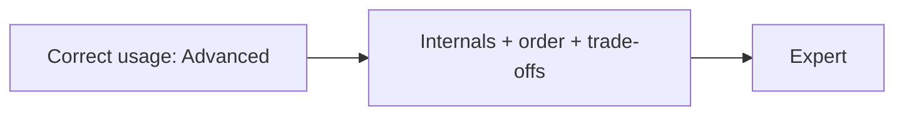

# Advanced vs Expert

La Certification Symfony 8 est **un seul examen avec deux résultats possibles**.
Vous ne choisissez pas de niveau à la réservation ; votre **score** décide si vous
obtenez **Advanced** ou **Expert**. Cette page explique comment les niveaux se
positionnent et comment viser chacun.

!!! abstract "The distinction"
    Mêmes 75 questions, mêmes 90 minutes. Un score de réussite = **Advanced** ; un
    score plus élevé = **Expert**. Expert n'est pas un examen différent — c'est une
    barre plus haute sur le même examen. Vérifiez les seuils en vigueur sur
    [certification.symfony.com](https://certification.symfony.com/).

## How the levels differ

| | Advanced | Expert |
|---|---|---|
| Ce que cela signale | Une maîtrise solide et correcte de Symfony 8 au quotidien | Une maîtrise profonde des mécanismes internes et des cas limites |
| Profondeur des connaissances | Usage correct, config, flux courants | Cycle de vie, ordre d'exécution, points d'extension, compromis |
| Zone de confort sur les questions | « How do I… » et « which is correct » | « What happens internally / in what order / why » |
| Ce qui vous coûte typiquement des points | Quelques pièges subtils | Les questions difficiles sur les internals qui séparent les deux paliers |

Comme il s'agit d'un score unique, **préparer Expert maximise aussi votre résultat
Advanced** — viser haut n'a aucun inconvénient.

## How to target Advanced

- Suivez la [Roadmap](../roadmap.md) ; priorisez les domaines **Critical**
  (Architecture, DI, Security, Messenger).
- Maîtrisez la **Theory**, la **Configuration & code** et les **Certification
  traps** de chaque chapitre. Survolez les Deep Dives pour la structure d'ensemble,
  pas chaque FQCN.
- Répétez les clés de config, valeurs par défaut et flux courants jusqu'à
  l'automatisme.
- Faites tourner la [banque de quiz](../revision/quiz.md) jusqu'à être régulièrement
  à l'aise.

## How to target Expert

- Lisez **chaque Deep Dive** et chaque **source reference** — les internals sont là
  où se gagnent les points Expert.
- Sachez réciter les **ordres d'exécution** de tête : kernel events, console events,
  flux d'authentification de la sécurité, flux des form events, validation vs
  expiration du cache.
- Connaissez les **points d'extension** (interfaces, tags, events) et les
  **compromis**, pas seulement le chemin nominal.
- Rendez l'[index des pièges](../revision/traps.md) et les
  [moyens mnémotechniques](../revision/memory-aids.md) obligatoires en révision.

## Choosing your track while studying

- Peu de temps, ou encore novice sur les internals de Symfony → **piste Advanced**
  d'abord, puis étendez-vous aux Deep Dives si le temps le permet.
- Ingénieur senior, à l'aise avec le framework → visez directement la **piste
  Expert** et traitez les Deep Dives comme le cœur, pas comme l'annexe.

!!! tip "Rule of thumb"
    Si vous savez *expliquer le mécanisme à quelqu'un d'autre* — pas seulement
    l'utiliser — vous êtes au niveau Expert sur ce sujet. Si vous savez *l'utiliser
    correctement et éviter les pièges*, vous êtes au niveau Advanced.

---

<small>Related: [Exam Format & Scoring](format.md) · [Roadmap](../roadmap.md) · [Exam-Day Strategy](strategy.md)</small>

## Official References

- [Official Symfony Certification](https://certification.symfony.com/)
- [Certification syllabus](https://certification.symfony.com/exams/symfony.html)
