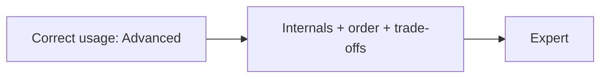

# Advanced vs Expert

The Symfony 8 Certification is **one exam with two outcomes**. You do not choose a
level when booking; your **score** decides whether you earn **Advanced** or
**Expert**. This page explains how the levels are positioned and how to target each.

!!! abstract "The distinction"
    Same 75 questions, same 90 minutes. A passing score = **Advanced**; a higher
    score = **Expert**. Expert is not a different exam — it is a higher bar on the
    same one. Confirm current thresholds at
    [certification.symfony.com](https://certification.symfony.com/).

## How the levels differ

| | Advanced | Expert |
|---|---|---|
| Signal | Solid, correct day-to-day Symfony 8 mastery | Deep command of internals and edge cases |
| Knowledge depth | Correct usage, config, common flows | Lifecycle, execution order, extension points, trade-offs |
| Question comfort zone | "How do I…" and "which is correct" | "What happens internally / in what order / why" |
| Typical misses cost you | A few subtle traps | The hard internals questions that separate the tiers |

Because it is a single score, **preparing for Expert also maximizes your Advanced
result** — there is no downside to aiming high.

## How to target Advanced

- Follow the [Roadmap](../roadmap.md); prioritize the **Critical** areas
  (Architecture, DI, Security, Messenger).
- Master each chapter's **Theory**, **Configuration & code**, and **Certification
  traps**. Skim the Deep Dives for the shape, not every FQCN.
- Drill config keys, defaults, and common flows until they are automatic.
- Run the [quiz bank](../revision/quiz.md) until you are consistently comfortable.

## How to target Expert

- Read **every Deep Dive** and **source reference** — internals are where Expert
  points are won.
- Be able to recite **execution orders** cold: kernel events, console events,
  security authentication flow, form event flow, cache validation vs expiration.
- Know **extension points** (interfaces, tags, events) and **trade-offs**, not just
  the happy path.
- Make the [trap index](../revision/traps.md) and [memory aids](../revision/memory-aids.md)
  mandatory revision.

## Choosing your track while studying

- Short on time or newer to Symfony internals → **Advanced track** first, then
  extend into Deep Dives if time allows.
- Senior engineer, comfortable with the framework → go straight for the **Expert
  track** and treat Deep Dives as the core, not the appendix.

!!! tip "Rule of thumb"
    If you can *explain the mechanism to someone else* — not just use it — you are
    at Expert level for that topic. If you can *use it correctly and avoid the
    traps*, you are at Advanced.

---

<small>Related: [Exam Format & Scoring](format.md) · [Roadmap](../roadmap.md) · [Exam-Day Strategy](strategy.md)</small>
