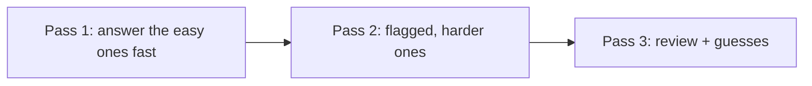

# Stratégie du jour J

Connaître la matière est nécessaire mais pas suffisant. Avec ~72 secondes par
question et une notation du choix multiple qui punit les quasi-réussites, la
**tactique** protège le score que vous avez déjà gagné.

!!! abstract "The four habits"
    1. Budgétez le temps en passes. 2. Éliminez avant de sélectionner. 3. Marquez et
    passez à la suite. 4. Reconnaissez les schémas de pièges. Entraînez-les lors
    d'une répétition chronométrée avant le jour J.

## 1. Time budgeting

75 questions / 90 minutes ≈ **72 secondes chacune**, mais la répartition est
inégale. Travaillez en **trois passes** :

- **Passe 1 (~45 min) :** répondez rapidement à tout ce que vous savez ; **marquez**
  tout ce qui prend plus de ~60 secondes et avancez. Mettez du temps de côté.
- **Passe 2 (~35 min) :** revenez aux questions marquées avec le temps économisé.
- **Passe 3 (~10 min) :** relisez, finalisez les sélections des choix multiples et
  assurez-vous qu'**aucune question ne reste sans réponse** (une mauvaise réponse
  au hasard ne coûte jamais plus cher qu'un blanc).

!!! warning "Do not sink 5 minutes into one question"
    Une question difficile vaut autant qu'une question facile. Marquez-la, avancez,
    revenez-y.

## 2. Elimination

Avant de choisir une réponse, **écartez** les mauvaises :

- Écartez les options utilisant des APIs **dépréciées ou supprimées** (ère
  Symfony 7, syntaxe sans attributs) — elles sont rarement la réponse Symfony 8.
- Écartez les options qui sont des **affirmations vraies mais qui ne répondent pas à
  la question**.
- Pour le **choix multiple**, évaluez chaque option indépendamment comme sa propre
  décision vrai/faux — vous devez sélectionner **toutes** les bonnes et **aucune**
  mauvaise.

## 3. Flagging and navigation

L'interface permet de marquer et de revenir. Utilisez-la délibérément :

- Marquez à la moindre hésitation ; ne perdez pas de temps à décider s'il faut
  marquer.
- Répondez *quelque chose* même sur les questions marquées avant d'avancer, pour ne
  jamais laisser de blanc si le temps vient à manquer.
- En passe 2, un regard neuf rend souvent la réponse évidente.

## 4. Reading questions correctly

- Lisez l'**énoncé littéralement**. Des mots comme **« always », « never »,
  « by default », « must », « only »** inversent la réponse — surtout en vrai/faux.
- Repérez si la question demande la **meilleure réponse unique** ou **toutes celles
  qui s'appliquent**.
- Attention aux **négations** (« which is NOT… ») — une source classique d'erreurs
  d'inattention.
- Quand un **extrait de code/config** est montré, vérifiez les détails liés à la
  version : attribut vs annotation, clés de config actuelles, syntaxe PHP 8.4.

## 5. Trap patterns to expect

!!! danger "Recurring certification traps"
    - **Ordre d'exécution** — kernel events, console events, flux de sécurité, ordre
      des events de form/validation. Mémorisez les séquences (voir les
      [moyens mnémotechniques](../revision/memory-aids.md)).
    - **Valeurs par défaut** — la stratégie d'access decision par défaut, le
      comportement par défaut du firewall, la visibilité de cache par défaut, le
      format par défaut du serializer.
    - **Distracteurs dépréciés** — une ancienne API familière proposée à côté de
      l'actuelle.
    - **« By default » vs « configurable »** — quelque chose est *possible* mais pas
      le *défaut*, ou inversement.
    - **Détails à un cran près** — codes de statut HTTP, niveaux de verbosité
      (`-v`/`-vv`/`-vvv`), signification des directives cache-control.

L'[index des pièges](../revision/traps.md) transversal les rassemble ;
entraînez-vous dessus avant l'examen.

## 6. Mindset

- **Répondez à chaque question.** Une supposition éclairée après élimination vaut
  mieux qu'un blanc.
- **Faites confiance à votre préparation** — la première intuition sur les sujets
  bien étudiés est généralement la bonne ; ne changez une réponse qu'avec une raison
  concrète.
- **Restez calme face aux questions inconnues** — sur 75 questions, quelques
  inconnues ne coulent pas un résultat Advanced (ni même Expert) si le reste est
  solide.

!!! tip "The day before"
    Arrêtez d'apprendre du nouveau. Dormez. Survolez uniquement la cheat sheet et
    l'index des pièges du [Revision Hub](../revision/index.md). Préparez votre pièce
    et votre matériel pour la session surveillée (voir l'[Exam Format](format.md)).

## Community prep wisdom (what past candidates report)

Distillé à partir de candidats expérimentés et de ressources de préparation
officielles/partenaires (liens ci-dessous). Ces constats reviennent dans presque
tous les témoignages :

- **L'examen teste le rappel précis, pas l'à-peu-près.** Noms exacts de classes,
  signatures de méthodes, clés de config et **valeurs par défaut** sont tous
  susceptibles de tomber. « À peu près juste » fait perdre des points. → révisez la
  [Cheat Sheet](../revision/cheat-sheet.md) et le [Glossary](../glossary.md).
- **Les internals avant l'usage.** Beaucoup de questions sondent *comment Symfony
  fonctionne à l'intérieur* (ordre des kernel events, compilation de la DI, flux du
  passport de sécurité) — pas seulement comment appeler l'API. Faites les sections
  [Deep Dive](../architecture/request-handling.md).
- **Le PHP pur est au programme.** OOP, SPL, closures, traits et la syntaxe PHP 8.4
  tombent à l'examen — ne sautez pas [PHP & Web Security](../php-web-security/index.md).
- **Lisez le code/la config attentivement.** Certaines questions se jouent sur une
  ligne, un appel déprécié ou une valeur par défaut subtile. Ralentissez sur les
  items de lecture de code.
- **L'étendue prime sur la profondeur.** Les questions sont tirées au hasard sur
  tout le syllabus : une couverture large compte plus que la maîtrise d'un seul
  domaine. Utilisez le [Study Planner](../revision/study-planner.md).
- **Le temps est le véritable ennemi.** ~72 s/question. Marquez et avancez ;
  répondez à tout (pas de points négatifs). Entraînez-vous avec les
  [Mock Exams](../revision/mock-exam.md).
- **Entraînez-vous avec une banque de questions.** Le rappel répété sous pression
  temporelle est le levier de score le plus puissant — faites tourner les
  [Flashcards](../revision/flashcards/index.md) et les mocks, et ne retestez que ce
  que vous ratez.

!!! info "Further reading (community & partner resources)"
    - [SensioLabs — official Symfony 8 certification prep course](https://sensiolabs.com/fr/formation/cours/preparation-a-la-certification-symfony-8)
    - [baksla.sh — Symfony certification write-up](https://baksla.sh/blog/symfony-certification)
    - [DND — comment bien préparer sa certification Symfony](https://www.dnd.fr/comment-bien-preparer-sa-certification-symfony-7/)
    - [Popov — My experience with the Symfony certification (Medium)](https://medium.com/@popov256/my-experience-with-symfony-certification-c265fe60422f)

---

<small>Related: [Exam Format & Scoring](format.md) · [Top Certification Traps](../revision/traps.md) · [Memory Aids](../revision/memory-aids.md)</small>

## Official References

- [Official Symfony Certification](https://certification.symfony.com/)
- [Certification syllabus](https://certification.symfony.com/exams/symfony.html)
