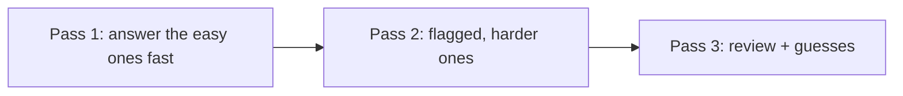

# Exam-Day Strategy

Knowing the material is necessary but not sufficient. With ~72 seconds per question
and multiple-choice scoring that punishes near-misses, **tactics** protect the
score you have earned.

!!! abstract "The four habits"
    1. Budget time in passes. 2. Eliminate before you select. 3. Flag and move on.
    4. Recognize the trap patterns. Practise these in a timed dry run before the day.

## 🧠 Pour les nuls

**C'est quoi cette page ?** Des tactiques concrètes pour gérer ton temps et éviter les pièges le jour de l'examen — connaître Symfony ne suffit pas si tu gères mal les 90 minutes.

**Pourquoi ça existe ?** Un candidat qui bloque 10 minutes sur une seule question difficile perd un temps qu'il ne pourra jamais rattraper sur les 74 autres questions.

**🏠 Analogie de la vraie vie :** Un examen scolaire classique où le conseil "fais d'abord les questions faciles, reviens sur les difficiles ensuite" évite de perdre des points faciles à cause du temps passé sur une question piège.

**Symfony dans la vraie vie :** Repérer un mot comme "always"/"never"/"by default" dans une question vrai/faux change souvent la réponse — lire vite peut te faire manquer exactement le mot qui inverse la bonne réponse.

**⚠️ Erreur fréquente :** laisser une question sans réponse — il n'y a pas de pénalité pour une mauvaise réponse, donc répondre au hasard vaut toujours mieux que de laisser vide.

**🧠 Comment le mémoriser :** "Trois passages : réponds vite à ce que tu sais, reviens sur ce que tu as marqué, relis à la fin — jamais de case vide."

## 1. Time budgeting

75 questions / 90 minutes ≈ **72 seconds each**, but the distribution is uneven.
Work in **three passes**:

- **Pass 1 (~45 min):** answer everything you know quickly; **flag** anything that
  takes more than ~60 seconds and move on. Bank time.
- **Pass 2 (~35 min):** return to flagged questions with the time you saved.
- **Pass 3 (~10 min):** review, finalize multiple-choice selections, and make sure
  **no question is left blank** (there is no penalty for guessing wrong that is
  worse than leaving it empty).

!!! warning "Do not sink 5 minutes into one question"
    One hard question is worth the same as one easy one. Flag it, move on, come back.

## 2. Elimination

Before picking an answer, **rule out** the wrong ones:

- Discard options using **deprecated or removed** APIs (Symfony 7-era, non-attribute
  syntax) — they are rarely the Symfony 8 answer.
- Discard options that are **true statements but don't answer the question**.
- For **multiple choice**, evaluate each option independently as its own true/false
  decision — you must select **all** correct ones and **no** incorrect ones.

## 3. Flagging and navigation

The interface lets you flag and revisit. Use it deliberately:

- Flag on any hesitation; don't burn time deciding whether to flag.
- Answer *something* even on flagged questions before moving on, so a blank is never
  left if you run out of time.
- On Pass 2, a fresh look often makes the answer obvious.

## 4. Reading questions correctly

- Read the **stem literally**. Words like **"always", "never", "by default",
  "must", "only"** flip answers — especially in true/false.
- Note whether it asks for the **single best** answer or **all that apply**.
- Watch for **negations** ("which is NOT…") — a common careless-error source.
- When a **code/config snippet** is shown, check version-specific details: attribute
  vs annotation, current config keys, PHP 8.4 syntax.

## 5. Trap patterns to expect

!!! danger "Recurring certification traps"
    - **Execution order** — kernel events, console events, security flow,
      form/validation event order. Memorize the sequences (see
      [memory aids](../revision/memory-aids.md)).
    - **Defaults** — the default access-decision strategy, default firewall
      behaviour, default cache visibility, default serializer format.
    - **Deprecated distractors** — a familiar old API offered next to the current
      one.
    - **"By default" vs "configurable"** — something is *possible* but not the
      *default*, or vice versa.
    - **Off-by-one specifics** — HTTP status codes, verbosity flags (`-v`/`-vv`/`-vvv`),
      cache-control directive meanings.

The cross-area [trap index](../revision/traps.md) collects these; drill it before
the exam.

## 6. Mindset

- **Answer every question.** An educated guess after elimination beats a blank.
- **Trust preparation** — first instincts on well-studied topics are usually right;
  change an answer only with a concrete reason.
- **Stay calm on unfamiliar questions** — with 75 questions, a few unknowns do not
  sink an Advanced (or even Expert) result if the rest are solid.

!!! tip "The day before"
    Stop learning new material. Sleep. Skim the [Revision Hub](../revision/index.md)
    cheat sheet and trap index only. Prepare your room and equipment for the
    proctored session (see [Exam Format](format.md)).

## Community prep wisdom (what past candidates report)

Distilled from experienced candidates and official/partner prep resources (links
below). These recur across almost every account:

- **The exam tests precise recall, not vibes.** Exact class names, method
  signatures, config keys, and **default values** are fair game. "Roughly right"
  loses points. → drill the [Cheat Sheet](../revision/cheat-sheet.md) and [Glossary](../glossary.md).
- **Internals over usage.** Many questions probe *how Symfony works inside* (kernel
  event order, DI compilation, the security passport flow) — not just how to call
  the API. Do the [Deep Dive](../architecture/request-handling.md) sections.
- **Pure PHP shows up.** OOP, SPL, closures, traits, and PHP 8.4 syntax are on the
  exam — don't skip [PHP & Web Security](../php-web-security/index.md).
- **Read code/config carefully.** Some questions hinge on one line, a deprecated
  call, or a subtle default. Slow down on code-reading items.
- **Breadth beats depth.** Questions are randomized across the whole syllabus, so
  broad coverage matters more than mastering one area. Use the [Study Planner](../revision/study-planner.md).
- **Time is the real enemy.** ~72 s/question. Flag and move on; answer everything
  (no negative marking). Practise with the [Mock Exams](../revision/mock-exam.md).
- **Practise with a question bank.** Repeated retrieval under time pressure is the
  single biggest score-mover — cycle the [Flashcards](../revision/flashcards/index.md)
  and mocks, and re-test only what you miss.

!!! info "Further reading (community & partner resources)"
    - [SensioLabs — official Symfony 8 certification prep course](https://sensiolabs.com/fr/formation/cours/preparation-a-la-certification-symfony-8)
    - [baksla.sh — Symfony certification write-up](https://baksla.sh/blog/symfony-certification)
    - [DND — comment bien préparer sa certification Symfony](https://www.dnd.fr/comment-bien-preparer-sa-certification-symfony-7/)
    - [Popov — My experience with the Symfony certification (Medium)](https://medium.com/@popov256/my-experience-with-symfony-certification-c265fe60422f)

---

<small>Related: [Exam Format & Scoring](format.md) · [Top Certification Traps](../revision/traps.md) · [Memory Aids](../revision/memory-aids.md)</small>

## Official References

- [Official Symfony Certification](https://certification.symfony.com/)
- [Certification syllabus](https://certification.symfony.com/exams/symfony.html)
