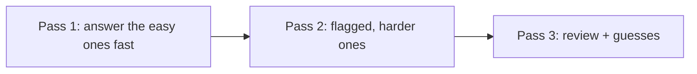

# Exam-Day Strategy

Knowing the material is necessary but not sufficient. With ~72 seconds per question
and multiple-choice scoring that punishes near-misses, **tactics** protect the
score you have earned.

!!! abstract "The four habits"
    1. Budget time in passes. 2. Eliminate before you select. 3. Flag and move on.
    4. Recognize the trap patterns. Practise these in a timed dry run before the day.

## 1. Time budgeting

75 questions / 90 minutes ≈ **72 seconds each**, but the distribution is uneven.
Work in **three passes**:

- **Pass 1 (~45 min):** answer everything you know quickly; **flag** anything that
  takes more than ~60 seconds and move on. Bank time.
- **Pass 2 (~35 min):** return to flagged questions with the time you saved.
- **Pass 3 (~10 min):** review, finalize multiple-choice selections, and make sure
  **no question is left blank** (there is no penalty for guessing wrong that is
  worse than leaving it empty).

!!! warning "Do not sink 5 minutes into one question"
    One hard question is worth the same as one easy one. Flag it, move on, come back.

## 2. Elimination

Before picking an answer, **rule out** the wrong ones:

- Discard options using **deprecated or removed** APIs (Symfony 7-era, non-attribute
  syntax) — they are rarely the Symfony 8 answer.
- Discard options that are **true statements but don't answer the question**.
- For **multiple choice**, evaluate each option independently as its own true/false
  decision — you must select **all** correct ones and **no** incorrect ones.

## 3. Flagging and navigation

The interface lets you flag and revisit. Use it deliberately:

- Flag on any hesitation; don't burn time deciding whether to flag.
- Answer *something* even on flagged questions before moving on, so a blank is never
  left if you run out of time.
- On Pass 2, a fresh look often makes the answer obvious.

## 4. Reading questions correctly

- Read the **stem literally**. Words like **"always", "never", "by default",
  "must", "only"** flip answers — especially in true/false.
- Note whether it asks for the **single best** answer or **all that apply**.
- Watch for **negations** ("which is NOT…") — a common careless-error source.
- When a **code/config snippet** is shown, check version-specific details: attribute
  vs annotation, current config keys, PHP 8.4 syntax.

## 5. Trap patterns to expect

!!! danger "Recurring certification traps"
    - **Execution order** — kernel events, console events, security flow,
      form/validation event order. Memorize the sequences (see
      [memory aids](../revision/memory-aids.md)).
    - **Defaults** — the default access-decision strategy, default firewall
      behaviour, default cache visibility, default serializer format.
    - **Deprecated distractors** — a familiar old API offered next to the current
      one.
    - **"By default" vs "configurable"** — something is *possible* but not the
      *default*, or vice versa.
    - **Off-by-one specifics** — HTTP status codes, verbosity flags (`-v`/`-vv`/`-vvv`),
      cache-control directive meanings.

The cross-area [trap index](../revision/traps.md) collects these; drill it before
the exam.

## 6. Mindset

- **Answer every question.** An educated guess after elimination beats a blank.
- **Trust preparation** — first instincts on well-studied topics are usually right;
  change an answer only with a concrete reason.
- **Stay calm on unfamiliar questions** — with 75 questions, a few unknowns do not
  sink an Advanced (or even Expert) result if the rest are solid.

!!! tip "The day before"
    Stop learning new material. Sleep. Skim the [Revision Hub](../revision/index.md)
    cheat sheet and trap index only. Prepare your room and equipment for the
    proctored session (see [Exam Format](format.md)).

---

<small>Related: [Exam Format & Scoring](format.md) · [Top Certification Traps](../revision/traps.md) · [Memory Aids](../revision/memory-aids.md)</small>
