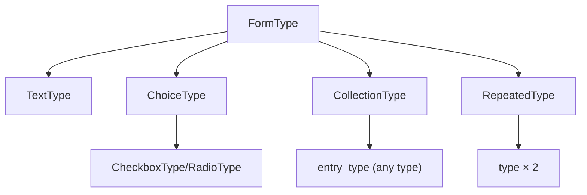

# Built-in Form Types Catalogue

!!! tip "In a nutshell"
    Symfony fournit des types de champs prêts à l'emploi (text, choice, date, money,
    collection, repeated, boutons), si bien que vous en construisez rarement un de
    zéro. Le fait le plus rentable : le widget de `ChoiceType` est déterminé par
    `expanded` × `multiple` (select / radios / checkboxes).

!!! example "Real-world analogy"
    Les types de base sont le rayon de visserie toute prête d'un magasin de
    bricolage — vis, boulons et rondelles déjà dimensionnés pour le travail : vous
    choisissez la bonne pièce au lieu de l'usiner vous-même. Et commander au
    restaurant illustre comment `ChoiceType` choisit son widget : deux questions
    décident du format — pouvez-vous prendre plusieurs plats (`multiple` ?), et
    toutes les options sont-elles étalées sous vos yeux ou cachées derrière un
    « voir la carte » (`expanded` ?). Étalées et à choix multiple : vous obtenez une
    rangée de cases à cocher ; cachées et à choix unique : un simple menu déroulant.

!!! abstract "Learning objectives"
    À la fin de ce chapitre, vous saurez :

    - [ ] Choisir le bon type de champ de base pour une valeur donnée.
    - [ ] Configurer les options clés des types texte, choice, date/heure, `collection`, `repeated`.
    - [ ] Expliquer comment `collection` et `repeated` sont des types compound bâtis sur d'autres.

    **Syllabus:** `Forms → Built-in types` ·
    **Level:** Advanced → Expert ·
    **Est. time:** 30 min ·
    **Prerequisites:** [Form types](types.md)

---

## Theory

Symfony fournit un catalogue de types de champs sous
`Symfony\Component\Form\Extension\Core\Type\*` (plus quelques-uns dans le
framework). Ils se regroupent en : **texte/scalaire**, **choice**, **date/heure**,
**compound à usage spécifique** (`collection`, `repeated`) et **boutons**.

```php
use Symfony\Component\Form\Extension\Core\Type\ChoiceType;     // choice
use Symfony\Component\Form\Extension\Core\Type\CollectionType; // 'collection' compound
use Symfony\Component\Form\Extension\Core\Type\DateType;       // date/time
use Symfony\Component\Form\Extension\Core\Type\RepeatedType;   // 'repeated' compound
use Symfony\Component\Form\Extension\Core\Type\SubmitType;     // buttons
use Symfony\Component\Form\Extension\Core\Type\TextType;       // text/scalar
```

!!! info "Doctrine out of scope"
    `EntityType` (`Symfony\Bridge\Doctrine\Form\Type\EntityType`) est un type du
    bridge Doctrine et est **hors périmètre** pour ce support. Utilisez `ChoiceType`
    avec des `choices` explicites comme équivalent sans Doctrine.

!!! question "Predict first"
    Un `ChoiceType` est configuré avec `expanded => true` et `multiple => true`.
    Quel widget le navigateur affiche-t-il — un `<select>`, des radios ou des
    checkboxes ?

??? note "Reveal"
    Des checkboxes. Le widget est déterminé par la paire `expanded` × `multiple` :
    replié ⇒ `<select>` (simple) ou multi-select ; déplié ⇒ radios (simple) ou
    checkboxes (multiple). `ChoiceType` n'a pas d'option `widget` distincte.

## Deep Dive — how it works internally

### Scalar & text types

| Type | Valeur | Notes |
|---|---|---|
| `TextType` | `string` | Base de nombreux champs texte |
| `TextareaType` | `string` | `<textarea>` |
| `EmailType` | `string` | `type="email"` |
| `PasswordType` | `string` | Non ré-affiché par défaut (`always_empty`) |
| `IntegerType` | `int` | Transformer d'entier indépendant de la locale |
| `NumberType` | `float`/`string` | `scale`, `rounding_mode` |
| `MoneyType` | `float`/`string` | `currency`, `divisor` (stocke des centimes si `100`) |
| `HiddenType` | `string` | Rendu en `<input type=hidden>` |

`IntegerType`/`NumberType`/`MoneyType` attachent des **view transformers** pour
que la chaîne saisie dans le navigateur corresponde à une valeur numérique côté
modèle (voir [data transformers](data-transformers.md)).

### Choice family

`Symfony\Component\Form\Extension\Core\Type\ChoiceType` est le cheval de trait.
Deux options booléennes définissent le widget :

| `expanded` | `multiple` | Widget |
|---|---|---|
| false | false | `<select>` (menu déroulant) |
| false | true | multi-select `<select multiple>` |
| true | false | boutons radio |
| true | true | checkboxes |

Options clés : `choices` (map libellé ⇒ valeur), `choice_value`, `choice_label`,
`placeholder`, `preferred_choices`. `CheckboxType` et `RadioType` sont les champs
primitifs booléen-simple/choix-simple sur lesquels `ChoiceType` s'appuie en mode
déplié.

### Date & time

`DateType`, `TimeType`, `DateTimeType` acceptent trois modes de `widget` :
`choice` (menus déroulants), `text` (un seul champ texte), `single_text` (un seul
champ `type="date"` — idéal avec HTML5). `input` choisit le type côté modèle :
`datetime_immutable` (recommandé), `datetime`, `string`, `timestamp`, `array`.

### Compound helpers

- **`CollectionType`** — une liste dynamique de sous-forms de type `entry_type`.
  Options `allow_add`, `allow_delete`, `by_reference`, `prototype` (un modèle que
  le JS clone). Il correspond à un tableau/une `Collection` d'éléments.
- **`RepeatedType`** — affiche `type` deux fois (p. ex. mot de passe +
  confirmation) et ne passe que si les deux correspondent.
  `first_name`/`second_name`, `invalid_message`.

### Buttons

`SubmitType`, `ButtonType`, `ResetType` — non mappés aux données ; `SubmitType`
vous permet de détecter *quel* bouton a été cliqué via
`$form->getClickedButton()`.



!!! note "Source reference"
    Types de base —
    [symfony/symfony `8.0` Core/Type](https://github.com/symfony/symfony/tree/8.0/src/Symfony/Component/Form/Extension/Core/Type).

## Configuration & code

=== "Choice + repeated"

    ```php
    <?php
    declare(strict_types=1);

    use Symfony\Component\Form\Extension\Core\Type\ChoiceType;
    use Symfony\Component\Form\Extension\Core\Type\PasswordType;
    use Symfony\Component\Form\Extension\Core\Type\RepeatedType;
    use Symfony\Component\Form\FormBuilderInterface;

    public function buildForm(FormBuilderInterface $builder, array $options): void
    {
        $builder
            ->add('role', ChoiceType::class, [
                'choices'  => ['User' => 'ROLE_USER', 'Admin' => 'ROLE_ADMIN'],
                'expanded' => true,   // radios
                'multiple' => false,
                'placeholder' => false,
            ])
            ->add('plainPassword', RepeatedType::class, [
                'type'            => PasswordType::class,
                'first_options'   => ['label' => 'Password'],
                'second_options'  => ['label' => 'Repeat password'],
                'invalid_message' => 'Passwords must match.',
                'mapped'          => false,
            ]);
    }
    ```

=== "Collection"

    ```php
    <?php
    declare(strict_types=1);

    use App\Form\TagType;
    use Symfony\Component\Form\Extension\Core\Type\CollectionType;
    use Symfony\Component\Form\FormBuilderInterface;

    public function buildForm(FormBuilderInterface $builder, array $options): void
    {
        $builder->add('tags', CollectionType::class, [
            'entry_type'   => TagType::class,
            'allow_add'    => true,
            'allow_delete' => true,
            'by_reference' => false, // call add/remove on the parent, not setter
            'prototype'    => true,
        ]);
    }
    ```

=== "Money & date"

    ```php
    <?php
    declare(strict_types=1);

    use Symfony\Component\Form\Extension\Core\Type\DateType;
    use Symfony\Component\Form\Extension\Core\Type\MoneyType;
    use Symfony\Component\Form\FormBuilderInterface;

    public function buildForm(FormBuilderInterface $builder, array $options): void
    {
        $builder
            ->add('price', MoneyType::class, ['currency' => 'EUR', 'divisor' => 100])
            ->add('publishedAt', DateType::class, [
                'widget' => 'single_text',
                'input'  => 'datetime_immutable',
            ]);
    }
    ```

## Best practices & anti-patterns

| ✅ À faire | ❌ À éviter |
|---|---|
| `ChoiceType` avec `choices` (sans Doctrine) | Dégainer `EntityType` ici |
| `RepeatedType` pour les confirmations | Deux champs + vérification d'égalité manuelle |
| `CollectionType` avec `by_reference: false` | Muter la collection en place |
| Widget de date `single_text` + HTML5 | Trois menus déroulants pour une simple date |

## When (not) to use it / alternatives

Préférez un type spécifique (`EmailType`, `MoneyType`) à `TextType` — vous
héritez du bon type d'input, des transformers et des indications de validation.
Pour un petit ensemble figé d'options, utilisez `ChoiceType` ; ne créez un type
personnalisé que lorsqu'une forme de champ revient régulièrement.

!!! danger "Certification traps"
    - Le widget de `ChoiceType` est déterminé par `expanded` × `multiple`, pas
      par une option distincte.
    - `CollectionType` a besoin de `by_reference => false` pour que les méthodes
      adder/remover du parent soient appelées lors des ajouts/suppressions.
    - `PasswordType` est vide au ré-affichage par défaut (`always_empty => true`).
    - Le `divisor` de `MoneyType` met la valeur stockée à l'échelle (p. ex. `100`
      ⇒ stockage en centimes).
    - `SubmitType`/les boutons ne font **pas** partie des données mappées.

!!! warning "Common mistakes"
    - Utiliser `EntityType` dans des exercices où Doctrine est hors périmètre.
    - `RepeatedType` mappé à une propriété qui n'existe pas — définissez
      `mapped => false` pour les mots de passe en clair.
    - S'attendre à ce que `collection` ajoute des lignes sans JS + `prototype`.

## Exercises

1. **(Advanced)** Construisez un form avec un prix en `MoneyType` (stockage en
   centimes), un `DateType` en `single_text` et un statut en `ChoiceType` rendu
   en radios.
2. **(Expert)** Expliquez ce que `by_reference => true` (valeur par défaut) fait
   à un `CollectionType` lié à une collection d'objets et pourquoi on le passe
   souvent à false.

??? success "Solutions"

    **1.** Voir les onglets "Money & date" et "Choice + repeated" ; combinez
    `MoneyType(divisor: 100)`, `DateType(widget: 'single_text')` et
    `ChoiceType(expanded: true, multiple: false)`.

    **2.** Avec `by_reference => true`, Symfony lit la collection via le getter
    et mute le *même* objet (il n'appelle le setter que pour les scalaires). Les
    éléments ajoutés/supprimés peuvent ne pas déclencher vos méthodes
    `addX`/`removeX`. Le passer à `false` force le form à appeler
    l'adder/le remover, ce qui garde les deux côtés d'une association
    synchronisés.

## Certification questions

??? question "Q1. Which options make `ChoiceType` render checkboxes?"
    - [x] A. `expanded => true, multiple => true` ✅
    - [ ] B. `expanded => false, multiple => true`
    - [ ] C. `expanded => true, multiple => false`
    - [ ] D. `widget => 'checkbox'`

    **Why:** Déplié + multiple ⇒ checkboxes ; déplié + simple ⇒ radios ; replié ⇒
    `<select>`.
    **Ref:** [ChoiceType](https://symfony.com/doc/current/reference/forms/types/choice.html).

??? question "Q2. What does `MoneyType`'s `divisor` do?"
    - [x] A. Scales the model value (e.g. `100` stores/reads cents) ✅
    - [ ] B. Sets the currency symbol
    - [ ] C. Rounds to N decimals
    - [ ] D. Limits the max amount

    **Why:** Le montant affiché est divisé par `divisor` pour produire la valeur
    du modèle, donc `100` vous permet de stocker des centimes entiers.
    **Ref:** [MoneyType](https://symfony.com/doc/current/reference/forms/types/money.html).

??? question "Q3. For a mapped `CollectionType` to call adder/remover methods you set…"
    - [x] A. `by_reference => false` ✅
    - [ ] B. `allow_add => false`
    - [ ] C. `prototype => false`
    - [ ] D. `mapped => false`

    **Why:** `by_reference => false` force le form à utiliser les méthodes
    add/remove du parent au lieu de muter la collection retournée en place.
    **Ref:** [CollectionType](https://symfony.com/doc/current/reference/forms/types/collection.html).

## Key takeaways

- Les types de base vivent dans `Extension\Core\Type\*` ; `EntityType` (Doctrine)
  est hors périmètre — utilisez `ChoiceType` avec `choices`.
- Widget de `ChoiceType` = `expanded` × `multiple`.
- `CollectionType` (listes dynamiques) et `RepeatedType` (confirmations) sont des
  helpers compound ; les boutons ne sont pas mappés.
- Les types numériques/de date embarquent des transformers ; préférez les dates
  en `single_text`.

## Last-minute revision

!!! tip "Cheat sheet"
    - Texte : `Text/Textarea/Email/Password(always_empty)/Integer/Number/Money/Hidden`.
    - `Choice` : `choices`, `expanded`, `multiple`, `placeholder`.
    - `Date/Time/DateTime` : `widget` (choice/text/single_text), `input`.
    - `Collection` : `entry_type`, `allow_add/delete`, `by_reference:false`, `prototype`.
    - `Repeated` : `type`, `first_options`/`second_options`.

## Connections

- **Depends on:** [Form types](types.md) — chaque type de base s'inscrit dans la hiérarchie des types résolus.
- **Reused in:** [Data transformers](data-transformers.md) — les types numériques/de date embarquent les view transformers étudiés là-bas.
- **Confused with:** [File uploads](file-upload.md) — `FileType` semble scalaire mais produit un `UploadedFile`, pas une chaîne.

## Official References
- [Official Symfony docs — Form types reference](https://symfony.com/doc/current/reference/forms/types.html)
- [Official Symfony docs — CollectionType](https://symfony.com/doc/current/reference/forms/types/collection.html)
- [Symfony source — Core form types](https://github.com/symfony/symfony/tree/8.0/src/Symfony/Component/Form/Extension/Core/Type)

## Video references

!!! tip "Watch & learn"
    Ce sont des chaînes vidéo officielles, mises à jour en continu — cherchez-y
    "Symfony forms" pour consolider ce chapitre. Nous lions des chaînes stables
    plutôt que des vidéos individuelles pour que les références ne périment jamais.

    - [SymfonyCasts screencasts](https://symfonycasts.com/tracks/symfony) — tutoriels scénarisés à suivre en codant.
    - [Symfony official YouTube](https://www.youtube.com/@SymfonyOfficial) — conférences et keynotes SymfonyCon.
    - [Official docs for this topic](https://symfony.com/doc/current/reference/forms/types/choice.html) — certaines pages de la doc Symfony intègrent un screencast.

## Confidence check

Je suis prêt quand je peux :

- [ ] expliquer **pourquoi** les types de base existent et quand en préférer un à un type personnalisé
- [ ] configurer `ChoiceType`, `CollectionType`, `RepeatedType`, `MoneyType`, `DateType` en Symfony 8
- [ ] déboguer un `CollectionType` qui ignore les méthodes adder/remover (`by_reference`)
- [ ] repérer la mauvaise réponse sur la paire `expanded` × `multiple` qui affiche des checkboxes
- [ ] expliquer comment le `divisor` de `MoneyType` met à l'échelle la valeur stockée côté modèle

---

<small>Related: [Form types](types.md) · [Data transformers](data-transformers.md) ·
[File uploads](file-upload.md)</small>
