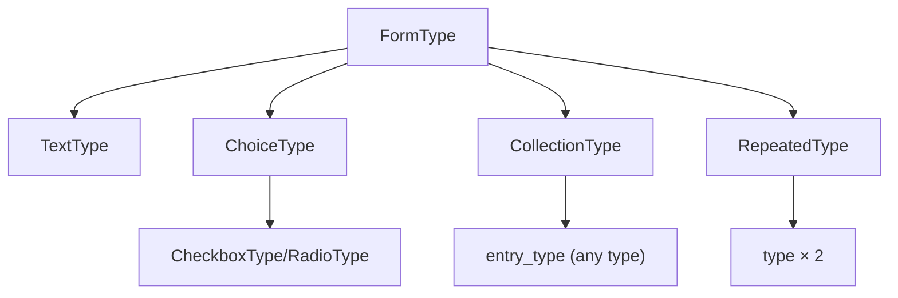

# Built-in Form Types Catalogue

!!! abstract "Learning objectives"
    By the end of this chapter you can:

    - [ ] Pick the correct core field type for a given value.
    - [ ] Configure the key options of text, choice, date/time, `collection`, `repeated` types.
    - [ ] Explain how `collection` and `repeated` are compound types built on others.

    **Syllabus:** `Forms → Built-in types` ·
    **Level:** Advanced → Expert ·
    **Est. time:** 30 min ·
    **Prerequisites:** [Form types](types.md)

---

## Theory

Symfony ships a catalogue of field types under
`Symfony\Component\Form\Extension\Core\Type\*` (plus a few in the framework).
They group into: **text/scalar**, **choice**, **date/time**, **special-purpose
compound** (`collection`, `repeated`), and **buttons**.

!!! info "Doctrine out of scope"
    `EntityType` (`Symfony\Bridge\Doctrine\Form\Type\EntityType`) is a Doctrine
    bridge type and is **out of scope** for this material. Use `ChoiceType` with
    explicit `choices` for the non-Doctrine equivalent.

## Deep Dive — how it works internally

### Scalar & text types

| Type | Value | Notes |
|---|---|---|
| `TextType` | `string` | Base for many text inputs |
| `TextareaType` | `string` | `<textarea>` |
| `EmailType` | `string` | `type="email"` |
| `PasswordType` | `string` | Not re-rendered by default (`always_empty`) |
| `IntegerType` | `int` | Locale-free integer transformer |
| `NumberType` | `float`/`string` | `scale`, `rounding_mode` |
| `MoneyType` | `float`/`string` | `currency`, `divisor` (stores cents if `100`) |
| `HiddenType` | `string` | Rendered as `<input type=hidden>` |

`IntegerType`/`NumberType`/`MoneyType` attach **view transformers** so the string
in the browser maps to a numeric model value (see
[data transformers](data-transformers.md)).

### Choice family

`Symfony\Component\Form\Extension\Core\Type\ChoiceType` is the workhorse.
Two boolean options define the widget:

| `expanded` | `multiple` | Widget |
|---|---|---|
| false | false | `<select>` (dropdown) |
| false | true | multi-select `<select multiple>` |
| true | false | radio buttons |
| true | true | checkboxes |

Key options: `choices` (label ⇒ value map), `choice_value`, `choice_label`,
`placeholder`, `preferred_choices`. `CheckboxType` and `RadioType` are the
primitive single-boolean/single-choice inputs `ChoiceType` builds on when
expanded.

### Date & time

`DateType`, `TimeType`, `DateTimeType` support three `widget` modes:
`choice` (dropdowns), `text` (a single text field), `single_text` (one
`type="date"` input — best with HTML5). `input` chooses the model type:
`datetime_immutable` (recommended), `datetime`, `string`, `timestamp`, `array`.

### Compound helpers

- **`CollectionType`** — a dynamic list of sub-forms of `entry_type`. Options
  `allow_add`, `allow_delete`, `by_reference`, `prototype` (a template for JS to
  clone). It maps to an array/`Collection` of items.
- **`RepeatedType`** — renders `type` twice (e.g. password + confirmation) and
  passes only if both match. `first_name`/`second_name`, `invalid_message`.

### Buttons

`SubmitType`, `ButtonType`, `ResetType` — not mapped to data; `SubmitType` lets
you detect *which* button was clicked via `$form->getClickedButton()`.



!!! note "Source reference"
    Core types —
    [symfony/symfony `8.0` Core/Type](https://github.com/symfony/symfony/tree/8.0/src/Symfony/Component/Form/Extension/Core/Type).

## Configuration & code

=== "Choice + repeated"

    ```php
    <?php
    declare(strict_types=1);

    use Symfony\Component\Form\Extension\Core\Type\ChoiceType;
    use Symfony\Component\Form\Extension\Core\Type\PasswordType;
    use Symfony\Component\Form\Extension\Core\Type\RepeatedType;
    use Symfony\Component\Form\FormBuilderInterface;

    public function buildForm(FormBuilderInterface $builder, array $options): void
    {
        $builder
            ->add('role', ChoiceType::class, [
                'choices'  => ['User' => 'ROLE_USER', 'Admin' => 'ROLE_ADMIN'],
                'expanded' => true,   // radios
                'multiple' => false,
                'placeholder' => false,
            ])
            ->add('plainPassword', RepeatedType::class, [
                'type'            => PasswordType::class,
                'first_options'   => ['label' => 'Password'],
                'second_options'  => ['label' => 'Repeat password'],
                'invalid_message' => 'Passwords must match.',
                'mapped'          => false,
            ]);
    }
    ```

=== "Collection"

    ```php
    <?php
    declare(strict_types=1);

    use App\Form\TagType;
    use Symfony\Component\Form\Extension\Core\Type\CollectionType;
    use Symfony\Component\Form\FormBuilderInterface;

    public function buildForm(FormBuilderInterface $builder, array $options): void
    {
        $builder->add('tags', CollectionType::class, [
            'entry_type'   => TagType::class,
            'allow_add'    => true,
            'allow_delete' => true,
            'by_reference' => false, // call add/remove on the parent, not setter
            'prototype'    => true,
        ]);
    }
    ```

=== "Money & date"

    ```php
    <?php
    declare(strict_types=1);

    use Symfony\Component\Form\Extension\Core\Type\DateType;
    use Symfony\Component\Form\Extension\Core\Type\MoneyType;
    use Symfony\Component\Form\FormBuilderInterface;

    public function buildForm(FormBuilderInterface $builder, array $options): void
    {
        $builder
            ->add('price', MoneyType::class, ['currency' => 'EUR', 'divisor' => 100])
            ->add('publishedAt', DateType::class, [
                'widget' => 'single_text',
                'input'  => 'datetime_immutable',
            ]);
    }
    ```

## Best practices & anti-patterns

| ✅ Do | ❌ Avoid |
|---|---|
| `ChoiceType` with `choices` (non-Doctrine) | Reaching for `EntityType` here |
| `RepeatedType` for confirmations | Two fields + manual equality check |
| `CollectionType` with `by_reference: false` | Mutating the collection in place |
| `single_text` date widget + HTML5 | Three dropdowns for a simple date |

## When (not) to use it / alternatives

Prefer a specific type (`EmailType`, `MoneyType`) over `TextType` — you inherit
correct input type, transformers and validation hints. For a fixed small set of
options use `ChoiceType`; only reach for a custom type when a field shape recurs.

!!! danger "Certification traps"
    - `ChoiceType` widget is decided by `expanded` × `multiple`, not by a
      separate option.
    - `CollectionType` needs `by_reference => false` for the parent's
      adder/remover methods to be called on add/delete.
    - `PasswordType` is empty on re-render by default (`always_empty => true`).
    - `MoneyType` `divisor` scales the stored value (e.g. `100` ⇒ store cents).
    - `SubmitType`/buttons are **not** part of the mapped data.

!!! warning "Common mistakes"
    - Using `EntityType` in exercises where Doctrine is out of scope.
    - `RepeatedType` mapped to a property that doesn't exist — set
      `mapped => false` for plain passwords.
    - Expecting `collection` to add rows without JS + `prototype`.

## Exercises

1. **(Advanced)** Build a form with a `MoneyType` price (store cents), a
   `single_text` `DateType`, and a `ChoiceType` status as radios.
2. **(Expert)** Explain what `by_reference => true` (default) does to a
   `CollectionType` bound to an object collection and why you often set it false.

??? success "Solutions"

    **1.** See the "Money & date" and "Choice + repeated" tabs; combine
    `MoneyType(divisor: 100)`, `DateType(widget: 'single_text')`, and
    `ChoiceType(expanded: true, multiple: false)`.

    **2.** With `by_reference => true`, Symfony reads the collection via the
    getter and mutates the *same* object (it only calls the setter for scalars).
    Added/removed items may not trigger your `addX`/`removeX` methods. Setting it
    `false` forces the form to call the adder/remover, keeping both sides of an
    association in sync.

## Certification questions

??? question "Q1. Which options make `ChoiceType` render checkboxes?"
    - [x] A. `expanded => true, multiple => true` ✅
    - [ ] B. `expanded => false, multiple => true`
    - [ ] C. `expanded => true, multiple => false`
    - [ ] D. `widget => 'checkbox'`

    **Why:** Expanded + multiple ⇒ checkboxes; expanded + single ⇒ radios;
    collapsed ⇒ `<select>`.
    **Ref:** [ChoiceType](https://symfony.com/doc/current/reference/forms/types/choice.html).

??? question "Q2. What does `MoneyType`'s `divisor` do?"
    - [x] A. Scales the model value (e.g. `100` stores/reads cents) ✅
    - [ ] B. Sets the currency symbol
    - [ ] C. Rounds to N decimals
    - [ ] D. Limits the max amount

    **Why:** The displayed amount is divided by `divisor` to produce the model
    value, so `100` lets you store integer cents.
    **Ref:** [MoneyType](https://symfony.com/doc/current/reference/forms/types/money.html).

??? question "Q3. For a mapped `CollectionType` to call adder/remover methods you set…"
    - [x] A. `by_reference => false` ✅
    - [ ] B. `allow_add => false`
    - [ ] C. `prototype => false`
    - [ ] D. `mapped => false`

    **Why:** `by_reference => false` forces the form to use the parent's
    add/remove methods instead of mutating the returned collection in place.
    **Ref:** [CollectionType](https://symfony.com/doc/current/reference/forms/types/collection.html).

## Key takeaways

- Core types live in `Extension\Core\Type\*`; `EntityType` (Doctrine) is out of
  scope — use `ChoiceType` with `choices`.
- `ChoiceType` widget = `expanded` × `multiple`.
- `CollectionType` (dynamic lists) and `RepeatedType` (confirmations) are
  compound helpers; buttons are unmapped.
- Numeric/date types carry transformers; prefer `single_text` dates.

## Last-minute revision

!!! tip "Cheat sheet"
    - Text: `Text/Textarea/Email/Password(always_empty)/Integer/Number/Money/Hidden`.
    - `Choice`: `choices`, `expanded`, `multiple`, `placeholder`.
    - `Date/Time/DateTime`: `widget` (choice/text/single_text), `input`.
    - `Collection`: `entry_type`, `allow_add/delete`, `by_reference:false`, `prototype`.
    - `Repeated`: `type`, `first_options`/`second_options`.

## Official References
- [Official Symfony docs — Form types reference](https://symfony.com/doc/current/reference/forms/types.html)
- [Official Symfony docs — CollectionType](https://symfony.com/doc/current/reference/forms/types/collection.html)
- [Symfony source — Core form types](https://github.com/symfony/symfony/tree/8.0/src/Symfony/Component/Form/Extension/Core/Type)

---

<small>Related: [Form types](types.md) · [Data transformers](data-transformers.md) ·
[File uploads](file-upload.md)</small>
</content>
