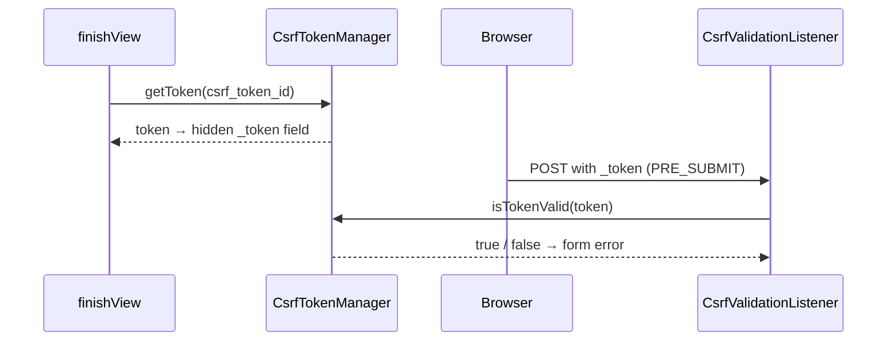

# CSRF Protection in Forms

!!! tip "In a nutshell"
    Les forms Symfony ajoutent et vérifient automatiquement un champ caché `_token`
    afin qu'un site étranger ne puisse pas forger une soumission. Points clés : le
    token est validé sur **PRE_SUBMIT**, et le **CSRF stateless** (7.2+, via
    `stateless_token_ids`) ne nécessite aucune session.

!!! example "Real-world analogy"
    Le `_token` caché est un **badge délivré à l'accueil sécurité**. Quand le form
    est rendu, l'accueil (`CsrfTokenManager`) remet un badge lié à votre visite
    (`csrf_token_id`). À la soumission, le vigile (`CsrfValidationListener`) vérifie
    que le badge correspond avant de laisser passer la request. Un site étranger
    peut faire frapper votre navigateur à la porte, mais il ne peut ni lire ni
    forger votre badge — le vigile le refoule donc.

!!! abstract "Learning objectives"
    À la fin de ce chapitre, vous saurez :

    - [ ] Expliquer comment le composant Form génère et valide un token CSRF.
    - [ ] Configurer `csrf_protection`, `csrf_token_id`, `csrf_field_name`.
    - [ ] Utiliser le **CSRF stateless** (Symfony 7.2+/8) et générer un token manuel.

    **Syllabus:** `Forms → CSRF protection` ·
    **Level:** Advanced → Expert ·
    **Est. time:** 25 min ·
    **Prerequisites:** [Web Security Fundamentals](../php-web-security/web-security.md) · [Handling submissions](handling.md)

---

## Theory

Le **CSRF** (Cross-Site Request Forgery) piège le navigateur d'un utilisateur
connecté pour lui faire soumettre une request modifiant l'état sans qu'il l'ait
voulu. La défense classique : un token secret par form qu'un site attaquant ne
peut ni lire ni deviner. Les forms Symfony ajoutent et vérifient ce token
automatiquement — vous êtes protégé sans rien faire.

Par défaut, chaque form construit via le framework a la protection CSRF activée
et rend un champ caché `_token`.

!!! question "Predict first"
    Un utilisateur soumet un form dont le champ caché `_token` est totalement
    absent. Le composant Form lève-t-il une exception, ou fait-il autre chose ?

??? note "Reveal"
    Autre chose : sur **PRE_SUBMIT**, le `CsrfValidationListener` extrait `_token`,
    le trouve absent/invalide, et ajoute une **erreur de form** — pas d'exception.
    `isValid()` renvoie `false` et vous re-rendez avec le `csrf_message`.

## Deep Dive — how it works internally

### The moving parts

- `Symfony\Component\Form\Extension\Csrf\Type\FormTypeCsrfExtension` — une
  **type extension** sur `FormType`. Dans `finishView()` elle injecte le token
  dans la vue (un champ caché nommé selon `csrf_field_name`) ; dans `buildForm()`
  elle enregistre un `CsrfValidationListener`.
- `Symfony\Component\Form\Extension\Csrf\EventListener\CsrfValidationListener` —
  sur **PRE_SUBMIT**, il extrait `_token` des données soumises et le valide,
  en ajoutant une erreur de form s'il est absent/invalide.
- `Symfony\Component\Security\Csrf\CsrfTokenManagerInterface` — génère et valide
  les tokens. Le `CsrfTokenManager` stateful par défaut stocke les tokens via un
  `TokenStorageInterface` (session) en utilisant un `UriSafeTokenGenerator`.

```php
// CsrfTokenManagerInterface: mints and checks tokens
$token = $tokenManager->getToken('task_item');   // default CsrfTokenManager stores it
                                                 // via TokenStorageInterface (session),
                                                 // values from UriSafeTokenGenerator
$ok = $tokenManager->isTokenValid(new CsrfToken('task_item', $submitted));

// FormTypeCsrfExtension wires this into every FormType:
//  - buildForm()  -> registers CsrfValidationListener (runs on PRE_SUBMIT)
//  - finishView() -> injects the hidden field named by csrf_field_name ('_token')
```



!!! note "Source reference"
    `FormTypeCsrfExtension` et `CsrfValidationListener` —
    [symfony/symfony `8.0`](https://github.com/symfony/symfony/blob/8.0/src/Symfony/Component/Form/Extension/Csrf/Type/FormTypeCsrfExtension.php).

### The options

| Option | Default | Purpose |
|---|---|---|
| `csrf_protection` | `true` | Activer/désactiver la protection par form |
| `csrf_field_name` | `_token` | Nom du champ caché |
| `csrf_token_id` | block prefix du form | Namespace/intention du token |
| `csrf_message` | message de token invalide | Erreur affichée en cas d'échec |
| `csrf_token_manager` | manager par défaut | Remplacer le service de manager |

`csrf_token_id` est la chaîne d'**intention**. Deux forms partageant un id
partagent un namespace de token ; des ids distincts les isolent. Définir un id
explicite rend le token stable quel que soit le nom de classe du form.

### Stateless CSRF (Symfony 7.2+/8)

Le CSRF traditionnel stocke un token dans la **session**, ce qui force la
création de session et casse le cache HTTP. Le **CSRF stateless** évite la
session grâce à une stratégie double-submit-cookie + same-origin, gérée par
`Symfony\Component\Security\Csrf\SameOriginCsrfTokenManager`. Activez-le en
listant les ids de token comme stateless :

```yaml
# config/packages/csrf.yaml
framework:
    csrf_protection:
        stateless_token_ids: ['submit', 'authenticate', 'logout']
```

Un form dont le `csrf_token_id` figure dans cette liste utilise le manager
stateless : le token est validé en comparant une valeur de header/cookie de la
request au champ soumis et en vérifiant l'origine de la request — **aucune
session nécessaire**. C'est le défaut recommandé pour les nouvelles applications
et les pages cache-friendly.

### Manual tokens (non-form actions)

Pour un lien/une action AJAX en dehors du système de forms, créez et vérifiez
les tokens vous-même.

### Null behavior

Une soumission avec un `_token` absent ou `null` est le cas typique d'attaque ou
de bug. Le `CsrfValidationListener` sur `PRE_SUBMIT` extrait `_token` des données
brutes ; s'il est absent ou ne correspond pas, il ne lève **pas** d'exception —
il ajoute une erreur de form, donc `isValid()` renvoie `false` et vous re-rendez
avec le `csrf_message`. Le helper de controller
`isCsrfTokenValid('intention', $token)` traite lui aussi un token soumis
`null`/vide comme invalide. Le bug classique : omettre `form_rest`/`_token` dans
un template manuel, si bien que le token est `null` à la soumission et que chaque
POST échoue silencieusement à la validation — pas d'exception, juste un form qui
ne valide jamais.

```php
// Missing/null _token -> a form error on PRE_SUBMIT, never an exception
$form->handleRequest($request);
if ($form->isSubmitted() && !$form->isValid()) {
    // CsrfValidationListener added the csrf_message as a form error
}

// Controller helper: a null/empty token is invalid too
$token = $request->getPayload()->get('_token'); // null if the template skipped form_rest()
if (!$this->isCsrfTokenValid('delete_item', $token)) {
    // quietly refused — re-render the form
}
```

!!! note "Null in real life"
    `null` = un visiteur **sans badge** à l'accueil sécurité — pas expulsé de
    force, juste refusé poliment jusqu'à ce qu'il en présente un valide.

## Configuration & code

=== "Per-form options"

    ```php
    <?php
    declare(strict_types=1);

    use Symfony\Component\OptionsResolver\OptionsResolver;

    public function configureOptions(OptionsResolver $resolver): void
    {
        $resolver->setDefaults([
            'csrf_protection' => true,
            'csrf_field_name' => '_token',
            'csrf_token_id'   => 'delete_item', // stable intention
            'csrf_message'    => 'Invalid CSRF token.',
        ]);
    }
    ```

=== "Global (YAML)"

    ```yaml
    # config/packages/csrf.yaml
    framework:
        csrf_protection:
            enabled: true
            stateless_token_ids: ['submit', 'authenticate', 'logout']
    ```

=== "Manual token (controller + Twig)"

    ```php
    <?php
    declare(strict_types=1);

    use Symfony\Component\HttpFoundation\Request;
    use Symfony\Component\HttpFoundation\Response;
    use Symfony\Component\HttpKernel\Exception\AccessDeniedHttpException;

    // In an action handling a delete link:
    public function delete(Request $request): Response
    {
        $submitted = (string) $request->request->get('_token');
        if (!$this->isCsrfTokenValid('delete-item-'.$id, $submitted)) {
            throw new AccessDeniedHttpException('Invalid CSRF token.');
        }
        // ... proceed ...
        return $this->redirectToRoute('items');
    }
    ```

    ```twig
    <form method="post" action="{{ path('item_delete', {id: item.id}) }}">
        <input type="hidden" name="_token"
               value="{{ csrf_token('delete-item-' ~ item.id) }}">
        <button>Delete</button>
    </form>
    ```

## Best practices & anti-patterns

| ✅ Do | ❌ Avoid |
|---|---|
| Garder le CSRF actif pour les forms modifiant l'état | Le désactiver « pour que le submit fonctionne » |
| Préférer le CSRF stateless pour les pages en cache | Forcer des sessions juste pour un token |
| Utiliser une intention `csrf_token_id` stable | Réutiliser un seul token id partout |
| Émettre `_token` (via `form_rest`) | Rendre les champs mais omettre `_token` |

## When (not) to use it / alternatives

Ne désactivez le CSRF que pour les **APIs stateless** authentifiées par
token/JWT et jamais via des cookies ambiants — il n'y a pas de surface CSRF là.
Pour les forms GET (recherche), le CSRF est inutile car ils doivent être sans
effet de bord. Tout ce qui mute l'état sous authentification par cookie **doit**
garder le CSRF.

!!! danger "Certification traps"
    - Le token CSRF est validé sur **PRE_SUBMIT**, avant transformation.
    - Le nom de champ par défaut est `_token` ; l'id par défaut est le **block
      prefix du form**, sauf si vous définissez `csrf_token_id`.
    - Le CSRF stateless (`stateless_token_ids`) utilise `SameOriginCsrfTokenManager`
      et ne nécessite **aucune session** — nouveauté de Symfony 7.2.
    - Rendre les champs manuellement en omettant `form_rest`/`_token` → échec
      « invalid token » garanti.

!!! warning "Common mistakes"
    - Désactiver `csrf_protection` pour corriger une erreur de token au lieu de
      rendre le token.
    - Supposer qu'`isCsrfTokenValid()` (helper de controller) utilise le même id
      que le form — passez la chaîne d'intention correspondante.
    - S'attendre à ce que le CSRF stateless fonctionne alors qu'un token id
      différent conserve le manager stateful (session).

## Exercises

1. **(Advanced)** Donnez à un form de suppression un `csrf_token_id` personnalisé
   et vérifiez qu'un token altéré produit une erreur de form plutôt qu'un crash.
2. **(Expert)** Migrez un form de login vers le CSRF stateless et expliquez ce
   qui change pour le cache HTTP et les sessions.

??? success "Solutions"

    **1.** Définissez `'csrf_token_id' => 'delete_item'`. À la soumission avec un
    `_token` erroné, le `CsrfValidationListener` ajoute une erreur ; `isValid()`
    renvoie `false` et vous re-rendez — pas d'exception.

    **2.** Ajoutez le token id du login (par ex. `authenticate`) à
    `framework.csrf_protection.stateless_token_ids`. Le token est désormais validé
    via same-origin/double-submit au lieu de la session, donc la page de login ne
    force plus de session et peut être servie depuis le cache.

## Certification questions

??? question "Q1. At which event is a form's CSRF token validated?"
    - [x] A. PRE_SUBMIT ✅
    - [ ] B. POST_SUBMIT
    - [ ] C. PRE_SET_DATA
    - [ ] D. SUBMIT

    **Why:** Le `CsrfValidationListener` s'exécute sur PRE_SUBMIT, extrait
    `_token` des données brutes et le valide.
    **Ref:** [CSRF protection](https://symfony.com/doc/current/security/csrf.html).

??? question "Q2. What does `csrf_token_id` control?"
    - [ ] A. The hidden field's HTML name
    - [x] B. The token intention/namespace ✅
    - [ ] C. Whether CSRF is enabled
    - [ ] D. The session cookie name

    **Why:** `csrf_token_id` est la chaîne d'intention ; `csrf_field_name`
    définit le nom du champ HTML.
    **Ref:** [Form CSRF options](https://symfony.com/doc/current/reference/forms/types/form.html).

??? question "Q3. Stateless CSRF (7.2+) primarily removes the need for…"
    - [x] A. A server-side session to store tokens ✅
    - [ ] B. The hidden `_token` field
    - [ ] C. HTTPS
    - [ ] D. The Validator component

    **Why:** Le `SameOriginCsrfTokenManager` valide via double-submit cookie +
    vérifications d'origine, donc aucun token n'est stocké en session.
    **Ref:** [Stateless CSRF](https://symfony.com/doc/current/security/csrf.html#csrf-protection-in-login-forms).

## Key takeaways

- La protection CSRF est active par défaut ; un champ caché `_token` est ajouté et vérifié.
- Options : `csrf_protection`, `csrf_field_name` (`_token`), `csrf_token_id`.
- La validation a lieu sur **PRE_SUBMIT** via le `CsrfValidationListener`.
- Le CSRF stateless (7.2+/8) via `stateless_token_ids` ne nécessite aucune session.

## Last-minute revision

!!! tip "Cheat sheet"
    - Champ par défaut : `_token` ; id par défaut : block prefix du form.
    - Validation : PRE_SUBMIT, `CsrfValidationListener`.
    - Stateless : `framework.csrf_protection.stateless_token_ids: [...]`.
    - Manuel : `csrf_token('intention')` en Twig · `isCsrfTokenValid('intention', $t)`.
    - Ne jamais désactiver le CSRF pour des changements d'état authentifiés par cookie.

## Connections

- **Depends on:** [Web security fundamentals](../php-web-security/web-security.md) — le CSRF est la menace de cross-site request forgery contre laquelle on se défend ici.
- **Reused in:** [Rendering forms](rendering.md) — `form_rest`/`form_end` émettent le `_token` caché ; omettez-le et chaque POST échoue.
- **Confused with:** [Form events](events.md) — le token est vérifié par un listener sur `PRE_SUBMIT`, pas dans une phase de validation séparée.

## Official References
- [Official Symfony docs — CSRF protection](https://symfony.com/doc/current/security/csrf.html)
- [Official Symfony docs — Form type CSRF options](https://symfony.com/doc/current/reference/forms/types/form.html)
- [Symfony source — FormTypeCsrfExtension](https://github.com/symfony/symfony/blob/8.0/src/Symfony/Component/Form/Extension/Csrf/Type/FormTypeCsrfExtension.php)

## Video references

!!! tip "Watch & learn"
    Voici des chaînes vidéo officielles, mises à jour en continu — cherchez-y
    « Symfony forms » pour consolider ce chapitre. Nous lions des chaînes stables
    plutôt que des vidéos individuelles afin que les références ne périment jamais.

    - [SymfonyCasts screencasts](https://symfonycasts.com/tracks/symfony) — tutoriels scénarisés à suivre en codant.
    - [Symfony official YouTube](https://www.youtube.com/@SymfonyOfficial) — conférences et keynotes SymfonyCon.
    - [Official docs for this topic](https://symfony.com/doc/current/security/csrf.html) — certaines pages de la doc Symfony intègrent un screencast.

## Confidence check

Je suis prêt quand je peux :

- [ ] expliquer **pourquoi** la protection CSRF existe et quelles requests en ont besoin
- [ ] configurer `csrf_protection`, `csrf_token_id`, `csrf_field_name` et le CSRF stateless dans Symfony 8
- [ ] déboguer un form qui échoue toujours à la validation parce que `_token` n'a jamais été rendu
- [ ] repérer la mauvaise réponse sur l'event qui valide le token (PRE_SUBMIT)
- [ ] expliquer comment le `SameOriginCsrfTokenManager` valide sans session

---

<small>Related: [Web Security Fundamentals](../php-web-security/web-security.md) ·
[Handling submissions](handling.md) · [Form events](events.md)</small>
