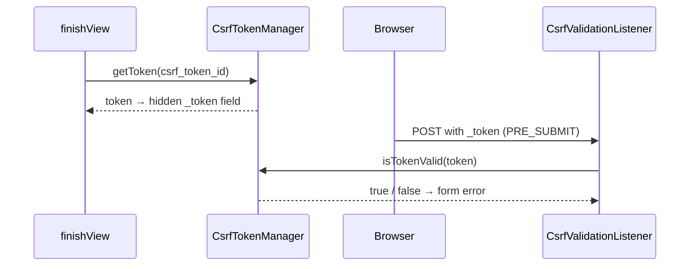

# CSRF Protection in Forms

!!! tip "In a nutshell"
    Symfony forms auto-add and check a hidden `_token` field so a foreign site
    cannot forge a submission. Key facts: the token is validated on **PRE_SUBMIT**,
    and **stateless CSRF** (7.2+, via `stateless_token_ids`) needs no session.

!!! example "Real-world analogy"
    The hidden `_token` is a **badge issued at the security desk**. When the form is
    rendered, the desk (`CsrfTokenManager`) hands out a badge tied to your visit
    (`csrf_token_id`). On submit, the guard (`CsrfValidationListener`) checks the
    badge matches before letting the request through. A foreign site can make your
    browser knock on the door, but it can't read or forge your badge — so the guard
    turns it away.

!!! abstract "Learning objectives"
    By the end of this chapter you can:

    - [ ] Explain how the Form component generates and validates a CSRF token.
    - [ ] Configure `csrf_protection`, `csrf_token_id`, `csrf_field_name`.
    - [ ] Use **stateless CSRF** (Symfony 7.2+/8) and generate a manual token.

    **Syllabus:** `Forms → CSRF protection` ·
    **Level:** Advanced → Expert ·
    **Est. time:** 25 min ·
    **Prerequisites:** [Web Security Fundamentals](../php-web-security/web-security.md) · [Handling submissions](handling.md)

---

## Theory

**CSRF** (Cross-Site Request Forgery) tricks a logged-in user's browser into
submitting a state-changing request they did not intend. The classic defence: a
per-form secret token that an attacker's site cannot read or guess. Symfony forms
add and check this token automatically — you get protection for free.

By default, every form built through the framework has CSRF protection enabled
and renders a hidden `_token` field.

!!! question "Predict first"
    A user submits a form whose hidden `_token` field is missing entirely. Does the
    Form component throw an exception, or do something else?

??? note "Reveal"
    Something else: on **PRE_SUBMIT** the `CsrfValidationListener` pops `_token`, finds
    it absent/invalid, and adds a **form error** — no exception. `isValid()` returns
    `false` and you re-render with the `csrf_message`.

## Deep Dive — how it works internally

### The moving parts

- `Symfony\Component\Form\Extension\Csrf\Type\FormTypeCsrfExtension` — a **type
  extension** on `FormType`. In `finishView()` it injects the token into the view
  (a hidden field named by `csrf_field_name`); in `buildForm()` it registers a
  `CsrfValidationListener`.
- `Symfony\Component\Form\Extension\Csrf\EventListener\CsrfValidationListener` —
  on **PRE_SUBMIT** it pops `_token` from the submitted data and validates it,
  adding a form error if it is missing/invalid.
- `Symfony\Component\Security\Csrf\CsrfTokenManagerInterface` — generates and
  validates tokens. Stateful default `CsrfTokenManager` stores tokens via a
  `TokenStorageInterface` (session) using a `UriSafeTokenGenerator`.



!!! note "Source reference"
    `FormTypeCsrfExtension` and `CsrfValidationListener` —
    [symfony/symfony `8.0`](https://github.com/symfony/symfony/blob/8.0/src/Symfony/Component/Form/Extension/Csrf/Type/FormTypeCsrfExtension.php).

### The options

| Option | Default | Purpose |
|---|---|---|
| `csrf_protection` | `true` | Toggle protection per form |
| `csrf_field_name` | `_token` | Name of the hidden field |
| `csrf_token_id` | form's block prefix | Namespace/intention of the token |
| `csrf_message` | invalid-token message | Error shown on failure |
| `csrf_token_manager` | default manager | Override the manager service |

`csrf_token_id` is the **intention** string. Two forms sharing an id share a
token namespace; distinct ids isolate them. Setting an explicit id makes the
token stable regardless of the form's class name.

### Stateless CSRF (Symfony 7.2+/8)

Traditional CSRF stores a token in the **session**, which forces session
creation and breaks HTTP caching. **Stateless CSRF** avoids the session using a
double-submit-cookie + same-origin strategy, handled by
`Symfony\Component\Security\Csrf\SameOriginCsrfTokenManager`. Enable it by
listing token ids as stateless:

```yaml
# config/packages/csrf.yaml
framework:
    csrf_protection:
        stateless_token_ids: ['submit', 'authenticate', 'logout']
```

A form whose `csrf_token_id` is in that list uses the stateless manager: the
token is validated by comparing a request header/cookie value against the
submitted field and checking the request origin — **no session needed**. This is
the recommended default for new apps and cache-friendly pages.

### Manual tokens (non-form actions)

For a link/AJAX action outside the form system, mint and check tokens yourself.

### Null behavior

A submission with a missing or `null` `_token` is the normal attack/bug shape.
`CsrfValidationListener` on `PRE_SUBMIT` pops `_token` from the raw data; if it is
absent or does not match, it does **not** throw — it adds a form error, so
`isValid()` returns `false` and you re-render with the `csrf_message`. The
controller helper `isCsrfTokenValid('intention', $token)` treats a `null`/empty
submitted token as invalid too. The common bug: skipping `form_rest`/`_token` in a
manual template, so the token is `null` on submit and every post silently fails
validation — no exception, just a form that never validates.

!!! note "Null in real life"
    `null` = a visitor with **no badge** at the security desk — not thrown out with
    force, just quietly refused entry until they present a valid one.

## Configuration & code

=== "Per-form options"

    ```php
    <?php
    declare(strict_types=1);

    use Symfony\Component\OptionsResolver\OptionsResolver;

    public function configureOptions(OptionsResolver $resolver): void
    {
        $resolver->setDefaults([
            'csrf_protection' => true,
            'csrf_field_name' => '_token',
            'csrf_token_id'   => 'delete_item', // stable intention
            'csrf_message'    => 'Invalid CSRF token.',
        ]);
    }
    ```

=== "Global (YAML)"

    ```yaml
    # config/packages/csrf.yaml
    framework:
        csrf_protection:
            enabled: true
            stateless_token_ids: ['submit', 'authenticate', 'logout']
    ```

=== "Manual token (controller + Twig)"

    ```php
    <?php
    declare(strict_types=1);

    use Symfony\Component\HttpFoundation\Request;
    use Symfony\Component\HttpFoundation\Response;
    use Symfony\Component\HttpKernel\Exception\AccessDeniedHttpException;

    // In an action handling a delete link:
    public function delete(Request $request): Response
    {
        $submitted = (string) $request->request->get('_token');
        if (!$this->isCsrfTokenValid('delete-item-'.$id, $submitted)) {
            throw new AccessDeniedHttpException('Invalid CSRF token.');
        }
        // ... proceed ...
        return $this->redirectToRoute('items');
    }
    ```

    ```twig
    <form method="post" action="{{ path('item_delete', {id: item.id}) }}">
        <input type="hidden" name="_token"
               value="{{ csrf_token('delete-item-' ~ item.id) }}">
        <button>Delete</button>
    </form>
    ```

## Best practices & anti-patterns

| ✅ Do | ❌ Avoid |
|---|---|
| Keep CSRF on for state-changing forms | Disabling it "to make submit work" |
| Prefer stateless CSRF for cached pages | Forcing sessions just for a token |
| Use a stable `csrf_token_id` intention | Reusing one token id everywhere |
| Emit `_token` (via `form_rest`) | Rendering fields but dropping `_token` |

## When (not) to use it / alternatives

Disable CSRF only for **stateless APIs** authenticated by a token/JWT and never
via ambient cookies — there is no CSRF surface there. For GET forms (search)
CSRF is unnecessary because they must be side-effect free. Everything that
mutates state under cookie auth **must** keep CSRF.

!!! danger "Certification traps"
    - The CSRF token is validated on **PRE_SUBMIT**, before transformation.
    - Default field name is `_token`; default id is the **form's block prefix**
      unless you set `csrf_token_id`.
    - Stateless CSRF (`stateless_token_ids`) uses `SameOriginCsrfTokenManager` and
      needs **no session** — new since Symfony 7.2.
    - Rendering fields manually and skipping `form_rest`/`_token` → guaranteed
      "invalid token" failure.

!!! warning "Common mistakes"
    - Turning off `csrf_protection` to fix a token error instead of rendering the
      token.
    - Assuming `isCsrfTokenValid()` (controller helper) uses the same id as the
      form — pass the matching intention string.
    - Expecting stateless CSRF to work while a differing token id keeps the
      stateful (session) manager.

## Exercises

1. **(Advanced)** Give a delete form a custom `csrf_token_id` and verify a
   tampered token yields a form error rather than a crash.
2. **(Expert)** Migrate a login form to stateless CSRF and explain what changes
   for HTTP caching and sessions.

??? success "Solutions"

    **1.** Set `'csrf_token_id' => 'delete_item'`. On submit with a wrong
    `_token`, `CsrfValidationListener` adds an error; `isValid()` returns `false`
    and you re-render — no exception.

    **2.** Add the login token id (e.g. `authenticate`) to
    `framework.csrf_protection.stateless_token_ids`. The token is now validated
    via same-origin/double-submit instead of the session, so the login page no
    longer forces a session and can be served from cache.

## Certification questions

??? question "Q1. At which event is a form's CSRF token validated?"
    - [x] A. PRE_SUBMIT ✅
    - [ ] B. POST_SUBMIT
    - [ ] C. PRE_SET_DATA
    - [ ] D. SUBMIT

    **Why:** `CsrfValidationListener` runs on PRE_SUBMIT, pops `_token` from raw
    data and validates it.
    **Ref:** [CSRF protection](https://symfony.com/doc/current/security/csrf.html).

??? question "Q2. What does `csrf_token_id` control?"
    - [ ] A. The hidden field's HTML name
    - [x] B. The token intention/namespace ✅
    - [ ] C. Whether CSRF is enabled
    - [ ] D. The session cookie name

    **Why:** `csrf_token_id` is the intention string; `csrf_field_name` sets the
    HTML field name.
    **Ref:** [Form CSRF options](https://symfony.com/doc/current/reference/forms/types/form.html).

??? question "Q3. Stateless CSRF (7.2+) primarily removes the need for…"
    - [x] A. A server-side session to store tokens ✅
    - [ ] B. The hidden `_token` field
    - [ ] C. HTTPS
    - [ ] D. The Validator component

    **Why:** `SameOriginCsrfTokenManager` validates via double-submit cookie +
    origin checks, so no token is stored in the session.
    **Ref:** [Stateless CSRF](https://symfony.com/doc/current/security/csrf.html#csrf-protection-in-login-forms).

## Key takeaways

- CSRF protection is on by default; a hidden `_token` field is added and checked.
- Options: `csrf_protection`, `csrf_field_name` (`_token`), `csrf_token_id`.
- Validation happens on **PRE_SUBMIT** via `CsrfValidationListener`.
- Stateless CSRF (7.2+/8) via `stateless_token_ids` needs no session.

## Last-minute revision

!!! tip "Cheat sheet"
    - Default field: `_token`; default id: form block prefix.
    - Validate: PRE_SUBMIT, `CsrfValidationListener`.
    - Stateless: `framework.csrf_protection.stateless_token_ids: [...]`.
    - Manual: `csrf_token('intention')` in Twig · `isCsrfTokenValid('intention', $t)`.
    - Never disable CSRF for cookie-authenticated state changes.

## Connections

- **Depends on:** [Web security fundamentals](../php-web-security/web-security.md) — CSRF is the cross-site request-forgery threat this defends against.
- **Reused in:** [Rendering forms](rendering.md) — `form_rest`/`form_end` emit the hidden `_token`; drop it and every POST fails.
- **Confused with:** [Form events](events.md) — the token is checked by a listener on `PRE_SUBMIT`, not a separate validation phase.

## Official References
- [Official Symfony docs — CSRF protection](https://symfony.com/doc/current/security/csrf.html)
- [Official Symfony docs — Form type CSRF options](https://symfony.com/doc/current/reference/forms/types/form.html)
- [Symfony source — FormTypeCsrfExtension](https://github.com/symfony/symfony/blob/8.0/src/Symfony/Component/Form/Extension/Csrf/Type/FormTypeCsrfExtension.php)

## Confidence check

I'm ready when I can:

- [ ] explain **why** CSRF protection exists and which requests need it
- [ ] configure `csrf_protection`, `csrf_token_id`, `csrf_field_name` and stateless CSRF in Symfony 8
- [ ] debug a form that always fails validation because `_token` was never rendered
- [ ] spot the wrong answer about which event validates the token (PRE_SUBMIT)
- [ ] explain how `SameOriginCsrfTokenManager` validates without a session

---

<small>Related: [Web Security Fundamentals](../php-web-security/web-security.md) ·
[Handling submissions](handling.md) · [Form events](events.md)</small>
