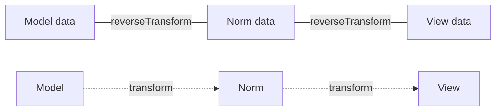

# Data Transformers

!!! tip "In a nutshell"
    Un data transformer convertit la valeur d'un champ entre ce que votre modèle
    contient et ce que le navigateur affiche (et inversement). Retenez le sens :
    `transform()` va du **model → view** (affichage), `reverseTransform()` va de la
    **view → model** (soumission).

!!! example "Real-world analogy"
    Un transformer est un **bureau de change** entre ce que l'utilisateur saisit et
    ce que votre objet stocke. `transform()`, c'est remettre votre argent pour
    obtenir la monnaie locale que le navigateur comprend (model → view) ;
    `reverseTransform()`, c'est le rechanger dans votre monnaie d'origine au retour
    (view → model). Présentez un montant que le bureau ne sait pas convertir et il
    refuse la transaction (`TransformationFailedException`) — il ne vous rend pas
    discrètement rien du tout.

!!! abstract "Learning objectives"
    À la fin de ce chapitre, vous saurez :

    - [ ] Implémenter `DataTransformerInterface` avec les bons sens `transform`/`reverseTransform`.
    - [ ] Placer un transformer avec `addModelTransformer` vs `addViewTransformer`.
    - [ ] Signaler une conversion invalide avec `TransformationFailedException`.

    **Syllabus:** `Forms → Data transformers` ·
    **Level:** Advanced → Expert ·
    **Est. time:** 30 min ·
    **Prerequisites:** [Handling submissions](handling.md) · [Form types](types.md)

---

## Theory

Un champ stocke sa valeur sous trois formes — **model**, **normalized (norm)**,
**view** — présentées dans [handling](handling.md). Les data transformers
convertissent entre formes adjacentes. C'est le mécanisme qui permet à un modèle
`\DateTimeImmutable` de devenir la chaîne `"2026-07-06"` dans le navigateur, et
inversement.

```php
// transform(): model -> view, runs on display
$view = $transformer->transform(new \DateTimeImmutable('2026-07-06')); // "2026-07-06"

// reverseTransform(): view -> model, runs on submit
$model = $transformer->reverseTransform('2026-07-06'); // \DateTimeImmutable object
```

Deux emplacements de transformer par champ :

| Emplacement | Convertit | Ajouté avec |
|---|---|---|
| **Model transformer** | model ↔ norm | `addModelTransformer()` |
| **View transformer** | norm ↔ view | `addViewTransformer()` |

```php
// Two slots, two adders — on the field's builder
$builder->get('issuedAt')
    ->addModelTransformer($modelToNorm)   // model <-> norm
    ->addViewTransformer($normToView);    // norm <-> view
```

!!! question "Predict first"
    Un champ convertit un modèle `DateTimeImmutable` en chaîne `"2026-07-06"` dans le
    navigateur. Quelle méthode s'exécute quand la page est **affichée**, et dans quel
    sens ?

??? note "Reveal"
    `transform()` s'exécute à l'affichage, **model → view**. `reverseTransform()`
    s'exécute à la soumission, **view → model**. Inverser cette paire est le bug de
    transformer le plus courant (et un piège d'examen favori).

## Deep Dive — how it works internally

### The interface & its two directions

`Symfony\Component\Form\DataTransformerInterface` (ou la variante typée
`Symfony\Component\Form\DataTransformer\...`) possède exactement deux méthodes :

```php
public function transform(mixed $value): mixed;         // toward the VIEW
public function reverseTransform(mixed $value): mixed;   // toward the MODEL
```

- **`transform()`** s'exécute lors de l'**affichage** des données (sens model → view).
- **`reverseTransform()`** s'exécute lors de la **soumission** des données (sens view → model).

Se tromper de sens est le bug de transformer le plus courant — et une question
d'examen garantie.

### Where each slot sits



- Les model transformers font le pont **model↔norm** (par exemple une chaîne d'ID ↔
  un objet du domaine).
- Les view transformers font le pont **norm↔view** (par exemple un
  `DateTimeImmutable` ↔ une chaîne).

Les types intégrés les enregistrent pour vous : `IntegerType` ajoute un view
transformer ; `DateType` ajoute les deux. Quand vous ajoutez les vôtres, l'ordre
compte :

- À l'**affichage**, les transformers s'exécutent dans l'ordre d'ajout
  (`transform`), model→view.
- À la **soumission**, ils s'exécutent dans l'ordre inverse (`reverseTransform`),
  view→model.

```php
// IntegerType registers one view transformer; DateType registers both kinds.
$builder->addViewTransformer($first);   // added first
$builder->addViewTransformer($second);  // added second

// Display: $first->transform() then $second->transform()            (order added)
// Submit:  $second->reverseTransform() then $first->reverseTransform() (reverse)
```

!!! note "Source reference"
    `Symfony\Component\Form\Form::modelToNorm()/normToView()` et leurs inverses —
    [symfony/symfony `8.0`](https://github.com/symfony/symfony/blob/8.0/src/Symfony/Component/Form/Form.php).

### Failure handling

Si l'entrée ne peut pas être convertie (par exemple un ID sans objet
correspondant), lancez
`Symfony\Component\Form\Exception\TransformationFailedException` depuis
`reverseTransform()`. Le form l'attrape, marque le champ invalide et affiche le
`invalid_message` du champ. Ne lancez **jamais** d'exception générique et ne
retournez jamais `null` en silence — cela masque les erreurs à la validation.

```php
// In reverseTransform(): signal a failed conversion, never return null silently
public function reverseTransform(mixed $value): ?Item
{
    $item = $this->repository->find($value);
    if (null === $item) {
        // caught by the form -> field marked invalid, invalid_message shown
        throw new TransformationFailedException(\sprintf('Item "%s" not found.', $value));
    }

    return $item;
}
```

### Null behavior

Les champs sont souvent vides, donc les deux sens rencontrent le vide. À
l'**affichage**, `transform(null)` se déclenche pour une valeur de modèle non
définie — retournez `''` (une chaîne vide que le widget peut afficher), **pas**
`null`, sinon l'input s'affiche bizarrement et les comparaisons de valeurs
ultérieures cassent. À la **soumission**, une saisie vide arrive comme `''` (ou
`null`), donc `reverseTransform('')` doit redonner la valeur vide de votre modèle
(`null`, `[]`, `0` …) plutôt que de tenter de la parser et de lancer une exception.
Protégez la première ligne de chaque méthode avec un test de vide avant toute
vraie conversion — exactement ce que fait le `MinutesToClockTransformer`
ci-dessus. Le bug classique : `reverseTransform('')` qui lance le parseur sur une
chaîne vide et déclenche une `TransformationFailedException` injustifiée sur un
champ pourtant **optionnel**.

!!! note "Null in real life"
    `null`/`''` = un bordereau vide au bureau de change — rendez un reçu vide,
    n'essayez pas de convertir zéro devise pour le tamponner « invalide ».

### Model vs view — which to pick

- Utilisez un **view transformer** quand seule la *représentation en chaîne*
  change (mise en forme). Il s'exécute au plus près du widget.
- Utilisez un **model transformer** quand le *type de l'objet sous-jacent* change
  (par exemple un champ qui contient un id d'entité dans la view mais un objet
  riche comme modèle). Les model transformers doivent être ajoutés **avant** que
  les données du champ ne soient définies.

## Configuration & code

=== "A view transformer"

    ```php
    <?php
    declare(strict_types=1);

    namespace App\Form\Transformer;

    use Symfony\Component\Form\DataTransformerInterface;
    use Symfony\Component\Form\Exception\TransformationFailedException;

    /**
     * Model: int (minutes). View: "H:MM" string.
     * @implements DataTransformerInterface<int|null, string>
     */
    final class MinutesToClockTransformer implements DataTransformerInterface
    {
        // model -> view (display)
        public function transform(mixed $value): string
        {
            if (null === $value) {
                return '';
            }
            if (!\is_int($value)) {
                throw new TransformationFailedException('Expected an int.');
            }

            return \sprintf('%d:%02d', intdiv($value, 60), $value % 60);
        }

        // view -> model (submit)
        public function reverseTransform(mixed $value): ?int
        {
            if ('' === $value || null === $value) {
                return null;
            }
            if (!preg_match('/^(\d+):([0-5]\d)$/', (string) $value, $m)) {
                throw new TransformationFailedException('Use H:MM.');
            }

            return ((int) $m[1]) * 60 + (int) $m[2];
        }
    }
    ```

=== "Registering it"

    ```php
    <?php
    declare(strict_types=1);

    namespace App\Form;

    use App\Form\Transformer\MinutesToClockTransformer;
    use Symfony\Component\Form\AbstractType;
    use Symfony\Component\Form\Extension\Core\Type\TextType;
    use Symfony\Component\Form\FormBuilderInterface;

    final class DurationType extends AbstractType
    {
        public function buildForm(FormBuilderInterface $builder, array $options): void
        {
            // View transformer: norm(int) <-> view(string)
            $builder->addViewTransformer(new MinutesToClockTransformer());
        }

        public function getParent(): string
        {
            return TextType::class;
        }
    }
    ```

## Best practices & anti-patterns

| ✅ À faire | ❌ À éviter |
|---|---|
| `transform` = vers la view, `reverse` = vers le model | Inverser les deux sens |
| Lancer `TransformationFailedException` sur une entrée invalide | Retourner `null`/une exception générique |
| Gérer explicitement chaîne vide / null | Supposer une valeur typée non vide |
| Un view transformer pour la mise en forme | Un model transformer pour de la pure mise en forme |

## When (not) to use it / alternatives

Utilisez un transformer quand la représentation navigateur diffère réellement du
modèle. Si vous n'avez besoin que d'un léger nettoyage qui relève de la logique de
soumission, un **event** `PRE_SUBMIT` ([events](events.md)) peut être plus simple.
N'utilisez **pas** les transformers pour la validation — un transform en échec est
une erreur de *format* ; les règles métier relèvent du Validator.

!!! danger "Certification traps"
    - `transform()` = **model → view** ; `reverseTransform()` = **view → model**.
      C'est le piège classique du sens inversé.
    - Model transformer : **model↔norm**. View transformer : **norm↔view**.
    - À la soumission, les view transformers s'exécutent avant les model
      transformers (view→norm→model, ordre inverse d'enregistrement).
    - Une `TransformationFailedException` produit un **form invalide**, pas une
      500 — elle est exposée via le `invalid_message` du champ.

!!! warning "Common mistakes"
    - Mettre une logique de recherche d'objet dans un view transformer au lieu
      d'un model transformer.
    - Oublier de gérer `''`/`null`, ce qui fait planter un champ optionnel.
    - Utiliser un transformer pour imposer une validation métier (utilisez une
      constraint).

## Exercises

1. **(Advanced)** Écrivez un view transformer qui convertit une chaîne séparée
   par des virgules dans le navigateur en un modèle `string[]` (tags), avec
   gestion du vide.
2. **(Expert)** Expliquez l'ordre dans lequel `reverseTransform` s'exécute quand
   un champ possède deux view transformers, et ce qui se passe si le premier
   lance une exception.

??? success "Solutions"

    **1.**

    ```php
    <?php
    declare(strict_types=1);

    namespace App\Form\Transformer;

    use Symfony\Component\Form\DataTransformerInterface;

    /** @implements DataTransformerInterface<list<string>|null, string> */
    final class CsvTagsTransformer implements DataTransformerInterface
    {
        public function transform(mixed $value): string
        {
            return \is_array($value) ? implode(', ', $value) : '';
        }

        public function reverseTransform(mixed $value): array
        {
            if (null === $value || '' === trim((string) $value)) {
                return [];
            }

            return array_values(array_filter(array_map(
                'trim', explode(',', (string) $value),
            )));
        }
    }
    ```

    **2.** Les view transformers s'exécutent dans l'**ordre inverse
    d'enregistrement** à la soumission (view→norm). Si le premier transformer
    exécuté lance une `TransformationFailedException`, la chaîne s'arrête, le
    champ est marqué invalide, les transformers suivants ne s'exécutent pas et le
    `invalid_message` est affiché.

## Certification questions

??? question "Q1. `reverseTransform()` runs in which direction?"
    - [x] A. View → model (on submission) ✅
    - [ ] B. Model → view (on display)
    - [ ] C. Norm → view only
    - [ ] D. It never runs for view transformers

    **Why:** `transform` va vers la view (affichage) ; `reverseTransform` va vers
    le model (soumission).
    **Ref:** [Data transformers](https://symfony.com/doc/current/form/data_transformers.html).

??? question "Q2. `addModelTransformer` converts between…"
    - [x] A. Model and normalized data ✅
    - [ ] B. Normalized and view data
    - [ ] C. View and HTML
    - [ ] D. Request and response

    **Why:** Les model transformers font le pont model↔norm ; les view
    transformers font le pont norm↔view.
    **Ref:** [Data transformers](https://symfony.com/doc/current/form/data_transformers.html).

??? question "Q3. What should a transformer throw on invalid input?"
    - [x] A. `TransformationFailedException` ✅
    - [ ] B. `\InvalidArgumentException`
    - [ ] C. `ValidatorException`
    - [ ] D. Nothing — return `null`

    **Why:** Elle est attrapée par le form et transformée en état invalide au
    niveau du champ, avec le `invalid_message`.
    **Ref:** [Symfony source — Form.php](https://github.com/symfony/symfony/blob/8.0/src/Symfony/Component/Form/Form.php).

## Key takeaways

- `transform` = model→view (affichage) ; `reverseTransform` = view→model (soumission).
- Model transformer = model↔norm ; view transformer = norm↔view.
- À la soumission, les view transformers s'exécutent avant les model transformers
  (ordre inverse).
- Entrée invalide ⇒ `TransformationFailedException` ⇒ champ invalide, pas une 500.

## Last-minute revision

!!! tip "Cheat sheet"
    - `transform()` → vers la VIEW · `reverseTransform()` → vers le MODEL.
    - `addViewTransformer` (norm↔view) · `addModelTransformer` (model↔norm).
    - Gestion du vide/null en premier, toujours.
    - Échec : `throw new TransformationFailedException(...)`.

## Connections

- **Depends on:** [Handling submissions](handling.md) — les transformers relient les formes model/norm/view présentées là-bas.
- **Reused in:** [Built-in types](built-in-types.md) — `IntegerType`/`DateType` enregistrent des transformers pour vous.
- **Confused with:** [Validation](../validation/index.md) — un transform en échec est une erreur de *format* (`invalid_message`), pas une violation de règle métier.

## Official References
- [Official Symfony docs — Data transformers](https://symfony.com/doc/current/form/data_transformers.html)
- [Official Symfony docs — Model/norm/view data](https://symfony.com/doc/current/form/data_transformers.html#example-1-transforming-string-to-datetime)
- [Symfony source — Form.php](https://github.com/symfony/symfony/blob/8.0/src/Symfony/Component/Form/Form.php)

## Video references

!!! tip "Watch & learn"
    Voici des chaînes vidéo officielles, mises à jour en continu — cherchez-y
    « Symfony forms » pour consolider ce chapitre. Nous référençons des chaînes
    stables plutôt que des vidéos individuelles pour que les liens ne pourrissent
    jamais.

    - [SymfonyCasts screencasts](https://symfonycasts.com/tracks/symfony) — tutoriels scénarisés à suivre en codant.
    - [Symfony official YouTube](https://www.youtube.com/@SymfonyOfficial) — conférences et keynotes SymfonyCon.
    - [Official docs for this topic](https://symfony.com/doc/current/form/data_transformers.html) — certaines pages de la doc Symfony intègrent un screencast.

## Confidence check

Je suis prêt quand je peux :

- [ ] expliquer **pourquoi** les transformers existent (valeur du modèle vs représentation navigateur)
- [ ] implémenter `DataTransformerInterface` avec les bons sens en Symfony 8
- [ ] déboguer un champ optionnel qui plante sur une saisie vide dans `reverseTransform('')`
- [ ] repérer la mauvaise réponse qui inverse `transform`/`reverseTransform`
- [ ] expliquer l'ordre d'exécution des model vs view transformers à l'affichage vs à la soumission

---

<small>Related: [Handling submissions](handling.md) · [Form events](events.md) ·
[Form types](types.md)</small>
