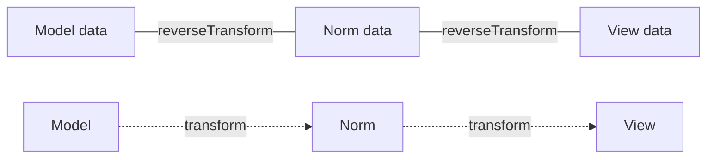

# Data Transformers

!!! tip "In a nutshell"
    A data transformer converts a field's value between what your model holds and
    what the browser shows (and back). Remember the direction: `transform()` goes
    **model → view** (display), `reverseTransform()` goes **view → model** (submit).

!!! example "Real-world analogy"
    A transformer is a **currency exchange booth** between what the user types and
    what your object stores. `transform()` is handing over your money to get the
    local currency the browser understands (model → view); `reverseTransform()` is
    changing it back to your home currency on the way in (view → model). Hand over
    an amount the booth can't convert and it refuses the deal
    (`TransformationFailedException`) — it does not quietly hand you nothing.

!!! abstract "Learning objectives"
    By the end of this chapter you can:

    - [ ] Implement `DataTransformerInterface` with correct `transform`/`reverseTransform` directions.
    - [ ] Place a transformer with `addModelTransformer` vs `addViewTransformer`.
    - [ ] Signal a bad conversion with `TransformationFailedException`.

    **Syllabus:** `Forms → Data transformers` ·
    **Level:** Advanced → Expert ·
    **Est. time:** 30 min ·
    **Prerequisites:** [Handling submissions](handling.md) · [Form types](types.md)

---

## Theory

A field stores its value in three shapes — **model**, **normalized (norm)**,
**view** — introduced in [handling](handling.md). Data transformers convert
between adjacent shapes. They are the mechanism that lets a `\DateTimeImmutable`
model become a `"2026-07-06"` string in the browser and back.

```php
// transform(): model -> view, runs on display
$view = $transformer->transform(new \DateTimeImmutable('2026-07-06')); // "2026-07-06"

// reverseTransform(): view -> model, runs on submit
$model = $transformer->reverseTransform('2026-07-06'); // \DateTimeImmutable object
```

Two transformer slots per field:

| Slot | Converts | Added with |
|---|---|---|
| **Model transformer** | model ↔ norm | `addModelTransformer()` |
| **View transformer** | norm ↔ view | `addViewTransformer()` |

```php
// Two slots, two adders — on the field's builder
$builder->get('issuedAt')
    ->addModelTransformer($modelToNorm)   // model <-> norm
    ->addViewTransformer($normToView);    // norm <-> view
```

!!! question "Predict first"
    A field converts a `DateTimeImmutable` model into a `"2026-07-06"` string in the
    browser. Which method runs when the page is **displayed**, and in which direction?

??? note "Reveal"
    `transform()` runs on display, **model → view**. `reverseTransform()` runs on
    submit, **view → model**. Getting this pair backwards is the single most common
    transformer bug (and a favourite exam trap).

## Deep Dive — how it works internally

### The interface & its two directions

`Symfony\Component\Form\DataTransformerInterface` (or the typed
`Symfony\Component\Form\DataTransformer\...`) has exactly two methods:

```php
public function transform(mixed $value): mixed;         // toward the VIEW
public function reverseTransform(mixed $value): mixed;   // toward the MODEL
```

- **`transform()`** runs when **displaying** data (model → view direction).
- **`reverseTransform()`** runs when **submitting** data (view → model direction).

Getting the direction wrong is the single most common transformer bug — and a
guaranteed exam question.

### Where each slot sits



- Model transformers bridge **model↔norm** (e.g. an ID string ↔ a domain
  object).
- View transformers bridge **norm↔view** (e.g. a `DateTimeImmutable` ↔ a string).

Built-in types register these for you: `IntegerType` adds a view transformer;
`DateType` adds both. When you add your own, order matters:

- On **display**, transformers run in the order added (`transform`), model→view.
- On **submit**, they run in reverse order (`reverseTransform`), view→model.

```php
// IntegerType registers one view transformer; DateType registers both kinds.
$builder->addViewTransformer($first);   // added first
$builder->addViewTransformer($second);  // added second

// Display: $first->transform() then $second->transform()            (order added)
// Submit:  $second->reverseTransform() then $first->reverseTransform() (reverse)
```

!!! note "Source reference"
    `Symfony\Component\Form\Form::modelToNorm()/normToView()` and their reverses —
    [symfony/symfony `8.0`](https://github.com/symfony/symfony/blob/8.0/src/Symfony/Component/Form/Form.php).

### Failure handling

If input cannot be converted (e.g. an ID with no matching object), throw
`Symfony\Component\Form\Exception\TransformationFailedException` from
`reverseTransform()`. The form catches it, marks the field invalid, and shows the
field's `invalid_message`. **Never** throw generic exceptions or return `null`
silently — that hides errors from validation.

```php
// In reverseTransform(): signal a failed conversion, never return null silently
public function reverseTransform(mixed $value): ?Item
{
    $item = $this->repository->find($value);
    if (null === $item) {
        // caught by the form -> field marked invalid, invalid_message shown
        throw new TransformationFailedException(\sprintf('Item "%s" not found.', $value));
    }

    return $item;
}
```

### Null behavior

Fields are frequently empty, so both directions meet emptiness. On **display**,
`transform(null)` fires for an unset model value — return `''` (an empty string the
widget can show), **not** `null`, or the input renders oddly and later value
comparisons break. On **submit**, an empty input arrives as `''` (or `null`), so
`reverseTransform('')` must map back to your model's empty value (`null`, `[]`,
`0` …) rather than trying to parse it and throwing. Guard the first line of each
method with an emptiness check before any real conversion — exactly what the
`MinutesToClockTransformer` above does. The classic bug: `reverseTransform('')`
running the parser on an empty string and raising a spurious
`TransformationFailedException` on an otherwise **optional** field.

```php
public function transform(mixed $value): string
{
    if (null === $value) {
        return '';   // display: empty widget — never return null here
    }
    // ... real conversion (as MinutesToClockTransformer does) ...
}

public function reverseTransform(mixed $value): ?int
{
    if ('' === $value || null === $value) {
        return null; // submit: optional field — no TransformationFailedException
    }
    // ... parse only when non-empty ...
}
```

!!! note "Null in real life"
    `null`/`''` = an empty slip at the exchange booth — hand back an empty receipt,
    don't try to convert zero currency and stamp it "invalid".

### Model vs view — which to pick

- Use a **view transformer** when only the *string representation* changes
  (formatting). It runs closest to the widget.
- Use a **model transformer** when the *type of the underlying object* changes
  (e.g. field holds an entity id in the view but a rich object as the model).
  Model transformers must be added **before** the field's data is set.

## Configuration & code

=== "A view transformer"

    ```php
    <?php
    declare(strict_types=1);

    namespace App\Form\Transformer;

    use Symfony\Component\Form\DataTransformerInterface;
    use Symfony\Component\Form\Exception\TransformationFailedException;

    /**
     * Model: int (minutes). View: "H:MM" string.
     * @implements DataTransformerInterface<int|null, string>
     */
    final class MinutesToClockTransformer implements DataTransformerInterface
    {
        // model -> view (display)
        public function transform(mixed $value): string
        {
            if (null === $value) {
                return '';
            }
            if (!\is_int($value)) {
                throw new TransformationFailedException('Expected an int.');
            }

            return \sprintf('%d:%02d', intdiv($value, 60), $value % 60);
        }

        // view -> model (submit)
        public function reverseTransform(mixed $value): ?int
        {
            if ('' === $value || null === $value) {
                return null;
            }
            if (!preg_match('/^(\d+):([0-5]\d)$/', (string) $value, $m)) {
                throw new TransformationFailedException('Use H:MM.');
            }

            return ((int) $m[1]) * 60 + (int) $m[2];
        }
    }
    ```

=== "Registering it"

    ```php
    <?php
    declare(strict_types=1);

    namespace App\Form;

    use App\Form\Transformer\MinutesToClockTransformer;
    use Symfony\Component\Form\AbstractType;
    use Symfony\Component\Form\Extension\Core\Type\TextType;
    use Symfony\Component\Form\FormBuilderInterface;

    final class DurationType extends AbstractType
    {
        public function buildForm(FormBuilderInterface $builder, array $options): void
        {
            // View transformer: norm(int) <-> view(string)
            $builder->addViewTransformer(new MinutesToClockTransformer());
        }

        public function getParent(): string
        {
            return TextType::class;
        }
    }
    ```

## Best practices & anti-patterns

| ✅ Do | ❌ Avoid |
|---|---|
| `transform` = to view, `reverse` = to model | Swapping the two directions |
| Throw `TransformationFailedException` on bad input | Returning `null`/generic exception |
| Handle empty string / null explicitly | Assuming a non-empty typed value |
| View transformer for formatting | A model transformer for pure formatting |

## When (not) to use it / alternatives

Use a transformer when the browser representation genuinely differs from the
model. If you only need light massaging that belongs to submission logic, a
`PRE_SUBMIT` **event** ([events](events.md)) may be simpler. Do **not** use
transformers for validation — a failed transform is a *format* error; business
rules belong to the Validator.

!!! danger "Certification traps"
    - `transform()` = **model → view**; `reverseTransform()` = **view → model**.
      This is the classic reversed-direction trap.
    - Model transformer: **model↔norm**. View transformer: **norm↔view**.
    - On submit, view transformers run before model transformers (view→norm→model,
      reverse registration order).
    - A `TransformationFailedException` produces an **invalid form**, not a thrown
      500 — surfaced as the field's `invalid_message`.

!!! warning "Common mistakes"
    - Putting object-lookup logic in a view transformer instead of a model one.
    - Forgetting to handle `''`/`null`, so an optional field crashes.
    - Using a transformer to enforce business validation (use a constraint).

## Exercises

1. **(Advanced)** Write a view transformer turning a comma-separated string in
   the browser into a `string[]` model (tags), with empty handling.
2. **(Expert)** Explain the order in which `reverseTransform` runs when a field
   has two view transformers, and what happens if the first throws.

??? success "Solutions"

    **1.**

    ```php
    <?php
    declare(strict_types=1);

    namespace App\Form\Transformer;

    use Symfony\Component\Form\DataTransformerInterface;

    /** @implements DataTransformerInterface<list<string>|null, string> */
    final class CsvTagsTransformer implements DataTransformerInterface
    {
        public function transform(mixed $value): string
        {
            return \is_array($value) ? implode(', ', $value) : '';
        }

        public function reverseTransform(mixed $value): array
        {
            if (null === $value || '' === trim((string) $value)) {
                return [];
            }

            return array_values(array_filter(array_map(
                'trim', explode(',', (string) $value),
            )));
        }
    }
    ```

    **2.** View transformers run in **reverse registration order** on submit
    (view→norm). If the first-run transformer throws
    `TransformationFailedException`, the chain stops, the field is marked invalid,
    later transformers do not run, and `invalid_message` is shown.

## Certification questions

??? question "Q1. `reverseTransform()` runs in which direction?"
    - [x] A. View → model (on submission) ✅
    - [ ] B. Model → view (on display)
    - [ ] C. Norm → view only
    - [ ] D. It never runs for view transformers

    **Why:** `transform` goes toward the view (display); `reverseTransform` goes
    toward the model (submit).
    **Ref:** [Data transformers](https://symfony.com/doc/8.0/form/data_transformers.html).

??? question "Q2. `addModelTransformer` converts between…"
    - [x] A. Model and normalized data ✅
    - [ ] B. Normalized and view data
    - [ ] C. View and HTML
    - [ ] D. Request and response

    **Why:** Model transformers bridge model↔norm; view transformers bridge
    norm↔view.
    **Ref:** [Data transformers](https://symfony.com/doc/8.0/form/data_transformers.html).

??? question "Q3. What should a transformer throw on invalid input?"
    - [x] A. `TransformationFailedException` ✅
    - [ ] B. `\InvalidArgumentException`
    - [ ] C. `ValidatorException`
    - [ ] D. Nothing — return `null`

    **Why:** It is caught by the form and turned into a field-level invalid state
    with `invalid_message`.
    **Ref:** [Symfony source — Form.php](https://github.com/symfony/symfony/blob/8.0/src/Symfony/Component/Form/Form.php).

## Key takeaways

- `transform` = model→view (display); `reverseTransform` = view→model (submit).
- Model transformer = model↔norm; view transformer = norm↔view.
- On submit, view transformers run before model transformers (reverse order).
- Bad input ⇒ `TransformationFailedException` ⇒ invalid field, not a 500.

## Last-minute revision

!!! tip "Cheat sheet"
    - `transform()` → toward VIEW · `reverseTransform()` → toward MODEL.
    - `addViewTransformer` (norm↔view) · `addModelTransformer` (model↔norm).
    - Empty/null handling first, always.
    - Failure: `throw new TransformationFailedException(...)`.

## Connections

- **Depends on:** [Handling submissions](handling.md) — transformers bridge the model/norm/view shapes introduced there.
- **Reused in:** [Built-in types](built-in-types.md) — `IntegerType`/`DateType` register transformers for you.
- **Confused with:** [Validation](../validation/index.md) — a failed transform is a *format* error (`invalid_message`), not a business-rule violation.

## Official References
- [Official Symfony docs — Data transformers](https://symfony.com/doc/8.0/form/data_transformers.html)
- [Official Symfony docs — Model/norm/view data](https://symfony.com/doc/8.0/form/data_transformers.html#example-1-transforming-string-to-datetime)
- [Symfony source — Form.php](https://github.com/symfony/symfony/blob/8.0/src/Symfony/Component/Form/Form.php)

## Video references

!!! tip "Watch & learn"
    These are official, continuously-updated video channels — search them for
    "Symfony forms" to reinforce this chapter. We link stable channels rather than
    individual videos so the references never rot.

    - [SymfonyCasts screencasts](https://symfonycasts.com/tracks/symfony) — scripted, code-along tutorials.
    - [Symfony official YouTube](https://www.youtube.com/@SymfonyOfficial) — SymfonyCon conference talks & keynotes.
    - [Official docs for this topic](https://symfony.com/doc/8.0/form/data_transformers.html) — some Symfony doc pages embed a screencast.

## Confidence check

I'm ready when I can:

- [ ] explain **why** transformers exist (model value vs browser representation)
- [ ] implement `DataTransformerInterface` with correct directions in Symfony 8
- [ ] debug an optional field that crashes on empty input in `reverseTransform('')`
- [ ] spot the wrong answer that swaps `transform`/`reverseTransform`
- [ ] explain the order model vs view transformers run on display vs submit

---

<small>Related: [Handling submissions](handling.md) · [Form events](events.md) ·
[Form types](types.md)</small>
