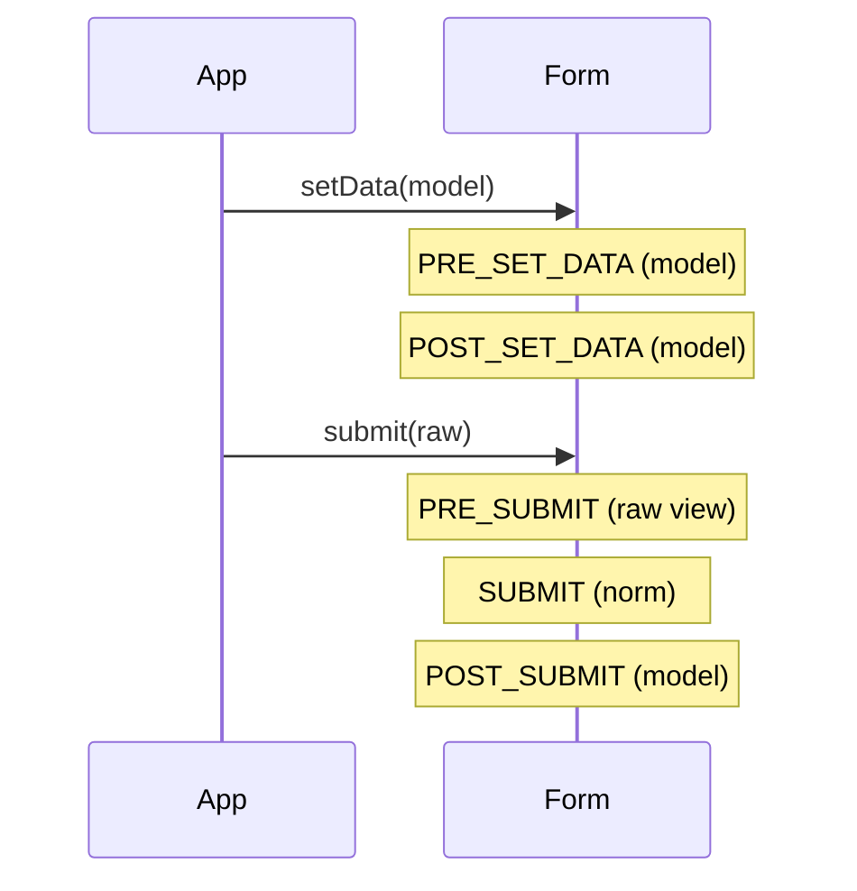
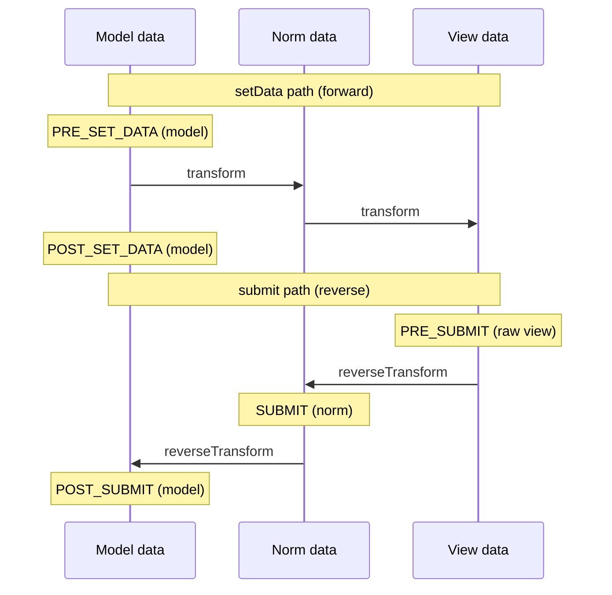

# Form Events

!!! tip "In a nutshell"
    Les form events vous permettent de modifier un form pendant sa construction ou
    sa soumission — ajouter des champs dynamiquement ou nettoyer l'entrée brute. Le
    fait à graver : deux séquences, **PRE_SET_DATA → POST_SET_DATA** (définition des
    données) et **PRE_SUBMIT → SUBMIT → POST_SUBMIT** (soumission).

!!! example "Real-world analogy"
    Les form events sont des **points de contrôle pendant que le formulaire est
    rempli puis remis**. Au moment où le formulaire vierge est préparé, vous passez
    `PRE_SET_DATA`/`POST_SET_DATA` — l'instant idéal pour ajouter des sections
    supplémentaires selon la personne qui le remplit. Quand vous le rendez, vous
    passez `PRE_SUBMIT` (un inspecteur voit encore votre écriture brute), puis
    `SUBMIT`, puis `POST_SUBMIT` (les réponses sont désormais classées dans votre
    dossier). Chaque point de contrôle permet d'inspecter ou d'ajuster — mais vous
    ne pouvez **ajouter des sections** qu'aux premiers, avant que le formulaire ne
    soit lié.

!!! abstract "Learning objectives"
    À la fin de ce chapitre, vous saurez :

    - [ ] Réciter les deux séquences de `FormEvents` et les données portées par chaque event.
    - [ ] Modifier un form dynamiquement depuis un event listener/subscriber.
    - [ ] Choisir le bon event pour une tâche donnée (PRE_SET_DATA vs PRE_SUBMIT).

    **Syllabus:** `Forms → Form events` ·
    **Level:** Advanced → Expert ·
    **Est. time:** 30 min ·
    **Prerequisites:** [Handling submissions](handling.md) · [Data transformers](data-transformers.md)

---

## Theory

Le cycle de vie du form dispatch des events à des points fixes pour vous permettre
de vous y accrocher — ajouter des champs selon les données, assainir l'entrée
brute, ou réagir après la liaison. Les cinq constantes vivent sur
`Symfony\Component\Form\FormEvents` ; chaque listener reçoit un
`Symfony\Component\Form\FormEvent`.

```php
// All five constants live on FormEvents; every listener receives a FormEvent
$builder->addEventListener(FormEvents::PRE_SUBMIT, function (FormEvent $event): void {
    $data = $event->getData();  // shape depends on the event (raw array here)
    $form = $event->getForm();  // the form being built/submitted
});
```

Deux séquences distinctes se déclenchent à deux moments différents :

| Phase | Séquence |
|---|---|
| **Définition des données** (`setData`, à la création/au peuplement) | `PRE_SET_DATA` → `POST_SET_DATA` |
| **Soumission** (`submit`, via `handleRequest`) | `PRE_SUBMIT` → `SUBMIT` → `POST_SUBMIT` |

!!! question "Predict first"
    Vous devez ajouter un champ `city` dont les choix dépendent du pays **soumis**.
    Quel form event écoutez-vous, et quelle forme a `$event->getData()` à ce
    moment-là ?

??? note "Reveal"
    `PRE_SUBMIT` — il se déclenche avant la liaison (vous pouvez donc encore ajouter
    des champs) et porte le **tableau brut de la request** (view data), donc lisez
    `$data['country'] ?? null`. Ajouter des champs sur `SUBMIT`/`POST_SUBMIT` est
    trop tard.

## Deep Dive — how it works internally

### What each event carries

| Constante | Chaîne | `$event->getData()` contient | Usage typique |
|---|---|---|---|
| `PRE_SET_DATA` | `form.pre_set_data` | données **model** (pré-transform) | ajouter des champs pour l'objet *initial* |
| `POST_SET_DATA` | `form.post_set_data` | données model (définies) | inspection en lecture seule |
| `PRE_SUBMIT` | `form.pre_submit` | données **view brutes** (tableau) | assainir l'entrée, ajouter des champs selon la valeur soumise |
| `SUBMIT` | `form.submit` | données **normalized** | ajuster les données norm avant l'écriture dans le model |
| `POST_SUBMIT` | `form.post_submit` | données **model** (liées) | validation, journalisation (lecture seule) |

!!! danger "Order is the exam favourite"
    Set : **PRE_SET_DATA → POST_SET_DATA**.
    Submit : **PRE_SUBMIT → SUBMIT → POST_SUBMIT**.
    Les mélanger (ou insérer un `PRE_VALIDATE` inexistant) est le piège classique.
    Il n'y a **pas** de `POST_VALIDATE` dans `FormEvents`.



Les deux mêmes flux vus comme **direction des données** — la définition des
données va model→norm→view (transform aller), la soumission va view→norm→model
(inverse) :



!!! note "Source reference"
    `Symfony\Component\Form\FormEvents` et `Form::setData()/submit()` —
    [symfony/symfony `8.0`](https://github.com/symfony/symfony/blob/8.0/src/Symfony/Component/Form/FormEvents.php).

### Dynamic form modification

Le cas d'usage phare : **changer les champs du form selon les données**.

- Champs qui dépendent de l'objet *initial* → écoutez **PRE_SET_DATA**
  (`$event->getForm()->add(...)`).
- Champs qui dépendent de la valeur *soumise* (listes déroulantes dépendantes) →
  écoutez **PRE_SUBMIT**, en lisant le tableau brut pour décider quoi ajouter.

Vous ne pouvez ajouter/supprimer des champs qu'**avant** leur liaison — c'est
pourquoi ces deux events « PRE » sont les bons points d'accroche, pas
`SUBMIT`/`POST_SUBMIT`.

```php
// Depends on the initial object -> PRE_SET_DATA
$builder->addEventListener(FormEvents::PRE_SET_DATA, function (FormEvent $e): void {
    $e->getForm()->add('vatNumber', TextType::class);   // form still mutable
});

// Depends on the submitted value -> PRE_SUBMIT (raw array)
$builder->addEventListener(FormEvents::PRE_SUBMIT, function (FormEvent $e): void {
    $country = $e->getData()['country'] ?? null;
    $e->getForm()->add('city', ChoiceType::class, ['choices' => []]);
});

// SUBMIT / POST_SUBMIT: too late — a field added here is never bound
```

### Listener vs subscriber

- **Listener en closure :** `$builder->addEventListener(FormEvents::PRE_SUBMIT, fn (FormEvent $e) => ...)`.
- **Subscriber :** une classe implémentant
  `Symfony\Component\EventDispatcher\EventSubscriberInterface` de
  l'EventDispatcher (le composant Form n'a pas de `FormEventSubscriberInterface`
  dédiée) et déclarant `getSubscribedEvents()` ; ajoutez-la avec
  `$builder->addEventSubscriber($subscriber)`.

Les subscribers sont réutilisables d'un form à l'autre et testables isolément.

```php
// Closure listener, inline on the builder
$builder->addEventListener(FormEvents::PRE_SUBMIT, fn (FormEvent $e) => $e->setData(
    array_map(trim(...), $e->getData()),
));

// Subscriber: EventSubscriberInterface + getSubscribedEvents(), reusable/testable
final class TrimCodeSubscriber implements EventSubscriberInterface
{
    public static function getSubscribedEvents(): array
    {
        return [FormEvents::PRE_SUBMIT => 'onPreSubmit'];
    }

    public function onPreSubmit(FormEvent $event): void { /* ... */ }
}

$builder->addEventSubscriber(new TrimCodeSubscriber());
```

### Null behavior

`PRE_SET_DATA` peut porter `null` : un form créé sans données initiales (pas de
`data_class`, ou un `null` explicite) transmet à votre listener
`$event->getData() === null` — protégez-vous avec `instanceof` / `??` avant
d'appeler des méthodes dessus. Le bug du champ dynamique : appeler
`$data->getId()` sur un form « nouvelle entité » à null — l'exemple `ArticleType`
survit parce qu'il vérifie d'abord `$article instanceof Article`. `PRE_SUBMIT`
porte le **tableau brut de la request**, où un champ laissé vide par
l'utilisateur est simplement une clé absente : lisez-le avec
`$data['country'] ?? null`, pas `$data['country']`, sous peine de déclencher un
warning de clé indéfinie. `POST_SUBMIT` voit le model lié, qui est `null`/vide
pour une soumission vide. Ne supposez jamais qu'une clé ou un objet est présent
dans un listener.

```php
$builder->addEventListener(FormEvents::PRE_SET_DATA, function (FormEvent $e): void {
    $article = $e->getData();   // null on a "new entity" form (no initial data_class value)
    if ($article instanceof Article && null !== $article->getId()) {
        // guarded: only call $data->getId() after the instanceof check
    }
});

$builder->addEventListener(FormEvents::PRE_SUBMIT, function (FormEvent $e): void {
    $data = $e->getData();                 // raw array: a blank field = absent key
    $country = $data['country'] ?? null;   // never bare $data['country']
});

// POST_SUBMIT: bound model — may be null/empty for an empty submission
```

!!! note "Null in real life"
    `null` = un point de contrôle qui laisse passer quelqu'un **sans papiers pour
    l'instant** — vérifiez s'il tient quelque chose avant d'essayer de l'inspecter.

## Configuration & code

=== "Dynamic field (PRE_SET_DATA)"

    ```php
    <?php
    declare(strict_types=1);

    namespace App\Form;

    use App\Entity\Article; // domain object (non-Doctrine mapping assumed)
    use Symfony\Component\Form\AbstractType;
    use Symfony\Component\Form\Event\PreSetDataEvent;
    use Symfony\Component\Form\Extension\Core\Type\TextType;
    use Symfony\Component\Form\FormBuilderInterface;
    use Symfony\Component\Form\FormEvents;

    final class ArticleType extends AbstractType
    {
        public function buildForm(FormBuilderInterface $builder, array $options): void
        {
            $builder->add('title', TextType::class);

            // Add a "slug" field only for brand-new (unsaved) articles.
            $builder->addEventListener(
                FormEvents::PRE_SET_DATA,
                static function (PreSetDataEvent $event): void {
                    $article = $event->getData();
                    if ($article instanceof Article && null === $article->getId()) {
                        $event->getForm()->add('slug', TextType::class);
                    }
                },
            );
        }
    }
    ```

=== "Dependent field (PRE_SUBMIT)"

    ```php
    <?php
    declare(strict_types=1);

    use Symfony\Component\Form\Event\PreSubmitEvent;
    use Symfony\Component\Form\Extension\Core\Type\ChoiceType;
    use Symfony\Component\Form\FormEvents;

    // Inside buildForm(): add cities depending on the submitted country.
    $builder->addEventListener(
        FormEvents::PRE_SUBMIT,
        static function (PreSubmitEvent $event): void {
            $data = $event->getData();               // raw array
            $country = $data['country'] ?? null;
            $event->getForm()->add('city', ChoiceType::class, [
                'choices' => $country ? cities_for($country) : [],
            ]);
        },
    );
    ```

=== "Subscriber"

    ```php
    <?php
    declare(strict_types=1);

    namespace App\Form\EventListener;

    use Symfony\Component\EventDispatcher\EventSubscriberInterface;
    use Symfony\Component\Form\Event\PreSubmitEvent;
    use Symfony\Component\Form\FormEvents;

    final class TrimSubscriber implements EventSubscriberInterface
    {
        public static function getSubscribedEvents(): array
        {
            return [FormEvents::PRE_SUBMIT => 'onPreSubmit'];
        }

        public function onPreSubmit(PreSubmitEvent $event): void
        {
            $data = $event->getData();
            if (\is_array($data) && isset($data['code'])) {
                $data['code'] = trim((string) $data['code']);
                $event->setData($data);
            }
        }
    }
    ```

## Best practices & anti-patterns

| ✅ À faire | ❌ À éviter |
|---|---|
| Ajouter/supprimer des champs sur PRE_SET_DATA / PRE_SUBMIT | Ajouter des champs sur SUBMIT/POST_SUBMIT |
| Lire le tableau brut sur PRE_SUBMIT | Y attendre des données transformées |
| Utiliser un subscriber pour la logique réutilisable | Copier-coller des closures entre types |
| Traiter POST_SUBMIT en lecture seule | Muter des champs après la liaison |

## When (not) to use it / alternatives

Les events servent au comportement **dynamique** et au nettoyage de l'entrée. Si
la transformation est une correspondance de format stable, utilisez plutôt un
[data transformer](data-transformers.md). Pour la validation métier, utilisez le
Validator, pas un hook POST_SUBMIT.

!!! danger "Certification traps"
    - Ordre set : **PRE_SET_DATA, POST_SET_DATA**. Ordre submit : **PRE_SUBMIT,
      SUBMIT, POST_SUBMIT**.
    - Les données de PRE_SUBMIT sont un **tableau/chaîne brut** (view data),
      *pas* votre objet.
    - Vous ne pouvez ajouter/supprimer des champs qu'**avant** que submit ne les
      lie (events PRE_*).
    - Il n'y a pas de `PRE_VALIDATE`/`POST_VALIDATE` dans `FormEvents` ; la
      validation est un listener `POST_SUBMIT`.

!!! warning "Common mistakes"
    - Essayer d'ajouter un champ sur SUBMIT/POST_SUBMIT — trop tard, il ne sera
      pas lié.
    - Lire `$event->getData()->getCountry()` sur PRE_SUBMIT (c'est un tableau).
    - Oublier `$event->setData(...)` après avoir muté les données dans un
      listener.

## Exercises

1. **(Advanced)** Ajoutez un listener `PRE_SUBMIT` qui passe en minuscules un
   champ `email` soumis, avant la liaison.
2. **(Expert)** Implémentez des listes déroulantes dépendantes : un champ
   `country` et un champ `city` dont les choix dépendent du pays soumis. Quels
   events utilisez-vous pour le rendu initial vs la soumission, et pourquoi ?

??? success "Solutions"

    **1.** Ajoutez sur PRE_SUBMIT : lisez `$data = $event->getData()`, faites
    `$data['email'] = strtolower($data['email'] ?? '')`, puis
    `$event->setData($data)`. Cela s'exécute sur le tableau brut, avant la
    transformation.

    **2.** Ajoutez toujours le champ `country`. Pour le rendu *initial*, utilisez
    **PRE_SET_DATA** pour ajouter `city` d'après le pays courant du model ; pour
    la *soumission*, utilisez **PRE_SUBMIT** pour ajouter `city` d'après le pays
    soumis (tableau brut). Les deux sont des events pré-liaison, donc le champ
    `city` ajouté dynamiquement existe à temps pour accepter sa valeur.

## Certification questions

??? question "Q1. What is the correct submit event order?"
    - [x] A. PRE_SUBMIT → SUBMIT → POST_SUBMIT ✅
    - [ ] B. SUBMIT → PRE_SUBMIT → POST_SUBMIT
    - [ ] C. PRE_SUBMIT → POST_SUBMIT → SUBMIT
    - [ ] D. PRE_SET_DATA → SUBMIT → POST_SUBMIT

    **Why:** La soumission dispatch PRE_SUBMIT (raw), SUBMIT (norm), POST_SUBMIT
    (model), dans cet ordre.
    **Ref:** [Form events](https://symfony.com/doc/current/form/events.html).

??? question "Q2. On PRE_SUBMIT, `$event->getData()` returns…"
    - [x] A. The raw submitted view data (array/string) ✅
    - [ ] B. The fully transformed model object
    - [ ] C. Normalized data
    - [ ] D. A `FormView`

    **Why:** PRE_SUBMIT se déclenche avant la transformation, donc les données
    sont les valeurs brutes de la request.
    **Ref:** [Form events docs](https://symfony.com/doc/current/form/events.html).

??? question "Q3. To add a field based on the submitted value, listen on…"
    - [x] A. PRE_SUBMIT ✅
    - [ ] B. POST_SUBMIT
    - [ ] C. SUBMIT
    - [ ] D. POST_SET_DATA

    **Why:** Les champs doivent être ajoutés avant la liaison ; PRE_SUBMIT vous
    donne la valeur brute pendant que le form est encore mutable.
    **Ref:** [Dynamic form modification](https://symfony.com/doc/current/form/dynamic_form_modification.html).

??? question "Q4. Which event does the validator extension hook to run validation?"
    - [x] A. POST_SUBMIT ✅
    - [ ] B. PRE_SUBMIT
    - [ ] C. SUBMIT
    - [ ] D. PRE_SET_DATA

    **Why:** La validation s'exécute après la liaison des données au model, via
    un listener POST_SUBMIT. Il n'existe pas d'event de validation dédié.
    **Ref:** [Form events docs](https://symfony.com/doc/current/form/events.html).

## Key takeaways

- Cinq events sur `FormEvents` ; deux séquences (set vs submit).
- Set : PRE_SET_DATA → POST_SET_DATA. Submit : PRE_SUBMIT → SUBMIT → POST_SUBMIT.
- Forme des données par event : PRE_SET_DATA=model, PRE_SUBMIT=view brute,
  SUBMIT=norm, POST_SUBMIT=model.
- Ajout/suppression de champs uniquement sur les events PRE_* ; la validation est
  un listener POST_SUBMIT.

## Last-minute revision

!!! tip "Cheat sheet"
    - `PRE_SET_DATA`(model) · `POST_SET_DATA`(model)
    - `PRE_SUBMIT`(raw) · `SUBMIT`(norm) · `POST_SUBMIT`(model)
    - Champs dynamiques : PRE_SET_DATA (initial), PRE_SUBMIT (soumis).
    - `addEventListener` / `addEventSubscriber` sur le builder.
    - Pas de `PRE_VALIDATE` ; validation = listener POST_SUBMIT.

## Connections

- **Depends on:** [Handling submissions](handling.md) — c'est le cycle de vie de la soumission qui dispatch ces events.
- **Reused in:** [Type extensions](type-extensions.md) — les extensions attachent couramment des listeners de form à de nombreux types.
- **Confused with:** [EventDispatcher](../architecture/events.md) — les form events utilisent le même dispatcher mais un jeu `FormEvents` distinct, pas les events du kernel.

## Official References
- [Official Symfony docs — Form events](https://symfony.com/doc/current/form/events.html)
- [Official Symfony docs — Dynamic form modification](https://symfony.com/doc/current/form/dynamic_form_modification.html)
- [Symfony source — FormEvents](https://github.com/symfony/symfony/blob/8.0/src/Symfony/Component/Form/FormEvents.php)

## Video references

!!! tip "Watch & learn"
    Voici des chaînes vidéo officielles, mises à jour en continu — cherchez-y
    « Symfony forms » pour consolider ce chapitre. Nous référençons des chaînes
    stables plutôt que des vidéos individuelles pour que les liens ne pourrissent
    jamais.

    - [SymfonyCasts screencasts](https://symfonycasts.com/tracks/symfony) — tutoriels scénarisés à suivre en codant.
    - [Symfony official YouTube](https://www.youtube.com/@SymfonyOfficial) — conférences et keynotes SymfonyCon.
    - [Official docs for this topic](https://symfony.com/doc/current/form/events.html) — certaines pages de la doc Symfony intègrent un screencast.

## Confidence check

Je suis prêt quand je peux :

- [ ] expliquer **pourquoi** les form events existent (champs dynamiques, nettoyage de l'entrée brute)
- [ ] ajouter un listener/subscriber à un form builder en Symfony 8
- [ ] déboguer un listener `PRE_SUBMIT` qui traite le tableau brut comme un objet
- [ ] repérer la mauvaise réponse qui invente `PRE_VALIDATE` ou réordonne la séquence de submit
- [ ] expliquer la forme des données portée par chacun des cinq `FormEvents`

---

<small>Related: [Handling submissions](handling.md) ·
[Data transformers](data-transformers.md) · [Type extensions](type-extensions.md)</small>
