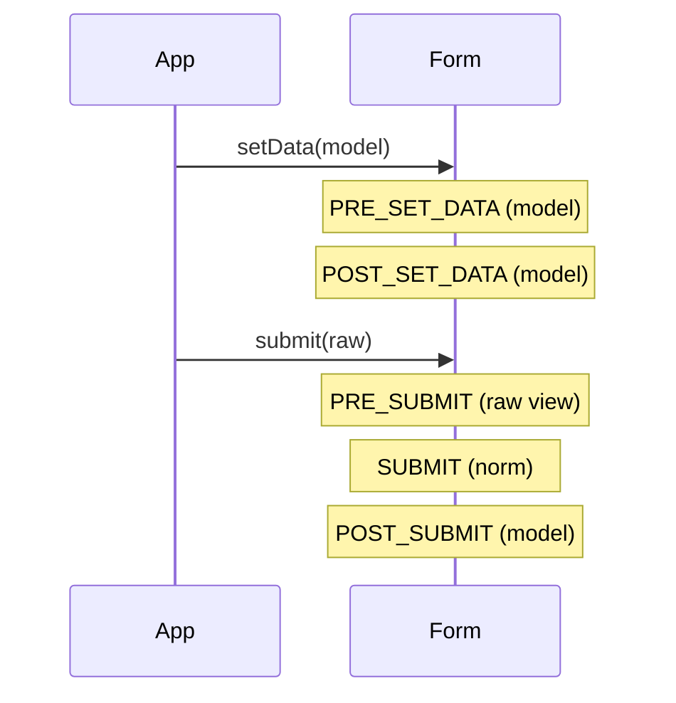
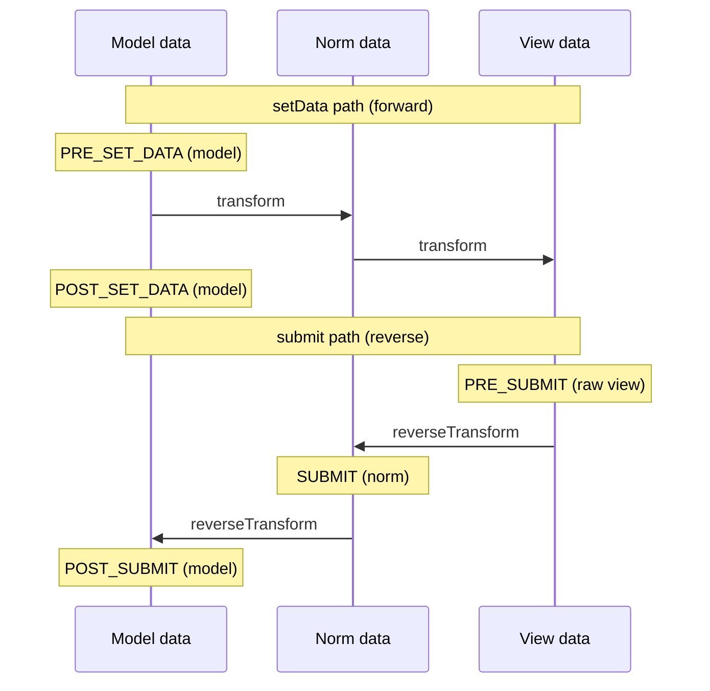

# Form Events

!!! tip "In a nutshell"
    Form events let you change a form while it is being built or submitted — add
    fields dynamically or clean raw input. The one fact to burn in: two sequences,
    **PRE_SET_DATA → POST_SET_DATA** (setting data) and **PRE_SUBMIT → SUBMIT →
    POST_SUBMIT** (submitting).

!!! example "Real-world analogy"
    Form events are **checkpoints as the form is filled and submitted**. As the blank
    form is laid out you pass `PRE_SET_DATA`/`POST_SET_DATA` — the moment to add
    extra fields for who's filling it in. As you hand it back you pass
    `PRE_SUBMIT` (an inspector still sees your raw handwriting), then `SUBMIT`, then
    `POST_SUBMIT` (the answers are now filed on your record). Each checkpoint lets
    you inspect or adjust — but you can only **add sections** at the early ones,
    before the form is bound.

!!! abstract "Learning objectives"
    By the end of this chapter you can:

    - [ ] Recite the two `FormEvents` sequences and what data each event carries.
    - [ ] Modify a form dynamically from an event listener/subscriber.
    - [ ] Choose the right event for a given task (PRE_SET_DATA vs PRE_SUBMIT).

    **Syllabus:** `Forms → Form events` ·
    **Level:** Advanced → Expert ·
    **Est. time:** 30 min ·
    **Prerequisites:** [Handling submissions](handling.md) · [Data transformers](data-transformers.md)

---

## Theory

The form lifecycle dispatches events at fixed points so you can hook in — to add
fields based on data, sanitise raw input, or react after binding. All five
constants live on `Symfony\Component\Form\FormEvents`; every listener receives a
`Symfony\Component\Form\FormEvent`.

Two distinct sequences fire at two different times:

| Phase | Sequence |
|---|---|
| **Setting data** (`setData`, on create/populate) | `PRE_SET_DATA` → `POST_SET_DATA` |
| **Submitting** (`submit`, on `handleRequest`) | `PRE_SUBMIT` → `SUBMIT` → `POST_SUBMIT` |

## Deep Dive — how it works internally

### What each event carries

| Constant | String | `$event->getData()` holds | Typical use |
|---|---|---|---|
| `PRE_SET_DATA` | `form.pre_set_data` | **model** data (pre-transform) | add fields for the *initial* object |
| `POST_SET_DATA` | `form.post_set_data` | model data (set) | read-only inspection |
| `PRE_SUBMIT` | `form.pre_submit` | **raw view** data (array) | sanitise input, add fields by submitted value |
| `SUBMIT` | `form.submit` | **normalized** data | adjust norm data before model write |
| `POST_SUBMIT` | `form.post_submit` | **model** data (bound) | validation, logging (read-only) |

!!! danger "Order is the exam favourite"
    Set: **PRE_SET_DATA → POST_SET_DATA**.
    Submit: **PRE_SUBMIT → SUBMIT → POST_SUBMIT**.
    Mixing these up (or inserting a non-existent `PRE_VALIDATE`) is the classic
    trap. There is **no** `POST_VALIDATE` in `FormEvents`.



The same two flows seen as **data direction** — set data flows model→norm→view
(forward transform), submit flows view→norm→model (reverse):



!!! note "Source reference"
    `Symfony\Component\Form\FormEvents` and `Form::setData()/submit()` —
    [symfony/symfony `8.0`](https://github.com/symfony/symfony/blob/8.0/src/Symfony/Component/Form/FormEvents.php).

### Dynamic form modification

The killer use case: **change the form's fields based on data**.

- Fields that depend on the *initial* object → listen on **PRE_SET_DATA**
  (`$event->getForm()->add(...)`).
- Fields that depend on the *submitted* value (dependent dropdowns) → listen on
  **PRE_SUBMIT**, reading the raw array to decide what to add.

You can only add/remove fields **before** they are bound — that is why these two
"PRE" events are the right hooks, not `SUBMIT`/`POST_SUBMIT`.

### Listener vs subscriber

- **Closure listener:** `$builder->addEventListener(FormEvents::PRE_SUBMIT, fn (FormEvent $e) => ...)`.
- **Subscriber:** a class implementing the EventDispatcher's
  `Symfony\Component\EventDispatcher\EventSubscriberInterface` (the Form component
  has no dedicated `FormEventSubscriberInterface`) declaring
  `getSubscribedEvents()`; add with `$builder->addEventSubscriber($subscriber)`.

Subscribers are reusable across forms and testable in isolation.

### Null behavior

`PRE_SET_DATA` can carry `null`: a form created without initial data (no
`data_class`, or an explicit `null`) hands your listener `$event->getData() === null`,
so guard with `instanceof` / `??` before calling methods on it. The dynamic-field
bug is calling `$data->getId()` on a null "new entity" form — the `ArticleType`
example survives because it checks `$article instanceof Article` first. `PRE_SUBMIT`
carries the **raw request array**, where a field the user left blank is simply an
absent key: read it with `$data['country'] ?? null`, not `$data['country']`, or you
trip an undefined-key warning. `POST_SUBMIT` sees the bound model, which is
`null`/empty for an empty submission. Never assume a key or object is present inside
a listener.

!!! note "Null in real life"
    `null` = a checkpoint waving through someone with **no papers yet** — check
    whether they're holding anything before you try to inspect it.

## Configuration & code

=== "Dynamic field (PRE_SET_DATA)"

    ```php
    <?php
    declare(strict_types=1);

    namespace App\Form;

    use App\Entity\Article; // domain object (non-Doctrine mapping assumed)
    use Symfony\Component\Form\AbstractType;
    use Symfony\Component\Form\Event\PreSetDataEvent;
    use Symfony\Component\Form\Extension\Core\Type\TextType;
    use Symfony\Component\Form\FormBuilderInterface;
    use Symfony\Component\Form\FormEvents;

    final class ArticleType extends AbstractType
    {
        public function buildForm(FormBuilderInterface $builder, array $options): void
        {
            $builder->add('title', TextType::class);

            // Add a "slug" field only for brand-new (unsaved) articles.
            $builder->addEventListener(
                FormEvents::PRE_SET_DATA,
                static function (PreSetDataEvent $event): void {
                    $article = $event->getData();
                    if ($article instanceof Article && null === $article->getId()) {
                        $event->getForm()->add('slug', TextType::class);
                    }
                },
            );
        }
    }
    ```

=== "Dependent field (PRE_SUBMIT)"

    ```php
    <?php
    declare(strict_types=1);

    use Symfony\Component\Form\Event\PreSubmitEvent;
    use Symfony\Component\Form\Extension\Core\Type\ChoiceType;
    use Symfony\Component\Form\FormEvents;

    // Inside buildForm(): add cities depending on the submitted country.
    $builder->addEventListener(
        FormEvents::PRE_SUBMIT,
        static function (PreSubmitEvent $event): void {
            $data = $event->getData();               // raw array
            $country = $data['country'] ?? null;
            $event->getForm()->add('city', ChoiceType::class, [
                'choices' => $country ? cities_for($country) : [],
            ]);
        },
    );
    ```

=== "Subscriber"

    ```php
    <?php
    declare(strict_types=1);

    namespace App\Form\EventListener;

    use Symfony\Component\EventDispatcher\EventSubscriberInterface;
    use Symfony\Component\Form\Event\PreSubmitEvent;
    use Symfony\Component\Form\FormEvents;

    final class TrimSubscriber implements EventSubscriberInterface
    {
        public static function getSubscribedEvents(): array
        {
            return [FormEvents::PRE_SUBMIT => 'onPreSubmit'];
        }

        public function onPreSubmit(PreSubmitEvent $event): void
        {
            $data = $event->getData();
            if (\is_array($data) && isset($data['code'])) {
                $data['code'] = trim((string) $data['code']);
                $event->setData($data);
            }
        }
    }
    ```

## Best practices & anti-patterns

| ✅ Do | ❌ Avoid |
|---|---|
| Add/remove fields on PRE_SET_DATA / PRE_SUBMIT | Adding fields on SUBMIT/POST_SUBMIT |
| Read raw array on PRE_SUBMIT | Expecting transformed data there |
| Use a subscriber for reusable logic | Copy-pasting closures across types |
| Treat POST_SUBMIT as read-only | Mutating fields after binding |

## When (not) to use it / alternatives

Events are for **dynamic** behaviour and input massaging. If the transformation
is a stable format mapping, use a [data transformer](data-transformers.md)
instead. For business validation, use the Validator, not a POST_SUBMIT hook.

!!! danger "Certification traps"
    - Set order: **PRE_SET_DATA, POST_SET_DATA**. Submit order: **PRE_SUBMIT,
      SUBMIT, POST_SUBMIT**.
    - PRE_SUBMIT data is a **raw array/string** (view data), *not* your object.
    - You can only add/remove fields **before** submit binds them (PRE_* events).
    - There is no `PRE_VALIDATE`/`POST_VALIDATE` in `FormEvents`; validation is a
      `POST_SUBMIT` listener.

!!! warning "Common mistakes"
    - Trying to add a field on SUBMIT/POST_SUBMIT — too late, it won't bind.
    - Reading `$event->getData()->getCountry()` on PRE_SUBMIT (it's an array).
    - Forgetting `$event->setData(...)` after mutating data in a listener.

## Exercises

1. **(Advanced)** Add a `PRE_SUBMIT` listener that lowercases a submitted
   `email` field before binding.
2. **(Expert)** Implement dependent dropdowns: a `country` field and a `city`
   field whose choices depend on the submitted country. Which events do you use
   for the initial render vs the submit, and why?

??? success "Solutions"

    **1.** Add on PRE_SUBMIT: read `$data = $event->getData()`, set
    `$data['email'] = strtolower($data['email'] ?? '')`, then
    `$event->setData($data)`. It runs on the raw array before transformation.

    **2.** Add the `country` field always. For the *initial* render use
    **PRE_SET_DATA** to add `city` based on the model's current country; for the
    *submission* use **PRE_SUBMIT** to add `city` based on the submitted country
    (raw array). Both are pre-binding events, so the dynamically added `city`
    field exists in time to accept its value.

## Certification questions

??? question "Q1. What is the correct submit event order?"
    - [x] A. PRE_SUBMIT → SUBMIT → POST_SUBMIT ✅
    - [ ] B. SUBMIT → PRE_SUBMIT → POST_SUBMIT
    - [ ] C. PRE_SUBMIT → POST_SUBMIT → SUBMIT
    - [ ] D. PRE_SET_DATA → SUBMIT → POST_SUBMIT

    **Why:** Submission dispatches PRE_SUBMIT (raw), SUBMIT (norm), POST_SUBMIT
    (model), in that order.
    **Ref:** [Form events](https://symfony.com/doc/current/form/events.html).

??? question "Q2. On PRE_SUBMIT, `$event->getData()` returns…"
    - [x] A. The raw submitted view data (array/string) ✅
    - [ ] B. The fully transformed model object
    - [ ] C. Normalized data
    - [ ] D. A `FormView`

    **Why:** PRE_SUBMIT fires before transformation, so data is the raw request
    values.
    **Ref:** [Form events docs](https://symfony.com/doc/current/form/events.html).

??? question "Q3. To add a field based on the submitted value, listen on…"
    - [x] A. PRE_SUBMIT ✅
    - [ ] B. POST_SUBMIT
    - [ ] C. SUBMIT
    - [ ] D. POST_SET_DATA

    **Why:** Fields must be added before binding; PRE_SUBMIT gives you the raw
    value while the form is still mutable.
    **Ref:** [Dynamic form modification](https://symfony.com/doc/current/form/dynamic_form_modification.html).

??? question "Q4. Which event does the validator extension hook to run validation?"
    - [x] A. POST_SUBMIT ✅
    - [ ] B. PRE_SUBMIT
    - [ ] C. SUBMIT
    - [ ] D. PRE_SET_DATA

    **Why:** Validation runs after data is bound to the model, via a POST_SUBMIT
    listener. There is no dedicated validate event.
    **Ref:** [Form events docs](https://symfony.com/doc/current/form/events.html).

## Key takeaways

- Five events on `FormEvents`; two sequences (set vs submit).
- Set: PRE_SET_DATA → POST_SET_DATA. Submit: PRE_SUBMIT → SUBMIT → POST_SUBMIT.
- Data shape per event: PRE_SET_DATA=model, PRE_SUBMIT=raw view, SUBMIT=norm,
  POST_SUBMIT=model.
- Add/remove fields only on PRE_* events; validation is a POST_SUBMIT listener.

## Last-minute revision

!!! tip "Cheat sheet"
    - `PRE_SET_DATA`(model) · `POST_SET_DATA`(model)
    - `PRE_SUBMIT`(raw) · `SUBMIT`(norm) · `POST_SUBMIT`(model)
    - Dynamic fields: PRE_SET_DATA (initial), PRE_SUBMIT (submitted).
    - `addEventListener` / `addEventSubscriber` on the builder.
    - No `PRE_VALIDATE`; validation = POST_SUBMIT listener.

## Official References
- [Official Symfony docs — Form events](https://symfony.com/doc/current/form/events.html)
- [Official Symfony docs — Dynamic form modification](https://symfony.com/doc/current/form/dynamic_form_modification.html)
- [Symfony source — FormEvents](https://github.com/symfony/symfony/blob/8.0/src/Symfony/Component/Form/FormEvents.php)

---

<small>Related: [Handling submissions](handling.md) ·
[Data transformers](data-transformers.md) · [Type extensions](type-extensions.md)</small>
