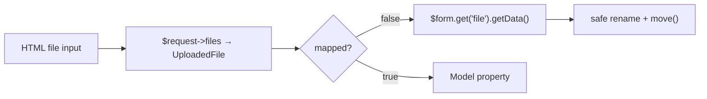

# Handling File Uploads

!!! tip "In a nutshell"
    Un champ `FileType` vous donne un `UploadedFile` ; les uploads sont
    généralement `mapped => false`, vous récupérez et déplacez donc le fichier
    vous-même. Ne faites jamais confiance au nom ni au type MIME envoyés par le
    client — renommez le fichier et validez avec la constraint `File`/`Image`.

!!! example "Real-world analogy"
    Pensez à une candidature avec un CV agrafé. Le formulaire vérifie quand même
    la pièce jointe — elle doit être un PDF sous la limite de taille (le champ est
    unmapped mais reste validé) — pourtant le formulaire papier lui-même ne classe
    jamais votre CV dans votre dossier d'employé permanent. Un commis le détache
    (`->getData()`), lui attribue un nouveau nom de référence et le range dans une
    armoire sécurisée séparée. Voilà `mapped => false` : la pièce jointe voyage
    avec le form et se fait inspecter, mais elle n'est pas écrite sur la fiche que
    le form remplit par ailleurs.

!!! abstract "Learning objectives"
    À la fin de ce chapitre, vous saurez :

    - [ ] Ajouter un champ `FileType` et lire l'`UploadedFile` résultant.
    - [ ] Utiliser le pattern `mapped => false` pour garder l'upload hors de votre entité/DTO.
    - [ ] Déplacer un fichier uploadé en toute sécurité et le contraindre avec `File`/`Image`.

    **Syllabus:** `Forms → File uploads` ·
    **Level:** Advanced → Expert ·
    **Est. time:** 25 min ·
    **Prerequisites:** [Handling submissions](handling.md) · [Validation](../validation/index.md)

---

## Pour les nuls

### L'idée en une phrase
Un champ `FileType` te donne un fichier téléversé — le plus souvent, tu le gères "à côté" du formulaire plutôt que directement lié à ton entité.

### Imagine dans la vraie vie
Une candidature avec un CV agrafé. Le formulaire vérifie quand même la pièce jointe — elle doit être un PDF sous une certaine taille (le champ est non-mappé mais quand même validé) — mais le formulaire papier lui-même ne classe jamais ton CV directement dans ton dossier permanent. Un employé le détache, lui donne une nouvelle référence, et le classe séparément.

### Dans Symfony
`mapped: false` empêche Symfony de chercher un setter `setCv()` inexistant sur ton entité — tu récupères le fichier via `$form->get('cv')->getData()` et tu le gères toi-même.

### Exemple simple
```php
$fichier = $form->get('cv')->getData(); // UploadedFile, pas lié à l'entité
$fichier->move($this->getParameter('uploads_dir'), uniqid().'.pdf');
```

### Comment le mémoriser 🧠
Ne fais **jamais confiance** au nom ou au type MIME envoyé par le client — renomme toujours le fichier et valide avec la contrainte `File`/`Image`.


## Theory

Un input HTML de type file arrive dans `$_FILES`, que Symfony expose sous forme
d'objets `Symfony\Component\HttpFoundation\File\UploadedFile` dans
`$request->files`. `FileType` lie un champ de form à cet objet. Comme un upload
binaire n'est pas quelque chose que vous stockez habituellement *tel quel* sur
votre modèle, le champ est fréquemment **unmapped** — le form le valide, vous
gérez la persistance.

```php
// The raw $_FILES entry is exposed as an UploadedFile on the request
$file = $request->files->get('brochure');   // ?UploadedFile

// FileType binds a form field to that object — usually unmapped
$builder->add('brochure', FileType::class, ['mapped' => false]);
```

!!! question "Predict first"
    Un fichier uploadé arrive avec `getClientOriginalName()` = `"../../evil.php"`.
    Cette valeur est-elle sûre à utiliser comme nom de fichier stocké ?

??? note "Reveal"
    Non — le nom et le type MIME envoyés par le client sont **non fiables** (path
    traversal, spoofing). Générez un nom sûr (slug + `uniqid()` +
    `guessExtension()`) et validez avec la constraint `File`/`Image` basée sur le
    contenu avant `move()`.

## Deep Dive — how it works internally

### From request to `UploadedFile`

Le `HttpFoundationRequestHandler` fusionne `$request->files` dans les données
soumises. Pour un champ `FileType`, la « view data » est l'`UploadedFile` ; il
n'y a aucune transformation en chaîne. La valeur modèle mappée (si mappée)
devient elle aussi cet `UploadedFile`.

`UploadedFile` étend `Symfony\Component\HttpFoundation\File\File` (qui étend
`\SplFileInfo`) et ajoute :

- `getClientOriginalName()` / `getClientMimeType()` — **non fiables**, envoyés par le client.
- `getMimeType()` — deviné à partir du contenu (fiable).
- `getSize()`, `isValid()`, `getError()`.
- `move(string $dir, ?string $name = null): File` — déplacer hors du répertoire temporaire.

```php
// HttpFoundationRequestHandler merged $request->files into the submitted data;
// for a FileType field the view data IS the UploadedFile (File -> \SplFileInfo).
$file->getClientOriginalName();  // untrusted (client-sent)
$file->getClientMimeType();      // untrusted (client-sent)
$file->getMimeType();            // guessed from content — trustworthy
$file->getSize();                // bytes
$file->isValid();                // upload completed without error?
$file->getError();               // raw UPLOAD_ERR_* code
$moved = $file->move('/var/app/uploads', 'doc-64f2a1.pdf'); // returns a File
```

!!! danger "Never trust the client filename"
    `getClientOriginalName()` peut contenir du path traversal ou des scripts.
    Générez toujours un nom sûr (par ex. slug + `uniqid()` + extension devinée)
    avant `move()`.



!!! note "Source reference"
    `Symfony\Component\HttpFoundation\File\UploadedFile` et `FileType` —
    [symfony/symfony `8.0`](https://github.com/symfony/symfony/blob/8.0/src/Symfony/Component/HttpFoundation/File/UploadedFile.php).

### `mapped => false`

Définir `'mapped' => false` sur un champ :

- le conserve dans le form (rendu, soumis, **validé**),
- mais le data mapper ne lit **pas** depuis le modèle et n'y écrit pas.

Vous le récupérez explicitement : `$form->get('brochure')->getData()`. C'est le
pattern standard pour les uploads, les champs de mot de passe en clair et les
cases « j'accepte les conditions ».

```php
$builder->add('brochure', FileType::class, [
    'mapped' => false,   // rendered, submitted, validated — never touches the model
]);

// After a valid submit, fetch it explicitly:
$file = $form->get('brochure')->getData();   // ?UploadedFile
```

### Constraints

Attachez la validation au champ via l'option `constraints` (ou à la propriété du
modèle). Utilisez :

- `Symfony\Component\Validator\Constraints\File` — `maxSize`, `mimeTypes`,
  `extensions`.
- `Symfony\Component\Validator\Constraints\Image` — plus largeur/hauteur/ratio.

```php
$builder->add('brochure', FileType::class, [
    'constraints' => [
        // File: maxSize + content-based mimeTypes
        new File(maxSize: '5m', mimeTypes: ['application/pdf']),
        // or: new File(extensions: ['pdf']) — checks extension AND matching MIME
    ],
]);

$builder->add('avatar', FileType::class, [
    // Image adds width/height/ratio checks on top of File
    'constraints' => [new Image(maxSize: '2m', maxWidth: 1024, maxHeight: 1024)],
]);
```

## Configuration & code

=== "Form type"

    ```php
    <?php
    declare(strict_types=1);

    namespace App\Form;

    use Symfony\Component\Form\AbstractType;
    use Symfony\Component\Form\Extension\Core\Type\FileType;
    use Symfony\Component\Form\FormBuilderInterface;
    use Symfony\Component\Validator\Constraints\File;

    final class DocumentType extends AbstractType
    {
        public function buildForm(FormBuilderInterface $builder, array $options): void
        {
            $builder->add('brochure', FileType::class, [
                'label'    => 'Brochure (PDF)',
                'mapped'   => false,          // handled manually
                'required' => false,
                'constraints' => [
                    new File(
                        maxSize: '5m',
                        mimeTypes: ['application/pdf'],
                        mimeTypesMessage: 'Please upload a valid PDF.',
                    ),
                ],
            ]);
        }
    }
    ```

=== "Controller"

    ```php
    <?php
    declare(strict_types=1);

    use App\Form\DocumentType;
    use Symfony\Component\HttpFoundation\File\Exception\FileException;
    use Symfony\Component\HttpFoundation\File\UploadedFile;
    use Symfony\Component\HttpFoundation\Request;
    use Symfony\Component\HttpFoundation\Response;
    use Symfony\Component\String\Slugger\SluggerInterface;

    public function upload(Request $request, SluggerInterface $slugger): Response
    {
        $form = $this->createForm(DocumentType::class);
        $form->handleRequest($request);

        if ($form->isSubmitted() && $form->isValid()) {
            /** @var UploadedFile|null $file */
            $file = $form->get('brochure')->getData();

            if ($file instanceof UploadedFile) {
                $safe = $slugger->slug(pathinfo(
                    $file->getClientOriginalName(), PATHINFO_FILENAME,
                ));
                $name = \sprintf('%s-%s.%s', $safe, uniqid(), $file->guessExtension());

                try {
                    $file->move($this->getParameter('brochures_dir'), $name);
                } catch (FileException) {
                    $this->addFlash('error', 'Upload failed.');
                }
            }

            return $this->redirectToRoute('upload');
        }

        return $this->render('upload/index.html.twig', ['form' => $form]);
    }
    ```

=== "Twig"

    ```twig
    {# form_start emits enctype="multipart/form-data" automatically #}
    {{ form_start(form) }}
        {{ form_row(form.brochure) }}
    {{ form_end(form) }}
    ```

## Best practices & anti-patterns

| ✅ Do | ❌ Avoid |
|---|---|
| `mapped => false` pour les uploads | Stocker un `UploadedFile` sur votre entité |
| Renommer avec le slugger + `uniqid()` | Utiliser `getClientOriginalName()` comme chemin |
| Valider avec `File`/`Image` | Faire confiance au type MIME du client |
| Stocker le chemin/nom de fichier sur le modèle | Persister l'objet fichier brut |

## When (not) to use it / alternatives

Utilisez `FileType` pour les uploads navigateur via un form. Pour les uploads
programmatiques/streamés (chunked, pré-signés S3), le composant Form n'intervient
pas — manipulez directement la `Request`/le HttpClient. Les widgets d'upload
basés sur Symfony UX sortent du cadre de ce chapitre.

!!! danger "Certification traps"
    - `form_start` ajoute `enctype="multipart/form-data"` **uniquement quand le
      form contient un champ file** — omettez `FileType` et le multipart ne sera
      pas défini.
    - `getClientOriginalName()`/`getClientMimeType()` sont **non fiables** ;
      utilisez `guessExtension()`/`getMimeType()` (basés sur le contenu) pour la
      sécurité.
    - Un champ unmapped est quand même **validé** ; vous le récupérez avec
      `->getData()`.
    - La constraint `File` `maxSize` est une chaîne comme `'5m'`/`'1024k'`,
      plafonnée par les directives PHP `upload_max_filesize`/`post_max_size`.

!!! warning "Common mistakes"
    - Oublier de vérifier `$file instanceof UploadedFile` (null sur les champs
      optionnels) → erreur fatale sur `move()`.
    - Stocker les fichiers dans la racine web publique sans validation → risque de RCE.
    - S'attendre à ce qu'un `FileType` mappé persiste automatiquement — il stocke
      l'objet, pas un chemin.

## Exercises

1. **(Advanced)** Ajoutez un avatar `FileType` (constraint `Image`, max 2 Mo) en
   champ unmapped et déplacez-le vers `%kernel.project_dir%/var/uploads`.
2. **(Expert)** Expliquez pourquoi s'appuyer sur `getClientMimeType()` pour une
   allow-list est insécurisé et ce qu'il faut utiliser à la place.

??? success "Solutions"

    **1.** Ajoutez `->add('avatar', FileType::class, ['mapped' => false, 'constraints'
    => [new Image(maxSize: '2m')]])`. Dans le controller, récupérez
    `$form->get('avatar')->getData()`, renommez via le slugger, puis `move()`
    vers le paramètre du répertoire d'uploads.

    **2.** `getClientMimeType()` est envoyé par le navigateur et trivialement
    falsifiable. Utilisez la constraint `File`/`Image` (qui appelle
    `getMimeType()`, deviné à partir du contenu du fichier) pour qu'un `.pdf`
    renommé en `.png` soit rejeté.

## Certification questions

??? question "Q1. Where do you read an unmapped `FileType` value?"
    - [ ] A. From the bound model object
    - [x] B. `$form->get('field')->getData()` ✅
    - [ ] C. `$request->request->get('field')`
    - [ ] D. `$form->getViewData()`

    **Why:** `mapped => false` exclut le champ du data mapper ; vous le
    récupérez directement depuis le form enfant.
    **Ref:** [File uploads](https://symfony.com/doc/8.0/controller/upload_file.html).

??? question "Q2. Which value is safe to trust for validation?"
    - [ ] A. `getClientOriginalName()`
    - [ ] B. `getClientMimeType()`
    - [x] C. `getMimeType()` / `guessExtension()` (content-based) ✅
    - [ ] D. The HTML `accept` attribute

    **Why:** Le nom/MIME fournis par le client sont falsifiables ; la détection
    basée sur le contenu fait foi.
    **Ref:** [UploadedFile](https://github.com/symfony/symfony/blob/8.0/src/Symfony/Component/HttpFoundation/File/UploadedFile.php).

??? question "Q3. When does `form_start` emit `multipart/form-data`?"
    - [x] A. When the form contains a file field ✅
    - [ ] B. Always
    - [ ] C. Only if you set it manually
    - [ ] D. Never — you must add it yourself

    **Why:** La variable de vue `multipart` du form est définie quand un enfant
    l'exige (par ex. `FileType`), et `form_start` rend l'enctype en conséquence.
    **Ref:** [File type](https://symfony.com/doc/8.0/reference/forms/types/file.html).

## Key takeaways

- `FileType` → `UploadedFile` ; lisez les uploads unmapped via `->get('x')->getData()`.
- Renommez avec un slug + `uniqid()` ; ne faites jamais confiance au nom/MIME du client.
- Validez avec les constraints `File`/`Image` (vérifications basées sur le contenu).
- `form_start` définit le multipart automatiquement quand un champ file est présent.

## Last-minute revision

!!! tip "Cheat sheet"
    - `UploadedFile` : `move($dir, $name)`, `guessExtension()`, `getMimeType()`.
    - Non fiables : `getClientOriginalName()`, `getClientMimeType()`.
    - `mapped => false` → toujours validé ; récupérez via `->getData()`.
    - `File(maxSize: '5m', mimeTypes: [...])` / `Image(...)`.
    - Voir aussi [controllers/file-upload](../controllers/file-upload.md).

## Connections

- **Depends on:** [Handling submissions](handling.md) — le request handler fusionne `$request->files` dans les données soumises.
- **Reused in:** [Controllers — file upload](../controllers/file-upload.md) — le même flux `UploadedFile`/`move()` en dehors d'un form.
- **Confused with:** [Validation](../validation/index.md) — les constraints `File`/`Image` imposent taille/MIME, même sur un champ unmapped.

## Official References
- [Official Symfony docs — Uploading files](https://symfony.com/doc/8.0/controller/upload_file.html)
- [Official Symfony docs — File field type](https://symfony.com/doc/8.0/reference/forms/types/file.html)
- [Symfony source — UploadedFile](https://github.com/symfony/symfony/blob/8.0/src/Symfony/Component/HttpFoundation/File/UploadedFile.php)

## Video references

!!! tip "Watch & learn"
    Voici des chaînes vidéo officielles, mises à jour en continu — cherchez-y
    « Symfony forms » pour consolider ce chapitre. Nous lions des chaînes stables
    plutôt que des vidéos individuelles afin que les références ne périment jamais.

    - [SymfonyCasts screencasts](https://symfonycasts.com/tracks/symfony) — tutoriels scénarisés à suivre en codant.
    - [Symfony official YouTube](https://www.youtube.com/@SymfonyOfficial) — conférences et keynotes SymfonyCon.
    - [Official docs for this topic](https://symfony.com/doc/8.0/controller/upload_file.html) — certaines pages de la doc Symfony intègrent un screencast.

## Confidence check

Je suis prêt quand je peux :

- [ ] expliquer **pourquoi** les uploads sont généralement `mapped => false`
- [ ] ajouter un `FileType`, lire l'`UploadedFile` et le déplacer en toute sécurité dans Symfony 8
- [ ] déboguer une erreur fatale sur `move()` due à un check `instanceof UploadedFile` manquant
- [ ] repérer la mauvaise réponse qui fait confiance à `getClientMimeType()` pour une allow-list
- [ ] expliquer quand `form_start` émet `enctype="multipart/form-data"`

---

<small>Related: [Controllers — file upload](../controllers/file-upload.md) ·
[Handling submissions](handling.md) · [Built-in types](built-in-types.md)</small>
