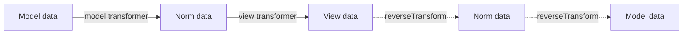
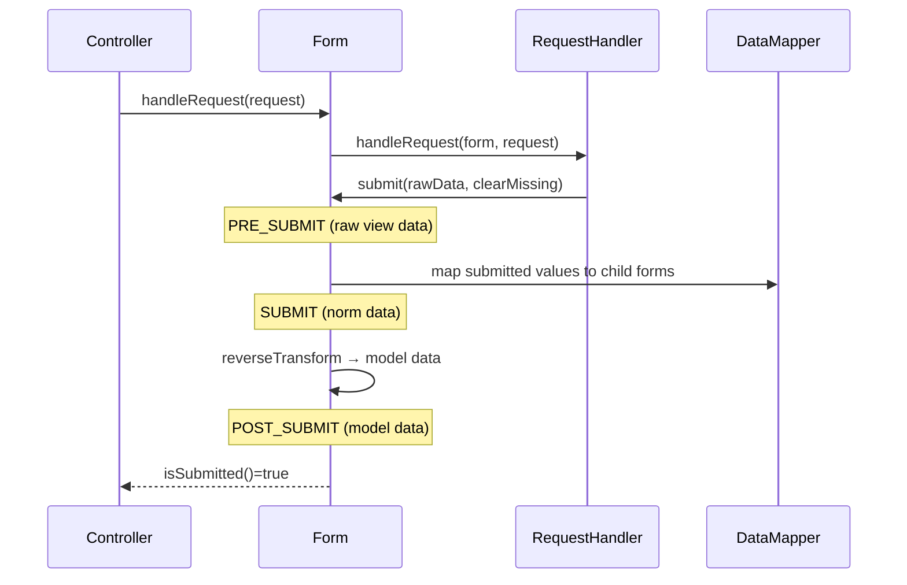

# Handling Submissions

!!! tip "In a nutshell"
    Une seule action de controller affiche et traite le form via `handleRequest()`.
    Règle d'or : protégez toujours avec `isSubmitted() && isValid()` (appeler
    `isValid()` sur un form non soumis lève une exception), puis redirigez après un POST réussi.

!!! example "Real-world analogy"
    Imaginez un greffier au guichet. `handleRequest`, c'est le greffier qui remarque
    si vous avez réellement **rendu le formulaire** (cette request est la soumission)
    ou si vous venez juste en chercher un vierge (GET). `isSubmitted()` = « l'avez-vous
    remis ? » ; `isValid()` = « a-t-il passé les contrôles ? ». La redirection après
    succès, c'est le greffier qui tamponne un **reçu** pour qu'un rafraîchissement de
    la page ne dépose pas votre formulaire deux fois.

!!! abstract "Learning objectives"
    À la fin de ce chapitre, vous saurez :

    - [ ] Câbler le flux canonique de controller `handleRequest` → `isSubmitted` → `isValid`.
    - [ ] Suivre les **trois représentations des données** (model / normalized / view) dans les deux sens.
    - [ ] Appliquer le pattern **POST-redirect-GET** et expliquer pourquoi il compte.

    **Syllabus:** `Forms → Handling submissions` ·
    **Level:** Advanced → Expert ·
    **Est. time:** 30 min ·
    **Prerequisites:** [Creating forms](creation.md) · [HTTP Request](../http/request.md)

---

## Theory

Un form a deux vies : **affichage** (GET) et **traitement** (POST). Une seule
action de controller sert les deux. `handleRequest()` inspecte la request
courante ; si c'est la soumission, elle remplit le form ; sinon, le form reste
vierge et s'affiche.

Le flux idiomatique :

```php
$form->handleRequest($request);
if ($form->isSubmitted() && $form->isValid()) {
    // $form->getData() is now the populated, validated model
}
```

- `isSubmitted()` — le form a-t-il été soumis ?
- `isValid()` — la validation a-t-elle réussi ? **N'a de sens qu'après soumission.**

!!! question "Predict first"
    Vous appelez `$form->isValid()` sur un form qui a été créé mais **jamais**
    soumis (pas de `handleRequest`/`submit`). Que se passe-t-il ?

??? note "Reveal"
    Cela lève une `LogicException` (« Cannot check if an unsubmitted form is valid »).
    Protégez toujours avec `isSubmitted() && isValid()` dans cet ordre —
    `handleRequest` doit s'exécuter d'abord pour lier la request.

## Deep Dive — how it works internally

### `handleRequest` delegates to a RequestHandler

`FormInterface::handleRequest()` ne lit pas `$_POST` lui-même. Il délègue à une
`Symfony\Component\Form\RequestHandlerInterface`. Avec FrameworkBundle installé,
c'est `Symfony\Component\Form\Extension\HttpFoundation\HttpFoundationRequestHandler`
(sinon `NativeRequestHandler`).

Le handler :

1. Vérifie la méthode HTTP par rapport à l'option `method` du form (par défaut `POST`).
2. Pour `POST`, fusionne `$request->request` (champs) et `$request->files`
   (uploads) dans les données soumises.
3. Gère les cas `enctype` / POST trop volumineux (`post_max_size`).
4. Appelle `$form->submit($data, clearMissing: $method !== 'PATCH')`.

```php
// FormInterface::handleRequest() delegates to a RequestHandlerInterface
$form->handleRequest($request); // never reads $_POST directly

// HttpFoundationRequestHandler (NativeRequestHandler without HttpFoundation):
if ($request->getMethod() === $form->getConfig()->getMethod()) { // 'method' option
    $data = array_replace_recursive(
        $request->request->all()[$form->getName()] ?? [],  // fields
        $request->files->all()[$form->getName()] ?? [],    // uploads
    );
    // (it also guards enctype and post_max_size oversized POSTs)
    $form->submit($data, 'PATCH' !== $request->getMethod()); // clearMissing
}
```

!!! note "Source reference"
    `HttpFoundationRequestHandler::handleRequest()` —
    [symfony/symfony `8.0`](https://github.com/symfony/symfony/blob/8.0/src/Symfony/Component/Form/Extension/HttpFoundation/HttpFoundationRequestHandler.php).

### The three data representations

Chaque champ détient ses données sous trois formes :

| Shape | What it is | Example |
|---|---|---|
| **Model data** | Votre valeur PHP | `\DateTimeImmutable` |
| **Norm(alized) data** | Forme canonique, neutre vis-à-vis du transport | `\DateTimeImmutable` ou chaîne ISO |
| **View data** | Chaînes pour le HTML | `['date' => '2026-07-06']` |

Les transformers convertissent entre elles — voir [data transformers](data-transformers.md).
`transform()` s'exécute **model → view** (rendu) ; `reverseTransform()` s'exécute
**view → model** (soumission).



### The submit flow



L'ordre des events au submit est **PRE_SUBMIT → SUBMIT → POST_SUBMIT**
(mémorisez-le — voir [events](events.md)). La validation est déclenchée par un
listener sur `POST_SUBMIT` enregistré par la form extension du validator, raison
pour laquelle `isValid()` n'est fiable qu'après une soumission.

### `clearMissing` and PATCH

`submit($data, $clearMissing = true)` remet à vide les champs absents du payload.
`handleRequest` passe `clearMissing = false` pour `PATCH`, ce qui permet les mises
à jour partielles — le détail de `handleRequest` préféré de l'examen.

### Null behavior

Une soumission vide reste une soumission : `handleRequest` appelle `submit()` avec
des valeurs vides/absentes, donc `clearMissing` (par défaut `true`) remet chaque
champ à sa valeur vide — un champ texte devient `''`, un form avec `data_class`
garde l'objet mais vide ses propriétés, et un form composé non lié produit un array
de nulls. **Avant** le submit, `getData()` est le modèle initial (ou `null` si vous
n'avez rien passé). Pour `PATCH`, `handleRequest` passe `clearMissing: false`, donc
les champs absents du payload gardent leur valeur courante au lieu de passer à
null — tout l'intérêt d'une mise à jour partielle. Le bug classique : envoyer un
PATCH comme un simple POST, si bien que `clearMissing` reste `true` et que les
champs non touchés sont silencieusement effacés en null/vide.

!!! note "Null in real life"
    `null`/vide = une ligne blanche sur le formulaire que le greffier a récupéré.
    Avec `clearMissing` activé, une ligne blanche **efface** ce qui était au dossier ;
    un PATCH dit au greffier de laisser les lignes non touchées exactement telles quelles.

## Configuration & code

=== "Controller"

    ```php
    <?php
    declare(strict_types=1);

    namespace App\Controller;

    use App\Dto\ContactData;
    use App\Form\ContactType;
    use Symfony\Bundle\FrameworkBundle\Controller\AbstractController;
    use Symfony\Component\HttpFoundation\Request;
    use Symfony\Component\HttpFoundation\Response;
    use Symfony\Component\Routing\Attribute\Route;

    final class ContactController extends AbstractController
    {
        #[Route('/contact', name: 'contact', methods: ['GET', 'POST'])]
        public function contact(Request $request): Response
        {
            $form = $this->createForm(ContactType::class, new ContactData());
            $form->handleRequest($request);

            if ($form->isSubmitted() && $form->isValid()) {
                /** @var ContactData $data */
                $data = $form->getData();
                // ... persist / send mail ...

                $this->addFlash('success', 'Message sent.');

                // POST-redirect-GET: never re-render on a successful POST.
                return $this->redirectToRoute('contact');
            }

            // First GET, or invalid submission (re-render with errors).
            return $this->render('contact/index.html.twig', ['form' => $form]);
        }
    }
    ```

=== "Reading errors"

    ```php
    <?php
    declare(strict_types=1);

    // Iterate errors (deep) after an invalid submit:
    foreach ($form->getErrors(true) as $error) {
        // $error->getMessage(), $error->getOrigin()?->getName()
    }
    ```

## Best practices & anti-patterns

| ✅ Do | ❌ Avoid |
|---|---|
| `isSubmitted() && isValid()` dans cet ordre | Appeler `isValid()` sans `isSubmitted()` |
| Rediriger après un POST réussi (PRG) | Rendre la page de succès sur le POST |
| Ré-afficher le *même* form en cas d'erreur | Reconstruire un form neuf après `handleRequest` |
| Utiliser `getData()` pour le modèle | Relire `$request->request` à la main |

## When (not) to use it / alternatives

`handleRequest` est le chemin standard. Pour les contextes hors HttpFoundation
(rares) ou les tests unitaires, vous pouvez appeler `$form->submit($array)`
directement — mais dans les tests, préférez passer par `handleRequest` avec une
`Request` fabriquée, pour plus de fidélité.

!!! danger "Certification traps"
    - Appeler `isValid()` sur un form qui n'a **jamais été soumis lève une
      `LogicException`** (« Cannot check if an unsubmitted form is valid »).
      Protégez toujours avec `isSubmitted()` d'abord.
    - `handleRequest` n'agit que si la **méthode HTTP correspond** à l'option
      `method` du form ; une méthode différente est silencieusement ignorée
      (form non soumis).
    - Pour `PATCH`, `clearMissing` vaut `false` — les champs absents gardent leur valeur.
    - La validation se déclenche sur **POST_SUBMIT**, pas pendant le parsing de
      `handleRequest`.

!!! warning "Common mistakes"
    - Oublier `methods: ['GET','POST']` sur la route → 405 au submit.
    - Oublier la redirection après succès → soumissions dupliquées au rafraîchissement.
    - Attendre des données transformées dans un listener `PRE_SUBMIT` (il contient
      les view data **brutes**).

## Exercises

1. **(Advanced)** Ajoutez le flux PRG complet à un controller et expliquez ce que
   fait un rafraîchissement du navigateur *avant* et *après* l'ajout de la redirection.
2. **(Expert)** Un collègue signale qu'un form `PATCH` efface les champs non
   touchés. Quel est le problème et comment le corrigez-vous ?

??? success "Solutions"

    **1.** Voir le controller ci-dessus. Avant la redirection, rafraîchir re-POSTe
    (le navigateur avertit « renvoyer les données du formulaire »), dupliquant les
    effets de bord. Après la redirection, le navigateur atterrit sur un GET ;
    rafraîchir ne fait que re-télécharger la page — sans danger.

    **2.** La request n'est pas réellement un `PATCH` (par exemple envoyée en
    `POST`), donc `clearMissing` reste `true` et les champs absents sont effacés.
    Assurez-vous que le `method` du form est `PATCH` (et utilisez l'override
    `_method` ou un vrai PATCH) pour que `handleRequest` passe `clearMissing: false`.

## Certification questions

??? question "Q1. In which order should you call the guard methods?"
    - [x] A. `handleRequest`, then `isSubmitted() && isValid()` ✅
    - [ ] B. `isValid()`, then `handleRequest`
    - [ ] C. `submit()`, then `handleRequest`
    - [ ] D. `createView()`, then `isSubmitted`

    **Why:** `handleRequest` remplit et soumet le form ; ce n'est qu'ensuite que
    `isSubmitted`/`isValid` ont un sens.
    **Ref:** [Processing forms](https://symfony.com/doc/current/forms.html#processing-forms).

??? question "Q2. When does form validation run in the submit lifecycle?"
    - [ ] A. During `handleRequest` header parsing
    - [ ] B. On `PRE_SUBMIT`
    - [x] C. Via a `POST_SUBMIT` listener from the validator extension ✅
    - [ ] D. On `createView()`

    **Why:** La form extension de validation enregistre un listener `POST_SUBMIT`
    qui exécute le Validator sur les données modèles mappées.
    **Ref:** [Form events](https://symfony.com/doc/current/form/events.html).

??? question "Q3. For a `PATCH` submission, `clearMissing` is…"
    - [x] A. `false`, enabling partial updates ✅
    - [ ] B. `true`, clearing absent fields
    - [ ] C. undefined
    - [ ] D. controlled only by `data_class`

    **Why:** `handleRequest` passe `clearMissing: false` pour PATCH afin que les
    champs omis gardent leur valeur courante.
    **Ref:** [Form::submit()](https://github.com/symfony/symfony/blob/8.0/src/Symfony/Component/Form/Form.php).

## Key takeaways

- Flux canonique : `handleRequest` → `isSubmitted() && isValid()` → `getData()` →
  **redirection**.
- Trois formes de données : model ↔ norm ↔ view, reliées par les transformers.
- Events de submit : **PRE_SUBMIT → SUBMIT → POST_SUBMIT** ; validation sur le dernier.
- `PATCH` ⇒ `clearMissing = false` (mise à jour partielle).

## Last-minute revision

!!! tip "Cheat sheet"
    - `handleRequest` délègue à `HttpFoundationRequestHandler`.
    - `submit($data, $clearMissing = true)` ; PATCH ⇒ `false`.
    - `getData()` = model, `getNormData()` = norm, `getViewData()` = view.
    - `getErrors(true)` = itérateur d'erreurs en profondeur.
    - **Redirigez** toujours après un POST réussi.

## Connections

- **Depends on:** [Creating forms](creation.md) — vous gérez le form construit là-bas ; la [HTTP request](../http/request.md) est ce que `handleRequest` inspecte.
- **Reused in:** [Form events](events.md) — la soumission dispatche PRE_SUBMIT → SUBMIT → POST_SUBMIT.
- **Confused with:** [Data transformers](data-transformers.md) — les formes model/norm/view liées ici sont converties par les transformers.

## Official References
- [Official Symfony docs — Processing forms](https://symfony.com/doc/current/forms.html)
- [Official Symfony docs — Form events](https://symfony.com/doc/current/form/events.html)
- [Symfony source — HttpFoundationRequestHandler](https://github.com/symfony/symfony/blob/8.0/src/Symfony/Component/Form/Extension/HttpFoundation/HttpFoundationRequestHandler.php)

## Video references

!!! tip "Watch & learn"
    Ce sont des chaînes vidéo officielles, mises à jour en continu — cherchez-y
    « Symfony forms » pour consolider ce chapitre. Nous lions des chaînes stables
    plutôt que des vidéos individuelles pour que les références ne périment jamais.

    - [SymfonyCasts screencasts](https://symfonycasts.com/tracks/symfony) — tutoriels scénarisés à suivre en codant.
    - [Symfony official YouTube](https://www.youtube.com/@SymfonyOfficial) — conférences et keynotes SymfonyCon.
    - [Official docs for this topic](https://symfony.com/doc/current/forms.html#processing-forms) — certaines pages de la doc Symfony embarquent un screencast.

## Confidence check

Je suis prêt quand je peux :

- [ ] expliquer **pourquoi** POST-redirect-GET compte après une soumission réussie
- [ ] câbler `handleRequest` → `isSubmitted() && isValid()` → redirection en Symfony 8
- [ ] déboguer un form `PATCH` qui efface les champs non touchés (`clearMissing`)
- [ ] repérer la mauvaise réponse appelant `isValid()` avant la soumission ou avant `handleRequest`
- [ ] expliquer quand la validation s'exécute réellement dans le cycle de submit (POST_SUBMIT)

---

<small>Related: [Creating forms](creation.md) · [Form events](events.md) ·
[Data transformers](data-transformers.md)</small>
