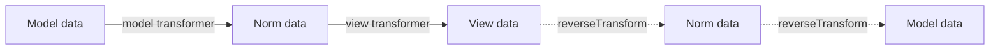
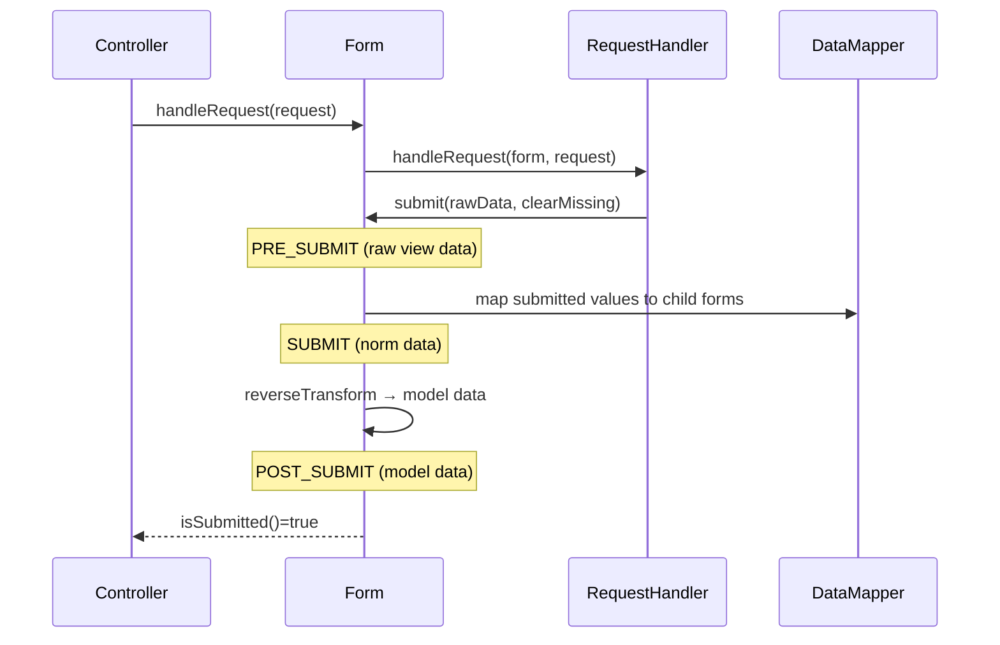

# Handling Submissions

!!! tip "In a nutshell"
    One controller action both shows and processes a form via `handleRequest()`.
    Golden rule: always guard with `isSubmitted() && isValid()` (calling
    `isValid()` on an unsubmitted form throws), then redirect after a successful POST.

!!! example "Real-world analogy"
    Think of a clerk at a counter. `handleRequest` is the clerk noticing whether you
    actually **handed the form back** (this request is the submission) or are just
    picking up a blank one (GET). `isSubmitted()` = "did you hand it in?";
    `isValid()` = "did it pass the checks?". The redirect after success is the clerk
    stamping a **receipt** so refreshing the page doesn't file your form twice.

!!! abstract "Learning objectives"
    By the end of this chapter you can:

    - [ ] Wire the canonical `handleRequest` → `isSubmitted` → `isValid` controller flow.
    - [ ] Trace the **three data representations** (model / normalized / view) in both directions.
    - [ ] Apply the **POST-redirect-GET** pattern and explain why it matters.

    **Syllabus:** `Forms → Handling submissions` ·
    **Level:** Advanced → Expert ·
    **Est. time:** 30 min ·
    **Prerequisites:** [Creating forms](creation.md) · [HTTP Request](../http/request.md)

---

## Theory

A form has two lives: **display** (GET) and **processing** (POST). One controller
action serves both. `handleRequest()` inspects the current request; if it is the
submission, it populates the form; otherwise the form stays pristine and renders.

The idiomatic flow:

```php
$form->handleRequest($request);
if ($form->isSubmitted() && $form->isValid()) {
    // $form->getData() is now the populated, validated model
}
```

- `isSubmitted()` — was the form submitted at all?
- `isValid()` — did validation pass? **Only meaningful after submission.**

!!! question "Predict first"
    You call `$form->isValid()` on a form that was created but **never** submitted
    (no `handleRequest`/`submit`). What happens?

??? note "Reveal"
    It throws a `LogicException` ("Cannot check if an unsubmitted form is valid").
    Always guard with `isSubmitted() && isValid()` in that order — `handleRequest`
    must run first to bind the request.

## Deep Dive — how it works internally

### `handleRequest` delegates to a RequestHandler

`FormInterface::handleRequest()` does not read `$_POST` itself. It delegates to a
`Symfony\Component\Form\RequestHandlerInterface`. With FrameworkBundle installed
that is `Symfony\Component\Form\Extension\HttpFoundation\HttpFoundationRequestHandler`
(otherwise `NativeRequestHandler`).

The handler:

1. Checks the HTTP method against the form's `method` option (default `POST`).
2. For `POST`, merges `$request->request` (fields) and `$request->files`
   (uploads) into the submitted data.
3. Guards `enctype` / oversized-POST (`post_max_size`) situations.
4. Calls `$form->submit($data, clearMissing: $method !== 'PATCH')`.

!!! note "Source reference"
    `HttpFoundationRequestHandler::handleRequest()` —
    [symfony/symfony `8.0`](https://github.com/symfony/symfony/blob/8.0/src/Symfony/Component/Form/Extension/HttpFoundation/HttpFoundationRequestHandler.php).

### The three data representations

Every field holds data in three shapes:

| Shape | What it is | Example |
|---|---|---|
| **Model data** | Your PHP value | `\DateTimeImmutable` |
| **Norm(alized) data** | Transport-neutral canonical form | `\DateTimeImmutable` or ISO string |
| **View data** | Strings for HTML | `['date' => '2026-07-06']` |

Transformers convert between them — see [data transformers](data-transformers.md).
`transform()` runs **model → view** (rendering); `reverseTransform()` runs
**view → model** (submission).



### The submit flow



The event order on submit is **PRE_SUBMIT → SUBMIT → POST_SUBMIT** (memorise it —
see [events](events.md)). Validation is triggered by a listener on `POST_SUBMIT`
registered by the validator form extension, which is why `isValid()` is only
reliable after a submission.

### `clearMissing` and PATCH

`submit($data, $clearMissing = true)` resets fields absent from the payload to
empty. `handleRequest` sets `clearMissing = false` for `PATCH`, enabling partial
updates — the exam's favourite `handleRequest` detail.

### Null behavior

An empty submission still submits: `handleRequest` calls `submit()` with
empty/absent values, so `clearMissing` (default `true`) resets each field to its
empty data — a text field becomes `''`, a `data_class` form keeps the object but
blanks its properties, and an unbound compound form yields an array of nulls.
**Before** submit, `getData()` is the initial model (or `null` if you passed none).
For `PATCH`, `handleRequest` passes `clearMissing: false`, so fields absent from the
payload keep their current value instead of going null — the whole point of a
partial update. The classic bug: sending a PATCH as a plain POST, so `clearMissing`
stays `true` and untouched fields are silently wiped to null/empty.

!!! note "Null in real life"
    `null`/empty = a blank line on the form the clerk got back. With `clearMissing`
    on, a blank line **erases** what was on file; a PATCH tells the clerk to leave
    untouched lines exactly as they were.

## Configuration & code

=== "Controller"

    ```php
    <?php
    declare(strict_types=1);

    namespace App\Controller;

    use App\Dto\ContactData;
    use App\Form\ContactType;
    use Symfony\Bundle\FrameworkBundle\Controller\AbstractController;
    use Symfony\Component\HttpFoundation\Request;
    use Symfony\Component\HttpFoundation\Response;
    use Symfony\Component\Routing\Attribute\Route;

    final class ContactController extends AbstractController
    {
        #[Route('/contact', name: 'contact', methods: ['GET', 'POST'])]
        public function contact(Request $request): Response
        {
            $form = $this->createForm(ContactType::class, new ContactData());
            $form->handleRequest($request);

            if ($form->isSubmitted() && $form->isValid()) {
                /** @var ContactData $data */
                $data = $form->getData();
                // ... persist / send mail ...

                $this->addFlash('success', 'Message sent.');

                // POST-redirect-GET: never re-render on a successful POST.
                return $this->redirectToRoute('contact');
            }

            // First GET, or invalid submission (re-render with errors).
            return $this->render('contact/index.html.twig', ['form' => $form]);
        }
    }
    ```

=== "Reading errors"

    ```php
    <?php
    declare(strict_types=1);

    // Iterate errors (deep) after an invalid submit:
    foreach ($form->getErrors(true) as $error) {
        // $error->getMessage(), $error->getOrigin()?->getName()
    }
    ```

## Best practices & anti-patterns

| ✅ Do | ❌ Avoid |
|---|---|
| `isSubmitted() && isValid()` in that order | Calling `isValid()` without `isSubmitted()` |
| Redirect after a successful POST (PRG) | Rendering the success page on the POST |
| Re-render the *same* form on error | Building a fresh form after `handleRequest` |
| Use `getData()` for the model | Re-reading `$request->request` manually |

## When (not) to use it / alternatives

`handleRequest` is the standard path. For non-HttpFoundation contexts (rare) or
unit tests you may call `$form->submit($array)` directly — but in tests prefer
driving through `handleRequest` with a crafted `Request` for fidelity.

!!! danger "Certification traps"
    - Calling `isValid()` on a form that was **never submitted throws a
      `LogicException`** ("Cannot check if an unsubmitted form is valid"). Always
      guard with `isSubmitted()` first.
    - `handleRequest` only acts if the **HTTP method matches** the form's
      `method` option; a mismatched method is silently ignored (form not
      submitted).
    - For `PATCH`, `clearMissing` is `false` — missing fields keep their value.
    - Validation fires on **POST_SUBMIT**, not during `handleRequest` parsing.

!!! warning "Common mistakes"
    - Missing `methods: ['GET','POST']` on the route → 405 on submit.
    - Forgetting the redirect after success → duplicate submissions on refresh.
    - Expecting transformed data in a `PRE_SUBMIT` listener (it holds **raw**
      view data).

## Exercises

1. **(Advanced)** Add the full PRG flow to a controller and explain what a
   browser refresh does *before* and *after* adding the redirect.
2. **(Expert)** A colleague reports a `PATCH` form wipes untouched fields. What
   is wrong and how do you fix it?

??? success "Solutions"

    **1.** See the controller above. Before the redirect, refreshing re-POSTs
    (browser warns "resend form data"), duplicating side effects. After the
    redirect, the browser lands on a GET; refresh just re-fetches — safe.

    **2.** The request is not actually a `PATCH` (e.g. sent as `POST`), so
    `clearMissing` stays `true` and absent fields are cleared. Ensure the form
    `method` is `PATCH` (and use `_method` override or a real PATCH) so
    `handleRequest` passes `clearMissing: false`.

## Certification questions

??? question "Q1. In which order should you call the guard methods?"
    - [x] A. `handleRequest`, then `isSubmitted() && isValid()` ✅
    - [ ] B. `isValid()`, then `handleRequest`
    - [ ] C. `submit()`, then `handleRequest`
    - [ ] D. `createView()`, then `isSubmitted`

    **Why:** `handleRequest` populates and submits the form; only then are
    `isSubmitted`/`isValid` meaningful.
    **Ref:** [Processing forms](https://symfony.com/doc/current/forms.html#processing-forms).

??? question "Q2. When does form validation run in the submit lifecycle?"
    - [ ] A. During `handleRequest` header parsing
    - [ ] B. On `PRE_SUBMIT`
    - [x] C. Via a `POST_SUBMIT` listener from the validator extension ✅
    - [ ] D. On `createView()`

    **Why:** The validation form extension registers a `POST_SUBMIT` listener
    that runs the Validator against the mapped model data.
    **Ref:** [Form events](https://symfony.com/doc/current/form/events.html).

??? question "Q3. For a `PATCH` submission, `clearMissing` is…"
    - [x] A. `false`, enabling partial updates ✅
    - [ ] B. `true`, clearing absent fields
    - [ ] C. undefined
    - [ ] D. controlled only by `data_class`

    **Why:** `handleRequest` passes `clearMissing: false` for PATCH so omitted
    fields keep their current value.
    **Ref:** [Form::submit()](https://github.com/symfony/symfony/blob/8.0/src/Symfony/Component/Form/Form.php).

## Key takeaways

- Canonical flow: `handleRequest` → `isSubmitted() && isValid()` → `getData()` →
  **redirect**.
- Three data shapes: model ↔ norm ↔ view, bridged by transformers.
- Submit events: **PRE_SUBMIT → SUBMIT → POST_SUBMIT**; validation on the last.
- `PATCH` ⇒ `clearMissing = false` (partial update).

## Last-minute revision

!!! tip "Cheat sheet"
    - `handleRequest` delegates to `HttpFoundationRequestHandler`.
    - `submit($data, $clearMissing = true)`; PATCH ⇒ `false`.
    - `getData()` = model, `getNormData()` = norm, `getViewData()` = view.
    - `getErrors(true)` = deep error iterator.
    - Always **redirect** after a successful POST.

## Connections

- **Depends on:** [Creating forms](creation.md) — you handle the form built there; [HTTP request](../http/request.md) is what `handleRequest` inspects.
- **Reused in:** [Form events](events.md) — submission dispatches PRE_SUBMIT → SUBMIT → POST_SUBMIT.
- **Confused with:** [Data transformers](data-transformers.md) — the model/norm/view shapes bound here are converted by transformers.

## Official References
- [Official Symfony docs — Processing forms](https://symfony.com/doc/current/forms.html)
- [Official Symfony docs — Form events](https://symfony.com/doc/current/form/events.html)
- [Symfony source — HttpFoundationRequestHandler](https://github.com/symfony/symfony/blob/8.0/src/Symfony/Component/Form/Extension/HttpFoundation/HttpFoundationRequestHandler.php)

## Confidence check

I'm ready when I can:

- [ ] explain **why** POST-redirect-GET matters after a successful submit
- [ ] wire `handleRequest` → `isSubmitted() && isValid()` → redirect in Symfony 8
- [ ] debug a `PATCH` form that wipes untouched fields (`clearMissing`)
- [ ] spot the wrong answer calling `isValid()` before submission or before `handleRequest`
- [ ] explain when validation actually runs in the submit lifecycle (POST_SUBMIT)

---

<small>Related: [Creating forms](creation.md) · [Form events](events.md) ·
[Data transformers](data-transformers.md)</small>
