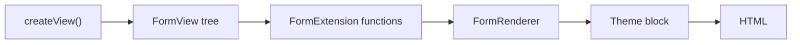

# Rendering Forms with Twig

!!! tip "In a nutshell"
    Les fonctions de form Twig transforment un form en HTML à n'importe quelle
    granularité, de `form(form)` jusqu'aux fonctions par partie
    `form_label`/`form_widget`. N'oubliez pas : `form_end` rend les champs
    restants — y compris le **token CSRF** caché — sauf si vous passez
    `render_rest: false`.

!!! example "Real-world analogy"
    Le rendu est l'**imprimerie** qui met en page votre formulaire papier vierge à
    partir d'une spécification (le `FormView`). `form(form)` imprime la page
    entière ; les fonctions granulaires (`form_row`, `form_label`, `form_widget`)
    vous laissent placer chaque champ à la main pour une mise en page sur mesure.
    `form_end`/`form_rest`, c'est l'imprimeur qui s'assure d'imprimer aussi les
    petites lignes en bas — les champs cachés et **CSRF** — pour que rien de ce que
    vous avez oublié de placer ne manque sur la page.

!!! abstract "Learning objectives"
    À la fin de ce chapitre, vous saurez :

    - [ ] Rendre un form entier avec `form()` et contrôler la mise en page avec `form_start`/`form_end`.
    - [ ] Rendre des champs de façon granulaire avec `form_row`, `form_widget`, `form_label`, `form_errors`, `form_help`.
    - [ ] Utiliser `form_rest` pour rendre les champs restants (y compris cachés/CSRF).

    **Syllabus:** `Forms → Rendering` ·
    **Level:** Advanced → Expert ·
    **Est. time:** 25 min ·
    **Prerequisites:** [Creating forms](creation.md) · [Templating](../twig/index.md)

---

## Theory

Les fonctions de form Twig transforment un `FormView` (l'instantané de rendu
issu de `createView()`) en HTML. Vous choisissez la granularité :

```php
// createView() produces the render-time FormView snapshot
$view = $form->createView();
assert($view instanceof \Symfony\Component\Form\FormView);

// In Twig you pass the form itself; Symfony calls createView() for you
return $this->render('contact/index.html.twig', ['form' => $form]);
```

| Fonction | Rend |
|---|---|
| `form(form)` | Le form entier (start, toutes les rows, end) |
| `form_start(form)` / `form_end(form)` | La balise `<form>` ouvrante/fermante |
| `form_row(field)` | Label + widget + erreurs + aide pour un champ |
| `form_label` / `form_widget` / `form_errors` / `form_help` | Une partie d'un champ |
| `form_rest(form)` | Tous les champs pas encore rendus (y compris cachés + CSRF) |

!!! question "Predict first"
    Vous rendez chaque champ visible à la main et terminez par
    `form_end(form, {'render_rest': false})`. Qu'est-ce qui disparaît en silence ?

??? note "Reveal"
    Les champs cachés — au premier chef le **`_token` CSRF**. `form_end` appelle
    `form_rest` par défaut pour les émettre ; avec `render_rest: false`, vous devez
    rendre `form_rest`/le token vous-même, sinon chaque soumission échoue à la
    validation CSRF.

## Deep Dive — how it works internally

### From `FormInterface` to `FormView`

Le rendu opère sur `Symfony\Component\Form\FormView`, produit par
`FormInterface::createView()`. Les fonctions Twig sont fournies par
`Symfony\Bridge\Twig\Extension\FormExtension`, qui délègue le rendu réel à un
`Symfony\Component\Form\FormRendererInterface`
(`Symfony\Bridge\Twig\Form\TwigRendererEngine`).

```php
// FormInterface::createView() builds the FormView tree
$view = $form->createView();

// Twig's FormExtension functions delegate to a FormRendererInterface,
// whose engine (TwigRendererEngine) loads the form theme templates
$html = $renderer->searchAndRenderBlock($view, 'widget');
```

Le renderer résout, pour chaque fonction + champ, un **bloc** dans le thème de
form actif (p. ex. `form_row`, `text_widget`) via la *hiérarchie de block
prefixes* du champ — traitée dans [theming](theming.md).

```twig
{# form_row on a text field resolves blocks by block-prefix hierarchy: #}
{{ form_row(form.name) }}
{# looks for 'text_row' first, falls back to the generic 'form_row';
   the widget inside resolves 'text_widget' → 'form_widget_simple' #}
```



!!! note "Source reference"
    `Symfony\Bridge\Twig\Extension\FormExtension` et `FormRenderer` —
    [symfony/symfony `8.0`](https://github.com/symfony/symfony/blob/8.0/src/Symfony/Bridge/Twig/Extension/FormExtension.php).

### `form_end` and `form_rest`

`form_end(form)` ferme la balise **et**, par défaut, appelle `form_rest` en
interne, rendant les champs que vous n'avez pas rendus manuellement — au premier
chef le **token CSRF caché** et tous les champs cachés. Passez
`{'render_rest': false}` pour supprimer ce comportement :

```twig
{{ form_end(form, {'render_rest': false}) }}
```

Si vous rendez les champs manuellement et définissez `render_rest: false`, vous
devez rendre `form_rest(form)` (ou le champ CSRF) vous-même, sinon la validation
CSRF échoue.

```twig
{{ form_start(form) }}
    {{ form_row(form.email) }}
    {{ form_rest(form) }}  {# emit the hidden CSRF token yourself #}
{{ form_end(form, {'render_rest': false}) }}
```

### The "rendered" flag

Chaque `FormView` porte un drapeau `isRendered()`. Appeler
`form_row`/`form_widget` le marque comme rendu, si bien que `form_rest` le
saute. C'est ainsi que rendu partiel + rest coexistent sans doublon.

```twig
{{ form_start(form) }}
{{ form_row(form.name) }}     {# this FormView now returns isRendered() = true #}
{{ form_widget(form.email) }} {# marked as rendered too #}
{{ form_rest(form) }}         {# skips rendered views — no duplication #}
{{ form_end(form) }}
```

## Configuration & code

=== "Whole form"

    ```twig
    {# templates/contact/index.html.twig #}
    {{ form(form) }}
    ```

=== "Manual layout"

    ```twig
    {{ form_start(form, {'attr': {'novalidate': 'novalidate'}}) }}
        {{ form_errors(form) }}                {# form-level errors #}

        {{ form_row(form.name) }}

        <div class="grid">
            {{ form_label(form.email) }}
            {{ form_widget(form.email, {'attr': {'placeholder': 'you@example.com'}}) }}
            {{ form_errors(form.email) }}
            {{ form_help(form.email) }}
        </div>

        {{ form_rest(form) }}                  {# hidden + CSRF fields #}
    {{ form_end(form) }}
    ```

=== "Controller"

    ```php
    <?php
    declare(strict_types=1);

    // Pass the FormInterface directly (Symfony calls createView() for you).
    return $this->render('contact/index.html.twig', ['form' => $form]);
    ```

## Best practices & anti-patterns

| ✅ À faire | ❌ À éviter |
|---|---|
| Utiliser `form_row` pour le cas courant | Écrire les balises `<input>` à la main |
| Garder `form_rest`/`form_end` pour émettre le CSRF | Rendre les champs mais perdre le CSRF |
| Définir les attributs via la variable `attr` | Coder en dur les attributs `name`/`id` |
| Thémer globalement, pas de bidouilles inline | Copier-coller le HTML du widget par template |

## When (not) to use it / alternatives

Les fonctions granulaires servent aux mises en page sur mesure. Pour un
front-end entièrement spécifique (hydraté par JS), vous pouvez ne rendre que
`form_start`/`form_widget` pour certains champs — mais émettez toujours le token
CSRF (via `form_rest` ou `csrf_token()`), ou désactivez explicitement le CSRF.

!!! danger "Certification traps"
    - `form_end` rend les champs restants **par défaut** ; supprimez ce
      comportement avec `render_rest: false` — et rendez alors le CSRF vous-même.
    - `form_row` = label + widget + erreurs + **aide** ; `form_widget` n'est que
      le contrôle.
    - `form_errors(form)` (racine) affiche les erreurs **au niveau du form** ;
      les erreurs par champ exigent `form_errors(form.field)`.
    - `form_label(field, 'Custom')` surcharge le texte du label en ligne.

!!! warning "Common mistakes"
    - Rendre les champs manuellement, définir `render_rest: false`, oublier le
      CSRF → "invalid token" à la soumission.
    - Passer des valeurs `form.vars` que vous n'avez pas définies ; les variables
      inconnues sont simplement vides.
    - Appeler `form(form.email)` — `form()` s'applique au form entier ; utilisez
      `form_row`/`form_widget` pour un champ.

## Exercises

1. **(Advanced)** Rendez un form manuellement avec une grille deux colonnes sur
   mesure, en vous assurant que le CSRF passe toujours à la soumission.
2. **(Expert)** Vous avez rendu chaque champ avec `form_row`, mais un champ caché
   manque dans le HTML. Pourquoi, et comment corriger ?

??? success "Solutions"

    **1.** Utilisez `form_start`, des `form_row` explicites dans votre balisage de
    grille, puis `form_rest(form)` avant `form_end(form, {'render_rest': false})`
    — ou laissez simplement `form_end` rendre le reste. `form_rest` émet le token
    CSRF caché.

    **2.** Vous n'avez jamais rendu ce champ et vous avez désactivé le reste (ou
    utilisé `render_rest: false` sur `form_end`). Ajoutez
    `{{ form_widget(form.theField) }}` ou rétablissez `form_rest`/le `form_end`
    par défaut.

## Certification questions

??? question "Q1. What does `form_row(form.email)` render?"
    - [ ] A. Only the `<input>`
    - [x] B. Label, widget, errors and help for that field ✅
    - [ ] C. The whole form
    - [ ] D. Just the label

    **Why:** `form_row` compose label + widget + erreurs + aide via le bloc de
    thème `field_row`/`*_row`.
    **Ref:** [Form rendering functions](https://symfony.com/doc/8.0/form/form_customization.html).

??? question "Q2. How is the CSRF token normally emitted in the HTML?"
    - [x] A. By `form_rest`, which `form_end` calls by default ✅
    - [ ] B. Only by writing `<input name="_token">` by hand
    - [ ] C. In `form_start`
    - [ ] D. It is never rendered in the form

    **Why:** Le champ CSRF est un enfant caché rendu par `form_rest` ; `form_end`
    déclenche `form_rest` sauf si `render_rest: false`.
    **Ref:** [CSRF protection](https://symfony.com/doc/8.0/security/csrf.html).

??? question "Q3. Which shows form-level (non-field) errors?"
    - [x] A. `form_errors(form)` ✅
    - [ ] B. `form_errors(form.name)`
    - [ ] C. `form_widget(form)`
    - [ ] D. `form_help(form)`

    **Why:** Passer la vue racine à `form_errors` rend les erreurs attachées au
    form lui-même (p. ex. issues d'une constraint au niveau de la classe).
    **Ref:** [Form errors](https://symfony.com/doc/8.0/forms.html).

## Key takeaways

- `form(form)` rend tout ; `form_start`/`form_end` encadrent les mises en page
  manuelles.
- `form_row` = label + widget + erreurs + aide ; les fonctions granulaires le
  décomposent.
- `form_end`/`form_rest` émettent les champs cachés + CSRF — ne les perdez
  jamais.
- Le rendu opère sur le `FormView` via le `FormRenderer` qui résout les blocs de
  thème.

## Last-minute revision

!!! tip "Cheat sheet"
    - `form_start(form, {attr:{...}})` / `form_end(form, {render_rest:false})`
    - `form_row / form_label / form_widget / form_errors / form_help`
    - `form_rest(form)` → cachés + CSRF.
    - Surcharger le label : `form_label(field, 'Text')`.
    - Passez le `FormInterface` ; Twig appelle `createView()`.

## Connections

- **Depends on:** [Creating forms](creation.md) — le rendu opère sur le `FormView` issu de `createView()` ; [Twig templating](../twig/index.md) fournit les fonctions.
- **Reused in:** [Theming](theming.md) — chaque fonction résout un bloc de thème via la hiérarchie de block prefixes.
- **Confused with:** [CSRF protection](csrf.md) — c'est `form_rest`/`form_end` qui émet réellement le token dans le HTML.

## Official References
- [Official Symfony docs — Form customization](https://symfony.com/doc/8.0/form/form_customization.html)
- [Official Symfony docs — Rendering forms](https://symfony.com/doc/8.0/forms.html)
- [Symfony source — Twig FormExtension](https://github.com/symfony/symfony/blob/8.0/src/Symfony/Bridge/Twig/Extension/FormExtension.php)

## Video references

!!! tip "Watch & learn"
    Ce sont des chaînes vidéo officielles, mises à jour en continu — cherchez-y
    "Symfony forms" pour consolider ce chapitre. Nous lions des chaînes stables
    plutôt que des vidéos individuelles pour que les références ne périment jamais.

    - [SymfonyCasts screencasts](https://symfonycasts.com/tracks/symfony) — tutoriels scénarisés à suivre en codant.
    - [Symfony official YouTube](https://www.youtube.com/@SymfonyOfficial) — conférences et keynotes SymfonyCon.
    - [Official docs for this topic](https://symfony.com/doc/8.0/form/form_customization.html) — certaines pages de la doc Symfony intègrent un screencast.

## Confidence check

Je suis prêt quand je peux :

- [ ] expliquer **pourquoi** `form_end`/`form_rest` doit émettre le champ CSRF caché
- [ ] rendre un form en entier ou de façon granulaire (`form_row`/`form_widget`/`form_label`) en Symfony 8
- [ ] déboguer un champ caché manquant causé par `render_rest: false`
- [ ] repérer la mauvaise réponse sur ce que `form_row` inclut (label + widget + erreurs + aide)
- [ ] expliquer comment le drapeau `isRendered()` fait coexister rendu partiel et `form_rest`

---

<small>Related: [Theming](theming.md) · [Creating forms](creation.md) ·
[CSRF protection](csrf.md)</small>
