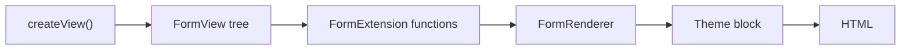

# Rendering Forms with Twig

!!! tip "In a nutshell"
    Twig form functions turn a form into HTML at any granularity, from `form(form)`
    to per-part `form_label`/`form_widget`. Don't forget: `form_end` renders the
    remaining fields — including the hidden **CSRF token** — unless you pass `render_rest: false`.

!!! example "Real-world analogy"
    Rendering is the **print shop** that lays out your blank paper form from a spec
    (the `FormView`). `form(form)` prints the whole page; the granular functions
    (`form_row`, `form_label`, `form_widget`) let you place each field by hand for a
    custom layout. `form_end`/`form_rest` is the shop making sure it also prints the
    small print at the bottom — the hidden and **CSRF** fields — so nothing you
    forgot to place is left off the page.

!!! abstract "Learning objectives"
    By the end of this chapter you can:

    - [ ] Render a whole form with `form()` and control layout with `form_start`/`form_end`.
    - [ ] Render fields granularly with `form_row`, `form_widget`, `form_label`, `form_errors`, `form_help`.
    - [ ] Use `form_rest` to render remaining (including hidden/CSRF) fields.

    **Syllabus:** `Forms → Rendering` ·
    **Level:** Advanced → Expert ·
    **Est. time:** 25 min ·
    **Prerequisites:** [Creating forms](creation.md) · [Templating](../twig/index.md)

---

## Theory

Twig form functions turn a `FormView` (the render-time snapshot from
`createView()`) into HTML. You choose the granularity:

| Function | Renders |
|---|---|
| `form(form)` | The entire form (start, all rows, end) |
| `form_start(form)` / `form_end(form)` | Opening/closing `<form>` tag |
| `form_row(field)` | Label + widget + errors + help for one field |
| `form_label` / `form_widget` / `form_errors` / `form_help` | One part of a field |
| `form_rest(form)` | All not-yet-rendered fields (incl. hidden + CSRF) |

## Deep Dive — how it works internally

### From `FormInterface` to `FormView`

Rendering operates on `Symfony\Component\Form\FormView`, produced by
`FormInterface::createView()`. The Twig functions are provided by
`Symfony\Bridge\Twig\Extension\FormExtension`, which delegates real rendering to
a `Symfony\Component\Form\FormRendererInterface`
(`Symfony\Bridge\Twig\Form\TwigRendererEngine`).

The renderer resolves, for each function + field, a **block** in the active form
theme (e.g. `form_row`, `text_widget`) using the field's *block prefix hierarchy*
— covered in [theming](theming.md).



!!! note "Source reference"
    `Symfony\Bridge\Twig\Extension\FormExtension` and `FormRenderer` —
    [symfony/symfony `8.0`](https://github.com/symfony/symfony/blob/8.0/src/Symfony/Bridge/Twig/Extension/FormExtension.php).

### `form_end` and `form_rest`

`form_end(form)` closes the tag **and** by default calls `form_rest` internally,
rendering any fields you did not render manually — crucially the **hidden CSRF
token** and any hidden fields. Pass `{'render_rest': false}` to suppress that:

```twig
{{ form_end(form, {'render_rest': false}) }}
```

If you render fields manually and set `render_rest: false`, you must render
`form_rest(form)` (or the CSRF field) yourself, or CSRF validation fails.

### The "rendered" flag

Each `FormView` has an `isRendered()` flag. Calling `form_row`/`form_widget`
marks it rendered so `form_rest` skips it. That is how partial + rest rendering
coexist without duplication.

## Configuration & code

=== "Whole form"

    ```twig
    {# templates/contact/index.html.twig #}
    {{ form(form) }}
    ```

=== "Manual layout"

    ```twig
    {{ form_start(form, {'attr': {'novalidate': 'novalidate'}}) }}
        {{ form_errors(form) }}                {# form-level errors #}

        {{ form_row(form.name) }}

        <div class="grid">
            {{ form_label(form.email) }}
            {{ form_widget(form.email, {'attr': {'placeholder': 'you@example.com'}}) }}
            {{ form_errors(form.email) }}
            {{ form_help(form.email) }}
        </div>

        {{ form_rest(form) }}                  {# hidden + CSRF fields #}
    {{ form_end(form) }}
    ```

=== "Controller"

    ```php
    <?php
    declare(strict_types=1);

    // Pass the FormInterface directly (Symfony calls createView() for you).
    return $this->render('contact/index.html.twig', ['form' => $form]);
    ```

## Best practices & anti-patterns

| ✅ Do | ❌ Avoid |
|---|---|
| Use `form_row` for the common case | Hand-writing `<input>` tags |
| Keep `form_rest`/`form_end` to emit CSRF | Rendering fields but dropping CSRF |
| Set attrs via the `attr` variable | Hard-coding `name`/`id` attributes |
| Theme globally, not inline hacks | Copy-pasting widget HTML per template |

## When (not) to use it / alternatives

Granular functions are for custom layouts. For a fully bespoke front-end
(hydrated by JS) you may render only `form_start`/`form_widget` for specific
fields — but always emit the CSRF token (via `form_rest` or `csrf_token()`), or
switch off CSRF explicitly.

!!! danger "Certification traps"
    - `form_end` renders remaining fields **by default**; suppress with
      `render_rest: false` — and then render CSRF yourself.
    - `form_row` = label + widget + errors + **help**; `form_widget` is the
      control only.
    - `form_errors(form)` (root) shows **form-level** errors; per-field errors
      need `form_errors(form.field)`.
    - `form_label(field, 'Custom')` overrides the label text inline.

!!! warning "Common mistakes"
    - Rendering fields manually, setting `render_rest: false`, forgetting CSRF →
      "invalid token" on submit.
    - Passing `form.vars` values you didn't define; unknown variables are just
      empty.
    - Calling `form(form.email)` — `form()` is for the whole form, use
      `form_row`/`form_widget` for a field.

## Exercises

1. **(Advanced)** Render a form manually with a custom two-column grid, ensuring
   CSRF still submits correctly.
2. **(Expert)** You rendered every field with `form_row` but a hidden field is
   missing from the HTML. Why, and what fixes it?

??? success "Solutions"

    **1.** Use `form_start`, explicit `form_row`s inside your grid markup, then
    `form_rest(form)` before `form_end(form, {'render_rest': false})` — or simply
    let `form_end` render the rest. `form_rest` emits the hidden CSRF token.

    **2.** You never rendered that field and you disabled the rest (or used
    `render_rest: false` on `form_end`). Add `{{ form_widget(form.theField) }}`
    or restore `form_rest`/default `form_end`.

## Certification questions

??? question "Q1. What does `form_row(form.email)` render?"
    - [ ] A. Only the `<input>`
    - [x] B. Label, widget, errors and help for that field ✅
    - [ ] C. The whole form
    - [ ] D. Just the label

    **Why:** `form_row` composes label + widget + errors + help via the
    `field_row`/`*_row` theme block.
    **Ref:** [Form rendering functions](https://symfony.com/doc/current/form/form_customization.html).

??? question "Q2. How is the CSRF token normally emitted in the HTML?"
    - [x] A. By `form_rest`, which `form_end` calls by default ✅
    - [ ] B. Only by writing `<input name="_token">` by hand
    - [ ] C. In `form_start`
    - [ ] D. It is never rendered in the form

    **Why:** The CSRF field is a hidden child rendered by `form_rest`; `form_end`
    triggers `form_rest` unless `render_rest: false`.
    **Ref:** [CSRF protection](https://symfony.com/doc/current/security/csrf.html).

??? question "Q3. Which shows form-level (non-field) errors?"
    - [x] A. `form_errors(form)` ✅
    - [ ] B. `form_errors(form.name)`
    - [ ] C. `form_widget(form)`
    - [ ] D. `form_help(form)`

    **Why:** Passing the root view to `form_errors` renders errors attached to
    the form itself (e.g. from a class-level constraint).
    **Ref:** [Form errors](https://symfony.com/doc/current/forms.html).

## Key takeaways

- `form(form)` renders everything; `form_start`/`form_end` bracket manual layouts.
- `form_row` = label + widget + errors + help; the granular functions split it.
- `form_end`/`form_rest` emit hidden + CSRF fields — never lose them.
- Rendering works on the `FormView` via `FormRenderer` resolving theme blocks.

## Last-minute revision

!!! tip "Cheat sheet"
    - `form_start(form, {attr:{...}})` / `form_end(form, {render_rest:false})`
    - `form_row / form_label / form_widget / form_errors / form_help`
    - `form_rest(form)` → hidden + CSRF.
    - Override label: `form_label(field, 'Text')`.
    - Pass the `FormInterface`; Twig calls `createView()`.

## Official References
- [Official Symfony docs — Form customization](https://symfony.com/doc/current/form/form_customization.html)
- [Official Symfony docs — Rendering forms](https://symfony.com/doc/current/forms.html)
- [Symfony source — Twig FormExtension](https://github.com/symfony/symfony/blob/8.0/src/Symfony/Bridge/Twig/Extension/FormExtension.php)

---

<small>Related: [Theming](theming.md) · [Creating forms](creation.md) ·
[CSRF protection](csrf.md)</small>
</content>
