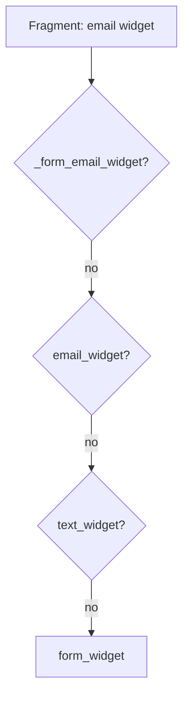

# Form Theming

!!! tip "In a nutshell"
    Un form theme est un ensemble de blocs Twig contrôlant le rendu de chaque
    fragment ; appliquez-le par template ou globalement. Piège d'examen : la recherche
    de blocs va du **plus spécifique → au moins spécifique**, et les thèmes intégrés
    Bootstrap/Foundation fournissent **uniquement le markup**, pas le CSS.

!!! example "Real-world analogy"
    Résoudre un bloc de form, c'est comme une réceptionniste qui cherche quelqu'un :
    elle essaie d'abord le nom complet unique (« Jane Doe, comptabilité, 3e étage »),
    puis le nom de famille, puis simplement le département, et enfin « n'importe quel
    employé » — la première entrée qui existe l'emporte. C'est pourquoi une surcharge
    pour un champ spécifique bat une surcharge pour tout un type de champ, qui bat
    elle-même le bloc fourre-tout. Et un thème Bootstrap intégré est comme un patron
    de couture : il façonne les coutures du vêtement (le markup) mais ne fournit
    aucun tissu — c'est à vous d'apporter l'étoffe (le CSS).

!!! abstract "Learning objectives"
    À la fin de ce chapitre, vous saurez :

    - [ ] Appliquer un form theme avec `` ou globalement dans la config.
    - [ ] Utiliser un thème intégré (par ex. `bootstrap_5_layout.html.twig`) comme **thème uniquement**.
    - [ ] Surcharger le bon bloc en vous appuyant sur l'ordre de **résolution des noms de blocs**.

    **Syllabus:** `Forms → Theming` ·
    **Level:** Advanced → Expert ·
    **Est. time:** 25 min ·
    **Prerequisites:** [Rendering forms](rendering.md)

---

## Theory

Un **form theme** est un template Twig composé de `` qui définissent
le rendu de chaque fragment de form. Le thème par défaut est
`form_div_layout.html.twig`. Les thèmes sont de la présentation pure — les thèmes
Bootstrap/Tailwind ne fournissent que le markup (aucun CSS/JS livré ; ce n'est pas
le rôle du composant Form, et les frameworks CSS sortent par ailleurs du cadre de
ce chapitre).

```twig
{# A theme is a set of Twig s; the default one is form_div_layout.html.twig #}



    <div class="field-row">
        {{ form_label(form) }}
        {{ form_widget(form) }}
    </div>

```

Vous appliquez un thème :

- **Par template** avec ``.
- **Globalement** via `twig.form_themes` dans `config/packages/twig.yaml`.

```yaml
# config/packages/twig.yaml — global themes via twig.form_themes
# (per template instead:  in the Twig file)
twig:
    form_themes:
        - 'form/fields.html.twig'
```

!!! question "Predict first"
    Un champ a le block prefix `rating` (parent `integer`). Vous définissez une
    surcharge `integer_widget` mais elle ne s'applique jamais, alors que
    `rating_widget` fonctionne. Pourquoi ?

??? note "Reveal"
    La recherche de blocs va du **plus spécifique → au moins spécifique**.
    `rating_widget` se situe au-dessus de `integer_widget` dans la chaîne de prefixes,
    il correspond donc en premier et `integer_widget` n'est jamais atteint. Surchargez
    `rating_widget`, ou supprimez-le pour retomber sur le suivant.

## Deep Dive — how it works internally

### Block-name resolution

Lors du rendu d'un fragment, le `FormRenderer` construit une liste de noms de
blocs candidats à partir de la **hiérarchie de block prefixes** du champ (le
`getBlockPrefix()` de chaque type en remontant la chaîne des parents) plus le
suffixe du fragment (`_widget`, `_label`, `_row`, `_errors`, `_help`). Il les
essaie du **plus spécifique → au moins spécifique**.

Exemple pour un champ `EmailType` nommé `email` :

```text
_form_email_widget      (unique: form id + field name)
email_widget            (field name)
email_widget            (block prefix: email)
text_widget             (parent block prefix)
form_widget_simple
form_widget
```

Le premier bloc qui existe l'emporte. C'est ce qui vous permet de surcharger un
seul champ (`_registration_email_widget`), tous les champs email
(`email_widget`) ou tous les widgets (`form_widget`).

```twig
{# One field of one form (most specific) #}
{{ block('form_widget_simple') }}

{# Every EmailType field #}
{{ block('form_widget_simple') }}

{# Every widget of every form (least specific) #}
{{ block('form_widget_simple') }}
```



!!! note "Source reference"
    Les block prefixes proviennent de `FormView.vars['block_prefixes']`, assemblés
    dans `ResolvedFormType::createView()` —
    [symfony/symfony `8.0`](https://github.com/symfony/symfony/blob/8.0/src/Symfony/Component/Form/ResolvedFormType.php).

### Where overrides can live

- **Dans le même fichier** que le form (``) — pratique,
  mais le template ne doit pas `extend` un autre template quand on utilise `_self`.
- **Dans un template de thème dédié** appliqué par vue ou globalement.
- **Via `use`** — à l'intérieur d'un thème, ``
  importe les blocs de base pour que vous ne surchargiez que ce qui change.

```twig
{# Same file as the form — this template must NOT extend another #}


{# Inside a dedicated theme: use imports base blocks, override only deltas #}


    <ul class="errors">{# custom markup #}</ul>

```

## Configuration & code

=== "Per-template theme"

    ```twig
    
    {{ form(form) }}
    ```

=== "Global (YAML)"

    ```yaml
    # config/packages/twig.yaml
    twig:
        form_themes:
            - 'bootstrap_5_layout.html.twig'
            - 'form/fields.html.twig'   # last wins on conflicts
    ```

=== "Overriding a block"

    ```twig
    {# templates/form/fields.html.twig #}
    

    {# Override the row wrapper for every field #}
    
        <div class="field">
            {{ form_label(form) }}
            {{ form_widget(form) }}
            {{ form_errors(form) }}
        </div>
    

    {# Override just email widgets #}
    
        
        {{ block('form_widget_simple') }}
    
    ```

## Best practices & anti-patterns

| ✅ Do | ❌ Avoid |
|---|---|
| Thématiser globalement pour un rendu homogène dans toute l'application | Copier le HTML du widget dans chaque template |
| Surcharger le bloc le plus spécifique nécessaire | Surcharger `form_widget` pour un seul champ |
| `` un thème de base, ne surcharger que les différences | Réécrire tout un thème de zéro |
| Garder plusieurs thèmes ordonnés (le dernier gagne) | Compter par accident sur l'ordre d'inclusion |

## When (not) to use it / alternatives

Utilisez un thème pour du markup structurel partagé entre plusieurs forms. Pour
les attributs d'un seul champ, passez-les en ligne via
`form_widget(field, {attr: {...}})` — moins coûteux qu'une surcharge de bloc.
Ne créez un thème entièrement personnalisé que lorsque le layout `div` par
défaut ne correspond pas au markup de votre framework.

!!! danger "Certification traps"
    - Les layouts intégrés Bootstrap/Foundation sont des **thèmes** — ils
      fournissent uniquement le markup, pas les assets CSS.
    - La recherche de blocs va du **spécifique → générique** ; `_formid_field_widget`
      bat `field_widget`, qui bat `text_widget`, qui bat `form_widget`.
    - `` exige que le template n'`extend` **pas**
      un autre template.
    - Thèmes multiples : le **dernier** de la liste gagne en cas de conflit de bloc.

!!! warning "Common mistakes"
    - Surcharger `form_widget` alors que vous visiez un seul champ, cassant
      ainsi tous les inputs.
    - Oublier `` et perdre tous les blocs de base.
    - S'attendre à ce qu'un thème Bootstrap charge le CSS de Bootstrap.

## Exercises

1. **(Advanced)** Appliquez `bootstrap_5_layout.html.twig` globalement, puis
   surchargez le bloc `form_row` pour tous les forms afin d'ajouter un wrapper
   `mb-3`.
2. **(Expert)** Un champ avec le block prefix `rating` (parent `integer`) ne
   prend pas en compte votre surcharge `integer_widget`, mais `rating_widget`
   fonctionne. Expliquez la résolution.

??? success "Solutions"

    **1.** Ajoutez les deux thèmes à `twig.form_themes` (Bootstrap en premier,
    votre fichier en dernier), puis dans votre thème
    `` et surchargez
    `` pour envelopper avec `class="mb-3"`.

    **2.** Le renderer essaie `rating_widget` *avant* `integer_widget` (plus
    spécifique dans la chaîne de block prefixes). Comme `rating_widget` existe,
    il gagne et `integer_widget` n'est jamais atteint. Surchargez
    `rating_widget`, ou supprimez-le pour retomber sur `integer_widget`.

## Certification questions

??? question "Q1. In which order are candidate blocks tried?"
    - [x] A. Most specific (unique id) → least specific (`form_widget`) ✅
    - [ ] B. Alphabetically
    - [ ] C. Least specific → most specific
    - [ ] D. Random per request

    **Why:** La hiérarchie des block prefixes est parcourue depuis le nom unique
    par champ jusqu'au bloc racine `form_*` ; le premier bloc existant est utilisé.
    **Ref:** [Form themes](https://symfony.com/doc/8.0/form/form_themes.html).

??? question "Q2. What does `bootstrap_5_layout.html.twig` provide?"
    - [ ] A. Bootstrap CSS and JS assets
    - [x] B. Twig blocks producing Bootstrap-compatible markup ✅
    - [ ] C. A PHP form type
    - [ ] D. CSRF protection

    **Why:** Les layouts intégrés sont des templates de thème (markup uniquement).
    C'est à vous de charger le framework CSS.
    **Ref:** [Bootstrap form theme](https://symfony.com/doc/8.0/form/bootstrap5.html).

??? question "Q3. When two global themes define the same block…"
    - [x] A. The last theme in the list wins ✅
    - [ ] B. The first wins
    - [ ] C. Twig throws an error
    - [ ] D. Both render

    **Why:** Les `twig.form_themes` sont appliqués dans l'ordre ; les entrées
    suivantes surchargent les précédentes.
    **Ref:** [Form themes docs](https://symfony.com/doc/8.0/form/form_themes.html).

## Key takeaways

- Un thème est un ensemble de blocs Twig ; le défaut est `form_div_layout.html.twig`.
- Appliquez-le via `` ou `twig.form_themes` (le dernier gagne).
- Recherche de blocs : id unique → nom du champ → block prefix → parent → `form_*`.
- Les layouts de frameworks intégrés sont des **thèmes de markup uniquement**.

## Last-minute revision

!!! tip "Cheat sheet"
    - `` · `_self` (pas d'`extend`).
    - Global : `twig.form_themes: [...]` (l'ordre compte).
    - Blocs : `{prefix}_row/_label/_widget/_errors/_help`.
    - `` pour hériter des blocs, ne surcharger que les différences.
    - Layout Bootstrap = markup, pas de CSS.

## Connections

- **Depends on:** [Rendering forms](rendering.md) — le theming personnalise les blocs que le renderer résout.
- **Reused in:** [Form types](types.md) — le `getBlockPrefix()` d'un type et sa chaîne de parents définissent les noms de blocs candidats.
- **Confused with:** [Twig templating](../twig/index.md) — les thèmes sont des blocs Twig ordinaires appliqués via `form_theme`/`twig.form_themes`, pas un moteur séparé.

## Official References
- [Official Symfony docs — Form themes](https://symfony.com/doc/8.0/form/form_themes.html)
- [Official Symfony docs — Bootstrap 5 form theme](https://symfony.com/doc/8.0/form/bootstrap5.html)
- [Symfony source — form_div_layout.html.twig](https://github.com/symfony/symfony/blob/8.0/src/Symfony/Bridge/Twig/Resources/views/Form/form_div_layout.html.twig)

## Video references

!!! tip "Watch & learn"
    Voici des chaînes vidéo officielles, mises à jour en continu — cherchez-y
    « Symfony forms » pour consolider ce chapitre. Nous lions des chaînes stables
    plutôt que des vidéos individuelles afin que les références ne périment jamais.

    - [SymfonyCasts screencasts](https://symfonycasts.com/tracks/symfony) — tutoriels scénarisés à suivre en codant.
    - [Symfony official YouTube](https://www.youtube.com/@SymfonyOfficial) — conférences et keynotes SymfonyCon.
    - [Official docs for this topic](https://symfony.com/doc/8.0/form/form_themes.html) — certaines pages de la doc Symfony intègrent un screencast.

## Confidence check

Je suis prêt quand je peux :

- [ ] expliquer **pourquoi** les thèmes séparent le markup de la logique des champs
- [ ] appliquer un thème par template et globalement dans Symfony 8
- [ ] déboguer une surcharge qui touche le mauvais bloc dans la chaîne de prefixes
- [ ] repérer la mauvaise réponse affirmant que le layout Bootstrap fournit le CSS
- [ ] expliquer l'ordre de résolution des noms de blocs, du spécifique au générique

---

<small>Related: [Rendering forms](rendering.md) · [Form types](types.md) ·
[Templating](../twig/index.md)</small>
