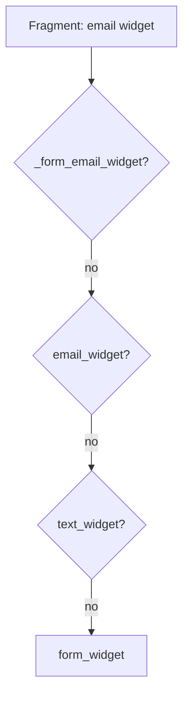

# Form Theming

!!! tip "In a nutshell"
    A form theme is a set of Twig blocks controlling how each fragment renders;
    apply one per template or globally. Exam hook: block lookup runs **most
    specific → least specific**, and built-in Bootstrap/Foundation themes ship **markup only**, not CSS.

!!! abstract "Learning objectives"
    By the end of this chapter you can:

    - [ ] Apply a form theme with `` or globally in config.
    - [ ] Use a built-in theme (e.g. `bootstrap_5_layout.html.twig`) as a **theme only**.
    - [ ] Override the right block using the **block-name resolution** order.

    **Syllabus:** `Forms → Theming` ·
    **Level:** Advanced → Expert ·
    **Est. time:** 25 min ·
    **Prerequisites:** [Rendering forms](rendering.md)

---

## Theory

A **form theme** is a Twig template of ``s that define how each form
fragment renders. The default theme is `form_div_layout.html.twig`. Themes are
pure presentation — Bootstrap/Tailwind themes are markup only (no CSS/JS shipped;
that is not the Form component's job and CSS frameworks are otherwise out of
scope here).

You apply a theme:

- **Per template** with ``.
- **Globally** via `twig.form_themes` in `config/packages/twig.yaml`.

## Deep Dive — how it works internally

### Block-name resolution

When rendering a fragment, the `FormRenderer` builds a list of candidate block
names from the field's **block prefix hierarchy** (each type's
`getBlockPrefix()` up the parent chain) plus the fragment suffix
(`_widget`, `_label`, `_row`, `_errors`, `_help`). It tries them
**most specific → least specific**.

Example for an `EmailType` field named `email`:

```text
_form_email_widget      (unique: form id + field name)
email_widget            (field name)
email_widget            (block prefix: email)
text_widget             (parent block prefix)
form_widget_simple
form_widget
```

The first block that exists wins. This is why you can override one field
(`_registration_email_widget`) or every email field (`email_widget`) or all
widgets (`form_widget`).



!!! note "Source reference"
    Block prefixes come from `FormView.vars['block_prefixes']`, assembled in
    `ResolvedFormType::createView()` —
    [symfony/symfony `8.0`](https://github.com/symfony/symfony/blob/8.0/src/Symfony/Component/Form/ResolvedFormType.php).

### Where overrides can live

- **Same file** as the form (``) — handy but the
  template must not `extend` another when using `_self`.
- **Dedicated theme template** applied per view or globally.
- **`use`** — inside a theme, `` imports
  base blocks so you override selectively.

## Configuration & code

=== "Per-template theme"

    ```twig
    
    {{ form(form) }}
    ```

=== "Global (YAML)"

    ```yaml
    # config/packages/twig.yaml
    twig:
        form_themes:
            - 'bootstrap_5_layout.html.twig'
            - 'form/fields.html.twig'   # last wins on conflicts
    ```

=== "Overriding a block"

    ```twig
    {# templates/form/fields.html.twig #}
    

    {# Override the row wrapper for every field #}
    
        <div class="field">
            {{ form_label(form) }}
            {{ form_widget(form) }}
            {{ form_errors(form) }}
        </div>
    

    {# Override just email widgets #}
    
        
        {{ block('form_widget_simple') }}
    
    ```

## Best practices & anti-patterns

| ✅ Do | ❌ Avoid |
|---|---|
| Theme globally for app-wide look | Copy widget HTML into every template |
| Override the most specific block needed | Overriding `form_widget` for one field |
| `` a base theme, override deltas | Rewriting a whole theme from scratch |
| Keep multiple themes ordered (last wins) | Relying on include order by accident |

## When (not) to use it / alternatives

Use a theme for structural markup shared across forms. For a single field's
attributes, pass them inline via `form_widget(field, {attr: {...}})` — cheaper
than a block override. Reach for a full custom theme only when the default
`div` layout does not fit your framework's markup.

!!! danger "Certification traps"
    - Built-in Bootstrap/Foundation layouts are **themes** — they ship markup
      only, not CSS assets.
    - Block lookup goes **specific → generic**; `_formid_field_widget` beats
      `field_widget` beats `text_widget` beats `form_widget`.
    - `` requires the template **not** to `extend`
      another.
    - Multiple themes: the **last** listed wins on a block clash.

!!! warning "Common mistakes"
    - Overriding `form_widget` when you meant one field, breaking every input.
    - Forgetting `` and losing all base blocks.
    - Expecting a Bootstrap theme to load Bootstrap's CSS.

## Exercises

1. **(Advanced)** Apply `bootstrap_5_layout.html.twig` globally, then override
   the `form_row` block for all forms to add a `mb-3` wrapper.
2. **(Expert)** A field with block prefix `rating` (parent `integer`) is not
   picking up your `integer_widget` override, but `rating_widget` works. Explain
   the resolution.

??? success "Solutions"

    **1.** Add both themes to `twig.form_themes` (Bootstrap first, your file
    last), then in your theme `` and
    override `` to wrap with `class="mb-3"`.

    **2.** The renderer tries `rating_widget` *before* `integer_widget` (more
    specific in the block-prefix chain). Since `rating_widget` exists, it wins and
    `integer_widget` is never reached. Override `rating_widget`, or remove it to
    fall through to `integer_widget`.

## Certification questions

??? question "Q1. In which order are candidate blocks tried?"
    - [x] A. Most specific (unique id) → least specific (`form_widget`) ✅
    - [ ] B. Alphabetically
    - [ ] C. Least specific → most specific
    - [ ] D. Random per request

    **Why:** The block-prefix hierarchy is walked from the unique per-field name
    down to the root `form_*` block; the first existing block is used.
    **Ref:** [Form themes](https://symfony.com/doc/current/form/form_themes.html).

??? question "Q2. What does `bootstrap_5_layout.html.twig` provide?"
    - [ ] A. Bootstrap CSS and JS assets
    - [x] B. Twig blocks producing Bootstrap-compatible markup ✅
    - [ ] C. A PHP form type
    - [ ] D. CSRF protection

    **Why:** Built-in layouts are theme templates (markup only). You still load
    the CSS framework yourself.
    **Ref:** [Bootstrap form theme](https://symfony.com/doc/current/form/bootstrap5.html).

??? question "Q3. When two global themes define the same block…"
    - [x] A. The last theme in the list wins ✅
    - [ ] B. The first wins
    - [ ] C. Twig throws an error
    - [ ] D. Both render

    **Why:** `twig.form_themes` are applied in order; later entries override
    earlier ones.
    **Ref:** [Form themes docs](https://symfony.com/doc/current/form/form_themes.html).

## Key takeaways

- A theme is a set of Twig blocks; default is `form_div_layout.html.twig`.
- Apply via `` or `twig.form_themes` (last wins).
- Block lookup: unique id → field name → block prefix → parent → `form_*`.
- Built-in framework layouts are **markup themes only**.

## Last-minute revision

!!! tip "Cheat sheet"
    - `` · `_self` (no `extend`).
    - Global: `twig.form_themes: [...]` (order matters).
    - Blocks: `{prefix}_row/_label/_widget/_errors/_help`.
    - `` to inherit blocks, override deltas.
    - Bootstrap layout = markup, not CSS.

## Official References
- [Official Symfony docs — Form themes](https://symfony.com/doc/current/form/form_themes.html)
- [Official Symfony docs — Bootstrap 5 form theme](https://symfony.com/doc/current/form/bootstrap5.html)
- [Symfony source — form_div_layout.html.twig](https://github.com/symfony/symfony/blob/8.0/src/Symfony/Bridge/Twig/Resources/views/Form/form_div_layout.html.twig)

---

<small>Related: [Rendering forms](rendering.md) · [Form types](types.md) ·
[Templating](../twig/index.md)</small>
</content>
