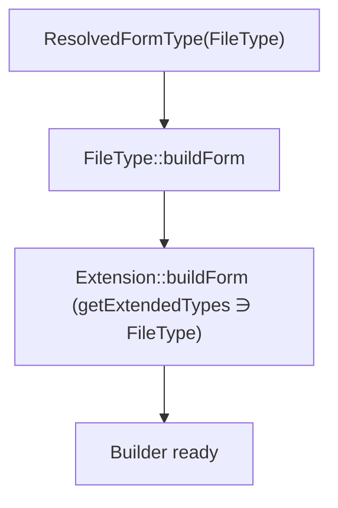

# Form Type Extensions

!!! tip "In a nutshell"
    Une type extension ajoute des options ou du comportement à des form types que
    vous ne possédez pas, sans en hériter. Réflexe d'examen : elle déclare ses
    cibles via la méthode statique **`getExtendedTypes()`** — il n'existe **pas
    d'attribut `#[AsFormTypeExtension]`**.

!!! example "Real-world analogy"
    Une type extension est comme une coque de téléphone qui ajoute un porte-carte
    et une meilleure prise en main à un téléphone que vous n'avez ni conçu ni
    fabriqué. Vous n'ouvrez jamais l'appareil pour le reconstruire (pas
    d'héritage) ; vous glissez simplement la coque, et elle indique clairement
    quels modèles elle équipe (`getExtendedTypes()`). Choisissez une coque
    étiquetée « compatible avec tous les téléphones jamais fabriqués »
    (`FormType::class`) et elle s'adapte à tous d'un coup — parfois ce que vous
    voulez, plus souvent une couverture maladroite et excessive.

!!! abstract "Learning objectives"
    À la fin de ce chapitre, vous saurez :

    - [ ] Créer une `AbstractTypeExtension` qui ajoute du comportement à des types existants.
    - [ ] Cibler un ou plusieurs types avec la méthode statique `getExtendedTypes()`.
    - [ ] Expliquer comment l'autoconfiguration l'enregistre via `form.type_extension`.

    **Syllabus:** `Forms → Type extensions` ·
    **Level:** Expert ·
    **Est. time:** 25 min ·
    **Prerequisites:** [Form types](types.md) · [Form events](events.md)

---

## Theory

Une **type extension** injecte des options et du comportement dans des form types
que vous ne possédez **pas** — sans en hériter. Une même extension peut cibler
plusieurs types à la fois. L'exemple canonique : ajouter une option
`help_inline`, ou une aide à l'upload de fichier, à chaque `FileType` de
l'application.

```php
// One extension adds a help_inline option to every FileType in the app
final class FileHelpExtension extends AbstractTypeExtension
{
    public static function getExtendedTypes(): iterable
    {
        return [FileType::class];   // the types to augment — no subclassing
    }

    public function configureOptions(OptionsResolver $resolver): void
    {
        $resolver->setDefaults(['help_inline' => null]);   // the new option
    }
}
```

Créez un type personnalisé quand vous avez besoin d'une *nouvelle identité de
champ* ; utilisez une type extension quand vous voulez *augmenter des types
existants* de façon uniforme.

!!! question "Predict first"
    Un collègue tente d'utiliser `#[AsFormTypeExtension]` pour enregistrer une
    extension sur `FileType`. Cet attribut existe-t-il ?

??? note "Reveal"
    Non. Les type extensions n'ont **aucun attribut dédié**. L'autoconfiguration
    tague tout service `FormTypeExtensionInterface` avec `form.type_extension` ;
    la méthode statique `getExtendedTypes(): iterable` nomme les types ciblés.

## Deep Dive — how it works internally

### The class

Étendez `Symfony\Component\Form\AbstractTypeExtension` (qui implémente
`Symfony\Component\Form\FormTypeExtensionInterface`). Elle expose les mêmes hooks
qu'un type — `configureOptions`, `buildForm`, `buildView`, `finishView` — **plus**
une méthode statique obligatoire :

```php
public static function getExtendedTypes(): iterable;
```

Elle retourne les FQCN des types à étendre (un tableau ou un generator).
Retourner un type de base comme `FormType::class` étend **tous** les forms (tous
les types en héritent) — puissant et dangereux.

### Where extensions run

Rappelez-vous de [types](types.md) : le `ResolvedFormType` assemble un type
**avec ses extensions applicables**. À chaque niveau de la hiérarchie de types,
le hook propre au type s'exécute d'abord, puis le hook correspondant de chaque
extension enregistrée. Le `buildForm` d'une extension s'exécute donc **après** le
`buildForm` du type étendu, ce qui vous permet d'ajouter des listeners ou des
champs par-dessus.

```php
// ResolvedFormType executes, per hierarchy level:
//   1. FileType::buildForm(...)          — the type's own hook first
//   2. FileHelpExtension::buildForm(...) — then each matching extension

public function buildForm(FormBuilderInterface $builder, array $options): void
{
    // runs AFTER FileType::buildForm — build on top of what the type set up
    $builder->addEventListener(FormEvents::POST_SUBMIT, $this->logUpload(...));
}
```



!!! note "Source reference"
    `Symfony\Component\Form\AbstractTypeExtension` et la correspondance dans
    `FormRegistry` —
    [symfony/symfony `8.0`](https://github.com/symfony/symfony/blob/8.0/src/Symfony/Component/Form/AbstractTypeExtension.php).

### Registration — no attribute needed

Avec l'**autoconfiguration des services** activée (par défaut), Symfony tague
automatiquement tout service implémentant `FormTypeExtensionInterface` avec
**`form.type_extension`** ; `getExtendedTypes()` indique au registry à quels
types l'attacher. Vous n'écrivez aucune config.

```php
// No YAML, no attribute — the interface IS the registration
final class FileHelpExtension extends AbstractTypeExtension // implements FormTypeExtensionInterface
{
    // autoconfiguration tags the service `form.type_extension`;
    // getExtendedTypes() tells the registry where to attach it
    public static function getExtendedTypes(): iterable
    {
        return [FileType::class];
    }
}
```

!!! warning "There is no `#[AsFormTypeExtension]` attribute"
    Contrairement aux listeners (`#[AsEventListener]`) ou aux commandes
    (`#[AsCommand]`), les form type extensions n'ont **aucun attribut dédié**
    dans le cœur de Symfony. L'enregistrement se fait par **interface +
    `getExtendedTypes()`** (autoconfiguration), ou par le tag manuel
    `form.type_extension` avec un `extended_type` quand l'autoconfiguration est
    désactivée.

### Manual tag (autoconfiguration disabled)

```yaml
# config/services.yaml
services:
    App\Form\Extension\ImageTypeExtension:
        tags:
            - { name: form.type_extension, extended_type: Symfony\Component\Form\Extension\Core\Type\FileType }
```

## Configuration & code

=== "Extension (PHP)"

    ```php
    <?php
    declare(strict_types=1);

    namespace App\Form\Extension;

    use Symfony\Component\Form\AbstractTypeExtension;
    use Symfony\Component\Form\Extension\Core\Type\FileType;
    use Symfony\Component\Form\FormInterface;
    use Symfony\Component\Form\FormView;
    use Symfony\Component\OptionsResolver\OptionsResolver;

    /** Adds a `help_download` option to every FileType. */
    final class FileHelpExtension extends AbstractTypeExtension
    {
        public static function getExtendedTypes(): iterable
        {
            return [FileType::class];
        }

        public function configureOptions(OptionsResolver $resolver): void
        {
            $resolver->setDefaults(['help_download' => null]);
            $resolver->setAllowedTypes('help_download', ['null', 'string']);
        }

        public function buildView(FormView $view, FormInterface $form, array $options): void
        {
            $view->vars['help_download'] = $options['help_download'];
        }
    }
    ```

=== "Extend many types"

    ```php
    <?php
    declare(strict_types=1);

    use Symfony\Component\Form\Extension\Core\Type\DateTimeType;
    use Symfony\Component\Form\Extension\Core\Type\DateType;
    use Symfony\Component\Form\Extension\Core\Type\TimeType;

    public static function getExtendedTypes(): iterable
    {
        // A generator works too (return type is iterable).
        yield DateType::class;
        yield TimeType::class;
        yield DateTimeType::class;
    }
    ```

=== "Twig usage"

    ```twig
    {# The new view var is available in a themed block #}
    
        {{ block('form_widget') }}
        
            <a href="{{ help_download }}">Download template</a>
        
    
    ```

## Best practices & anti-patterns

| ✅ À faire | ❌ À éviter |
|---|---|
| Étendre le type le plus restreint possible | Étendre `FormType` pour un ajustement de niche |
| Ajouter les options via `configureOptions` | Lire des clés `$options` non définies |
| S'appuyer sur l'autoconfiguration | Taguer à la main quand c'est inutile |
| Exposer des données à Twig via `buildView` | Muter les données du model dans une extension |

## When (not) to use it / alternatives

Utilisez une extension pour appliquer une préoccupation **à de nombreux
forms/types** (texte d'aide, attributs, un listener partagé). Si le comportement
ne concerne qu'un seul champ, configurez-le au `->add()` ou dans un type
personnalisé. N'utilisez pas une extension pour changer la conversion des
données — c'est le travail d'un [data transformer](data-transformers.md).

!!! danger "Certification traps"
    - `getExtendedTypes()` est **statique** et retourne un **iterable de FQCN**
      (tableau ou generator).
    - Étendre `FormType::class` s'applique à **tous** les forms — parfois voulu,
      souvent accidentel.
    - Il n'y a **pas d'attribut `#[AsFormTypeExtension]`** ; l'autoconfiguration
      tague les services `FormTypeExtensionInterface` avec `form.type_extension`.
    - Les hooks d'une extension s'exécutent **après** les hooks du type étendu.

!!! warning "Common mistakes"
    - Écrire `getExtendedType()` (singulier, supprimé) au lieu de
      `getExtendedTypes()`.
    - Oublier l'attribut de tag `extended_type` quand l'autoconfiguration est
      désactivée.
    - S'attendre à ce que l'extension s'exécute automatiquement pour les
      *sous-types* — elle s'attache aux types listés (et à leurs descendants via
      la hiérarchie), ciblez donc le bon niveau.

## Exercises

1. **(Expert)** Écrivez une type extension qui ajoute une option booléenne
   `readonly` à `TextType` et la reflète comme attribut HTML dans `buildView`.
2. **(Expert)** Expliquez l'effet et le risque de retourner `FormType::class`
   depuis `getExtendedTypes()`.

??? success "Solutions"

    **1.**

    ```php
    <?php
    declare(strict_types=1);

    namespace App\Form\Extension;

    use Symfony\Component\Form\AbstractTypeExtension;
    use Symfony\Component\Form\Extension\Core\Type\TextType;
    use Symfony\Component\Form\FormInterface;
    use Symfony\Component\Form\FormView;
    use Symfony\Component\OptionsResolver\OptionsResolver;

    final class ReadonlyTextExtension extends AbstractTypeExtension
    {
        public static function getExtendedTypes(): iterable
        {
            return [TextType::class];
        }

        public function configureOptions(OptionsResolver $resolver): void
        {
            $resolver->setDefaults(['readonly' => false]);
            $resolver->setAllowedTypes('readonly', 'bool');
        }

        public function buildView(FormView $view, FormInterface $form, array $options): void
        {
            if ($options['readonly']) {
                $view->vars['attr']['readonly'] = 'readonly';
            }
        }
    }
    ```

    **2.** Cela attache l'extension à *chaque* champ de form (tous les types
    descendent de `FormType`). Utile pour des préoccupations vraiment globales
    (par exemple un attribut universel), mais risqué : elle s'exécute partout,
    peut entrer en conflit avec des noms d'options et ajoute une surcharge à tous
    les forms. Préférez le type le plus restreint.

## Certification questions

??? question "Q1. Which method declares the types an extension applies to?"
    - [x] A. `public static function getExtendedTypes(): iterable` ✅
    - [ ] B. `public function getExtendedType(): string`
    - [ ] C. `public function configureOptions()`
    - [ ] D. `public function getParent(): string`

    **Why:** `getExtendedTypes()` (statique, iterable) a remplacé l'ancienne
    méthode au singulier `getExtendedType()`.
    **Ref:** [Form type extensions](https://symfony.com/doc/current/form/create_form_type_extension.html).

??? question "Q2. How is a type extension registered with autoconfiguration on?"
    - [x] A. Automatically, via the `form.type_extension` tag on `FormTypeExtensionInterface` services ✅
    - [ ] B. With an `#[AsFormTypeExtension]` attribute
    - [ ] C. By calling `addTypeExtension()` in a controller
    - [ ] D. It cannot be autoconfigured

    **Why:** Symfony tague automatiquement les implémentations ; aucun attribut
    n'existe pour cela.
    **Ref:** [Form type extensions docs](https://symfony.com/doc/current/form/create_form_type_extension.html).

??? question "Q3. What does returning `FormType::class` from `getExtendedTypes()` do?"
    - [x] A. Applies the extension to every form type ✅
    - [ ] B. Disables the extension
    - [ ] C. Applies it only to the root form
    - [ ] D. Throws an exception

    **Why:** Tous les types descendent de `FormType`, donc l'extension s'attache
    à tous.
    **Ref:** [Form type extensions docs](https://symfony.com/doc/current/form/create_form_type_extension.html).

## Key takeaways

- Une type extension augmente des types existants sans héritage ; une même classe
  peut cibler plusieurs types.
- Étendez `AbstractTypeExtension` ; implémentez la statique
  `getExtendedTypes(): iterable`.
- L'autoconfiguration la tague `form.type_extension` — **aucun attribut**
  n'existe.
- Les hooks de l'extension s'exécutent après ceux du type étendu ;
  `FormType::class` = tous les forms.

## Last-minute revision

!!! tip "Cheat sheet"
    - `class X extends AbstractTypeExtension`.
    - `public static function getExtendedTypes(): iterable` → `[FooType::class]`.
    - Hooks : `configureOptions/buildForm/buildView/finishView`.
    - Enregistrement : autoconfig → `form.type_extension` ; le tag manuel exige
      `extended_type`.
    - Pas de `#[AsFormTypeExtension]` ; `getExtendedType()` (singulier) a disparu.

## Connections

- **Depends on:** [Form types](types.md) — le `ResolvedFormType` assemble un type *avec* ses extensions applicables.
- **Reused in:** [Theming](theming.md) — une variable de `buildView` ajoutée par une extension est consommée dans un block de thème.
- **Confused with:** [Data transformers](data-transformers.md) — les extensions augmentent options/comportement, pas la conversion des valeurs.

## Official References
- [Official Symfony docs — Create a form type extension](https://symfony.com/doc/current/form/create_form_type_extension.html)
- [Symfony source — AbstractTypeExtension](https://github.com/symfony/symfony/blob/8.0/src/Symfony/Component/Form/AbstractTypeExtension.php)

## Video references

!!! tip "Watch & learn"
    Voici des chaînes vidéo officielles, mises à jour en continu — cherchez-y
    « Symfony forms » pour consolider ce chapitre. Nous référençons des chaînes
    stables plutôt que des vidéos individuelles pour que les liens ne pourrissent
    jamais.

    - [SymfonyCasts screencasts](https://symfonycasts.com/tracks/symfony) — tutoriels scénarisés à suivre en codant.
    - [Symfony official YouTube](https://www.youtube.com/@SymfonyOfficial) — conférences et keynotes SymfonyCon.
    - [Official docs for this topic](https://symfony.com/doc/current/form/create_form_type_extension.html) — certaines pages de la doc Symfony intègrent un screencast.

## Confidence check

Je suis prêt quand je peux :

- [ ] expliquer **pourquoi** une extension vaut mieux qu'un héritage pour augmenter des types que je ne possède pas
- [ ] écrire une `AbstractTypeExtension` avec la statique `getExtendedTypes()` en Symfony 8
- [ ] déboguer une extension qui ne s'exécute jamais (`getExtendedType` au singulier, tag manquant)
- [ ] repérer la mauvaise réponse qui invente `#[AsFormTypeExtension]`
- [ ] expliquer quand les hooks d'une extension s'exécutent par rapport à ceux du type étendu

---

<small>Related: [Form types](types.md) · [Form events](events.md) ·
[Theming](theming.md)</small>
