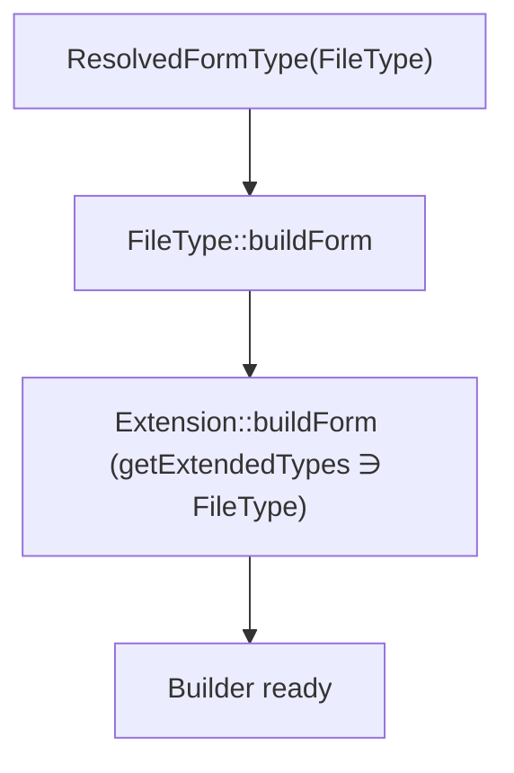

# Form Type Extensions

!!! tip "In a nutshell"
    A type extension adds options or behaviour to form types you do not own,
    without subclassing them. Exam hook: it declares its targets with the static
    **`getExtendedTypes()`** — there is **no `#[AsFormTypeExtension]` attribute**.

!!! example "Real-world analogy"
    A type extension is like a phone case that adds a card slot and a grip to a phone
    you didn't design or manufacture. You never crack open and rebuild the handset
    (no subclassing); you just slip the case on, and it clearly states which models it
    fits (`getExtendedTypes()`). Pick a case labelled "fits every phone ever made"
    (`FormType::class`) and it snaps onto all of them at once — occasionally what you
    want, more often a clumsy overreach.

!!! abstract "Learning objectives"
    By the end of this chapter you can:

    - [ ] Create an `AbstractTypeExtension` that adds behaviour to existing types.
    - [ ] Target one or many types with the static `getExtendedTypes()`.
    - [ ] Explain how autoconfiguration registers it via `form.type_extension`.

    **Syllabus:** `Forms → Type extensions` ·
    **Level:** Expert ·
    **Est. time:** 25 min ·
    **Prerequisites:** [Form types](types.md) · [Form events](events.md)

---

## Theory

A **type extension** injects options and behaviour into form types you do **not**
own — without subclassing them. One extension can target many types at once. The
canonical example: add an `help_inline` option, or a file-upload helper, to every
`FileType` in the app.

Create a custom type when you need a *new field identity*; use a type extension
when you want to *augment existing types* uniformly.

!!! question "Predict first"
    A teammate reaches for `#[AsFormTypeExtension]` to register an extension on
    `FileType`. Does that attribute exist?

??? note "Reveal"
    No. Type extensions have **no dedicated attribute**. Autoconfiguration tags any
    `FormTypeExtensionInterface` service with `form.type_extension`; the static
    `getExtendedTypes(): iterable` names the target types.

## Deep Dive — how it works internally

### The class

Extend `Symfony\Component\Form\AbstractTypeExtension` (implements
`Symfony\Component\Form\FormTypeExtensionInterface`). It exposes the same hooks as
a type — `configureOptions`, `buildForm`, `buildView`, `finishView` — **plus** one
required static method:

```php
public static function getExtendedTypes(): iterable;
```

It returns the FQCNs of the types to extend (an array or a generator). Returning a
base type like `FormType::class` extends **every** form (all types inherit from
it) — powerful and dangerous.

### Where extensions run

Recall from [types](types.md): the `ResolvedFormType` bundles a type **with its
applicable extensions**. At each level of the type hierarchy, the type's own hook
runs first, then each registered extension's matching hook. So an extension's
`buildForm` runs **after** the extended type's `buildForm`, letting you add
listeners or fields on top.



!!! note "Source reference"
    `Symfony\Component\Form\AbstractTypeExtension` and `FormRegistry` matching —
    [symfony/symfony `8.0`](https://github.com/symfony/symfony/blob/8.0/src/Symfony/Component/Form/AbstractTypeExtension.php).

### Registration — no attribute needed

With **service autoconfiguration** enabled (default), Symfony auto-tags any
service implementing `FormTypeExtensionInterface` with **`form.type_extension`**;
`getExtendedTypes()` tells the registry which types to attach it to. You write no
config.

!!! warning "There is no `#[AsFormTypeExtension]` attribute"
    Unlike listeners (`#[AsEventListener]`) or commands (`#[AsCommand]`), form type
    extensions have **no dedicated attribute** in core Symfony. Registration is by
    **interface + `getExtendedTypes()`** (autoconfiguration), or by the manual
    `form.type_extension` tag with an `extended_type` when autoconfiguration is
    off.

### Manual tag (autoconfiguration disabled)

```yaml
# config/services.yaml
services:
    App\Form\Extension\ImageTypeExtension:
        tags:
            - { name: form.type_extension, extended_type: Symfony\Component\Form\Extension\Core\Type\FileType }
```

## Configuration & code

=== "Extension (PHP)"

    ```php
    <?php
    declare(strict_types=1);

    namespace App\Form\Extension;

    use Symfony\Component\Form\AbstractTypeExtension;
    use Symfony\Component\Form\Extension\Core\Type\FileType;
    use Symfony\Component\Form\FormInterface;
    use Symfony\Component\Form\FormView;
    use Symfony\Component\OptionsResolver\OptionsResolver;

    /** Adds a `help_download` option to every FileType. */
    final class FileHelpExtension extends AbstractTypeExtension
    {
        public static function getExtendedTypes(): iterable
        {
            return [FileType::class];
        }

        public function configureOptions(OptionsResolver $resolver): void
        {
            $resolver->setDefaults(['help_download' => null]);
            $resolver->setAllowedTypes('help_download', ['null', 'string']);
        }

        public function buildView(FormView $view, FormInterface $form, array $options): void
        {
            $view->vars['help_download'] = $options['help_download'];
        }
    }
    ```

=== "Extend many types"

    ```php
    <?php
    declare(strict_types=1);

    use Symfony\Component\Form\Extension\Core\Type\DateTimeType;
    use Symfony\Component\Form\Extension\Core\Type\DateType;
    use Symfony\Component\Form\Extension\Core\Type\TimeType;

    public static function getExtendedTypes(): iterable
    {
        // A generator works too (return type is iterable).
        yield DateType::class;
        yield TimeType::class;
        yield DateTimeType::class;
    }
    ```

=== "Twig usage"

    ```twig
    {# The new view var is available in a themed block #}
    
        {{ block('form_widget') }}
        
            <a href="{{ help_download }}">Download template</a>
        
    
    ```

## Best practices & anti-patterns

| ✅ Do | ❌ Avoid |
|---|---|
| Extend the narrowest type you need | Extending `FormType` for a niche tweak |
| Add options via `configureOptions` | Reading undefined `$options` keys |
| Rely on autoconfiguration | Hand-tagging when it's unnecessary |
| Expose data to Twig via `buildView` | Mutating model data in an extension |

## When (not) to use it / alternatives

Use an extension to apply a concern **across many forms/types** (help text,
attributes, a shared listener). If the behaviour belongs to one field only,
configure it at `->add()` or in a custom type. Do not use an extension to change
data conversion — that is a [data transformer](data-transformers.md)'s job.

!!! danger "Certification traps"
    - `getExtendedTypes()` is **static** and returns an **iterable of FQCNs**
      (array or generator).
    - Extending `FormType::class` applies to **every** form — intended sometimes,
      accidental often.
    - There is **no `#[AsFormTypeExtension]` attribute**; autoconfiguration tags
      `FormTypeExtensionInterface` services with `form.type_extension`.
    - An extension's hooks run **after** the extended type's own hooks.

!!! warning "Common mistakes"
    - Writing `getExtendedType()` (singular, removed) instead of
      `getExtendedTypes()`.
    - Forgetting the `extended_type` tag attribute when autoconfiguration is off.
    - Expecting the extension to run for *subtypes* automatically — it attaches to
      the listed types (and their descendants via the hierarchy), so target the
      right level.

## Exercises

1. **(Expert)** Write a type extension that adds a boolean `readonly` option to
   `TextType` and reflects it as an HTML attribute in `buildView`.
2. **(Expert)** Explain the effect and risk of returning `FormType::class` from
   `getExtendedTypes()`.

??? success "Solutions"

    **1.**

    ```php
    <?php
    declare(strict_types=1);

    namespace App\Form\Extension;

    use Symfony\Component\Form\AbstractTypeExtension;
    use Symfony\Component\Form\Extension\Core\Type\TextType;
    use Symfony\Component\Form\FormInterface;
    use Symfony\Component\Form\FormView;
    use Symfony\Component\OptionsResolver\OptionsResolver;

    final class ReadonlyTextExtension extends AbstractTypeExtension
    {
        public static function getExtendedTypes(): iterable
        {
            return [TextType::class];
        }

        public function configureOptions(OptionsResolver $resolver): void
        {
            $resolver->setDefaults(['readonly' => false]);
            $resolver->setAllowedTypes('readonly', 'bool');
        }

        public function buildView(FormView $view, FormInterface $form, array $options): void
        {
            if ($options['readonly']) {
                $view->vars['attr']['readonly'] = 'readonly';
            }
        }
    }
    ```

    **2.** It attaches the extension to *every* form field (all types descend from
    `FormType`). Useful for truly global concerns (e.g. a universal attribute), but
    risky: it runs everywhere, can clash with option names, and adds overhead to
    all forms. Prefer the narrowest type.

## Certification questions

??? question "Q1. Which method declares the types an extension applies to?"
    - [x] A. `public static function getExtendedTypes(): iterable` ✅
    - [ ] B. `public function getExtendedType(): string`
    - [ ] C. `public function configureOptions()`
    - [ ] D. `public function getParent(): string`

    **Why:** `getExtendedTypes()` (static, iterable) replaced the old singular
    `getExtendedType()`.
    **Ref:** [Form type extensions](https://symfony.com/doc/current/form/create_form_type_extension.html).

??? question "Q2. How is a type extension registered with autoconfiguration on?"
    - [x] A. Automatically, via the `form.type_extension` tag on `FormTypeExtensionInterface` services ✅
    - [ ] B. With an `#[AsFormTypeExtension]` attribute
    - [ ] C. By calling `addTypeExtension()` in a controller
    - [ ] D. It cannot be autoconfigured

    **Why:** Symfony auto-tags implementers; no attribute exists for this.
    **Ref:** [Form type extensions docs](https://symfony.com/doc/current/form/create_form_type_extension.html).

??? question "Q3. What does returning `FormType::class` from `getExtendedTypes()` do?"
    - [x] A. Applies the extension to every form type ✅
    - [ ] B. Disables the extension
    - [ ] C. Applies it only to the root form
    - [ ] D. Throws an exception

    **Why:** All types descend from `FormType`, so the extension attaches to all
    of them.
    **Ref:** [Form type extensions docs](https://symfony.com/doc/current/form/create_form_type_extension.html).

## Key takeaways

- A type extension augments existing types without subclassing; one class can
  target many types.
- Extend `AbstractTypeExtension`; implement static `getExtendedTypes(): iterable`.
- Autoconfiguration tags it `form.type_extension` — **no attribute** exists.
- Extension hooks run after the extended type's hooks; `FormType::class` = all
  forms.

## Last-minute revision

!!! tip "Cheat sheet"
    - `class X extends AbstractTypeExtension`.
    - `public static function getExtendedTypes(): iterable` → `[FooType::class]`.
    - Hooks: `configureOptions/buildForm/buildView/finishView`.
    - Register: autoconfig → `form.type_extension`; manual tag needs
      `extended_type`.
    - No `#[AsFormTypeExtension]`; `getExtendedType()` (singular) is gone.

## Connections

- **Depends on:** [Form types](types.md) — the `ResolvedFormType` bundles a type *with* its applicable extensions.
- **Reused in:** [Theming](theming.md) — a `buildView` var added by an extension is consumed in a themed block.
- **Confused with:** [Data transformers](data-transformers.md) — extensions augment options/behaviour, not value conversion.

## Official References
- [Official Symfony docs — Create a form type extension](https://symfony.com/doc/current/form/create_form_type_extension.html)
- [Symfony source — AbstractTypeExtension](https://github.com/symfony/symfony/blob/8.0/src/Symfony/Component/Form/AbstractTypeExtension.php)

## Confidence check

I'm ready when I can:

- [ ] explain **why** an extension beats subclassing to augment types you don't own
- [ ] write an `AbstractTypeExtension` with static `getExtendedTypes()` in Symfony 8
- [ ] debug an extension that never runs (singular `getExtendedType`, missing tag)
- [ ] spot the wrong answer inventing `#[AsFormTypeExtension]`
- [ ] explain when an extension's hooks run relative to the extended type's hooks

---

<small>Related: [Form types](types.md) · [Form events](events.md) ·
[Theming](theming.md)</small>
