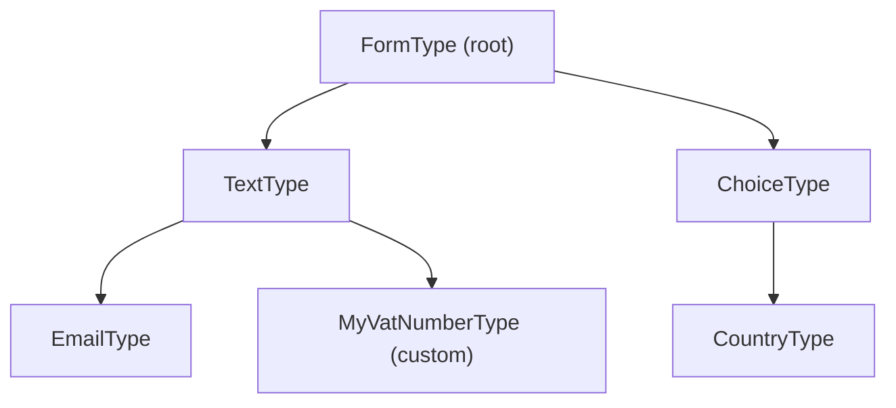

# Form Types & the Type Hierarchy

!!! tip "In a nutshell"
    Chaque champ est un form d'un certain *type*, et les types héritent le long
    d'une chaîne jusqu'au `FormType` racine. Retenez : `getParent()` retourne une
    **chaîne de classe** (FQCN), le FQCN est l'identifiant du type (pas de
    `getName()`), et les hooks du parent s'exécutent avant ceux de l'enfant.

!!! example "Real-world analogy"
    Les types sont des **modèles de formulaires standardisés qui héritent de
    modèles maîtres**. Un formulaire spécialisé (un champ de numéro de TVA) part
    d'un modèle générique de champ texte et y appose quelques règles
    supplémentaires ; ce modèle s'appuie à son tour sur la mise en page de base de
    tout le bureau (`FormType`). Les règles de chaque couche s'appliquent de
    l'extérieur vers l'intérieur, si bien que votre spécialisation n'écrit que le
    **delta**, pas toute la page depuis zéro.

!!! abstract "Learning objectives"
    À la fin de ce chapitre, vous saurez :

    - [ ] Distinguer les types intégrés des types personnalisés et situer n'importe quel type dans la hiérarchie.
    - [ ] Utiliser `getParent()` pour hériter d'un comportement et expliquer comment un `ResolvedFormType` est construit.
    - [ ] Déclarer et valider les options d'un type avec `OptionsResolver`.

    **Syllabus:** `Forms → Form types` ·
    **Level:** Advanced → Expert ·
    **Est. time:** 30 min ·
    **Prerequisites:** [Creating forms](creation.md)

---

## Theory

Chaque champ *est* un form, et chaque form est une instance d'un certain
**type**. Les types forment une chaîne d'héritage : votre type personnalisé
déclare un **parent**, qui déclare le sien, jusqu'au `FormType` racine. Les
comportements et les options s'accumulent le long de la chaîne.

- Les **types intégrés** vivent dans
  `Symfony\Component\Form\Extension\Core\Type\*` (p. ex. `TextType`, `ChoiceType`).
- Les **types personnalisés** étendent `AbstractType` et définissent
  généralement `getParent()`.

La racine commune est `Symfony\Component\Form\Extension\Core\Type\FormType`, et
la base commune des *champs* est `TextType` pour les entrées scalaires.

!!! question "Predict first"
    Le `getParent()` de votre type personnalisé retourne `TextType::class`. Dans
    quel ordre s'exécutent les `configureOptions`/`buildForm` du parent et de
    l'enfant — et que retourne réellement `getParent()` ?

??? note "Reveal"
    **Le parent d'abord, puis l'enfant.** Le `ResolvedFormType` parcourt la chaîne
    du haut vers le bas, si bien que l'enfant voit les valeurs par défaut du parent
    déjà posées et n'écrit que le delta. `getParent()` retourne une **chaîne de
    classe** (FQCN), jamais une instance.

## Deep Dive — how it works internally

### The hierarchy



`getParent()` retourne le FQCN du type parent (par défaut `FormType`). Retournez
un type intégré pour hériter de ses `buildForm`, `buildView`, transformers et
options — vous n'écrivez que le delta.

### `ResolvedFormType` — how a type is "resolved"

Un type brut n'est pas utilisable seul. Le
`Symfony\Component\Form\FormRegistry` enveloppe chaque type dans un
`Symfony\Component\Form\ResolvedFormType` qui capture :

- l'instance du type,
- sa **chaîne de parents entièrement résolue**,
- toutes les **type extensions** qui s'appliquent (voir [type extensions](type-extensions.md)).

Lors de la construction d'un form, le type résolu invoque, **parent → enfant** :
`configureOptions` (fusionné dans un seul `OptionsResolver`), puis `buildForm`,
puis à la création de la vue `buildView` et `finishView`. Les hooks de chaque
type extension s'exécutent **après** ceux du type lui-même à chaque niveau.

!!! note "Source reference"
    `ResolvedFormType::buildForm()` et `FormRegistry::resolveType()` —
    [symfony/symfony `8.0`](https://github.com/symfony/symfony/blob/8.0/src/Symfony/Component/Form/ResolvedFormType.php).

### Option resolution

`configureOptions(OptionsResolver $resolver)` est l'endroit où vous :

- `setDefaults([...])` — valeurs par défaut ;
- `setRequired([...])` — options que les appelants doivent passer ;
- `setAllowedTypes('opt', 'string')` / `setAllowedValues(...)` — validation ;
- `setNormalizer('opt', fn ($opts, $value) => ...)` — dérivez une option d'une
  autre ;
- `setDeprecated(...)` — marquez une option comme dépréciée.

Comme le `configureOptions` du parent s'exécute d'abord, un enfant peut
*surcharger* une valeur par défaut du parent et référencer l'option du parent
dans un normalizer.

### Type discovery & DI

Les types personnalisés sont enregistrés automatiquement : le FrameworkBundle
autoconfigure les classes implémentant `FormTypeInterface` avec le tag
`form.type` ; vous pouvez donc injecter des services dans le constructeur d'un
type, et il est disponible par son FQCN. Il n'y a **plus** de `getName()` — le
FQCN est l'identifiant et `getBlockPrefix()` nomme le bloc Twig.

## Configuration & code

=== "Custom type via getParent"

    ```php
    <?php
    declare(strict_types=1);

    namespace App\Form\Type;

    use Symfony\Component\Form\AbstractType;
    use Symfony\Component\Form\Extension\Core\Type\TextType;
    use Symfony\Component\OptionsResolver\OptionsResolver;

    /** A trimmed, uppercased VAT number field built on TextType. */
    final class VatNumberType extends AbstractType
    {
        public function configureOptions(OptionsResolver $resolver): void
        {
            $resolver->setDefaults([
                'invalid_message' => 'Please enter a valid VAT number.',
            ]);
        }

        public function getParent(): string
        {
            return TextType::class;
        }
    }
    ```

=== "OptionsResolver features"

    ```php
    <?php
    declare(strict_types=1);

    use Symfony\Component\OptionsResolver\OptionsResolver;

    public function configureOptions(OptionsResolver $resolver): void
    {
        $resolver->setDefaults(['multiple' => false, 'expanded' => false]);
        $resolver->setAllowedTypes('multiple', 'bool');
        $resolver->setRequired('choices');
        $resolver->setNormalizer(
            'expanded',
            static fn (\Symfony\Component\OptionsResolver\Options $o, bool $v): bool
                => $v && !$o['multiple'] ? true : $v,
        );
    }
    ```

## Best practices & anti-patterns

| ✅ À faire | ❌ À éviter |
|---|---|
| Étendre le type intégré le plus proche via `getParent` | Ré-implémenter `TextType` de zéro |
| Valider les options avec allowed types/values | Faire aveuglément confiance aux `$options` bruts |
| Injecter des services dans les types personnalisés | Des accès statiques/globaux dans `buildForm` |
| Référencer le FQCN comme identifiant du type | Chercher `getName()` |

## When (not) to use it / alternatives

Créez un type personnalisé quand une forme de champ revient régulièrement (un
champ montant, un champ TVA). Si vous devez seulement ajuster un type *existant*
sur de nombreux forms sans nouvelle identité de champ, préférez une **type
extension** ([type-extensions](type-extensions.md)). Pour un besoin ponctuel,
configurez simplement les options au moment du `->add()`.

!!! danger "Certification traps"
    - `getParent()` retourne une **chaîne de classe**, pas une instance.
    - Les `configureOptions`/`buildForm` du parent s'exécutent **avant** ceux de
      l'enfant ; l'enfant voit les valeurs par défaut du parent déjà posées.
    - Les types sont identifiés par leur **FQCN** ; `getName()` n'existe plus.
    - Un `ResolvedFormType` regroupe le type **plus ses extensions** — les
      extensions ne sont pas appliquées au cas par cas, instance par instance.

!!! warning "Common mistakes"
    - Retourner `new TextType()` depuis `getParent()` au lieu de
      `TextType::class`.
    - Ajouter des champs dans un type dont le parent est un type scalaire comme
      `TextType` (les types scalaires ne sont pas compound — mettez le parent à
      `FormType` pour un type personnalisé compound).

## Exercises

1. **(Advanced)** Construisez un `PercentageType` au-dessus de `NumberType` avec
   `scale` à 2 par défaut et un `invalid_message` parlant.
2. **(Expert)** Expliquez pourquoi des options de `ChoiceType` comme
   `expanded`/`multiple` changent le *widget rendu* (checkbox/radio vs select)
   sans nouveau type.

??? success "Solutions"

    **1.**

    ```php
    <?php
    declare(strict_types=1);

    namespace App\Form\Type;

    use Symfony\Component\Form\AbstractType;
    use Symfony\Component\Form\Extension\Core\Type\NumberType;
    use Symfony\Component\OptionsResolver\OptionsResolver;

    final class PercentageType extends AbstractType
    {
        public function configureOptions(OptionsResolver $resolver): void
        {
            $resolver->setDefaults([
                'scale' => 2,
                'invalid_message' => 'Enter a number between 0 and 100.',
            ]);
        }

        public function getParent(): string
        {
            return NumberType::class;
        }
    }
    ```

    **2.** `ChoiceType::buildView()` lit `expanded`/`multiple` et définit des
    variables de vue ; le bloc Twig `choice_widget` bifurque dessus pour rendre un
    `<select>`, ou des checkboxes/radios dépliées. Un seul type résolu, plusieurs
    widgets — ce sont les options qui pilotent la vue, pas la classe.

## Certification questions

??? question "Q1. What does `getParent()` return?"
    - [ ] A. A `FormBuilderInterface`
    - [x] B. The parent type's fully-qualified class name ✅
    - [ ] C. A `ResolvedFormType` instance
    - [ ] D. `null` for all custom types

    **Why:** `getParent()` retourne une chaîne de classe (par défaut
    `FormType::class`) ; le registre la résout en chaîne de parents.
    **Ref:** [Creating a custom type](https://symfony.com/doc/current/form/create_custom_field_type.html).

??? question "Q2. Which object bundles a type with its parents and extensions?"
    - [ ] A. `FormBuilder`
    - [ ] B. `FormConfig`
    - [x] C. `ResolvedFormType` ✅
    - [ ] D. `OptionsResolver`

    **Why:** Le `FormRegistry` produit un `ResolvedFormType` capturant le type,
    son parent résolu et les type extensions applicables.
    **Ref:** [Symfony source — ResolvedFormType](https://github.com/symfony/symfony/blob/8.0/src/Symfony/Component/Form/ResolvedFormType.php).

??? question "Q3. In what order do `configureOptions` methods run?"
    - [x] A. Parent first, then child ✅
    - [ ] B. Child first, then parent
    - [ ] C. Alphabetical by class name
    - [ ] D. Undefined

    **Why:** Le type résolu parcourt la chaîne du haut vers le bas, si bien qu'un
    enfant peut surcharger les valeurs par défaut posées par son parent.
    **Ref:** [Form types docs](https://symfony.com/doc/current/forms.html).

## Key takeaways

- Les types forment une chaîne d'héritage enracinée sur `FormType` ;
  `getParent()` retourne une chaîne de classe.
- `ResolvedFormType` = type + chaîne de parents + type extensions ; il pilote la
  construction.
- Les hooks du parent s'exécutent avant ceux de l'enfant (options et build).
- Les options sont déclarées/validées avec `OptionsResolver` ; le FQCN est
  l'identifiant du type.

## Last-minute revision

!!! tip "Cheat sheet"
    - Intégrés : `Symfony\Component\Form\Extension\Core\Type\*`.
    - `getParent(): string` → p. ex. `TextType::class`.
    - `OptionsResolver` : `setDefaults / setRequired / setAllowedTypes / setNormalizer`.
    - Pas de `getName()` ; `getBlockPrefix()` pour le theming ; le FQCN est l'identifiant.
    - Tag `form.type` autoconfiguré → injectez des services dans les types.

## Connections

- **Depends on:** [Dependency injection](../dependency-injection/index.md) — les types sont autoconfigurés avec le tag `form.type`, vous pouvez donc y injecter des services.
- **Reused in:** [Type extensions](type-extensions.md) — le `ResolvedFormType` regroupe un type avec ses extensions applicables.
- **Confused with:** [Built-in types](built-in-types.md) — ce sont les types de champs concrets ; ce chapitre couvre la hiérarchie et le mécanisme `ResolvedFormType` qui les sous-tend.

## Official References
- [Official Symfony docs — Creating a custom form type](https://symfony.com/doc/current/form/create_custom_field_type.html)
- [Official Symfony docs — Form type options](https://symfony.com/doc/current/reference/forms/types.html)
- [Symfony source — ResolvedFormType](https://github.com/symfony/symfony/blob/8.0/src/Symfony/Component/Form/ResolvedFormType.php)

## Video references

!!! tip "Watch & learn"
    Ce sont des chaînes vidéo officielles, mises à jour en continu — cherchez-y
    "Symfony forms" pour consolider ce chapitre. Nous lions des chaînes stables
    plutôt que des vidéos individuelles pour que les références ne périment jamais.

    - [SymfonyCasts screencasts](https://symfonycasts.com/tracks/symfony) — tutoriels scénarisés à suivre en codant.
    - [Symfony official YouTube](https://www.youtube.com/@SymfonyOfficial) — conférences et keynotes SymfonyCon.
    - [Official docs for this topic](https://symfony.com/doc/current/form/create_custom_field_type.html) — certaines pages de la doc Symfony intègrent un screencast.

## Confidence check

Je suis prêt quand je peux :

- [ ] expliquer **pourquoi** les types héritent le long d'une chaîne jusqu'à `FormType`
- [ ] construire un type personnalisé avec `getParent()` et `OptionsResolver` en Symfony 8
- [ ] déboguer un type personnalisé compound dont le parent est un `TextType` scalaire
- [ ] repérer la mauvaise réponse retournant `new TextType()` depuis `getParent()` ou attendant `getName()`
- [ ] expliquer ce qu'un `ResolvedFormType` regroupe et l'ordre des hooks parent → enfant

---

<small>Related: [Creating forms](creation.md) · [Built-in types](built-in-types.md) ·
[Type extensions](type-extensions.md)</small>
