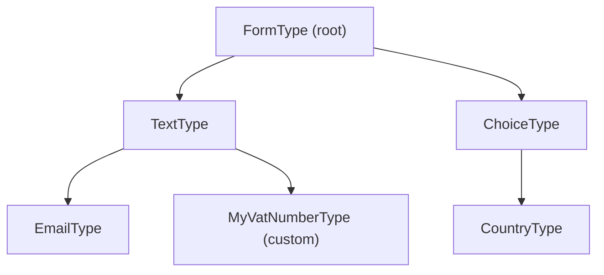

# Form Types & the Type Hierarchy

!!! tip "In a nutshell"
    Every field is a form of some *type*, and types inherit down a chain to the
    root `FormType`. Remember: `getParent()` returns a **class string** (FQCN), the
    FQCN is the type id (no `getName()`), and parent hooks run before the child's.

!!! example "Real-world analogy"
    Types are **standardised form templates that inherit from master templates**.
    A specialised form (a VAT-number field) starts from a generic text-field
    template and stamps a few extra rules on top; that template in turn builds on
    the office-wide base layout (`FormType`). Each layer's rules are applied
    outer-to-inner, so your specialisation only writes the **delta**, not the whole
    page from scratch.

!!! abstract "Learning objectives"
    By the end of this chapter you can:

    - [ ] Distinguish built-in from custom types and place any type in the hierarchy.
    - [ ] Use `getParent()` to inherit behaviour and explain how `ResolvedFormType` is built.
    - [ ] Declare and validate type options with `OptionsResolver`.

    **Syllabus:** `Forms → Form types` ·
    **Level:** Advanced → Expert ·
    **Est. time:** 30 min ·
    **Prerequisites:** [Creating forms](creation.md)

---

## Theory

Every field *is* a form, and every form is an instance of some **type**. Types
form an inheritance chain: your custom type declares a **parent**, which declares
its parent, up to the root `FormType`. Behaviour and options accumulate down the
chain.

- **Built-in types** live in
  `Symfony\Component\Form\Extension\Core\Type\*` (e.g. `TextType`, `ChoiceType`).
- **Custom types** extend `AbstractType` and usually set `getParent()`.

The common root is `Symfony\Component\Form\Extension\Core\Type\FormType`, and the
common *field* base is `TextType` for scalar inputs.

!!! question "Predict first"
    Your custom type's `getParent()` returns `TextType::class`. In what order do the
    parent's and child's `configureOptions`/`buildForm` run — and what does
    `getParent()` actually return?

??? note "Reveal"
    **Parent first, then child.** The `ResolvedFormType` walks the chain top-down, so
    the child sees the parent's defaults already set and writes only the delta.
    `getParent()` returns a **class string** (FQCN), never an instance.

## Deep Dive — how it works internally

### The hierarchy



`getParent()` returns the FQCN of the parent type (default `FormType`). Return a
built-in type to inherit its `buildForm`, `buildView`, transformers and options —
you write only the delta.

### `ResolvedFormType` — how a type is "resolved"

A raw type is not usable alone. The `Symfony\Component\Form\FormRegistry` wraps
each type in a `Symfony\Component\Form\ResolvedFormType` that captures:

- the type instance,
- its **fully resolved parent chain**,
- all **type extensions** that apply (see [type extensions](type-extensions.md)).

When building a form, the resolved type invokes, **parent → child**:
`configureOptions` (merged into one `OptionsResolver`), then `buildForm`,
then on view creation `buildView` and `finishView`. Each type extension's hooks
run **after** the type's own at each level.

!!! note "Source reference"
    `ResolvedFormType::buildForm()` and `FormRegistry::resolveType()` —
    [symfony/symfony `8.0`](https://github.com/symfony/symfony/blob/8.0/src/Symfony/Component/Form/ResolvedFormType.php).

### Option resolution

`configureOptions(OptionsResolver $resolver)` is where you:

- `setDefaults([...])` — default values;
- `setRequired([...])` — options callers must pass;
- `setAllowedTypes('opt', 'string')` / `setAllowedValues(...)` — validation;
- `setNormalizer('opt', fn ($opts, $value) => ...)` — derive one option from
  others;
- `setDeprecated(...)` — mark an option deprecated.

Because parent `configureOptions` runs first, a child can *override* a parent
default and reference the parent's option in a normalizer.

### Type discovery & DI

Custom types are auto-registered: FrameworkBundle autoconfigures classes
implementing `FormTypeInterface` with the `form.type` tag, so you can inject
services into a type's constructor and it is available by FQCN. There is **no**
`getName()` any more — the FQCN is the identifier and `getBlockPrefix()` names
the Twig block.

## Configuration & code

=== "Custom type via getParent"

    ```php
    <?php
    declare(strict_types=1);

    namespace App\Form\Type;

    use Symfony\Component\Form\AbstractType;
    use Symfony\Component\Form\Extension\Core\Type\TextType;
    use Symfony\Component\OptionsResolver\OptionsResolver;

    /** A trimmed, uppercased VAT number field built on TextType. */
    final class VatNumberType extends AbstractType
    {
        public function configureOptions(OptionsResolver $resolver): void
        {
            $resolver->setDefaults([
                'invalid_message' => 'Please enter a valid VAT number.',
            ]);
        }

        public function getParent(): string
        {
            return TextType::class;
        }
    }
    ```

=== "OptionsResolver features"

    ```php
    <?php
    declare(strict_types=1);

    use Symfony\Component\OptionsResolver\OptionsResolver;

    public function configureOptions(OptionsResolver $resolver): void
    {
        $resolver->setDefaults(['multiple' => false, 'expanded' => false]);
        $resolver->setAllowedTypes('multiple', 'bool');
        $resolver->setRequired('choices');
        $resolver->setNormalizer(
            'expanded',
            static fn (\Symfony\Component\OptionsResolver\Options $o, bool $v): bool
                => $v && !$o['multiple'] ? true : $v,
        );
    }
    ```

## Best practices & anti-patterns

| ✅ Do | ❌ Avoid |
|---|---|
| Extend the closest built-in via `getParent` | Re-implementing `TextType` from scratch |
| Validate options with allowed types/values | Trusting raw `$options` blindly |
| Inject services into custom types | Static/global lookups inside `buildForm` |
| Reference the FQCN as the type id | Looking for `getName()` |

## When (not) to use it / alternatives

Create a custom type when a field shape recurs (a money field, a VAT field). If
you only need to tweak an *existing* type across many forms without a new field
identity, prefer a **type extension** ([type-extensions](type-extensions.md)).
For a one-off, just configure options at `->add()`.

!!! danger "Certification traps"
    - `getParent()` returns a **class string**, not an instance.
    - Parent `configureOptions`/`buildForm` run **before** the child's; the child
      sees parent defaults already set.
    - Types are identified by **FQCN**; `getName()` no longer exists.
    - A `ResolvedFormType` bundles the type **plus its extensions** — extensions
      are not applied per-instance ad hoc.

!!! warning "Common mistakes"
    - Returning `new TextType()` from `getParent()` instead of `TextType::class`.
    - Adding fields in a type whose parent is a scalar type like `TextType`
      (scalar types are not compound — set the parent to `FormType` for a
      compound custom type).

## Exercises

1. **(Advanced)** Build a `PercentageType` on top of `NumberType` that defaults
   `scale` to 2 and a helpful `invalid_message`.
2. **(Expert)** Explain why `ChoiceType` options like `expanded`/`multiple`
   change the *rendered widget* (checkbox/radio vs select) without a new type.

??? success "Solutions"

    **1.**

    ```php
    <?php
    declare(strict_types=1);

    namespace App\Form\Type;

    use Symfony\Component\Form\AbstractType;
    use Symfony\Component\Form\Extension\Core\Type\NumberType;
    use Symfony\Component\OptionsResolver\OptionsResolver;

    final class PercentageType extends AbstractType
    {
        public function configureOptions(OptionsResolver $resolver): void
        {
            $resolver->setDefaults([
                'scale' => 2,
                'invalid_message' => 'Enter a number between 0 and 100.',
            ]);
        }

        public function getParent(): string
        {
            return NumberType::class;
        }
    }
    ```

    **2.** `ChoiceType::buildView()` reads `expanded`/`multiple` and sets view
    variables; the Twig `choice_widget` block branches on them to render a
    `<select>`, or expanded checkboxes/radios. One resolved type, many widgets —
    options drive the view, not the class.

## Certification questions

??? question "Q1. What does `getParent()` return?"
    - [ ] A. A `FormBuilderInterface`
    - [x] B. The parent type's fully-qualified class name ✅
    - [ ] C. A `ResolvedFormType` instance
    - [ ] D. `null` for all custom types

    **Why:** `getParent()` returns a class string (default `FormType::class`); the
    registry resolves it into the parent chain.
    **Ref:** [Creating a custom type](https://symfony.com/doc/current/form/create_custom_field_type.html).

??? question "Q2. Which object bundles a type with its parents and extensions?"
    - [ ] A. `FormBuilder`
    - [ ] B. `FormConfig`
    - [x] C. `ResolvedFormType` ✅
    - [ ] D. `OptionsResolver`

    **Why:** `FormRegistry` produces a `ResolvedFormType` capturing the type, its
    resolved parent, and applicable type extensions.
    **Ref:** [Symfony source — ResolvedFormType](https://github.com/symfony/symfony/blob/8.0/src/Symfony/Component/Form/ResolvedFormType.php).

??? question "Q3. In what order do `configureOptions` methods run?"
    - [x] A. Parent first, then child ✅
    - [ ] B. Child first, then parent
    - [ ] C. Alphabetical by class name
    - [ ] D. Undefined

    **Why:** The resolved type walks the chain top-down, so a child can override
    defaults set by its parent.
    **Ref:** [Form types docs](https://symfony.com/doc/current/forms.html).

## Key takeaways

- Types form an inheritance chain rooted at `FormType`; `getParent()` returns a
  class string.
- `ResolvedFormType` = type + parent chain + type extensions; it drives build.
- Parent hooks run before child hooks (options and build).
- Options are declared/validated with `OptionsResolver`; FQCN is the type id.

## Last-minute revision

!!! tip "Cheat sheet"
    - Built-in: `Symfony\Component\Form\Extension\Core\Type\*`.
    - `getParent(): string` → e.g. `TextType::class`.
    - `OptionsResolver`: `setDefaults / setRequired / setAllowedTypes / setNormalizer`.
    - No `getName()`; `getBlockPrefix()` for theming; FQCN is the id.
    - `form.type` tag autoconfigured → inject services into types.

## Connections

- **Depends on:** [Dependency injection](../dependency-injection/index.md) — types are autoconfigured with the `form.type` tag, so you can inject services into them.
- **Reused in:** [Type extensions](type-extensions.md) — the `ResolvedFormType` bundles a type with its applicable extensions.
- **Confused with:** [Built-in types](built-in-types.md) — those are concrete field types; this chapter is the hierarchy/`ResolvedFormType` mechanism behind them.

## Official References
- [Official Symfony docs — Creating a custom form type](https://symfony.com/doc/current/form/create_custom_field_type.html)
- [Official Symfony docs — Form type options](https://symfony.com/doc/current/reference/forms/types.html)
- [Symfony source — ResolvedFormType](https://github.com/symfony/symfony/blob/8.0/src/Symfony/Component/Form/ResolvedFormType.php)

## Video references

!!! tip "Watch & learn"
    These are official, continuously-updated video channels — search them for
    "Symfony forms" to reinforce this chapter. We link stable channels rather than
    individual videos so the references never rot.

    - [SymfonyCasts screencasts](https://symfonycasts.com/tracks/symfony) — scripted, code-along tutorials.
    - [Symfony official YouTube](https://www.youtube.com/@SymfonyOfficial) — SymfonyCon conference talks & keynotes.
    - [Official docs for this topic](https://symfony.com/doc/current/form/create_custom_field_type.html) — some Symfony doc pages embed a screencast.

## Confidence check

I'm ready when I can:

- [ ] explain **why** types inherit down a chain to `FormType`
- [ ] build a custom type with `getParent()` and `OptionsResolver` in Symfony 8
- [ ] debug a compound custom type whose parent is a scalar `TextType`
- [ ] spot the wrong answer returning `new TextType()` from `getParent()` or expecting `getName()`
- [ ] explain what a `ResolvedFormType` bundles and the parent → child hook order

---

<small>Related: [Creating forms](creation.md) · [Built-in types](built-in-types.md) ·
[Type extensions](type-extensions.md)</small>
