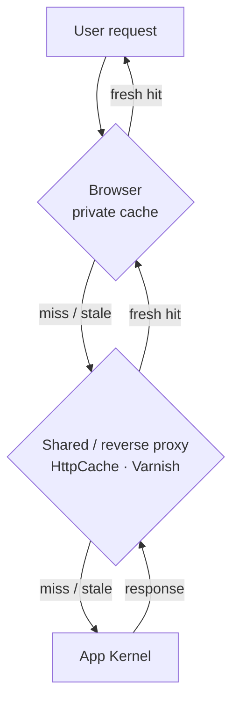
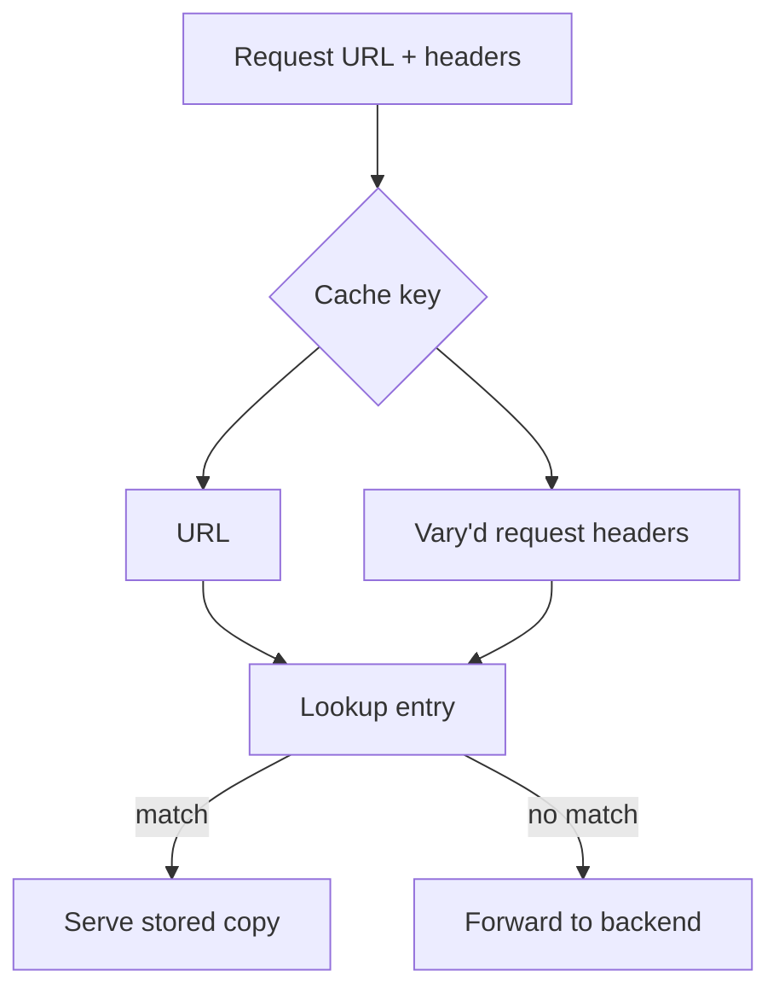

# Cache Types

!!! tip "In a nutshell"
    Les caches vivent à trois endroits : le navigateur de l'utilisateur
    (**privé**), les proxies/CDN du réseau (**partagé**), et un reverse proxy
    qui vous appartient (**gateway**). Le seul appel qui compte : marquer une
    response `public` pour que les caches partagés puissent la stocker — le
    défaut de Symfony, `no-cache, private`, ne partage rien.

!!! example "Real-world analogy"
    Pensez à la distribution de copies d'un document. Une photocopie que vous gardez dans le
    tiroir de votre propre bureau (le cache **privé** du navigateur) n'est destinée qu'à vos
    yeux. Une pile laissée sur le comptoir d'une bibliothèque publique (un cache **partagé**)
    peut être prise par n'importe quel passant : vous ne devez donc jamais y laisser un
    document portant le nom de quelqu'un. Une salle de courrier que vous gérez dans le hall de
    votre propre immeuble (le **gateway/reverse proxy**) est un comptoir partagé que vous
    contrôlez. Tamponner un document « public » est ce qui le déclare sûr à laisser sur le
    comptoir de la bibliothèque — par défaut, chaque document est tamponné « réservé à vos
    yeux ».

!!! abstract "Learning objectives"
    À la fin de ce chapitre, vous saurez :

    - [ ] Distinguer les caches **privés**, **partagés/proxy** et **reverse proxy (gateway)**.
    - [ ] Décider quand une response est `public` ou `private`, et pourquoi c'est important.
    - [ ] Lire et écrire les directives `Cache-Control` essentielles.
    - [ ] Utiliser correctement le header `Vary` pour éviter de servir la mauvaise copie en cache.

    **Syllabus:** `HTTP Caching → Cache types & Cache-Control` ·
    **Level:** Advanced ·
    **Est. time:** 20 min ·
    **Prerequisites:** [HTTP Response](../http/response.md)

---

## Theory

Un **cache** stocke une response et la rejoue pour des requests identiques
ultérieures. HTTP définit trois endroits où cela se produit :

| Cache | Emplacement | Sert | Symfony l'appelle |
|---|---|---|---|
| **Privé** | Le navigateur | un seul utilisateur | private cache |
| **Partagé / proxy** | FAI, CDN, proxy d'entreprise | de nombreux utilisateurs | shared cache |
| **Reverse proxy (gateway)** | Devant *votre* application | de nombreux utilisateurs | `HttpCache`, Varnish |

Un cache **privé** appartient à un seul utilisateur (son navigateur). Un cache
**partagé** se trouve sur le chemin réseau et sert de nombreux utilisateurs : il
ne doit donc jamais stocker de données propres à un utilisateur. Un **reverse
proxy** (alias *gateway cache* ou *HTTP accelerator*) est un cache partagé que
vous contrôlez, déployé devant l'application — c'est ce que sont le
[`HttpCache`](server-side.md) de Symfony et Varnish.

Pour une même request, ces caches forment des **couches** : chacune peut servir
un hit frais et court-circuiter le reste, ou transmettre le miss à la couche
suivante, jusqu'à votre application.



### `public` vs `private`

La décision la plus importante de toutes : **un cache partagé peut-il stocker
cette response ?**

- `Cache-Control: public` — n'importe quel cache (navigateur **et** partagé)
  peut la stocker.
- `Cache-Control: private` — **seul** le navigateur peut la stocker ; les
  caches partagés ne le doivent pas. Utilisez-la pour tout ce qui est lié à une
  session ou à un utilisateur.

!!! danger "The default is private"
    Une `Response` Symfony **sans** cache-control défini émet
    `Cache-Control: no-cache, private`. *Ne rien faire* est donc sûr (pas de
    cache partagé), mais cela signifie aussi **aucun bénéfice de cache**. Vous
    devez opter explicitement.

### Core `Cache-Control` directives

| Directive | Signification |
|---|---|
| `public` / `private` | Qui peut la stocker |
| `max-age=N` | Fraîche pendant N secondes (tous les caches + navigateur) |
| `s-maxage=N` | Fraîche pendant N secondes (caches **partagés** uniquement) |
| `no-cache` | Peut être stockée, mais **doit être revalidée** avant réutilisation |
| `no-store` | Ne doit **jamais** être stockée |
| `must-revalidate` | Une fois périmée, doit être revalidée (interdiction de servir du périmé) |
| `immutable` | Ne change jamais pendant la fraîcheur — pas de revalidation |

La fraîcheur (`max-age`, `s-maxage`, `Expires`) relève du modèle
d'[expiration](expiration.md) ; la revalidation (`no-cache`, `ETag`,
`Last-Modified`) relève du modèle de [validation](validation.md).

!!! question "Predict first"
    Une response porte `Cache-Control: public, max-age=60, s-maxage=600`.
    Combien de temps le **navigateur** la considère-t-il comme fraîche, et
    combien de temps un **CDN** ?

??? note "Reveal"
    Le navigateur honore `max-age=60` et ignore `s-maxage` : il réutilise donc
    la copie pendant 60 s. Un cache partagé résout la fraîcheur avec `s-maxage`
    > `max-age`, donc le CDN la garde fraîche pendant 600 s. Un même header,
    deux durées de vie — cette séparation est exactement la raison d'être des
    deux directives.

## Deep Dive — how it works internally

### Where the directives are computed

Symfony ne stocke pas la chaîne `Cache-Control` brute. Il conserve une map
structurée dans `Symfony\Component\HttpFoundation\ResponseHeaderBag` et *rend*
le header paresseusement dans
`ResponseHeaderBag::computeCacheControlValue()`. C'est cette méthode qui
produit `no-cache, private` quand vous ne définissez rien, et qui applique la
règle selon laquelle **appeler `setPublic()` retire `private`** (et
inversement), de sorte que vous ne pouvez jamais émettre le contradictoire
`public, private`.

!!! note "Source reference"
    `Symfony\Component\HttpFoundation\ResponseHeaderBag::computeCacheControlValue()`
    and `Symfony\Component\HttpFoundation\Response::setPublic()` —
    [symfony/symfony `8.0`](https://github.com/symfony/symfony/blob/8.0/src/Symfony/Component/HttpFoundation/ResponseHeaderBag.php).

### The `Vary` header — one cache key per representation

Un cache indexe ses entrées stockées par URL. `Vary` lui indique **quels
headers de request font aussi partie de la clé**. Une response avec
`Vary: Accept-Encoding` est stockée séparément pour chaque encodage, si bien
qu'un client gzip ne reçoit jamais un corps brotli.



Sans `Vary`, un cache partagé qui aurait stocké une page française gzippée
pourrait la remettre à un client anglophone demandant un encodage identity.
`Vary: Accept-Language, Accept-Encoding` empêche cela.

!!! warning "`Vary: *` and `Vary: Cookie` kill caching"
    `Vary: *` signifie « chaque request est unique » — les caches partagés ne
    peuvent en pratique rien réutiliser. `Vary: Cookie` fait exploser l'espace
    des clés (une entrée par valeur de cookie), ce qui, pour les cookies de
    session, signifie *aucun* hit de cache partagé. Préférez [ESI](esi.md) pour
    isoler le fragment propre à l'utilisateur.

### Who obeys what

`max-age` est honoré par **tous** les caches, navigateur compris. `s-maxage`
n'est honoré **que par les caches partagés** (proxies, reverse proxy) — le
navigateur l'ignore. Cette séparation est précisément ce qui vous permet de
mettre une page en cache 60 s dans le CDN tout en disant aux navigateurs de ne
pas la mettre en cache du tout.

## Configuration & code

=== "PHP Attributes"

    ```php
    <?php
    declare(strict_types=1);

    namespace App\Controller;

    use Symfony\Bundle\FrameworkBundle\Controller\AbstractController;
    use Symfony\Component\HttpFoundation\Response;
    use Symfony\Component\HttpKernel\Attribute\Cache;
    use Symfony\Component\Routing\Attribute\Route;

    final class ArticleController extends AbstractController
    {
        // Public: shared caches may store it; vary on language + encoding.
        #[Route('/articles', name: 'article_list')]
        #[Cache(public: true, maxage: 3600, vary: ['Accept-Language', 'Accept-Encoding'])]
        public function list(): Response
        {
            return $this->render('article/list.html.twig');
        }
    }
    ```

=== "PHP (Response API)"

    ```php
    <?php
    declare(strict_types=1);

    use Symfony\Component\HttpFoundation\Response;

    $response = new Response('<h1>Articles</h1>');
    $response->setPublic();                          // Cache-Control: public
    $response->setMaxAge(3600);                       // browser + shared
    $response->setVary(['Accept-Language', 'Accept-Encoding']);

    // Explicitly private (per-user) content:
    $response->setPrivate();                          // strips "public"
    ```

=== "Raw HTTP"

    ```http
    HTTP/1.1 200 OK
    Cache-Control: public, max-age=3600
    Vary: Accept-Language, Accept-Encoding
    Content-Type: text/html; charset=UTF-8
    ```

## Best practices & anti-patterns

| ✅ Do | ❌ Avoid |
|---|---|
| Marquer explicitement `public` les pages partageables | Supposer que les responses sont cacheables par défaut |
| Garder les données utilisateur `private` (ou non cachées) | Servir `public` sur des pages liées à une session |
| `Vary` sur les headers dont dépend réellement la response | `Vary: *` ou `Vary: Cookie` sur un cache partagé |
| Isoler les parties par utilisateur avec [ESI](esi.md) | Rendre toute la page privée pour un seul widget |

## When (not) to use it / alternatives

Utilisez le cache `public` pour les pages anonymes, surtout en lecture
(listings, articles, assets). Gardez les tableaux de bord authentifiés
`private` ou non cachés. Quand une page est *majoritairement* publique mais
comporte un petit recoin par utilisateur, ne dégradez pas toute la page —
mettez la coquille en cache publiquement et récupérez la partie privée via
[ESI](esi.md).

!!! danger "Certification traps"
    - Une response **sans** `Cache-Control` devient `no-cache, private` — sûr,
      mais **pas** mise en cache par les caches partagés. Vous devez opter avec
      `public`.
    - `setPublic()` et `setPrivate()` sont **mutuellement exclusifs** : le
      dernier appel gagne et retire l'autre ; vous n'obtenez jamais
      `public, private`.
    - `Vary: Cookie` (ou un cookie de session sans `Vary`) rend un cache
      partagé quasi inutile — le reverse proxy traite par défaut les requests
      porteuses d'une session comme **privées** (`private_headers` = `Cookie`,
      `Authorization`).
    - Le **navigateur ignore `s-maxage`** ; seuls les caches partagés
      l'honorent.

!!! warning "Common mistakes"
    - Marquer une page `public` alors qu'elle appelle encore
      `getSession()`/lit un cookie, ce qui fait fuiter la page d'un utilisateur
      vers un autre via le CDN.
    - Oublier `Vary: Accept-Encoding` derrière un proxy qui stocke les corps
      compressés et non compressés sous la même clé.

## Exercises

1. **(Advanced)** Rendez une action de listing d'articles cacheable par un CDN
   pendant 10 minutes mais *pas* par le navigateur. Quelle(s) directive(s) ?
2. **(Expert)** Une page est du HTML public mais affiche le nom de
   l'utilisateur connecté dans l'en-tête. Expliquez pourquoi la marquer
   `private` est pénalisant et que faire à la place.

??? success "Solutions"

    **1.** Utilisez uniquement une durée de fraîcheur **partagée** :
    `#[Cache(public: true, smaxage: 600)]` (ou
    `$response->setSharedMaxAge(600)`), et définissez `max-age=0` / laissez
    `max-age` non défini pour que les navigateurs ne mettent pas en cache.
    `setSharedMaxAge()` marque aussi la response `public` pour vous.

    **2.** `private` signifie aucun cache CDN du tout : chaque visiteur anonyme
    rate donc aussi le cache — vous perdez le gain pour les 99 % de cas.
    Gardez plutôt la page `public` et affichez le nom d'utilisateur via un
    fragment [ESI](esi.md) avec son propre TTL `private`/court, de sorte que la
    coquille soit partagée et que seul le minuscule fragment soit par
    utilisateur.

## Certification questions

??? question "Q1. A Symfony `Response` with no cache headers set emits which `Cache-Control`?"
    - [ ] A. `public, max-age=0`
    - [x] B. `no-cache, private` ✅
    - [ ] C. (empty — no header)
    - [ ] D. `no-store`

    **Why:** `ResponseHeaderBag::computeCacheControlValue()` produit par défaut
    `no-cache, private` quand rien n'est configuré — sûr, mais non cacheable
    par les caches partagés.
    **Ref:** [HTTP cache](https://symfony.com/doc/current/http_cache.html).

??? question "Q2. Which cache honours `s-maxage`?"
    - [ ] A. The browser only
    - [x] B. Shared caches only (proxies, reverse proxy) ✅
    - [ ] C. Every cache including the browser
    - [ ] D. No cache — it is a request directive

    **Why:** `s-maxage` cible les caches partagés ; les navigateurs l'ignorent
    et utilisent `max-age`/`Expires`.
    **Ref:** [Expiration](https://symfony.com/doc/current/http_cache/expiration.html).

??? question "Q3. What does `Vary: Accept-Language` instruct a cache to do?"
    - [ ] A. Reject requests with no `Accept-Language`
    - [x] B. Store a separate copy per distinct `Accept-Language` value ✅
    - [ ] C. Translate the response automatically
    - [ ] D. Disable caching entirely

    **Why:** `Vary` ajoute le ou les headers de request nommés à la clé de
    cache, si bien que chaque variante de langue est stockée et servie
    indépendamment.
    **Ref:** [MDN Vary](https://developer.mozilla.org/en-US/docs/Web/HTTP/Headers/Vary).

??? question "Q4. You call `$response->setPublic()` then `$response->setPrivate()`. Result?"
    - [ ] A. `Cache-Control: public, private`
    - [x] B. `Cache-Control: private` (public removed) ✅
    - [ ] C. An exception
    - [ ] D. `Cache-Control: public`

    **Why:** Les deux sont mutuellement exclusifs ; `setPrivate()` retire
    `public`, donc le dernier appel gagne.
    **Ref:** [Response API](https://symfony.com/doc/current/http_cache.html).

## Key takeaways

- Trois types de caches : **privé** (navigateur), **partagé** (réseau),
  **reverse proxy** (le vôtre).
- `public` fait entrer une response dans le cache partagé ; `private` la
  restreint au navigateur ; le défaut de Symfony est `no-cache, private`.
- `max-age` vaut pour tous les caches ; `s-maxage` uniquement pour les caches
  partagés.
- `Vary` ajoute des headers de request à la clé de cache — utilisez-le avec
  précision, jamais `*` ni `Cookie`.

## Last-minute revision

!!! tip "Cheat sheet"
    - `Cache-Control` par défaut = `no-cache, private`. Optez pour le partage
      avec `public`.
    - `public`/`private` sont mutuellement exclusifs ; le dernier setter gagne.
    - `max-age` = tout le monde ; `s-maxage` = caches partagés uniquement (le
      navigateur ignore).
    - `Vary` = headers supplémentaires dans la clé de cache. `Vary: *`/`Cookie`
      ≈ aucun cache partagé.
    - Reverse proxy = gateway cache = `HttpCache`/Varnish (un cache partagé).

## Connections

- **Depends on:** [HTTP Response](../http/response.md) — `Cache-Control`/`Vary`
  vivent sur le header bag de la response que vous apprenez à construire
  là-bas.
- **Reused in:** [Server-Side Caching](server-side.md) — le reverse proxy
  (gateway cache) est le cache partagé qui vous appartient, décrit ici.
- **Confused with:** [Expiration](expiration.md) — le *type* de cache (qui peut
  stocker) est un axe différent de la *fraîcheur* (combien de temps il peut
  être réutilisé).

## Official References
- [Symfony docs — HTTP cache](https://symfony.com/doc/current/http_cache.html)
- [MDN — Cache-Control](https://developer.mozilla.org/en-US/docs/Web/HTTP/Headers/Cache-Control)
- [MDN — Vary](https://developer.mozilla.org/en-US/docs/Web/HTTP/Headers/Vary)
- [Symfony source — ResponseHeaderBag](https://github.com/symfony/symfony/blob/8.0/src/Symfony/Component/HttpFoundation/ResponseHeaderBag.php)

## Video references

!!! tip "Watch & learn"
    Voici des chaînes vidéo officielles, mises à jour en continu — cherchez-y
    « HTTP caching » pour consolider ce chapitre. Nous lions des chaînes
    stables plutôt que des vidéos individuelles pour que les références ne
    périment jamais.

    - [SymfonyCasts screencasts](https://symfonycasts.com/tracks/symfony) — des tutoriels scriptés, à coder en suivant.
    - [Symfony official YouTube](https://www.youtube.com/@SymfonyOfficial) — les conférences et keynotes SymfonyCon.
    - [Official docs for this topic](https://symfony.com/doc/current/http_cache.html) — certaines pages de la doc Symfony intègrent un screencast.

## Confidence check

Je suis prêt quand je peux :

- [ ] expliquer **pourquoi** `public` doit être un choix explicite et ce que
  protège le défaut `no-cache, private`
- [ ] marquer une response `public`/`private` et définir `max-age`/`s-maxage`
  dans Symfony 8
- [ ] déboguer un CDN qui sert la page d'un utilisateur à un autre (`private`
  manquant/session parasite)
- [ ] repérer le piège : `setPublic()` puis `setPrivate()` ne produit que
  `private`
- [ ] expliquer comment `ResponseHeaderBag::computeCacheControlValue()` rend le
  header

---

<small>Related: [Expiration](expiration.md) · [Validation](validation.md) ·
[Server-Side Caching](server-side.md) · [Edge Side Includes](esi.md)</small>
