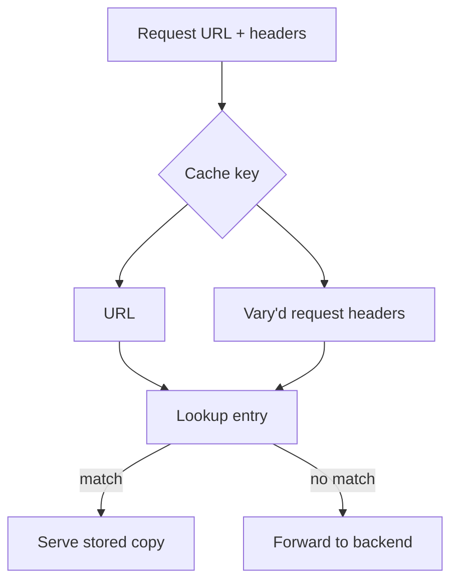

# Cache Types

!!! tip "In a nutshell"
    Caches live in three places: the user's browser (**private**), network
    proxies/CDNs (**shared**), and a reverse proxy you own (**gateway**). The one
    call that matters: mark a response `public` so shared caches may store it —
    Symfony's default `no-cache, private` shares nothing.

!!! abstract "Learning objectives"
    By the end of this chapter you can:

    - [ ] Distinguish **private**, **shared/proxy** and **reverse-proxy (gateway)** caches.
    - [ ] Decide when a response is `public` vs `private` and why it matters.
    - [ ] Read and write the core `Cache-Control` directives.
    - [ ] Use the `Vary` header correctly to avoid serving the wrong cached copy.

    **Syllabus:** `HTTP Caching → Cache types & Cache-Control` ·
    **Level:** Advanced ·
    **Est. time:** 20 min ·
    **Prerequisites:** [HTTP Response](../http/response.md)

---

## Theory

A **cache** stores a response and replays it for later identical requests. HTTP
defines three places this happens:

| Cache | Location | Serves | Symfony calls it |
|---|---|---|---|
| **Private** | The browser | one user | private cache |
| **Shared / proxy** | ISP, CDN, corporate proxy | many users | shared cache |
| **Reverse proxy (gateway)** | In front of *your* app | many users | `HttpCache`, Varnish |

A **private** cache belongs to a single user (their browser). A **shared** cache
sits on the network path and serves many users, so it must never store
user-specific data. A **reverse proxy** (a.k.a. *gateway cache* or *HTTP
accelerator*) is a shared cache you control, deployed in front of the app — this
is what Symfony's [`HttpCache`](server-side.md) and Varnish are.

### `public` vs `private`

The single most important decision: **may a shared cache store this response?**

- `Cache-Control: public` — any cache (browser **and** shared) may store it.
- `Cache-Control: private` — **only** the browser may store it; shared caches
  must not. Use it for anything tied to a session or user.

!!! danger "The default is private"
    A Symfony `Response` with **no** cache-control set emits
    `Cache-Control: no-cache, private`. So *doing nothing* is safe (no shared
    caching) but also means **no caching benefit**. You must opt in explicitly.

### Core `Cache-Control` directives

| Directive | Meaning |
|---|---|
| `public` / `private` | Who may store it |
| `max-age=N` | Fresh for N seconds (all caches + browser) |
| `s-maxage=N` | Fresh for N seconds (**shared** caches only) |
| `no-cache` | May store, but **must revalidate** before reuse |
| `no-store` | Must **never** store |
| `must-revalidate` | Once stale, must revalidate (no serving stale) |
| `immutable` | Never changes during freshness — skip revalidation |

Freshness (`max-age`, `s-maxage`, `Expires`) is the [expiration](expiration.md)
model; revalidation (`no-cache`, `ETag`, `Last-Modified`) is the
[validation](validation.md) model.

## Deep Dive — how it works internally

### Where the directives are computed

Symfony does not store the raw `Cache-Control` string. It keeps a structured map
inside `Symfony\Component\HttpFoundation\ResponseHeaderBag` and *renders* the
header lazily in `ResponseHeaderBag::computeCacheControlValue()`. That method is
what produces `no-cache, private` when you set nothing, and what enforces the
rule that **calling `setPublic()` strips `private`** (and vice-versa) so you can
never emit the contradictory `public, private`.

!!! note "Source reference"
    `Symfony\Component\HttpFoundation\ResponseHeaderBag::computeCacheControlValue()`
    and `Symfony\Component\HttpFoundation\Response::setPublic()` —
    [symfony/symfony `8.0`](https://github.com/symfony/symfony/blob/8.0/src/Symfony/Component/HttpFoundation/ResponseHeaderBag.php).

### The `Vary` header — one cache key per representation

A cache keys its stored entries by URL. `Vary` tells it **which request headers
also form part of the key**. A response with `Vary: Accept-Encoding` is stored
separately per encoding, so a gzip client never receives a brotli body.



Without `Vary`, a shared cache that stored a French, gzipped page could hand it
to an English client asking for identity encoding. `Vary: Accept-Language,
Accept-Encoding` prevents that.

!!! warning "`Vary: *` and `Vary: Cookie` kill caching"
    `Vary: *` means "every request is unique" — shared caches effectively cannot
    reuse anything. `Vary: Cookie` explodes the key space (one entry per cookie
    value), which for session cookies means *no* shared cache hits. Prefer
    [ESI](esi.md) to isolate the user-specific fragment instead.

### Who obeys what

`max-age` is honoured by **every** cache including the browser. `s-maxage` is
honoured **only by shared caches** (proxies, the reverse proxy) — the browser
ignores it. This split is the whole reason you can cache a page for 60 s in the
CDN while telling browsers not to cache it at all.

## Configuration & code

=== "PHP Attributes"

    ```php
    <?php
    declare(strict_types=1);

    namespace App\Controller;

    use Symfony\Bundle\FrameworkBundle\Controller\AbstractController;
    use Symfony\Component\HttpFoundation\Response;
    use Symfony\Component\HttpKernel\Attribute\Cache;
    use Symfony\Component\Routing\Attribute\Route;

    final class ArticleController extends AbstractController
    {
        // Public: shared caches may store it; vary on language + encoding.
        #[Route('/articles', name: 'article_list')]
        #[Cache(public: true, maxage: 3600, vary: ['Accept-Language', 'Accept-Encoding'])]
        public function list(): Response
        {
            return $this->render('article/list.html.twig');
        }
    }
    ```

=== "PHP (Response API)"

    ```php
    <?php
    declare(strict_types=1);

    use Symfony\Component\HttpFoundation\Response;

    $response = new Response('<h1>Articles</h1>');
    $response->setPublic();                          // Cache-Control: public
    $response->setMaxAge(3600);                       // browser + shared
    $response->setVary(['Accept-Language', 'Accept-Encoding']);

    // Explicitly private (per-user) content:
    $response->setPrivate();                          // strips "public"
    ```

=== "Raw HTTP"

    ```http
    HTTP/1.1 200 OK
    Cache-Control: public, max-age=3600
    Vary: Accept-Language, Accept-Encoding
    Content-Type: text/html; charset=UTF-8
    ```

## Best practices & anti-patterns

| ✅ Do | ❌ Avoid |
|---|---|
| Mark shareable pages `public` explicitly | Assuming responses are cacheable by default |
| Keep user data `private` (or uncached) | Serving `public` on session-bound pages |
| `Vary` on the headers you actually branch on | `Vary: *` or `Vary: Cookie` on a shared cache |
| Isolate per-user bits with [ESI](esi.md) | Making the whole page private for one widget |

## When (not) to use it / alternatives

Use `public` caching for anonymous, read-mostly pages (listings, articles,
assets). Keep authenticated dashboards `private` or uncached. When a page is
*mostly* public but has a small per-user corner, don't downgrade the whole page
— cache the shell publicly and pull the private part via [ESI](esi.md).

!!! danger "Certification traps"
    - A response with **no** `Cache-Control` becomes `no-cache, private` — safe
      but **not** cached by shared caches. You must opt in with `public`.
    - `setPublic()` and `setPrivate()` are **mutually exclusive**: the last call
      wins and removes the other; you never get `public, private`.
    - `Vary: Cookie` (or a session cookie without `Vary`) makes a shared cache
      near-useless — the reverse proxy treats requests with a session as
      **private** by default (`private_headers` = `Cookie`, `Authorization`).
    - The **browser ignores `s-maxage`**; only shared caches honour it.

!!! warning "Common mistakes"
    - Marking a page `public` while it still calls `getSession()`/reads a cookie,
      leaking one user's page to another via the CDN.
    - Forgetting `Vary: Accept-Encoding` behind a proxy that stores compressed
      and uncompressed bodies under the same key.

## Exercises

1. **(Advanced)** Make an article-listing action cacheable by a CDN for 10
   minutes but *not* by the browser. Which directive(s)?
2. **(Expert)** A page is public HTML but shows the logged-in user's name in the
   header. Explain why marking it `private` hurts and what to do instead.

??? success "Solutions"

    **1.** Use only a **shared** freshness lifetime: `#[Cache(public: true,
    smaxage: 600)]` (or `$response->setSharedMaxAge(600)`), and set
    `max-age=0`/leave `max-age` unset so browsers don't cache. `setSharedMaxAge()`
    also marks the response `public` for you.

    **2.** `private` means no CDN caching at all, so every anonymous visitor also
    misses the cache — you lose the win for the 99% case. Instead keep the page
    `public` and render the username via an [ESI](esi.md) fragment with its own
    `private`/short TTL, so the shell is shared and only the tiny fragment is
    per-user.

## Certification questions

??? question "Q1. A Symfony `Response` with no cache headers set emits which `Cache-Control`?"
    - [ ] A. `public, max-age=0`
    - [x] B. `no-cache, private` ✅
    - [ ] C. (empty — no header)
    - [ ] D. `no-store`

    **Why:** `ResponseHeaderBag::computeCacheControlValue()` defaults to
    `no-cache, private` when nothing is configured — safe, but not shared-cacheable.
    **Ref:** [HTTP cache](https://symfony.com/doc/current/http_cache.html).

??? question "Q2. Which cache honours `s-maxage`?"
    - [ ] A. The browser only
    - [x] B. Shared caches only (proxies, reverse proxy) ✅
    - [ ] C. Every cache including the browser
    - [ ] D. No cache — it is a request directive

    **Why:** `s-maxage` targets shared caches; browsers ignore it and use
    `max-age`/`Expires`.
    **Ref:** [Expiration](https://symfony.com/doc/current/http_cache/expiration.html).

??? question "Q3. What does `Vary: Accept-Language` instruct a cache to do?"
    - [ ] A. Reject requests with no `Accept-Language`
    - [x] B. Store a separate copy per distinct `Accept-Language` value ✅
    - [ ] C. Translate the response automatically
    - [ ] D. Disable caching entirely

    **Why:** `Vary` adds the named request header(s) to the cache key, so each
    language variant is stored and served independently.
    **Ref:** [MDN Vary](https://developer.mozilla.org/en-US/docs/Web/HTTP/Headers/Vary).

??? question "Q4. You call `$response->setPublic()` then `$response->setPrivate()`. Result?"
    - [ ] A. `Cache-Control: public, private`
    - [x] B. `Cache-Control: private` (public removed) ✅
    - [ ] C. An exception
    - [ ] D. `Cache-Control: public`

    **Why:** The two are mutually exclusive; `setPrivate()` removes `public`, so
    the last call wins.
    **Ref:** [Response API](https://symfony.com/doc/current/http_cache.html).

## Key takeaways

- Three cache types: **private** (browser), **shared** (network), **reverse
  proxy** (yours).
- `public` opts a response into shared caching; `private` restricts it to the
  browser; the Symfony default is `no-cache, private`.
- `max-age` is for all caches; `s-maxage` is shared-only.
- `Vary` adds request headers to the cache key — use it precisely, never `*` or
  `Cookie`.

## Last-minute revision

!!! tip "Cheat sheet"
    - Default `Cache-Control` = `no-cache, private`. Opt into sharing with
      `public`.
    - `public`/`private` are mutually exclusive; last setter wins.
    - `max-age` = everyone; `s-maxage` = shared caches only (browser ignores).
    - `Vary` = extra cache-key headers. `Vary: *`/`Cookie` ≈ no shared caching.
    - Reverse proxy = gateway cache = `HttpCache`/Varnish (a shared cache).

## Official References
- [Symfony docs — HTTP cache](https://symfony.com/doc/current/http_cache.html)
- [MDN — Cache-Control](https://developer.mozilla.org/en-US/docs/Web/HTTP/Headers/Cache-Control)
- [MDN — Vary](https://developer.mozilla.org/en-US/docs/Web/HTTP/Headers/Vary)
- [Symfony source — ResponseHeaderBag](https://github.com/symfony/symfony/blob/8.0/src/Symfony/Component/HttpFoundation/ResponseHeaderBag.php)

---

<small>Related: [Expiration](expiration.md) · [Validation](validation.md) ·
[Server-Side Caching](server-side.md) · [Edge Side Includes](esi.md)</small>
