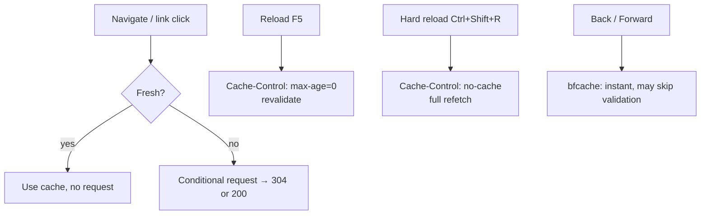

# Client-Side Caching

!!! tip "In a nutshell"
    Le navigateur possède son propre cache **privé** : il obéit à
    `max-age`/`Expires` et ignore `s-maxage`. Fait le plus rentable : un
    rechargement normal envoie `max-age=0` (revalidation → 304 possible), un
    rechargement forcé envoie `no-cache` (retéléchargement complet), et vous
    « invalidez » un asset mis en cache en changeant son URL, pas en le vidant.

!!! example "Real-world analogy"
    Imaginez un rapport que vous avez imprimé et que vous gardez sur votre propre bureau. Si
    votre copie est assez récente (encore **fraîche**), vous la lisez sans aller aux
    archives. Un **rechargement** normal revient à téléphoner aux archives pour demander
    « cela a-t-il changé depuis ma copie ? » — souvent la réponse est « non, gardez la
    vôtre » (un `304` sans corps). Un **rechargement forcé**, c'est jeter votre copie et
    aller chercher une impression toute neuve. Et vous ne pouvez jamais vous forcer à
    remarquer une nouvelle édition classée sous le même titre ; c'est l'éditeur qui donne à
    la nouvelle édition un nouveau titre (une URL avec empreinte) pour qu'elle arrive comme
    quelque chose que vous n'avez jamais vu.

!!! abstract "Learning objectives"
    À la fin de ce chapitre, vous saurez :

    - [ ] Décrire comment un navigateur décide de réutiliser, revalider ou retélécharger une response.
    - [ ] Lire les directives `Cache-Control` de **request** qu'un client peut envoyer.
    - [ ] Expliquer pourquoi `private` et `max-age` gouvernent le cache privé du navigateur.
    - [ ] Prédire le comportement du navigateur au rechargement, rechargement forcé et précédent/suivant.

    **Syllabus:** `HTTP Caching → Client-side caching` ·
    **Level:** Advanced ·
    **Est. time:** 18 min ·
    **Prerequisites:** [Expiration](expiration.md), [Validation](validation.md)

---

## Pour les nuls

### L'idée en une phrase
Le navigateur garde son propre cache privé et obéit à `max-age`/`Expires`, mais un rechargement normal et un rechargement forcé ne se comportent pas du tout pareil.

### Imagine dans la vraie vie
Un rapport imprimé que tu gardes sur ton propre bureau. Si ta copie est assez récente (encore **fraîche**), tu la lis sans marcher jusqu'aux archives. Un **rechargement normal** appelle les archives pour demander "ça a changé depuis ma copie ?" — souvent la réponse est "non, garde la tienne" (un 304 sans corps). Un **rechargement forcé** jette ta copie et va chercher un exemplaire tout neuf.

### Dans Symfony
Changer l'URL d'un fichier CSS (`app.abc123.css` → `app.def456.css`) force le navigateur à le retélécharger — vider manuellement le cache du visiteur n'est jamais nécessaire ni possible depuis le serveur.

### Exemple simple
```
Rechargement normal (F5)    → max-age=0, revalide, parfois 304
Rechargement forcé (Ctrl+F5) → no-cache, retéléchargement complet
```

### Comment le mémoriser 🧠
On ne "casse" jamais un cache navigateur en le vidant — on change l'**URL** du fichier (fingerprinting), ce qui en fait une ressource jamais vue auparavant.

---


## Theory

Le navigateur possède son propre **cache privé**. Avant d'émettre une request
réseau, il consulte ce cache et, d'après les headers de *response* stockés
auparavant, décide de l'une de ces trois options :

1. **Réutiliser** la copie stockée sans aucune request — elle est encore
   **fraîche** (`max-age`/`Expires` non écoulés).
2. **Revalider** — elle est périmée (ou `no-cache`) ; envoyer une request
   conditionnelle (`If-None-Match`/`If-Modified-Since`) et espérer un `304`.
3. **Retélécharger** — rien d'utilisable n'est stocké, ou `no-store` ; effectuer
   une request complète.

```http
# 1. Fresh (max-age/Expires not elapsed): reuse silently, no request at all
# 2. Stale or no-cache: revalidate with a conditional request
GET /report.pdf HTTP/1.1
If-None-Match: "abc123"
If-Modified-Since: Tue, 30 Jun 2026 08:00:00 GMT

HTTP/1.1 304 Not Modified

# 3. Nothing stored (or no-store): full request, full 200 response
```

Comme il s'agit d'un cache *privé*, le navigateur respecte `max-age` mais
**ignore `s-maxage`**, et il peut stocker des responses `private` (un cache
partagé ne le peut pas).

```http
HTTP/1.1 200 OK
Cache-Control: private, max-age=600, s-maxage=3600

# Browser (private cache): may store it, fresh for 600 s (max-age)
# s-maxage=3600 is ignored -- it only targets shared caches
```

### `Cache-Control` request directives

`Cache-Control` circule aussi sur la **request**, permettant au client
d'influencer les caches sur le chemin :

| Directive de request | Signification |
|---|---|
| `no-cache` | Forcer la revalidation — ne pas servir une copie en cache sans vérifier |
| `no-store` | Ne pas stocker la request/response |
| `max-age=0` | Considérer comme périmé tout ce qui a plus de 0 s (⇒ revalider) |
| `max-stale[=N]` | Accepter une response périmée (jusqu'à N s) |
| `min-fresh=N` | N'accepter qu'une response encore fraîche pendant au moins N secondes |
| `only-if-cached` | Retourner une copie en cache ou `504` — aucune request vers l'origine |

!!! question "Predict first"
    Un utilisateur appuie sur **F5** (rechargement normal) sur une page dont
    l'asset est encore frais. Le navigateur retélécharge-t-il l'asset, le
    revalide-t-il, ou le réutilise-t-il silencieusement ?

??? note "Reveal"
    Un rechargement normal envoie `Cache-Control: max-age=0`, forçant une
    **revalidation** : le navigateur émet une request conditionnelle et reçoit
    généralement un `304` sans corps, conservant les anciens octets. Seul un
    **rechargement forcé** (`no-cache`) retélécharge entièrement ; une simple
    navigation vers une ressource fraîche évite complètement le réseau.

## Deep Dive — how it works internally

### Reload vs hard reload

Les actions de l'interface du navigateur correspondent à des directives de
request — un détail proche de l'examen très apprécié :



- La **navigation normale** applique les règles de fraîcheur — une ressource
  fraîche se charge **sans aucune** request réseau.
- Le **rechargement** envoie typiquement `Cache-Control: max-age=0`, forçant une
  revalidation mais autorisant un `304`.
- Le **rechargement forcé** envoie `Cache-Control: no-cache` (et souvent
  `Pragma: no-cache`), forçant un retéléchargement complet.
- **Précédent/suivant** peut utiliser le **bfcache** en mémoire, restaurant la
  page instantanément et contournant la validation habituelle.

```http
# Reload (F5): revalidate -- a 304 keeps the cached bytes
GET /page HTTP/1.1
Cache-Control: max-age=0

# Hard reload (Ctrl+Shift+R): full refetch, no 304 possible
GET /page HTTP/1.1
Cache-Control: no-cache
Pragma: no-cache
```

### What the browser stores

Le navigateur respecte les mêmes headers de response que Symfony émet :

- `no-store` → jamais écrit dans le cache disque/mémoire.
- `private` → *peut* être stocké (c'est le navigateur, un cache privé).
- `max-age`/`Expires` → fenêtre de fraîcheur pour une réutilisation silencieuse.
- `ETag`/`Last-Modified` → réutilisés comme `If-None-Match`/`If-Modified-Since`
  lors de la revalidation.
- `Vary` → le navigateur doit aussi faire correspondre les headers de request
  concernés.
- `immutable` → le navigateur saute la revalidation même au rechargement tant
  que c'est frais (idéal pour les assets avec empreinte).

```http
# Stored response (no `no-store`, so the browser may keep it)
HTTP/1.1 200 OK
Cache-Control: private, max-age=3600, immutable
Expires: Tue, 07 Jul 2026 12:00:00 GMT
ETag: "a1b2c3"
Last-Modified: Mon, 06 Jul 2026 10:00:00 GMT
Vary: Accept-Encoding

# Once stale, the validators come back on the next conditional request
# (which must also match the varied header, here Accept-Encoding):
GET /app.css HTTP/1.1
If-None-Match: "a1b2c3"
If-Modified-Since: Mon, 06 Jul 2026 10:00:00 GMT
Accept-Encoding: gzip
```

!!! note "Symfony's role is only to emit headers"
    Symfony ne dialogue jamais directement avec le cache du navigateur ; il se
    contente de définir les headers de la `Response` via
    `Symfony\Component\HttpFoundation\Response`. Le cache du navigateur est
    entièrement gouverné par ces headers émis, plus la request générée par
    l'action de l'utilisateur.

!!! note "Référence source"
    `setPublic()`/`setPrivate()`/`setMaxAge()` délèguent à
    `Symfony\Component\HttpFoundation\ResponseHeaderBag::addCacheControlDirective()` —
    [symfony/symfony `8.0`](https://github.com/symfony/symfony/blob/8.0/src/Symfony/Component/HttpFoundation/ResponseHeaderBag.php).

### Requests that bypass the cache anyway

Les méthodes non sûres (`POST`, `PUT`, `PATCH`, `DELETE`) ne sont **pas**
servies depuis le cache et peuvent invalider les entrées stockées pour l'URL
cible. Seules les méthodes **sûres** (`GET`, `HEAD`) sont mises en cache. Voir
[HTTP Methods](../http/methods.md).

```php
// Safe methods are cache candidates; unsafe ones always hit the origin
$cacheable = in_array($request->getMethod(), ['GET', 'HEAD'], true);

// POST, PUT, PATCH and DELETE bypass the cache and invalidate the URL's entry
```

## Configuration & code

=== "Emit browser-friendly headers"

    ```php
    <?php
    declare(strict_types=1);

    use Symfony\Component\HttpFoundation\Response;

    // Fingerprinted asset: cache hard in the browser for a year, never revalidate.
    $response = new Response($css, 200, ['Content-Type' => 'text/css']);
    $response->setPublic();
    $response->setMaxAge(31536000);   // 1 year, browser + shared
    $response->setImmutable();         // skip revalidation while fresh
    ```

=== "Read request directives"

    ```php
    <?php
    declare(strict_types=1);

    use Symfony\Component\HttpFoundation\Request;

    // Did the client force a revalidation (reload)? The directive value is a
    // string ("0"), so compare as a string.
    $forceRevalidate = $request->headers->hasCacheControlDirective('no-cache')
        || '0' === $request->headers->getCacheControlDirective('max-age');
    ```

=== "Raw HTTP (hard reload)"

    ```http
    GET /app.css HTTP/1.1
    Cache-Control: no-cache
    Pragma: no-cache
    ```

## Best practices & anti-patterns

| ✅ Do | ❌ Avoid |
|---|---|
| `immutable` + long `max-age` pour les assets avec empreinte | Un long `max-age` sur des URLs dont le contenu change sur place |
| Garder le HTML à courte durée de vie ou validé | Mettre le HTML en cache un an dans le navigateur |
| Laisser le serveur décider ; émettre les bons headers | Tenter de contrôler le cache navigateur avec des bidouilles JS |
| Utiliser des URLs d'assets hachées par contenu pour le cache-busting | Le busting par query string `?v=` sur les caches partagés |

## When (not) to use it / alternatives

Un cache navigateur agressif est parfait pour les **assets statiques
versionnés** (CSS/JS/images avec empreinte) — définissez un `max-age` d'un an +
`immutable`. Pour le HTML qui change, préférez une fraîcheur courte plus la
[validation](validation.md) afin qu'un rechargement ne coûte qu'un `304` bon
marché. Vous ne pouvez pas *forcer* un navigateur à abandonner une ressource en
cache encore fraîche — vous changez plutôt son **URL** (cache busting).

!!! danger "Certification traps"
    - Le navigateur **ignore `s-maxage`** ; seuls `max-age`/`Expires` gouvernent
      son cache privé.
    - `Cache-Control` est à la fois un header de **request** et de **response** —
      les directives de request (`no-cache`, `max-age=0`, `only-if-cached`) sont
      distinctes des sémantiques de response.
    - **Rechargement** ≈ `max-age=0` (revalidation) ; **rechargement forcé** ≈
      `no-cache` (retéléchargement complet). Ce n'est pas la même chose.
    - Seules les méthodes **sûres** sont mises en cache ; un `POST` n'est jamais
      servi depuis le cache.

!!! warning "Common mistakes"
    - Livrer un asset avec `max-age=31536000` mais un nom de fichier stable, si
      bien que les utilisateurs gardent l'ancien fichier après un déploiement —
      utilisez des URLs avec empreinte.
    - S'attendre à ce que `s-maxage` conserve quelque chose dans le cache du
      navigateur — cela ne fonctionnera pas.

## Exercises

1. **(Advanced)** Configurez les headers pour qu'un `app.a1b2c3.js` avec
   empreinte soit mis en cache par le navigateur pendant un an, sans
   revalidation tant qu'il est frais.
2. **(Expert)** Un utilisateur signale « mon rechargement ne récupère pas le
   nouveau CSS ». Expliquez la différence entre rechargement et rechargement
   forcé en termes de cache, et la vraie solution.

??? success "Solutions"

    **1.** `setPublic()` + `setMaxAge(31536000)` + `setImmutable()`. C'est
    l'empreinte dans le nom de fichier qui permet de mettre en cache pour
    toujours en toute sécurité — un nouveau build produit une nouvelle URL.

    **2.** Un rechargement normal envoie `max-age=0`, donc le navigateur
    *revalide* ; si le serveur retourne `304` (ETag/Last-Modified inchangés), les
    anciens octets restent. Un rechargement forcé envoie `no-cache` et
    retélécharge entièrement. La vraie solution est le **cache busting** : servez
    le CSS sous une URL hachée par contenu pour qu'un changement produise une
    nouvelle URL que le navigateur n'a jamais mise en cache.

## Certification questions

??? question "Q1. Which directive does the browser ignore for its own cache?"
    - [ ] A. `max-age`
    - [x] B. `s-maxage` ✅
    - [ ] C. `no-store`
    - [ ] D. `immutable`

    **Why:** `s-maxage` cible les caches partagés ; le navigateur est un cache
    privé et utilise `max-age`/`Expires`.
    **Ref:** [HTTP cache](https://symfony.com/doc/8.0/http_cache.html).

??? question "Q2. A normal browser **reload** typically sends…"
    - [ ] A. `Cache-Control: no-store`
    - [x] B. `Cache-Control: max-age=0` (revalidate) ✅
    - [ ] C. `Cache-Control: only-if-cached`
    - [ ] D. no `Cache-Control` at all

    **Why:** Le rechargement demande aux caches de revalider (`max-age=0`) ; le
    rechargement forcé envoie `no-cache` pour un retéléchargement complet.
    **Ref:** [Cache-Control request directives](https://developer.mozilla.org/en-US/docs/Web/HTTP/Headers/Cache-Control#request_directives).

??? question "Q3. What does `immutable` buy for a fingerprinted asset?"
    - [x] A. The browser skips revalidation while the response is fresh ✅
    - [ ] B. The asset is cached forever regardless of `max-age`
    - [ ] C. Shared caches refuse to store it
    - [ ] D. It forces HTTPS

    **Why:** `immutable` indique au navigateur que le corps ne changera pas
    pendant sa fenêtre de fraîcheur, donc même un rechargement ne revalidera pas.
    **Ref:** [Cache-Control](https://developer.mozilla.org/en-US/docs/Web/HTTP/Headers/Cache-Control).

??? question "Q4. Which request is eligible to be served from the browser cache?"
    - [x] A. `GET /page` ✅
    - [ ] B. `POST /orders`
    - [ ] C. `DELETE /orders/5`
    - [ ] D. `PATCH /orders/5`

    **Why:** Seules les méthodes sûres (`GET`, `HEAD`) sont cachables ; les
    méthodes non sûres sont toujours envoyées à l'origine et peuvent invalider
    des entrées.
    **Ref:** [HTTP methods](../http/methods.md).

## Key takeaways

- Le navigateur est un cache **privé** : il respecte `max-age`/`Expires`, ignore
  `s-maxage` et peut stocker `private`.
- Les directives `Cache-Control` de request (`no-cache`, `max-age=0`,
  `only-if-cached`) permettent au client de piloter les caches.
- Rechargement ≈ revalidation ; rechargement forcé ≈ retéléchargement complet ;
  le bfcache restaure instantanément.
- Seules les méthodes sûres sont mises en cache ; versionnez les URLs d'assets
  pour invalider le cache.

## Last-minute revision

!!! tip "Cheat sheet"
    - Cache navigateur = privé : `max-age`/`Expires`/`ETag` ; ignore `s-maxage`.
    - Rechargement → `max-age=0` (304 possible). Rechargement forcé → `no-cache`
      (retéléchargement).
    - Asset avec empreinte → `public, max-age=31536000, immutable`.
    - Cache busting = nouvelle URL, pas un « vidage » du cache navigateur.

## Connections

- **Depends on:** [Cache Types](cache-types.md) — le navigateur est le cache
  *privé*, il obéit donc à `max-age` mais ignore `s-maxage`.
- **Reused in:** [Validation](validation.md) — la request conditionnelle du
  navigateur (`If-None-Match`) sur une entrée périmée est ce qui devient un `304`.
- **Confused with:** [Server-Side Caching](server-side.md) — le cache navigateur
  est par utilisateur et hors de votre contrôle ; le reverse proxy est partagé et
  vous appartient.

## Official References
- [Symfony docs — HTTP cache](https://symfony.com/doc/8.0/http_cache.html)
- [MDN — Cache-Control (request directives)](https://developer.mozilla.org/en-US/docs/Web/HTTP/Headers/Cache-Control#request_directives)
- [MDN — HTTP caching](https://developer.mozilla.org/en-US/docs/Web/HTTP/Caching)

## Video references

!!! tip "Watch & learn"
    Voici des chaînes vidéo officielles, mises à jour en continu — cherchez-y
    "HTTP caching" pour consolider ce chapitre. Nous lions des chaînes stables
    plutôt que des vidéos individuelles pour que les références ne se périment
    jamais.

    - [SymfonyCasts screencasts](https://symfonycasts.com/tracks/symfony) — tutoriels scénarisés à suivre en codant.
    - [Symfony official YouTube](https://www.youtube.com/@SymfonyOfficial) — conférences et keynotes SymfonyCon.
    - [Official docs for this topic](https://symfony.com/doc/8.0/http_cache.html) — certaines pages de la doc Symfony intègrent un screencast.

## Confidence check

Je suis prêt quand je peux :

- [ ] expliquer **pourquoi** le navigateur est un cache privé et quel problème la réutilisation côté client résout
- [ ] émettre des headers adaptés au navigateur (`immutable`, long `max-age`) pour un asset avec empreinte en Symfony 8
- [ ] déboguer « mon rechargement ne récupère pas le nouveau CSS » (rechargement vs rechargement forcé vs cache busting)
- [ ] repérer le piège : le navigateur ignore `s-maxage`
- [ ] expliquer comment une action de l'interface (F5 / Ctrl+Shift+R) correspond aux directives `Cache-Control` de request

---

<small>Related: [Expiration](expiration.md) · [Validation](validation.md) ·
[Cache Types](cache-types.md) · [Server-Side Caching](server-side.md)</small>
