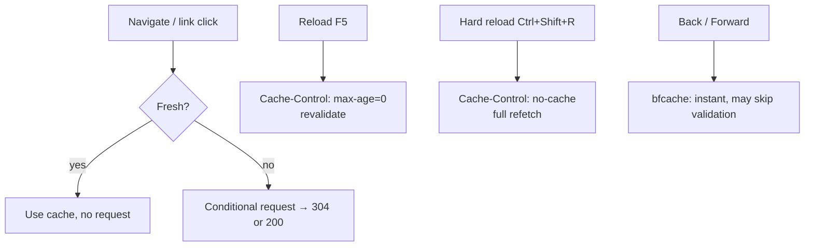

# Client-Side Caching

!!! tip "In a nutshell"
    The browser keeps its own **private** cache and obeys `max-age`/`Expires`
    while ignoring `s-maxage`. Highest-yield fact: a normal reload sends
    `max-age=0` (revalidate → maybe 304), a hard reload sends `no-cache` (full
    refetch), and you "bust" a cached asset by changing its URL, not by clearing it.

!!! example "Real-world analogy"
    Picture a report you printed and keep on your own desk. If your copy is recent enough
    (still **fresh**), you just read it without walking to the archive. A normal **reload**
    is phoning the archive to ask "has this changed since my copy?" — often the answer is
    "no, keep yours" (a bodyless `304`). A **hard reload** is binning your copy and fetching
    a brand-new print. And you can never force yourself to notice a new edition filed under
    the same title; instead the publisher gives the new edition a new title (a fingerprinted
    URL) so it lands as something you have never seen before.

!!! abstract "Learning objectives"
    By the end of this chapter you can:

    - [ ] Describe how a browser decides to reuse, revalidate or refetch a response.
    - [ ] Read the `Cache-Control` **request** directives a client can send.
    - [ ] Explain why `private` and `max-age` govern the browser's private cache.
    - [ ] Predict browser behaviour on reload vs hard-reload vs back/forward.

    **Syllabus:** `HTTP Caching → Client-side caching` ·
    **Level:** Advanced ·
    **Est. time:** 18 min ·
    **Prerequisites:** [Expiration](expiration.md), [Validation](validation.md)

---

## Theory

The browser has its own **private cache**. Before making a network request it
checks that cache and, based on the *response* headers stored earlier, decides
one of three things:

1. **Reuse** the stored copy without any request — it is still **fresh**
   (`max-age`/`Expires` not elapsed).
2. **Revalidate** — it is stale (or `no-cache`); send a conditional request
   (`If-None-Match`/`If-Modified-Since`) and hope for a `304`.
3. **Refetch** — nothing usable is stored, or `no-store`; do a full request.

```http
# 1. Fresh (max-age/Expires not elapsed): reuse silently, no request at all
# 2. Stale or no-cache: revalidate with a conditional request
GET /report.pdf HTTP/1.1
If-None-Match: "abc123"
If-Modified-Since: Tue, 30 Jun 2026 08:00:00 GMT

HTTP/1.1 304 Not Modified

# 3. Nothing stored (or no-store): full request, full 200 response
```

Because it is a *private* cache, the browser honours `max-age` but **ignores
`s-maxage`**, and it may store `private` responses (a shared cache may not).

```http
HTTP/1.1 200 OK
Cache-Control: private, max-age=600, s-maxage=3600

# Browser (private cache): may store it, fresh for 600 s (max-age)
# s-maxage=3600 is ignored -- it only targets shared caches
```

### `Cache-Control` request directives

`Cache-Control` also travels on the **request**, letting the client influence
caches on the path:

| Request directive | Meaning |
|---|---|
| `no-cache` | Force revalidation — don't serve a cached copy without checking |
| `no-store` | Don't store the request/response |
| `max-age=0` | Treat anything older than 0 s as stale (⇒ revalidate) |
| `max-stale[=N]` | Willing to accept a stale response (up to N s) |
| `min-fresh=N` | Only accept a response fresh for at least N more seconds |
| `only-if-cached` | Return a cached copy or `504` — no origin request |

!!! question "Predict first"
    A user presses **F5** (normal reload) on a page whose asset is still fresh.
    Does the browser refetch the asset, revalidate it, or reuse it silently?

??? note "Reveal"
    A normal reload sends `Cache-Control: max-age=0`, forcing **revalidation**: the
    browser issues a conditional request and usually gets a bodyless `304`, keeping
    the old bytes. Only a **hard reload** (`no-cache`) refetches fully; plain
    navigation to a fresh resource skips the network entirely.

## Deep Dive — how it works internally

### Reload vs hard reload

The browser's UI actions map to request directives — a favourite exam-adjacent
detail:



- **Normal navigation** uses the freshness rules — a fresh resource loads with
  **no** network request at all.
- **Reload** typically sends `Cache-Control: max-age=0`, forcing revalidation but
  allowing a `304`.
- **Hard reload** sends `Cache-Control: no-cache` (and often `Pragma: no-cache`),
  forcing a full refetch.
- **Back/forward** may use the in-memory **bfcache**, restoring the page
  instantly and bypassing normal validation.

```http
# Reload (F5): revalidate -- a 304 keeps the cached bytes
GET /page HTTP/1.1
Cache-Control: max-age=0

# Hard reload (Ctrl+Shift+R): full refetch, no 304 possible
GET /page HTTP/1.1
Cache-Control: no-cache
Pragma: no-cache
```

### What the browser stores

The browser respects the same response headers Symfony sets:

- `no-store` → never written to disk/memory cache.
- `private` → *may* be stored (it is the browser, a private cache).
- `max-age`/`Expires` → freshness window for silent reuse.
- `ETag`/`Last-Modified` → reused as `If-None-Match`/`If-Modified-Since` when
  revalidating.
- `Vary` → the browser must match the varied request headers too.
- `immutable` → the browser skips revalidation even on reload while fresh (great
  for fingerprinted assets).

```http
# Stored response (no `no-store`, so the browser may keep it)
HTTP/1.1 200 OK
Cache-Control: private, max-age=3600, immutable
Expires: Tue, 07 Jul 2026 12:00:00 GMT
ETag: "a1b2c3"
Last-Modified: Mon, 06 Jul 2026 10:00:00 GMT
Vary: Accept-Encoding

# Once stale, the validators come back on the next conditional request
# (which must also match the varied header, here Accept-Encoding):
GET /app.css HTTP/1.1
If-None-Match: "a1b2c3"
If-Modified-Since: Mon, 06 Jul 2026 10:00:00 GMT
Accept-Encoding: gzip
```

!!! note "Symfony's role is only to emit headers"
    Symfony never talks to the browser cache directly; it just sets the
    `Response` headers via `Symfony\Component\HttpFoundation\Response`. The
    browser's cache is entirely governed by those emitted headers plus the
    request the user's action generates.

### Requests that bypass the cache anyway

Non-safe methods (`POST`, `PUT`, `PATCH`, `DELETE`) are **not** served from cache
and can invalidate stored entries for the target URL. Only **safe** methods
(`GET`, `HEAD`) are cached. See [HTTP Methods](../http/methods.md).

```php
// Safe methods are cache candidates; unsafe ones always hit the origin
$cacheable = in_array($request->getMethod(), ['GET', 'HEAD'], true);

// POST, PUT, PATCH and DELETE bypass the cache and invalidate the URL's entry
```

## Configuration & code

=== "Emit browser-friendly headers"

    ```php
    <?php
    declare(strict_types=1);

    use Symfony\Component\HttpFoundation\Response;

    // Fingerprinted asset: cache hard in the browser for a year, never revalidate.
    $response = new Response($css, 200, ['Content-Type' => 'text/css']);
    $response->setPublic();
    $response->setMaxAge(31536000);   // 1 year, browser + shared
    $response->setImmutable();         // skip revalidation while fresh
    ```

=== "Read request directives"

    ```php
    <?php
    declare(strict_types=1);

    use Symfony\Component\HttpFoundation\Request;

    // Did the client force a revalidation (reload)? The directive value is a
    // string ("0"), so compare as a string.
    $forceRevalidate = $request->headers->hasCacheControlDirective('no-cache')
        || '0' === $request->headers->getCacheControlDirective('max-age');
    ```

=== "Raw HTTP (hard reload)"

    ```http
    GET /app.css HTTP/1.1
    Cache-Control: no-cache
    Pragma: no-cache
    ```

## Best practices & anti-patterns

| ✅ Do | ❌ Avoid |
|---|---|
| `immutable` + long `max-age` for fingerprinted assets | Long `max-age` on URLs whose content changes in place |
| Keep HTML short-lived or validated | Caching HTML for a year in the browser |
| Let the server decide; emit correct headers | Trying to control the browser cache from JS hacks |
| Use content-hashed asset URLs for cache-busting | Query-string `?v=` busting on shared caches |

## When (not) to use it / alternatives

Aggressive browser caching is perfect for **static, versioned assets**
(fingerprinted CSS/JS/images) — set a one-year `max-age` + `immutable`. For HTML
that changes, prefer short freshness plus [validation](validation.md) so a reload
costs a cheap `304`. You cannot *force* a browser to drop a cached, still-fresh
resource — you change its **URL** instead (cache busting).

!!! danger "Certification traps"
    - The browser **ignores `s-maxage`**; only `max-age`/`Expires` govern its
      private cache.
    - `Cache-Control` is both a **request** and a **response** header — the
      request directives (`no-cache`, `max-age=0`, `only-if-cached`) are separate
      from the response semantics.
    - **Reload** ≈ `max-age=0` (revalidate); **hard reload** ≈ `no-cache` (full
      refetch). They are not the same.
    - Only **safe** methods are cached; a `POST` is never served from cache.

!!! warning "Common mistakes"
    - Shipping an asset with `max-age=31536000` but a stable filename, so users
      keep the old file after a deploy — use fingerprinted URLs.
    - Expecting `s-maxage` to keep something in the browser cache — it won't.

## Exercises

1. **(Advanced)** Configure headers so a fingerprinted `app.a1b2c3.js` is cached
   by the browser for a year with no revalidation while fresh.
2. **(Expert)** A user reports "my reload doesn't fetch the new CSS." Explain the
   difference between reload and hard reload in cache terms, and the real fix.

??? success "Solutions"

    **1.** `setPublic()` + `setMaxAge(31536000)` + `setImmutable()`. The
    fingerprint in the filename is what lets you cache forever safely — a new
    build yields a new URL.

    **2.** A normal reload sends `max-age=0`, so the browser *revalidates*; if the
    server returns `304` (unchanged ETag/Last-Modified) the old bytes stay. A hard
    reload sends `no-cache` and refetches fully. The real fix is **cache busting**:
    serve the CSS under a content-hashed URL so a change produces a new URL the
    browser has never cached.

## Certification questions

??? question "Q1. Which directive does the browser ignore for its own cache?"
    - [ ] A. `max-age`
    - [x] B. `s-maxage` ✅
    - [ ] C. `no-store`
    - [ ] D. `immutable`

    **Why:** `s-maxage` targets shared caches; the browser is a private cache and
    uses `max-age`/`Expires`.
    **Ref:** [HTTP cache](https://symfony.com/doc/current/http_cache.html).

??? question "Q2. A normal browser **reload** typically sends…"
    - [ ] A. `Cache-Control: no-store`
    - [x] B. `Cache-Control: max-age=0` (revalidate) ✅
    - [ ] C. `Cache-Control: only-if-cached`
    - [ ] D. no `Cache-Control` at all

    **Why:** Reload asks caches to revalidate (`max-age=0`); hard reload sends
    `no-cache` for a full refetch.
    **Ref:** [Cache-Control request directives](https://developer.mozilla.org/en-US/docs/Web/HTTP/Headers/Cache-Control#request_directives).

??? question "Q3. What does `immutable` buy for a fingerprinted asset?"
    - [x] A. The browser skips revalidation while the response is fresh ✅
    - [ ] B. The asset is cached forever regardless of `max-age`
    - [ ] C. Shared caches refuse to store it
    - [ ] D. It forces HTTPS

    **Why:** `immutable` tells the browser the body won't change during its
    freshness window, so even a reload won't revalidate.
    **Ref:** [Cache-Control](https://developer.mozilla.org/en-US/docs/Web/HTTP/Headers/Cache-Control).

??? question "Q4. Which request is eligible to be served from the browser cache?"
    - [x] A. `GET /page` ✅
    - [ ] B. `POST /orders`
    - [ ] C. `DELETE /orders/5`
    - [ ] D. `PATCH /orders/5`

    **Why:** Only safe methods (`GET`, `HEAD`) are cacheable; unsafe methods are
    always sent to the origin and may invalidate entries.
    **Ref:** [HTTP methods](../http/methods.md).

## Key takeaways

- The browser is a **private** cache: honours `max-age`/`Expires`, ignores
  `s-maxage`, may store `private`.
- `Cache-Control` request directives (`no-cache`, `max-age=0`, `only-if-cached`)
  let the client steer caches.
- Reload ≈ revalidate; hard reload ≈ full refetch; bfcache restores instantly.
- Only safe methods are cached; version asset URLs to bust the cache.

## Last-minute revision

!!! tip "Cheat sheet"
    - Browser cache = private: `max-age`/`Expires`/`ETag`; ignores `s-maxage`.
    - Reload → `max-age=0` (304 possible). Hard reload → `no-cache` (refetch).
    - Fingerprinted asset → `public, max-age=31536000, immutable`.
    - Cache busting = new URL, not "clearing" the browser cache.

## Connections

- **Depends on:** [Cache Types](cache-types.md) — the browser is the *private*
  cache, so it obeys `max-age` but ignores `s-maxage`.
- **Reused in:** [Validation](validation.md) — the browser's conditional request
  (`If-None-Match`) on a stale entry is what turns into a `304`.
- **Confused with:** [Server-Side Caching](server-side.md) — the browser cache is
  per-user and out of your control; the reverse proxy is shared and yours.

## Official References
- [Symfony docs — HTTP cache](https://symfony.com/doc/current/http_cache.html)
- [MDN — Cache-Control (request directives)](https://developer.mozilla.org/en-US/docs/Web/HTTP/Headers/Cache-Control#request_directives)
- [MDN — HTTP caching](https://developer.mozilla.org/en-US/docs/Web/HTTP/Caching)

## Video references

!!! tip "Watch & learn"
    These are official, continuously-updated video channels — search them for
    "HTTP caching" to reinforce this chapter. We link stable channels rather than
    individual videos so the references never rot.

    - [SymfonyCasts screencasts](https://symfonycasts.com/tracks/symfony) — scripted, code-along tutorials.
    - [Symfony official YouTube](https://www.youtube.com/@SymfonyOfficial) — SymfonyCon conference talks & keynotes.
    - [Official docs for this topic](https://symfony.com/doc/current/http_cache.html) — some Symfony doc pages embed a screencast.

## Confidence check

I'm ready when I can:

- [ ] explain **why** the browser is a private cache and what problem client-side reuse solves
- [ ] emit browser-friendly headers (`immutable`, long `max-age`) for a fingerprinted asset in Symfony 8
- [ ] debug "my reload doesn't fetch the new CSS" (reload vs hard reload vs cache busting)
- [ ] spot the trap that the browser ignores `s-maxage`
- [ ] explain how a UI action (F5 / Ctrl+Shift+R) maps to `Cache-Control` request directives

---

<small>Related: [Expiration](expiration.md) · [Validation](validation.md) ·
[Cache Types](cache-types.md) · [Server-Side Caching](server-side.md)</small>
