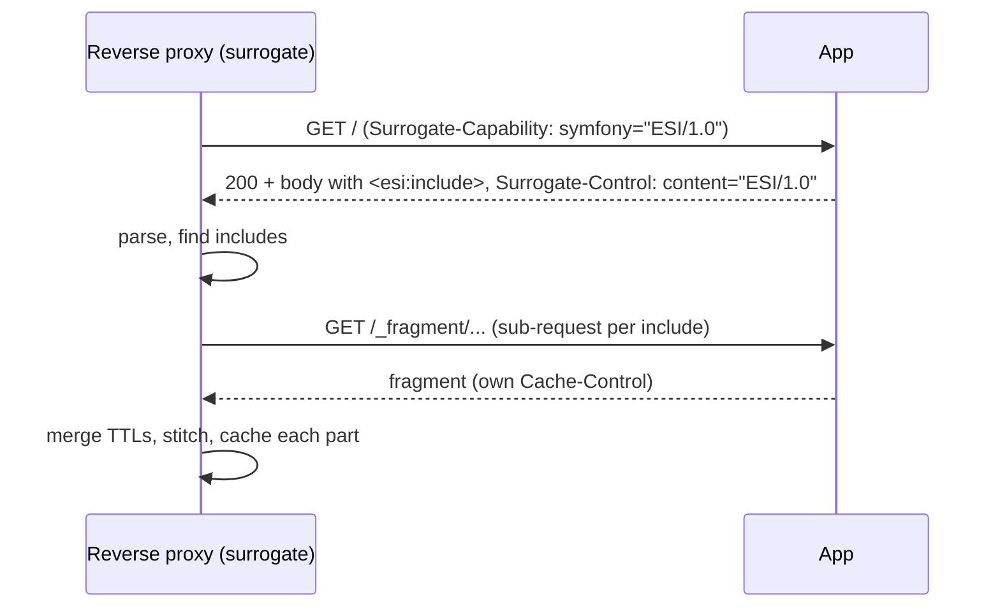

# Edge Side Includes (ESI)

**Exclu de la certification Symfony 8.** ESI ne figure pas au programme
officiel de la certification Symfony 8. Ce chapitre est conservé comme
contenu additionnel / d'approfondissement — voir `specs/TraceabilityMatrix.md`
pour la séparation officiel/additionnel — et n'est pas testé dans les examens
générés ni compté dans la couverture officielle du syllabus.

!!! tip "In a nutshell"
    ESI permet à une même page de mélanger les fraîcheurs : les trous
    `<esi:include>` sont récupérés et mis en cache séparément par le reverse
    proxy, si bien qu'une coquille à longue durée de vie peut envelopper un
    fragment par utilisateur. Accroche d'examen : `render_esi()` n'émet le tag
    que lorsqu'un surrogate annonce la capacité ESI — sinon il rend le fragment
    inline.

!!! example "Real-world analogy"
    Pensez à un panneau d'information de musée : un grand panneau imprimé permanent avec
    quelques emplacements pour cartes à clipser. Le grand panneau est réimprimé rarement,
    tandis que la carte « événements du jour » et une carte par visiteur « la langue de
    votre audioguide » sont remplacées selon leurs propres calendriers et glissées dans les
    découpes. Un membre du personnel (le **surrogate**, c'est-à-dire le reverse proxy)
    conserve le panneau durable et ne rafraîchit que les cartes expirées, au lieu de
    réimprimer tout le panneau. Sans personnel de service, tout est imprimé en une seule
    feuille plate et le panneau entier doit être réimprimé aussi souvent que sa carte qui
    change le plus fréquemment.

!!! abstract "Learning objectives"
    À la fin de ce chapitre, vous saurez :

    - [ ] Expliquer ce qu'est un `<esi:include>` et pourquoi il permet des fraîcheurs mélangées.
    - [ ] Activer ESI (`framework.esi`) et intégrer un fragment avec `render_esi`.
    - [ ] Décrire comment le surrogate annonce/traite l'ESI dans le reverse proxy.
    - [ ] Décider quand ESI l'emporte sur le cache pleine page, et quand SSI convient.

    **Syllabus:** `HTTP Caching → Edge Side Includes` ·
    **Level:** Expert ·
    **Est. time:** 22 min ·
    **Prerequisites:** [Server-Side Caching](server-side.md)

---

## Theory

Une même page mélange souvent les fraîcheurs : une coquille statique (en cache
une heure), un bandeau d'actualités (une minute) et un message d'accueil par
utilisateur (jamais partagé). Mettre en cache la page entière signifie que la
durée de vie la plus courte l'emporte. Les **Edge Side Includes (ESI)**
résolvent ce problème en laissant la page déclarer des **trous** que le cache
remplit indépendamment, chacun avec sa **propre** durée de vie de cache.

Un tag ESI est un espace réservé dans le corps de la response :

```html
<esi:include src="/_fragment/user-greeting" />
```

Le **surrogate** (le reverse proxy) récupère chaque `src` comme une
*sub-request*, la met en cache selon ses propres conditions et assemble le
résultat dans la page externe. La page externe peut donc être mise en cache
longtemps même si un fragment est privé ou à courte durée de vie.

!!! question "Predict first"
    Vous enveloppez un message d'accueil par utilisateur dans `render_esi(...)`
    mais exécutez l'application **sans** reverse proxy. Que contient la page
    rendue à l'emplacement du message d'accueil ?

??? note "Reveal"
    Le message d'accueil lui-même, rendu **inline**. `render_esi` n'émet un tag
    `<esi:include>` que lorsqu'un surrogate annonce la capacité ESI
    (`Surrogate-Capability`) ; sinon il se rabat sur le rendu inline, si bien que
    le même template fonctionne avec ou sans proxy — vous n'avez simplement pas
    de cache séparé.

## Deep Dive — how it works internally

### Capability negotiation



1. Le proxy ajoute `Surrogate-Capability: symfony="ESI/1.0"` à la request pour
   que le backend sache qu'un surrogate peut traiter l'ESI.
2. Le `render_esi` de Symfony n'émet un tag `<esi:include>` **que si** cette
   capacité est présente ; sinon il se rabat sur le rendu **inline** du fragment
   (le même template fonctionne donc avec ou sans proxy).
3. Le backend ajoute `Surrogate-Control: content="ESI/1.0"` pour signaler qu'il
   a utilisé l'ESI.
4. Le proxy analyse le corps, émet une sub-request par include et met chaque
   fragment en cache indépendamment.

```http
# Proxy -> backend: advertise that a surrogate can process ESI
GET / HTTP/1.1
Surrogate-Capability: symfony="ESI/1.0"

# Backend -> proxy: render_esi emitted a tag and signals ESI was used
HTTP/1.1 200 OK
Surrogate-Control: content="ESI/1.0"

<esi:include src="/_fragment?_path=..." />
```

### The classes

- `Symfony\Component\HttpKernel\HttpCache\Esi` implémente `SurrogateInterface`
  (et `Ssi` pour le SSI). Il annonce la capacité, détecte les `<esi:include>`
  et les traite. C'est le `$surrogate` passé à
  [`HttpCache`](server-side.md).
- `Symfony\Component\HttpKernel\Fragment\EsiFragmentRenderer` (alias de renderer
  `esi`) transforme une référence de controller en tag `<esi:include>` ; la
  fonction Twig `render_esi` délègue au fragment handler
  (`Symfony\Component\HttpKernel\Fragment\FragmentHandler`).
- Les URLs de fragments sont signées par
  `Symfony\Component\HttpFoundation\UriSigner` (via `framework.fragments`
  et le secret de l'application) afin que des appels `_fragment` arbitraires ne
  puissent pas être forgés. (L'URI est construite par
  `Symfony\Component\HttpKernel\Fragment\FragmentUriGenerator`.)

```php
use Symfony\Component\HttpKernel\HttpCache\Esi;
use Symfony\Component\HttpKernel\HttpCache\HttpCache;
use Symfony\Component\HttpKernel\HttpCache\Ssi;

// Esi and Ssi both implement SurrogateInterface
$cache = new HttpCache($kernel, $store, new Esi()); // the $surrogate argument

// In Twig, render_esi delegates to FragmentHandler, which picks the "esi"
// renderer (EsiFragmentRenderer); the fragment URI is built by
// FragmentUriGenerator and signed by UriSigner (framework.fragments + secret).
```

!!! note "Source reference"
    `Symfony\Component\HttpKernel\HttpCache\Esi` et
    `...\Fragment\EsiFragmentRenderer` —
    [symfony/symfony `8.0`](https://github.com/symfony/symfony/blob/8.0/src/Symfony/Component/HttpKernel/HttpCache/Esi.php).

### TTL merging

Le surrogate utilise une `ResponseCacheStrategy` : le TTL effectif de la
response **externe** est réduit au **minimum** de ses fragments intégrés *sauf*
s'ils sont servis via ESI. C'est tout l'intérêt — avec ESI, chaque fragment
conserve son propre TTL et la coquille garde le sien, long, parce qu'ils sont
mis en cache comme des entrées séparées. Sans ESI (rendu inline), le fragment à
la durée de vie la plus courte tire vers le bas le TTL de toute la page.

### The fragment sub-request

Chaque `<esi:include src>` pointe vers la route `_fragment` de Symfony (gérée
par le `FragmentListener`). Le controller référencé s'exécute comme une
sub-request indépendante avec sa propre `Response` — il définit donc son propre
`#[Cache(...)]`.

```php
// FragmentListener resolves the signed /_fragment URL to this controller,
// which runs as its own sub-request and returns its own Response.
#[Cache(smaxage: 30)]           // freshness for this fragment only
public function newsTicker(): Response
{
    return $this->render('fragment/ticker.html.twig');
}
```

## Configuration & code

=== "Enable ESI/SSI (YAML)"

    ```yaml
    # config/packages/framework.yaml
    framework:
        esi: true          # or { enabled: true }
        # ssi: true        # Server Side Includes alternative
        fragments: { path: /_fragment }
        http_cache: true   # the reverse proxy that processes ESI
    ```

=== "Twig template"

    ```twig
    {# templates/layout.html.twig #}
    <header>{{ render_esi(controller('App\\Controller\\FragmentController::userGreeting')) }}</header>

    <main>{{ block('content') }}</main>

    {# SSI equivalent: render_ssi(controller(...)) #}
    ```

=== "Fragment controller"

    ```php
    <?php
    declare(strict_types=1);

    namespace App\Controller;

    use Symfony\Bundle\FrameworkBundle\Controller\AbstractController;
    use Symfony\Component\HttpFoundation\Response;
    use Symfony\Component\HttpKernel\Attribute\Cache;

    final class FragmentController extends AbstractController
    {
        // Fragment cached for just 5 s, independent of the outer page.
        #[Cache(smaxage: 5)]
        public function userGreeting(): Response
        {
            return $this->render('fragment/greeting.html.twig', [
                'user' => $this->getUser(),
            ]);
        }
    }
    ```

=== "Rendered body (proxy view)"

    ```html
    <header><esi:include src="/_fragment?_hash=...&_path=..." /></header>
    <main>...long-lived shell...</main>
    ```

## Best practices & anti-patterns

| ✅ Do | ❌ Avoid |
|---|---|
| Isoler les parties à courte durée de vie/par utilisateur en fragments ESI | Dégrader le TTL de toute la page pour un widget |
| Garder la coquille `public` + long `s-maxage` | Rendre toute la page `private` pour un message d'accueil |
| Donner à chaque fragment son propre `#[Cache]` | Oublier que le fragment ne définit aucun header de cache |
| Compter sur le fallback inline en dev | Supposer qu'ESI fonctionne sans surrogate |

## When (not) to use it / alternatives

Utilisez ESI quand une page est **majoritairement cachable** mais comporte
quelques parties de fraîcheur différente (ou du contenu par utilisateur) — cela
permet à la coquille coûteuse de rester en cache. Passez-vous d'ESI quand toute
la page partage une seule durée de vie (le simple cache pleine page est plus
simple), ou quand il n'y a aucun reverse proxy (les fragments sont juste rendus
inline, sans aucun bénéfice). **SSI** (`render_ssi`) est l'alternative quasi
identique pour les serveurs (nginx, Apache `mod_include`, Varnish) qui parlent
Server Side Includes au lieu d'ESI. Pour du chargement paresseux purement côté
client (sans objectif de cache), un fragment AJAX/`hinclude` peut mieux
convenir.

!!! danger "Certification traps"
    - `render_esi` n'émet un `<esi:include>` **que lorsqu'un surrogate annonce la
      capacité ESI** ; sinon il rend silencieusement le fragment **inline**. Même
      template, deux comportements.
    - ESI laisse chaque fragment conserver son **propre TTL** ; sans lui, le
      fragment intégré à la durée de vie la plus courte plafonne le TTL de **toute
      la page** (`ResponseCacheStrategy`).
    - L'ESI est traité par le **reverse proxy** (Symfony `HttpCache` ou Varnish),
      pas par PHP en soi — vous devez activer `framework.esi` **et** exécuter un
      surrogate.
    - Les URIs de fragments sont **signées** (`UriSigner`) pour empêcher les
      requests `_fragment` forgées.
    - **SSI** est le jumeau : même idée, `render_ssi`, surrogate `Ssi`,
      `framework.ssi`.

!!! warning "Common mistakes"
    - Activer `framework.esi` sans exécuter le reverse proxy, puis se demander
      pourquoi rien n'est mis en cache séparément (le rendu se fait inline).
    - Oublier de définir des headers de cache sur le controller de fragment, si
      bien que le fragment est non cachable et re-récupéré à chaque fois.

## Exercises

1. **(Advanced)** Transformez un message d'accueil par utilisateur au sein d'une
   page en cache longue durée en un fragment ESI mis en cache 5 secondes.
   Activez ESI et écrivez le Twig + le controller.
2. **(Expert)** Expliquez pourquoi, sans ESI, ajouter un fragment
   `#[Cache(smaxage: 5)]` à une page `s-maxage=3600` fait s'effondrer toute la
   page à un TTL de 5 secondes.

??? success "Solutions"

    **1.** Activez `framework.esi: true` (+ `http_cache: true`), intégrez
    `{{ render_esi(controller('App\\Controller\\FragmentController::userGreeting')) }}`,
    et annotez `userGreeting()` avec `#[Cache(smaxage: 5)]` (voir les onglets
    ci-dessus). La coquille conserve son long `s-maxage` ; le message d'accueil
    se rafraîchit toutes les 5 s.

    **2.** Sans ESI, le fragment est rendu **inline** dans la response maître, et
    `ResponseCacheStrategy` réduit la fraîcheur de la response maître au
    **minimum** de toutes les responses intégrées — le fragment de 5 secondes
    l'emporte donc et toute la page devient fraîche pendant 5 secondes seulement.
    ESI évite cela en mettant le fragment en cache comme une entrée **séparée**,
    laissant intact le TTL de la coquille.

## Certification questions

??? question "Q1. When does `render_esi` actually output an `<esi:include>` tag?"
    - [ ] A. Always
    - [x] B. Only when a surrogate advertises ESI capability; else it renders inline ✅
    - [ ] C. Only in the dev environment
    - [ ] D. Only for JSON responses

    **Why:** Le renderer ESI vérifie la capacité du surrogate ; sans elle, le
    fragment est rendu inline pour que le template fonctionne quand même.
    **Ref:** [ESI](https://symfony.com/doc/current/http_cache/esi.html).

??? question "Q2. What is the main benefit of ESI over full-page caching?"
    - [ ] A. Smaller HTML
    - [x] B. Each fragment can have its own cache lifetime ✅
    - [ ] C. It encrypts fragments
    - [ ] D. It removes the need for a reverse proxy

    **Why:** ESI met les fragments en cache comme des entrées indépendantes, si
    bien qu'une coquille à longue durée de vie peut coexister avec des parties à
    courte durée de vie ou par utilisateur.
    **Ref:** [ESI](https://symfony.com/doc/current/http_cache/esi.html).

??? question "Q3. Which processes the `<esi:include>` tags?"
    - [ ] A. The Twig compiler
    - [ ] B. The PHP engine at render time
    - [x] C. The reverse proxy / surrogate (`HttpCache` or Varnish) ✅
    - [ ] D. The browser

    **Why:** L'ESI est une fonctionnalité de *surrogate* ; le gateway cache
    récupère et assemble les includes.
    **Ref:** [Esi surrogate](https://github.com/symfony/symfony/blob/8.0/src/Symfony/Component/HttpKernel/HttpCache/Esi.php).

??? question "Q4. Why are `_fragment` URIs signed?"
    - [x] A. To stop attackers forging arbitrary fragment requests ✅
    - [ ] B. To compress them
    - [ ] C. To enable HTTP/2 push
    - [ ] D. To set the ETag

    **Why:** `UriSigner` signe les URIs de fragments avec le secret de
    l'application, si bien que seuls les appels de fragments légitimement générés
    sont honorés.
    **Ref:** [Fragments](https://symfony.com/doc/current/http_cache/esi.html).

## Key takeaways

- L'ESI déclare des **trous** que le surrogate remplit via des sub-requests
  indépendantes, chacune avec son propre TTL — des fraîcheurs mélangées sur une
  seule page.
- Activez `framework.esi: true` et intégrez avec `render_esi(controller(...))` ;
  sans surrogate, le rendu se fait inline.
- Le traitement a lieu dans le reverse proxy (`HttpCache`/Varnish) via le
  surrogate `Esi` ; les URIs de fragments sont signées.
- SSI (`render_ssi`) est l'équivalent pour les serveurs compatibles SSI.

## Last-minute revision

!!! tip "Cheat sheet"
    - Activation : `framework.esi: true` (+ `http_cache: true`). SSI :
      `framework.ssi`.
    - Twig : `render_esi(controller('Ctrl::method'))` ; le fragment définit son
      propre `#[Cache]`.
    - Pas de surrogate → `render_esi` se rabat sur le rendu **inline**.
    - Classes : `HttpCache\Esi` (SurrogateInterface), `Fragment\EsiFragmentRenderer`.
    - Sans ESI, le TTL intégré le plus court plafonne toute la page.

## Connections

- **Depends on:** [Server-Side Caching](server-side.md) — le surrogate qui
  remplit les trous ESI est le reverse proxy (`HttpCache`/Varnish).
- **Reused in:** [Controller Rendering (Twig)](../twig/controller-rendering.md) —
  `render_esi(controller(...))` s'appuie sur la mécanique fragment/sub-request.
- **Confused with:** [Cache Types](cache-types.md) — l'ESI isole la fraîcheur
  d'un *fragment* plutôt que de choisir `public`/`private` pour toute la page.

## Official References
- [Symfony docs — ESI](https://symfony.com/doc/current/http_cache/esi.html)
- [Symfony source — Esi](https://github.com/symfony/symfony/blob/8.0/src/Symfony/Component/HttpKernel/HttpCache/Esi.php)
- [Symfony source — EsiFragmentRenderer](https://github.com/symfony/symfony/blob/8.0/src/Symfony/Component/HttpKernel/Fragment/EsiFragmentRenderer.php)

## Video references

!!! tip "Watch & learn"
    Voici des chaînes vidéo officielles, mises à jour en continu — cherchez-y
    "HTTP caching" pour consolider ce chapitre. Nous lions des chaînes stables
    plutôt que des vidéos individuelles pour que les références ne se périment
    jamais.

    - [SymfonyCasts screencasts](https://symfonycasts.com/tracks/symfony) — tutoriels scénarisés à suivre en codant.
    - [Symfony official YouTube](https://www.youtube.com/@SymfonyOfficial) — conférences et keynotes SymfonyCon.
    - [Official docs for this topic](https://symfony.com/doc/current/http_cache/esi.html) — certaines pages de la doc Symfony intègrent un screencast.

## Confidence check

Je suis prêt quand je peux :

- [ ] expliquer **pourquoi** l'ESI existe — des fraîcheurs mélangées sur une page sans plafonner le TTL de la coquille
- [ ] activer `framework.esi` et intégrer un fragment avec `render_esi` en Symfony 8
- [ ] déboguer « rien n'est mis en cache séparément » (pas de surrogate → fallback inline)
- [ ] repérer que sans ESI le TTL intégré le plus court (`ResponseCacheStrategy`) plafonne toute la page
- [ ] nommer les classes — `HttpCache\Esi`, `EsiFragmentRenderer`, `UriSigner` — et expliquer comment elles collaborent

---

<small>Related: [Server-Side Caching](server-side.md) · [Cache Types](cache-types.md) ·
[Controller Rendering (Twig)](../twig/controller-rendering.md)</small>
