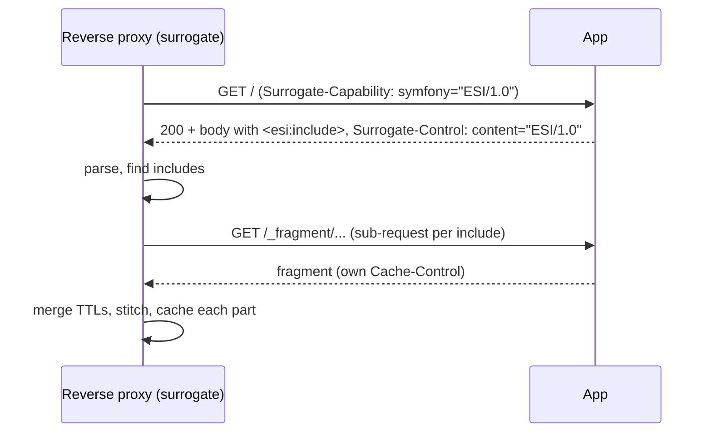

# Edge Side Includes (ESI)

!!! tip "In a nutshell"
    ESI lets one page mix freshness: `<esi:include>` holes are fetched and cached
    separately by the reverse proxy, so a long-lived shell can wrap a per-user
    fragment. Exam hook: `render_esi()` only emits the tag when a surrogate
    advertises ESI capability — otherwise it renders the fragment inline.

!!! example "Real-world analogy"
    Think of a museum information board that is a permanent printed panel with a few clip-in
    card slots. The big panel is reprinted rarely, while the "today's events" card and a
    per-visitor "your audioguide language" card are swapped on their own schedules and
    slotted into cutouts. A staff member (the **surrogate**, i.e. the reverse proxy) holds
    the durable panel and refreshes only the cards that expired, instead of reprinting the
    whole board. With no such staff member on duty, everything is printed as one flat sheet
    and the entire board must be reprinted as often as its most frequently-changing card.

!!! abstract "Learning objectives"
    By the end of this chapter you can:

    - [ ] Explain what an `<esi:include>` is and why it enables mixed freshness.
    - [ ] Enable ESI (`framework.esi`) and embed a fragment with `render_esi`.
    - [ ] Describe how the surrogate advertises/processes ESI in the reverse proxy.
    - [ ] Decide when ESI beats full-page caching, and when SSI is the fit.

    **Syllabus:** `HTTP Caching → Edge Side Includes` ·
    **Level:** Expert ·
    **Est. time:** 22 min ·
    **Prerequisites:** [Server-Side Caching](server-side.md)

---

## Theory

A single page often mixes freshness: a static shell (cache for an hour), a news
ticker (a minute), and a per-user greeting (never shared). Caching the whole page
means the shortest lifetime wins. **Edge Side Includes (ESI)** solve this by
letting the page declare **holes** that the cache fills independently, each with
its **own** cache lifetime.

An ESI tag is a placeholder in the response body:

```html
<esi:include src="/_fragment/user-greeting" />
```

The **surrogate** (the reverse proxy) fetches each `src` as a *sub-request*,
caches it on its own terms, and stitches the result into the outer page. The
outer page can therefore be cached for a long time even though one fragment is
private or short-lived.

!!! question "Predict first"
    You wrap a per-user greeting in `render_esi(...)` but run the app **without** a
    reverse proxy. What does the rendered page contain where the greeting goes?

??? note "Reveal"
    The greeting itself, rendered **inline**. `render_esi` emits an
    `<esi:include>` tag only when a surrogate advertises ESI capability
    (`Surrogate-Capability`); otherwise it falls back to inline rendering so the
    same template works with or without a proxy — you just get no separate caching.

## Deep Dive — how it works internally

### Capability negotiation



1. The proxy adds `Surrogate-Capability: symfony="ESI/1.0"` to the request so the
   backend knows a surrogate can process ESI.
2. Symfony's `render_esi` emits an `<esi:include>` tag **only if** that capability
   is present; otherwise it falls back to rendering the fragment **inline**
   (so the same template works with or without a proxy).
3. The backend adds `Surrogate-Control: content="ESI/1.0"` to signal it used ESI.
4. The proxy parses the body, issues a sub-request per include, and caches each
   fragment independently.

### The classes

- `Symfony\Component\HttpKernel\HttpCache\Esi` implements `SurrogateInterface`
  (and `Ssi` for SSI). It advertises capability, detects `<esi:include>` and
  processes them. It is the `$surrogate` passed to
  [`HttpCache`](server-side.md).
- `Symfony\Component\HttpKernel\Fragment\EsiFragmentRenderer` (renderer alias
  `esi`) turns a controller reference into the `<esi:include>` tag; the
  `render_esi` Twig function delegates to the fragment handler
  (`Symfony\Component\HttpKernel\Fragment\FragmentHandler`).
- Fragment URLs are signed by
  `Symfony\Component\HttpFoundation\UriSigner` (via `framework.fragments`
  and the app secret) so arbitrary `_fragment` calls cannot be forged. (The URI
  is built by `Symfony\Component\HttpKernel\Fragment\FragmentUriGenerator`.)

!!! note "Source reference"
    `Symfony\Component\HttpKernel\HttpCache\Esi` and
    `...\Fragment\EsiFragmentRenderer` —
    [symfony/symfony `8.0`](https://github.com/symfony/symfony/blob/8.0/src/Symfony/Component/HttpKernel/HttpCache/Esi.php).

### TTL merging

The surrogate uses a `ResponseCacheStrategy`: the **outer** response's effective
TTL is reduced to the **minimum** of its embedded fragments *unless* they are
served via ESI. That is the whole point — with ESI each fragment keeps its own
TTL and the shell keeps its long one, because they are cached as separate
entries. Without ESI (inline rendering), the shortest-lived fragment drags the
whole page's TTL down.

### The fragment sub-request

Each `<esi:include src>` points at Symfony's `_fragment` route
(`FragmentListener` handles it). The referenced controller runs as an independent
sub-request with its own `Response` — so it sets its own `#[Cache(...)]`.

## Configuration & code

=== "Enable ESI/SSI (YAML)"

    ```yaml
    # config/packages/framework.yaml
    framework:
        esi: true          # or { enabled: true }
        # ssi: true        # Server Side Includes alternative
        fragments: { path: /_fragment }
        http_cache: true   # the reverse proxy that processes ESI
    ```

=== "Twig template"

    ```twig
    {# templates/layout.html.twig #}
    <header>{{ render_esi(controller('App\\Controller\\FragmentController::userGreeting')) }}</header>

    <main>{{ block('content') }}</main>

    {# SSI equivalent: render_ssi(controller(...)) #}
    ```

=== "Fragment controller"

    ```php
    <?php
    declare(strict_types=1);

    namespace App\Controller;

    use Symfony\Bundle\FrameworkBundle\Controller\AbstractController;
    use Symfony\Component\HttpFoundation\Response;
    use Symfony\Component\HttpKernel\Attribute\Cache;

    final class FragmentController extends AbstractController
    {
        // Fragment cached for just 5 s, independent of the outer page.
        #[Cache(smaxage: 5)]
        public function userGreeting(): Response
        {
            return $this->render('fragment/greeting.html.twig', [
                'user' => $this->getUser(),
            ]);
        }
    }
    ```

=== "Rendered body (proxy view)"

    ```html
    <header><esi:include src="/_fragment?_hash=...&_path=..." /></header>
    <main>...long-lived shell...</main>
    ```

## Best practices & anti-patterns

| ✅ Do | ❌ Avoid |
|---|---|
| Isolate short-lived/per-user bits as ESI fragments | Downgrading the whole page's TTL for one widget |
| Keep the shell `public` + long `s-maxage` | Making the whole page `private` for a greeting |
| Give each fragment its own `#[Cache]` | Forgetting the fragment sets no cache headers |
| Rely on the inline fallback in dev | Assuming ESI works without a surrogate |

## When (not) to use it / alternatives

Use ESI when a page is **mostly cacheable** but has a few parts with different
freshness (or per-user content) — it lets the expensive shell stay cached. Skip
ESI when the whole page shares one lifetime (plain full-page caching is simpler),
or when there is no reverse proxy at all (fragments just render inline, giving no
benefit). **SSI** (`render_ssi`) is the near-identical alternative for servers
(nginx, Apache `mod_include`, Varnish) that speak Server Side Includes instead of
ESI. For pure client-side laziness (no caching goal), an AJAX/`hinclude` fragment
may fit better.

!!! danger "Certification traps"
    - `render_esi` emits an `<esi:include>` **only when a surrogate advertises ESI
      capability**; otherwise it silently renders the fragment **inline**. Same
      template, two behaviours.
    - ESI lets each fragment keep its **own TTL**; without it, the shortest-lived
      embedded fragment caps the **whole page's** TTL (`ResponseCacheStrategy`).
    - ESI is processed by the **reverse proxy** (Symfony `HttpCache` or Varnish),
      not by PHP for its own sake — you must enable `framework.esi` **and** run a
      surrogate.
    - Fragment URIs are **signed** (`UriSigner`) to prevent forged `_fragment`
      requests.
    - **SSI** is the sibling: same idea, `render_ssi`, `Ssi` surrogate,
      `framework.ssi`.

!!! warning "Common mistakes"
    - Enabling `framework.esi` but not running the reverse proxy, then wondering
      why nothing is cached separately (it renders inline).
    - Forgetting to set cache headers on the fragment controller, so the fragment
      is uncacheable and re-fetched every time.

## Exercises

1. **(Advanced)** Turn a per-user greeting inside a long-cached page into an ESI
   fragment cached for 5 seconds. Enable ESI and write the Twig + controller.
2. **(Expert)** Explain why, without ESI, adding a `#[Cache(smaxage: 5)]` fragment
   to an `s-maxage=3600` page collapses the whole page to a 5-second TTL.

??? success "Solutions"

    **1.** Enable `framework.esi: true` (+ `http_cache: true`), embed
    `{{ render_esi(controller('App\\Controller\\FragmentController::userGreeting')) }}`,
    and annotate `userGreeting()` with `#[Cache(smaxage: 5)]` (see the tabs
    above). The shell keeps its long `s-maxage`; the greeting refreshes every 5 s.

    **2.** Without ESI the fragment is rendered **inline** into the master
    response, and `ResponseCacheStrategy` reduces the master's freshness to the
    **minimum** of all embedded responses — so the 5-second fragment wins and the
    whole page becomes 5-second-fresh. ESI avoids this by caching the fragment as
    a **separate** entry, leaving the shell's TTL intact.

## Certification questions

??? question "Q1. When does `render_esi` actually output an `<esi:include>` tag?"
    - [ ] A. Always
    - [x] B. Only when a surrogate advertises ESI capability; else it renders inline ✅
    - [ ] C. Only in the dev environment
    - [ ] D. Only for JSON responses

    **Why:** The ESI renderer checks the surrogate capability; without it, the
    fragment is rendered inline so the template still works.
    **Ref:** [ESI](https://symfony.com/doc/current/http_cache/esi.html).

??? question "Q2. What is the main benefit of ESI over full-page caching?"
    - [ ] A. Smaller HTML
    - [x] B. Each fragment can have its own cache lifetime ✅
    - [ ] C. It encrypts fragments
    - [ ] D. It removes the need for a reverse proxy

    **Why:** ESI caches fragments as independent entries, so a long-lived shell
    can coexist with short-lived/per-user parts.
    **Ref:** [ESI](https://symfony.com/doc/current/http_cache/esi.html).

??? question "Q3. Which processes the `<esi:include>` tags?"
    - [ ] A. The Twig compiler
    - [ ] B. The PHP engine at render time
    - [x] C. The reverse proxy / surrogate (`HttpCache` or Varnish) ✅
    - [ ] D. The browser

    **Why:** ESI is a *surrogate* feature; the gateway cache fetches and stitches
    the includes.
    **Ref:** [Esi surrogate](https://github.com/symfony/symfony/blob/8.0/src/Symfony/Component/HttpKernel/HttpCache/Esi.php).

??? question "Q4. Why are `_fragment` URIs signed?"
    - [x] A. To stop attackers forging arbitrary fragment requests ✅
    - [ ] B. To compress them
    - [ ] C. To enable HTTP/2 push
    - [ ] D. To set the ETag

    **Why:** `UriSigner` signs fragment URIs with the app secret so only
    legitimately generated fragment calls are honoured.
    **Ref:** [Fragments](https://symfony.com/doc/current/http_cache/esi.html).

## Key takeaways

- ESI declares **holes** the surrogate fills as independent sub-requests, each
  with its own TTL — mixed freshness on one page.
- Enable `framework.esi: true` and embed with `render_esi(controller(...))`;
  without a surrogate it renders inline.
- Processing happens in the reverse proxy (`HttpCache`/Varnish) via the `Esi`
  surrogate; fragment URIs are signed.
- SSI (`render_ssi`) is the equivalent for SSI-capable servers.

## Last-minute revision

!!! tip "Cheat sheet"
    - Enable: `framework.esi: true` (+ `http_cache: true`). SSI: `framework.ssi`.
    - Twig: `render_esi(controller('Ctrl::method'))`; fragment sets own `#[Cache]`.
    - No surrogate → `render_esi` falls back to **inline** rendering.
    - Classes: `HttpCache\Esi` (SurrogateInterface), `Fragment\EsiFragmentRenderer`.
    - Without ESI, the shortest embedded TTL caps the whole page.

## Connections

- **Depends on:** [Server-Side Caching](server-side.md) — the surrogate that fills
  ESI holes is the reverse proxy (`HttpCache`/Varnish).
- **Reused in:** [Controller Rendering (Twig)](../twig/controller-rendering.md) —
  `render_esi(controller(...))` builds on the fragment/sub-request machinery.
- **Confused with:** [Cache Types](cache-types.md) — ESI isolates a *fragment's*
  freshness rather than choosing `public`/`private` for the whole page.

## Confidence check

I'm ready when I can:

- [ ] explain **why** ESI exists — mixed freshness on one page without capping the shell's TTL
- [ ] enable `framework.esi` and embed a fragment with `render_esi` in Symfony 8
- [ ] debug "nothing is cached separately" (no surrogate → inline fallback)
- [ ] spot that without ESI the shortest embedded TTL (`ResponseCacheStrategy`) caps the whole page
- [ ] name the classes — `HttpCache\Esi`, `EsiFragmentRenderer`, `UriSigner` — and how they collaborate

## Official References
- [Symfony docs — ESI](https://symfony.com/doc/current/http_cache/esi.html)
- [Symfony source — Esi](https://github.com/symfony/symfony/blob/8.0/src/Symfony/Component/HttpKernel/HttpCache/Esi.php)
- [Symfony source — EsiFragmentRenderer](https://github.com/symfony/symfony/blob/8.0/src/Symfony/Component/HttpKernel/Fragment/EsiFragmentRenderer.php)

---

<small>Related: [Server-Side Caching](server-side.md) · [Cache Types](cache-types.md) ·
[Controller Rendering (Twig)](../twig/controller-rendering.md)</small>
