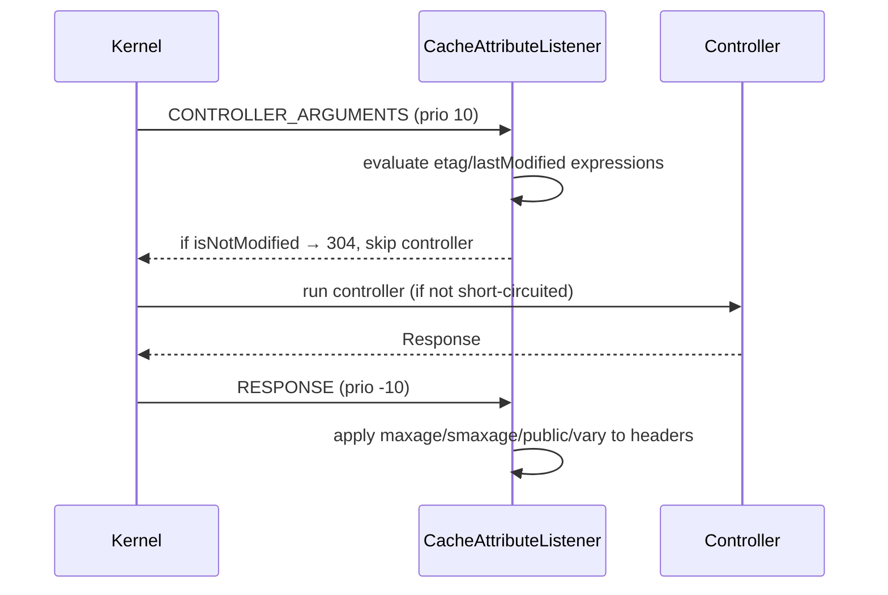

# Expiration (Expires, Cache-Control)

!!! tip "In a nutshell"
    L'expiration indique combien de temps une response reste **fraîche**, afin
    que les caches répondent sans toucher à l'origine. Retenez la précédence
    des caches partagés `s-maxage` > `max-age` > `Expires`, le fait que
    `setSharedMaxAge()` marque aussi la response `public`, et que `no-cache`
    signifie « revalider d'abord », pas « ne jamais stocker » (ça, c'est
    `no-store`).

!!! example "Real-world analogy"
    La fraîcheur est la date « à consommer de préférence avant » imprimée sur une brique de
    lait. Tant que la date n'est pas dépassée, vous la sortez directement du frigo et la
    buvez sans la sentir (un cache la sert sans contacter l'origine). Vous pouvez même
    accorder des fenêtres différentes à des endroits différents — une plus longue à
    l'entrepôt partagé du supermarché (`s-maxage`) qu'à votre frigo domestique (`max-age`).
    Notez la différence cruciale : `no-cache` est la règle « toujours sentir avant de boire,
    même si ça a l'air bon » (revalider d'abord), ce qui n'a rien à voir avec `no-store`, la
    règle « ne jamais garder ceci au frigo, point final ».

!!! abstract "Learning objectives"
    À la fin de ce chapitre, vous saurez :

    - [ ] Expliquer le modèle de fraîcheur et la précédence `s-maxage` > `max-age` > `Expires`.
    - [ ] Définir des durées de vie avec `setMaxAge()`, `setSharedMaxAge()` et `setExpires()`.
    - [ ] Utiliser `stale-while-revalidate`, `stale-if-error`, `no-store`, `no-cache`, `must-revalidate`.
    - [ ] Appliquer l'attribut `#[Cache]` et savoir comment il se traduit en headers.

    **Syllabus:** `HTTP Caching → Expiration model` ·
    **Level:** Advanced → Expert ·
    **Est. time:** 25 min ·
    **Prerequisites:** [Cache Types](cache-types.md)

---

## Pour les nuls

### L'idée en une phrase
L'expiration dit combien de temps une réponse reste "fraîche" — les caches peuvent répondre sans jamais recontacter le serveur pendant cette période.

### Imagine dans la vraie vie
La fraîcheur est la date "à consommer avant" sur une brique de lait. Tant que la date n'est pas dépassée, tu la sers directement du frigo sans la sentir (un cache la sert sans contacter le serveur d'origine).

### Dans Symfony
`$response->setMaxAge(3600)` dit au navigateur "ne me redemande rien pendant une heure" — la page suivante visitée dans l'heure est servie instantanément, sans requête réseau.

### Exemple simple
```php
$response->setSharedMaxAge(3600); // active AUSSI public automatiquement
```

### Comment le mémoriser 🧠
`no-cache` ne veut **pas** dire "ne jamais stocker" (c'est `no-store`) — ça veut dire "toujours revérifier avant de servir", même si la copie semble bonne.

---


## Theory

Le modèle d'**expiration** (fraîcheur) permet à un cache de servir une response
stockée **sans contacter l'origine** jusqu'à ce qu'elle devienne *périmée*
(*stale*). Il répond à « combien de temps ceci est-il bon ? » — l'inverse du
modèle de [validation](validation.md), qui demande à l'origine « est-ce que ça
a changé ? ».

Deux mécanismes expriment la fraîcheur :

| Header | Forme | Notes |
|---|---|---|
| `Expires` | Date absolue | HTTP/1.0 ; sensible aux décalages d'horloge |
| `Cache-Control: max-age=N` | Secondes relatives | HTTP/1.1 ; **à privilégier** |
| `Cache-Control: s-maxage=N` | Secondes relatives | Caches partagés uniquement |

### Freshness precedence

Quand plusieurs sont présents, un cache **partagé** résout la fraîcheur dans
cet ordre (le premier trouvé gagne) :

1. `s-maxage`
2. `max-age`
3. `Expires`

Un cache **privé** (navigateur) ignore `s-maxage` et commence à `max-age`.

```http
HTTP/1.1 200 OK
Cache-Control: public, max-age=60, s-maxage=600
Expires: Tue, 07 Jul 2026 12:00:00 GMT
Content-Type: text/html; charset=UTF-8
```

### The `Age` header

Un cache partagé ajoute `Age: N` — le nombre de secondes que la response a
passées dans les caches. La durée de fraîcheur moins `Age` donne le temps de
fraîcheur restant. Le reverse proxy de Symfony calcule et émet `Age` pour vous.

### Beyond fresh: graceful staleness

| Directive | Effet une fois périmée |
|---|---|
| `stale-while-revalidate=N` | Servir du périmé pendant N s tout en revalidant en arrière-plan |
| `stale-if-error=N` | Servir du périmé pendant N s si l'origine renvoie une erreur |
| `must-revalidate` | Ne **jamais** servir du périmé — revalider d'abord |
| `immutable` | Ne changera pas tant que c'est frais — le navigateur saute la revalidation au rechargement |

### Suppressing caching

- `no-cache` — peut être **stockée**, mais doit être **revalidée** avant chaque
  réutilisation (ce n'est *pas* « ne pas mettre en cache »).
- `no-store` — ne doit **jamais** être stockée, nulle part. À utiliser pour les
  données réellement sensibles.

```http
HTTP/1.1 200 OK
Cache-Control: no-cache

HTTP/1.1 200 OK
Cache-Control: no-store
```

!!! question "Predict first"
    Vous appelez `$response->setSharedMaxAge(600)` et rien d'autre. La response
    est-elle `public` ou `private`, et le navigateur la met-il en cache ?

??? note "Reveal"
    Elle devient **`public`** — `setSharedMaxAge()` positionne aussi le flag
    `public`, car un TTL partagé n'a aucun sens sur une response privée. Elle
    n'émet que `s-maxage=600`, que le navigateur ignore : les navigateurs n'ont
    donc aucune fenêtre de fraîcheur (ils revalident) tandis que les caches
    partagés la gardent fraîche pendant 600 s.

## Deep Dive — how it works internally

### From API call to header

`Response::setMaxAge()`, `setSharedMaxAge()`, `setStaleWhileRevalidate()`,
`setStaleIfError()` et `setImmutable()` écrivent tous dans la map
`Cache-Control` structurée de `ResponseHeaderBag`. Deux comportements comptent
pour l'examen :

- **`setSharedMaxAge($n)` rend implicitement la response `public`.** Il
  positionne `s-maxage` *et* le flag `public`, car un TTL partagé n'a aucun
  sens sur une response `private`.
- **`must-revalidate` n'a pas de setter.** `Response::mustRevalidate()` est un
  **getter** (il retourne un `bool`). Pour l'émettre, utilisez
  `setCache(['must_revalidate' => true])` ou l'attribut
  `#[Cache(mustRevalidate: true)]`.

```php
$response->setMaxAge(60);                    // Cache-Control: max-age=60
$response->setSharedMaxAge(600);             // s-maxage=600 + public
$response->setStaleWhileRevalidate(30);      // stale-while-revalidate=30
$response->setStaleIfError(3600);            // stale-if-error=3600
$response->setImmutable(true);               // immutable

// must-revalidate has no setter; mustRevalidate() only reads the flag:
$response->setCache(['must_revalidate' => true]);
$response->mustRevalidate();                 // true — or use #[Cache(mustRevalidate: true)]
```

!!! note "Source reference"
    `Symfony\Component\HttpFoundation\Response::setSharedMaxAge()` and
    `Response::setCache()` —
    [symfony/symfony `8.0`](https://github.com/symfony/symfony/blob/8.0/src/Symfony/Component/HttpFoundation/Response.php).

### `setCache()` — the one-call API

`Response::setCache(array $options): static` définit tout de manière atomique
et **valide les clés** (une clé inconnue lève une `InvalidArgumentException`).
Clés autorisées :

`etag`, `last_modified`, `max_age`, `s_maxage`, `public`, `private`, `immutable`,
`must_revalidate`, `no_cache`, `no_store`, `no_transform`, `proxy_revalidate`,
`stale_while_revalidate`, `stale_if_error`.

```php
// One atomic, validated call:
$response->setCache([
    'public'   => true,
    's_maxage' => 3600,
    'etag'     => 'v3',
]);

// Unknown key (e.g. 'smaxage') would throw InvalidArgumentException
```

### The `#[Cache]` attribute lifecycle

`#[Cache]` (`Symfony\Component\HttpKernel\Attribute\Cache`) est appliqué par
`Symfony\Component\HttpKernel\EventListener\CacheAttributeListener`, qui
s'abonne à deux events du kernel :



Sur `CONTROLLER_ARGUMENTS`, il évalue les **expressions** `etag`/`lastModified`
sur les arguments résolus du controller ; si la request est déjà à jour, il
retourne un **304 avant même l'exécution du controller** (voir
[validation](validation.md)). Sur `RESPONSE` (priorité −10, c'est-à-dire
tardive), il fusionne les directives d'expiration — **sans écraser** ce que le
controller a déjà défini explicitement.

```php
// etag/lastModified expressions run on CONTROLLER_ARGUMENTS (may 304 early);
// maxage/smaxage/public are merged later, on RESPONSE (priority -10).
#[Cache(smaxage: 600, etag: 'post.getContent()', lastModified: 'post.getUpdatedAt()')]
public function show(Post $post): Response
{
    return $this->render('post/show.html.twig', ['post' => $post]);
}
```

!!! info "String durations"
    `maxage`, `smaxage`, `staleWhileRevalidate` et `staleIfError` acceptent un
    `int` (secondes) **ou** une chaîne de date relative comme `'1 hour'` ou
    `'+5 minutes'`, analysée via `DateTimeImmutable`. `expires` est une chaîne
    de date.

## Configuration & code

=== "PHP Attributes"

    ```php
    <?php
    declare(strict_types=1);

    namespace App\Controller;

    use Symfony\Bundle\FrameworkBundle\Controller\AbstractController;
    use Symfony\Component\HttpFoundation\Response;
    use Symfony\Component\HttpKernel\Attribute\Cache;
    use Symfony\Component\Routing\Attribute\Route;

    final class FeedController extends AbstractController
    {
        // Public, 1 h shared TTL, serve stale up to 60 s while revalidating,
        // and up to 1 h if the backend errors.
        #[Route('/feed', name: 'feed')]
        #[Cache(
            public: true,
            smaxage: '1 hour',
            staleWhileRevalidate: 60,
            staleIfError: 3600,
        )]
        public function feed(): Response
        {
            return $this->render('feed/index.html.twig');
        }
    }
    ```

=== "PHP (Response API)"

    ```php
    <?php
    declare(strict_types=1);

    use Symfony\Component\HttpFoundation\Response;

    $response = new Response('...');

    // Fluent, one call, validated keys:
    $response->setCache([
        'public'                 => true,
        's_maxage'               => 3600,
        'stale_while_revalidate' => 60,
        'stale_if_error'         => 3600,
    ]);

    // Or step by step:
    $response->setSharedMaxAge(3600);          // implies public
    $response->setMaxAge(0);                     // browsers: don't reuse
    $response->setStaleWhileRevalidate(60);
    ```

=== "no-store (sensitive)"

    ```php
    <?php
    declare(strict_types=1);

    use Symfony\Component\HttpFoundation\Response;

    $response = new Response('bank statement');
    $response->setCache(['no_store' => true]); // never stored anywhere
    ```

## Best practices & anti-patterns

| ✅ Do | ❌ Avoid |
|---|---|
| Préférer `max-age`/`s-maxage` à `Expires` | Se reposer sur `Expires` (décalage d'horloge) |
| Utiliser `stale-while-revalidate` pour masquer la latence | Un long `max-age` sans chemin de revalidation |
| `no-store` uniquement pour les données réellement sensibles | Utiliser `no-cache` pour dire « ne pas stocker » |
| Définir `s-maxage` pour le CDN et `max-age` pour le navigateur séparément | Un seul TTL pour les deux alors qu'ils devraient différer |

## When (not) to use it / alternatives

L'expiration est idéale quand vous pouvez *prédire* une durée de vie (un
listing valable une minute, un asset valable un an). Quand vous ne pouvez
**pas** la prédire mais que vous *pouvez* détecter le changement à peu de
frais, utilisez plutôt la [validation](validation.md) (ETag/Last-Modified) — ou
**combinez** les deux : un `s-maxage` court plus un `ETag`, pour qu'une entrée
périmée se revalide avec un 304 peu coûteux.

!!! danger "Certification traps"
    - `no-cache` signifie **« revalider avant réutilisation »**, pas « ne
      jamais stocker ». La directive « ne jamais stocker » est `no-store`.
    - `setSharedMaxAge()` **marque aussi la response `public`** — vous
      n'appelez pas `setPublic()` séparément.
    - Il n'existe **pas de `setMustRevalidate()`** ; `mustRevalidate()` est un
      getter. Émettez-la via `setCache(['must_revalidate' => true])` ou
      `#[Cache(mustRevalidate: true)]`.
    - Précédence pour un cache **partagé** : `s-maxage` > `max-age` >
      `Expires`.
    - L'attribut `#[Cache]` est appliqué **tardivement** (RESPONSE, prio −10)
      et **ne remplace pas** les headers que vous définissez dans le
      controller.

!!! warning "Common mistakes"
    - Définir seulement `max-age` en s'attendant à ce que le CDN mette en cache
      plus longtemps que le navigateur — il vous faut `s-maxage` pour cela.
    - Passer une clé inconnue à `setCache()` — cela lève une
      `InvalidArgumentException`, contrairement à la définition d'une chaîne de
      header quelconque.

## Exercises

1. **(Advanced)** Mettez en cache un endpoint JSON dans le CDN pendant
   5 minutes, gardez-le hors du cache du navigateur, et laissez le CDN servir
   du périmé pendant 30 s le temps de le rafraîchir.
2. **(Expert)** Expliquez pourquoi `#[Cache(smaxage: 60)]` sur une action qui
   appelle aussi `$this->getUser()` est dangereux, et comment le reverse proxy
   vous protège malgré tout.

??? success "Solutions"

    **1.**
    ```php
    $response->setCache([
        's_maxage'               => 300,   // CDN, implies public
        'max_age'                => 0,     // browser: revalidate/refetch
        'stale_while_revalidate' => 30,
    ]);
    ```

    **2.** `smaxage: 60` marque la response `public` : un CDN pourrait donc
    servir la vue authentifiée d'un utilisateur à un autre. Le **reverse proxy
    Symfony** atténue ce risque car son défaut `private_headers` inclut
    `Cookie` et `Authorization` : une request porteuse d'un cookie de session
    est traitée comme privée et n'est ni servie depuis le cache partagé, ni
    stockée dedans. Ne vous y fiez cependant jamais — gardez les responses
    authentifiées `private` ou non cachées, et utilisez [ESI](../appendices/out-of-syllabus/esi.md).

## Certification questions

??? question "Q1. Which `Cache-Control` directive means 'store but revalidate before reuse'?"
    - [ ] A. `no-store`
    - [x] B. `no-cache` ✅
    - [ ] C. `must-revalidate`
    - [ ] D. `private`

    **Why:** `no-cache` autorise le stockage mais impose une revalidation à
    chaque fois ; `no-store` interdit tout stockage.
    **Ref:** [Cache-Control](https://developer.mozilla.org/en-US/docs/Web/HTTP/Headers/Cache-Control).

??? question "Q2. `$response->setSharedMaxAge(600)` also does what?"
    - [ ] A. Sets `max-age=600` for the browser
    - [x] B. Marks the response `public` ✅
    - [ ] C. Adds a `must-revalidate` directive
    - [ ] D. Sets an `Expires` header

    **Why:** Un TTL partagé n'a de sens que sur une response partageable : la
    méthode positionne donc aussi le flag `public`.
    **Ref:** [Response](https://github.com/symfony/symfony/blob/8.0/src/Symfony/Component/HttpFoundation/Response.php).

??? question "Q3. For a shared cache, which freshness source wins?"
    - [ ] A. `Expires` over everything
    - [ ] B. `max-age` over `s-maxage`
    - [x] C. `s-maxage`, then `max-age`, then `Expires` ✅
    - [ ] D. Whichever appears first in the header

    **Why:** Les caches partagés résolvent la fraîcheur avec `s-maxage` >
    `max-age` > `Expires`.
    **Ref:** [Expiration](https://symfony.com/doc/8.0/http_cache/expiration.html).

??? question "Q4. How do you emit `must-revalidate` from a `Response`?"
    - [ ] A. `$response->setMustRevalidate()`
    - [ ] B. `$response->mustRevalidate(true)`
    - [x] C. `$response->setCache(['must_revalidate' => true])` ✅
    - [ ] D. It is automatic with `no-cache`

    **Why:** Il n'existe pas de setter dédié ; `mustRevalidate()` est un
    getter. Utilisez `setCache()` (ou `#[Cache(mustRevalidate: true)]`).
    **Ref:** [HTTP cache](https://symfony.com/doc/8.0/http_cache.html).

??? question "Q5. What accepts a string like `'1 hour'` on `#[Cache]`?"
    - [x] A. `maxage`, `smaxage`, `staleWhileRevalidate`, `staleIfError` ✅
    - [ ] B. Only `expires`
    - [ ] C. None — all are integers
    - [ ] D. `public` and `private`

    **Why:** Ces options de durée numérique acceptent un int ou une chaîne de
    date relative analysée via `DateTimeImmutable`.
    **Ref:** [#[Cache] attribute](https://symfony.com/doc/8.0/http_cache.html#the-cache-attribute).

## Key takeaways

- La fraîcheur permet à un cache de répondre sans toucher à l'origine ; la
  précédence est `s-maxage` > `max-age` > `Expires` pour les caches partagés.
- `setSharedMaxAge()` implique `public` ; `must-revalidate` n'a pas de setter.
- `no-cache` = revalider avant réutilisation ; `no-store` = ne jamais stocker.
- `stale-while-revalidate`/`stale-if-error` échangent de la fraîcheur contre de
  la disponibilité.
- `#[Cache]` est appliqué tardivement sur RESPONSE et ne remplace jamais les
  headers explicites.

## Last-minute revision

!!! tip "Cheat sheet"
    - `setMaxAge()` navigateur+partagé · `setSharedMaxAge()` partagé uniquement
      **+ public**.
    - `setCache([...])` valide les clés ; clé inconnue →
      `InvalidArgumentException`.
    - `no-cache` ≠ `no-store`. `must-revalidate` via `setCache`/attribut
      uniquement.
    - Fraîcheur partagée : `s-maxage` > `max-age` > `Expires`. `Age` compte le
      temps écoulé.
    - Listener `#[Cache]` : CONTROLLER_ARGUMENTS (court-circuit 304) +
      RESPONSE −10.

## Connections

- **Depends on:** [Cache Types](cache-types.md) — la fraîcheur n'aide qu'une
  fois que vous avez décidé qui peut stocker la response (`public`/`private`).
- **Reused in:** [Server-Side Caching](server-side.md) — le reverse proxy lit
  `s-maxage` pour décider des hits frais et émet le header `Age`.
- **Confused with:** [Validation](validation.md) — l'expiration *prédit* une
  durée de vie ; la validation *demande à l'origine* si la copie a changé.

## Official References
- [Symfony docs — Expiration](https://symfony.com/doc/8.0/http_cache/expiration.html)
- [Symfony docs — The #[Cache] attribute](https://symfony.com/doc/8.0/http_cache.html#the-cache-attribute)
- [MDN — Cache-Control](https://developer.mozilla.org/en-US/docs/Web/HTTP/Headers/Cache-Control)
- [Symfony source — Response](https://github.com/symfony/symfony/blob/8.0/src/Symfony/Component/HttpFoundation/Response.php)
- [Symfony source — CacheAttributeListener](https://github.com/symfony/symfony/blob/8.0/src/Symfony/Component/HttpKernel/EventListener/CacheAttributeListener.php)

## Video references

!!! tip "Watch & learn"
    Voici des chaînes vidéo officielles, mises à jour en continu — cherchez-y
    « HTTP caching » pour consolider ce chapitre. Nous lions des chaînes
    stables plutôt que des vidéos individuelles pour que les références ne
    périment jamais.

    - [SymfonyCasts screencasts](https://symfonycasts.com/tracks/symfony) — des tutoriels scriptés, à coder en suivant.
    - [Symfony official YouTube](https://www.youtube.com/@SymfonyOfficial) — les conférences et keynotes SymfonyCon.
    - [Official docs for this topic](https://symfony.com/doc/8.0/http_cache/expiration.html) — certaines pages de la doc Symfony intègrent un screencast.

## Confidence check

Je suis prêt quand je peux :

- [ ] expliquer **pourquoi** la fraîcheur permet à un cache de répondre sans
  toucher à l'origine
- [ ] définir des durées de vie avec `setMaxAge`/`setSharedMaxAge`/`setCache([...])`
  et `#[Cache]` dans Symfony 8
- [ ] déboguer « le CDN ne met pas en cache plus longtemps que le navigateur »
  (il faut `s-maxage`, pas seulement `max-age`)
- [ ] repérer les pièges : `no-cache` ≠ `no-store`, et il n'existe pas de
  `setMustRevalidate()`
- [ ] expliquer la précédence des caches partagés `s-maxage` > `max-age` >
  `Expires` et le timing du listener `#[Cache]`

---

<small>Related: [Cache Types](cache-types.md) · [Validation](validation.md) ·
[Client-Side Caching](client-side.md) · [Server-Side Caching](server-side.md)</small>
