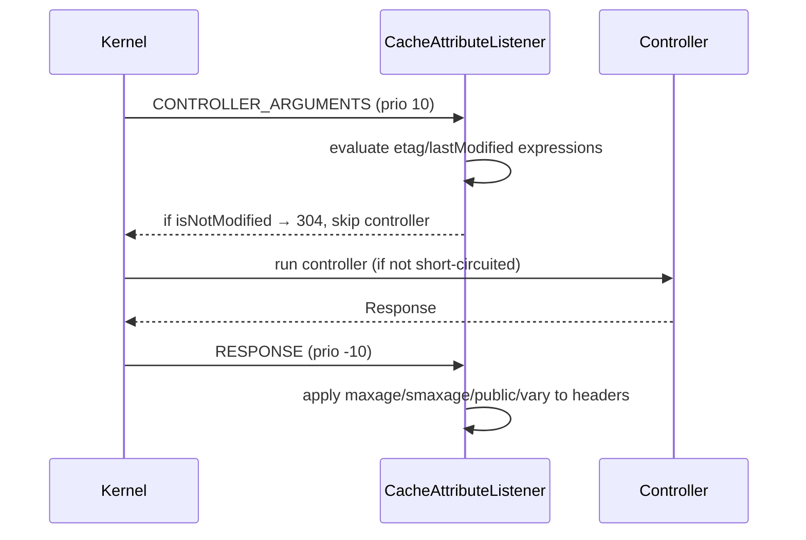

# Expiration (Expires, Cache-Control)

!!! tip "In a nutshell"
    Expiration says how long a response stays **fresh** so caches answer without
    hitting the origin. Remember the shared-cache precedence `s-maxage` >
    `max-age` > `Expires`, that `setSharedMaxAge()` also marks the response
    `public`, and that `no-cache` means "revalidate first", not "never store"
    (that is `no-store`).

!!! example "Real-world analogy"
    Freshness is the "best before" date stamped on a carton of milk. While the date hasn't
    passed you take it straight from the fridge and drink it without smelling it (a cache
    serves it without contacting the origin). You can even give different windows to
    different places — a longer one to the shared supermarket warehouse (`s-maxage`) than to
    your home fridge (`max-age`). Note the crucial difference: `no-cache` is the rule "always
    sniff-test before drinking, even if it looks fine" (revalidate first), which is nothing
    like `no-store`, the rule "never keep this in the fridge at all".

!!! abstract "Learning objectives"
    By the end of this chapter you can:

    - [ ] Explain the freshness model and the precedence `s-maxage` > `max-age` > `Expires`.
    - [ ] Set lifetimes with `setMaxAge()`, `setSharedMaxAge()` and `setExpires()`.
    - [ ] Use `stale-while-revalidate`, `stale-if-error`, `no-store`, `no-cache`, `must-revalidate`.
    - [ ] Apply the `#[Cache]` attribute and know how it maps to headers.

    **Syllabus:** `HTTP Caching → Expiration model` ·
    **Level:** Advanced → Expert ·
    **Est. time:** 25 min ·
    **Prerequisites:** [Cache Types](cache-types.md)

---

## Theory

The **expiration** (freshness) model lets a cache serve a stored response
**without contacting the origin** until it becomes *stale*. It answers "how long
is this good for?" — the opposite of the [validation](validation.md) model, which
asks the origin "did it change?".

Two mechanisms express freshness:

| Header | Form | Notes |
|---|---|---|
| `Expires` | Absolute date | HTTP/1.0; clock-skew prone |
| `Cache-Control: max-age=N` | Relative seconds | HTTP/1.1; **preferred** |
| `Cache-Control: s-maxage=N` | Relative seconds | Shared caches only |

### Freshness precedence

When more than one is present, a **shared** cache resolves freshness in this
order (first one wins):

1. `s-maxage`
2. `max-age`
3. `Expires`

A **private** cache (browser) ignores `s-maxage` and starts at `max-age`.

```http
HTTP/1.1 200 OK
Cache-Control: public, max-age=60, s-maxage=600
Expires: Tue, 07 Jul 2026 12:00:00 GMT
Content-Type: text/html; charset=UTF-8
```

### The `Age` header

A shared cache adds `Age: N` — how many seconds the response has been sitting in
caches. Freshness lifetime minus `Age` is the remaining fresh time. Symfony's
reverse proxy computes and emits `Age` for you.

### Beyond fresh: graceful staleness

| Directive | Effect once stale |
|---|---|
| `stale-while-revalidate=N` | Serve stale for N s while revalidating in background |
| `stale-if-error=N` | Serve stale for N s if the origin errors |
| `must-revalidate` | **Never** serve stale — revalidate first |
| `immutable` | Won't change while fresh — browser skips revalidation on reload |

### Suppressing caching

- `no-cache` — may **store**, but must **revalidate** before every reuse
  (it is *not* "don't cache").
- `no-store` — must **never** store anywhere. Use for truly sensitive data.

```http
HTTP/1.1 200 OK
Cache-Control: no-cache

HTTP/1.1 200 OK
Cache-Control: no-store
```

!!! question "Predict first"
    You call `$response->setSharedMaxAge(600)` and nothing else. Is the response
    `public` or `private`, and does the browser cache it?

??? note "Reveal"
    It becomes **`public`** — `setSharedMaxAge()` sets the `public` flag too, since
    a shared TTL is meaningless on a private response. It emits only `s-maxage=600`,
    which the browser ignores, so browsers get no freshness window (they revalidate)
    while shared caches keep it fresh for 600 s.

## Deep Dive — how it works internally

### From API call to header

`Response::setMaxAge()`, `setSharedMaxAge()`, `setStaleWhileRevalidate()`,
`setStaleIfError()` and `setImmutable()` all write into the structured
`Cache-Control` map on `ResponseHeaderBag`. Two behaviours matter for the exam:

- **`setSharedMaxAge($n)` implicitly makes the response `public`.** It sets
  `s-maxage` *and* the `public` flag, because a shared TTL is meaningless on a
  `private` response.
- **`must-revalidate` has no setter.** `Response::mustRevalidate()` is a **getter**
  (returns `bool`). To emit it, use `setCache(['must_revalidate' => true])` or the
  `#[Cache(mustRevalidate: true)]` attribute.

```php
$response->setMaxAge(60);                    // Cache-Control: max-age=60
$response->setSharedMaxAge(600);             // s-maxage=600 + public
$response->setStaleWhileRevalidate(30);      // stale-while-revalidate=30
$response->setStaleIfError(3600);            // stale-if-error=3600
$response->setImmutable(true);               // immutable

// must-revalidate has no setter; mustRevalidate() only reads the flag:
$response->setCache(['must_revalidate' => true]);
$response->mustRevalidate();                 // true — or use #[Cache(mustRevalidate: true)]
```

!!! note "Source reference"
    `Symfony\Component\HttpFoundation\Response::setSharedMaxAge()` and
    `Response::setCache()` —
    [symfony/symfony `8.0`](https://github.com/symfony/symfony/blob/8.0/src/Symfony/Component/HttpFoundation/Response.php).

### `setCache()` — the one-call API

`Response::setCache(array $options): static` sets everything atomically and
**validates the keys** (an unknown key throws `InvalidArgumentException`). Allowed
keys:

`etag`, `last_modified`, `max_age`, `s_maxage`, `public`, `private`, `immutable`,
`must_revalidate`, `no_cache`, `no_store`, `no_transform`, `proxy_revalidate`,
`stale_while_revalidate`, `stale_if_error`.

```php
// One atomic, validated call:
$response->setCache([
    'public'   => true,
    's_maxage' => 3600,
    'etag'     => 'v3',
]);

// Unknown key (e.g. 'smaxage') would throw InvalidArgumentException
```

### The `#[Cache]` attribute lifecycle

`#[Cache]` (`Symfony\Component\HttpKernel\Attribute\Cache`) is applied by
`Symfony\Component\HttpKernel\EventListener\CacheAttributeListener`, which
subscribes to two kernel events:



On `CONTROLLER_ARGUMENTS` it evaluates the `etag`/`lastModified` **expressions**
against the resolved controller arguments; if the request is already up to date
it returns a **304 before the controller runs** (see [validation](validation.md)).
On `RESPONSE` (priority −10, i.e. late) it merges the expiration directives —
**without overwriting** anything the controller already set explicitly.

```php
// etag/lastModified expressions run on CONTROLLER_ARGUMENTS (may 304 early);
// maxage/smaxage/public are merged later, on RESPONSE (priority -10).
#[Cache(smaxage: 600, etag: 'post.getContent()', lastModified: 'post.getUpdatedAt()')]
public function show(Post $post): Response
{
    return $this->render('post/show.html.twig', ['post' => $post]);
}
```

!!! info "String durations"
    `maxage`, `smaxage`, `staleWhileRevalidate` and `staleIfError` accept an
    `int` (seconds) **or** a relative date string like `'1 hour'` or `'+5 minutes'`,
    parsed via `DateTimeImmutable`. `expires` is a date string.

## Configuration & code

=== "PHP Attributes"

    ```php
    <?php
    declare(strict_types=1);

    namespace App\Controller;

    use Symfony\Bundle\FrameworkBundle\Controller\AbstractController;
    use Symfony\Component\HttpFoundation\Response;
    use Symfony\Component\HttpKernel\Attribute\Cache;
    use Symfony\Component\Routing\Attribute\Route;

    final class FeedController extends AbstractController
    {
        // Public, 1 h shared TTL, serve stale up to 60 s while revalidating,
        // and up to 1 h if the backend errors.
        #[Route('/feed', name: 'feed')]
        #[Cache(
            public: true,
            smaxage: '1 hour',
            staleWhileRevalidate: 60,
            staleIfError: 3600,
        )]
        public function feed(): Response
        {
            return $this->render('feed/index.html.twig');
        }
    }
    ```

=== "PHP (Response API)"

    ```php
    <?php
    declare(strict_types=1);

    use Symfony\Component\HttpFoundation\Response;

    $response = new Response('...');

    // Fluent, one call, validated keys:
    $response->setCache([
        'public'                 => true,
        's_maxage'               => 3600,
        'stale_while_revalidate' => 60,
        'stale_if_error'         => 3600,
    ]);

    // Or step by step:
    $response->setSharedMaxAge(3600);          // implies public
    $response->setMaxAge(0);                     // browsers: don't reuse
    $response->setStaleWhileRevalidate(60);
    ```

=== "no-store (sensitive)"

    ```php
    <?php
    declare(strict_types=1);

    use Symfony\Component\HttpFoundation\Response;

    $response = new Response('bank statement');
    $response->setCache(['no_store' => true]); // never stored anywhere
    ```

## Best practices & anti-patterns

| ✅ Do | ❌ Avoid |
|---|---|
| Prefer `max-age`/`s-maxage` over `Expires` | Relying on `Expires` (clock skew) |
| Use `stale-while-revalidate` to hide latency | Long `max-age` with no revalidation path |
| `no-store` only for truly sensitive data | Using `no-cache` to mean "don't store" |
| Set `s-maxage` for CDN, `max-age` for browser separately | One TTL for both when they should differ |

## When (not) to use it / alternatives

Expiration is ideal when you can *predict* a lifetime (a listing valid for a
minute, an asset for a year). When you **cannot** predict it but *can* cheaply
detect change, use [validation](validation.md) (ETag/Last-Modified) instead — or
**combine** both: a short `s-maxage` plus an `ETag` so a stale entry revalidates
with a cheap 304.

!!! danger "Certification traps"
    - `no-cache` means **"revalidate before reuse"**, not "never store". The
      "never store" directive is `no-store`.
    - `setSharedMaxAge()` **also marks the response `public`** — you don't call
      `setPublic()` separately.
    - There is **no `setMustRevalidate()`**; `mustRevalidate()` is a getter. Emit
      it via `setCache(['must_revalidate' => true])` or `#[Cache(mustRevalidate: true)]`.
    - Precedence for a **shared** cache: `s-maxage` > `max-age` > `Expires`.
    - The `#[Cache]` attribute is applied **late** (RESPONSE, prio −10) and does
      **not** override headers you set in the controller.

!!! warning "Common mistakes"
    - Setting only `max-age` and expecting the CDN to cache longer than the
      browser — you need `s-maxage` for that.
    - Passing an unknown key to `setCache()` — it throws
      `InvalidArgumentException`, unlike setting a stray header string.

## Exercises

1. **(Advanced)** Cache a JSON endpoint in the CDN for 5 minutes, keep it out of
   the browser cache, and let the CDN serve stale for 30 s while it refreshes.
2. **(Expert)** Explain why `#[Cache(smaxage: 60)]` on an action that also calls
   `$this->getUser()` is dangerous, and how the reverse proxy protects you anyway.

??? success "Solutions"

    **1.**
    ```php
    $response->setCache([
        's_maxage'               => 300,   // CDN, implies public
        'max_age'                => 0,     // browser: revalidate/refetch
        'stale_while_revalidate' => 30,
    ]);
    ```

    **2.** `smaxage: 60` marks the response `public`, so a CDN could serve one
    user's authenticated view to another. The **Symfony reverse proxy** mitigates
    this because its `private_headers` default includes `Cookie` and
    `Authorization`: a request carrying a session cookie is treated as private and
    not served from (or stored in) the shared cache. Still, never rely on that —
    keep authenticated responses `private` or uncached, and use [ESI](../appendices/out-of-syllabus/esi.md).

## Certification questions

??? question "Q1. Which `Cache-Control` directive means 'store but revalidate before reuse'?"
    - [ ] A. `no-store`
    - [x] B. `no-cache` ✅
    - [ ] C. `must-revalidate`
    - [ ] D. `private`

    **Why:** `no-cache` permits storage but forces revalidation each time;
    `no-store` forbids storing at all.
    **Ref:** [Cache-Control](https://developer.mozilla.org/en-US/docs/Web/HTTP/Headers/Cache-Control).

??? question "Q2. `$response->setSharedMaxAge(600)` also does what?"
    - [ ] A. Sets `max-age=600` for the browser
    - [x] B. Marks the response `public` ✅
    - [ ] C. Adds a `must-revalidate` directive
    - [ ] D. Sets an `Expires` header

    **Why:** A shared TTL only makes sense on a shareable response, so the method
    sets the `public` flag as well.
    **Ref:** [Response](https://github.com/symfony/symfony/blob/8.0/src/Symfony/Component/HttpFoundation/Response.php).

??? question "Q3. For a shared cache, which freshness source wins?"
    - [ ] A. `Expires` over everything
    - [ ] B. `max-age` over `s-maxage`
    - [x] C. `s-maxage`, then `max-age`, then `Expires` ✅
    - [ ] D. Whichever appears first in the header

    **Why:** Shared caches resolve freshness as `s-maxage` > `max-age` > `Expires`.
    **Ref:** [Expiration](https://symfony.com/doc/8.0/http_cache/expiration.html).

??? question "Q4. How do you emit `must-revalidate` from a `Response`?"
    - [ ] A. `$response->setMustRevalidate()`
    - [ ] B. `$response->mustRevalidate(true)`
    - [x] C. `$response->setCache(['must_revalidate' => true])` ✅
    - [ ] D. It is automatic with `no-cache`

    **Why:** There is no dedicated setter; `mustRevalidate()` is a getter. Use
    `setCache()` (or `#[Cache(mustRevalidate: true)]`).
    **Ref:** [HTTP cache](https://symfony.com/doc/8.0/http_cache.html).

??? question "Q5. What accepts a string like `'1 hour'` on `#[Cache]`?"
    - [x] A. `maxage`, `smaxage`, `staleWhileRevalidate`, `staleIfError` ✅
    - [ ] B. Only `expires`
    - [ ] C. None — all are integers
    - [ ] D. `public` and `private`

    **Why:** Those numeric-duration options accept an int or a relative date
    string parsed via `DateTimeImmutable`.
    **Ref:** [#[Cache] attribute](https://symfony.com/doc/8.0/http_cache.html#the-cache-attribute).

## Key takeaways

- Freshness lets a cache answer without hitting the origin; precedence is
  `s-maxage` > `max-age` > `Expires` for shared caches.
- `setSharedMaxAge()` implies `public`; `must-revalidate` has no setter.
- `no-cache` = revalidate before reuse; `no-store` = never store.
- `stale-while-revalidate`/`stale-if-error` trade freshness for availability.
- `#[Cache]` is applied late on RESPONSE and never overrides explicit headers.

## Last-minute revision

!!! tip "Cheat sheet"
    - `setMaxAge()` browser+shared · `setSharedMaxAge()` shared-only **+ public**.
    - `setCache([...])` validates keys; unknown key → `InvalidArgumentException`.
    - `no-cache` ≠ `no-store`. `must-revalidate` via `setCache`/attribute only.
    - Shared freshness: `s-maxage` > `max-age` > `Expires`. `Age` counts elapsed.
    - `#[Cache]` listener: CONTROLLER_ARGUMENTS (304 short-circuit) + RESPONSE −10.

## Connections

- **Depends on:** [Cache Types](cache-types.md) — freshness only helps once you've
  decided who may store the response (`public`/`private`).
- **Reused in:** [Server-Side Caching](server-side.md) — the reverse proxy reads
  `s-maxage` to decide fresh hits and emits the `Age` header.
- **Confused with:** [Validation](validation.md) — expiration *predicts* a lifetime;
  validation *asks the origin* whether the copy changed.

## Official References
- [Symfony docs — Expiration](https://symfony.com/doc/8.0/http_cache/expiration.html)
- [Symfony docs — The #[Cache] attribute](https://symfony.com/doc/8.0/http_cache.html#the-cache-attribute)
- [MDN — Cache-Control](https://developer.mozilla.org/en-US/docs/Web/HTTP/Headers/Cache-Control)
- [Symfony source — Response](https://github.com/symfony/symfony/blob/8.0/src/Symfony/Component/HttpFoundation/Response.php)
- [Symfony source — CacheAttributeListener](https://github.com/symfony/symfony/blob/8.0/src/Symfony/Component/HttpKernel/EventListener/CacheAttributeListener.php)

## Video references

!!! tip "Watch & learn"
    These are official, continuously-updated video channels — search them for
    "HTTP caching" to reinforce this chapter. We link stable channels rather than
    individual videos so the references never rot.

    - [SymfonyCasts screencasts](https://symfonycasts.com/tracks/symfony) — scripted, code-along tutorials.
    - [Symfony official YouTube](https://www.youtube.com/@SymfonyOfficial) — SymfonyCon conference talks & keynotes.
    - [Official docs for this topic](https://symfony.com/doc/8.0/http_cache/expiration.html) — some Symfony doc pages embed a screencast.

## Confidence check

I'm ready when I can:

- [ ] explain **why** freshness lets a cache answer without hitting the origin
- [ ] set lifetimes with `setMaxAge`/`setSharedMaxAge`/`setCache([...])` and `#[Cache]` in Symfony 8
- [ ] debug "the CDN won't cache longer than the browser" (needs `s-maxage`, not just `max-age`)
- [ ] spot the traps: `no-cache` ≠ `no-store`, and there is no `setMustRevalidate()`
- [ ] explain the shared-cache precedence `s-maxage` > `max-age` > `Expires` and the `#[Cache]` listener timing

---

<small>Related: [Cache Types](cache-types.md) · [Validation](validation.md) ·
[Client-Side Caching](client-side.md) · [Server-Side Caching](server-side.md)</small>
