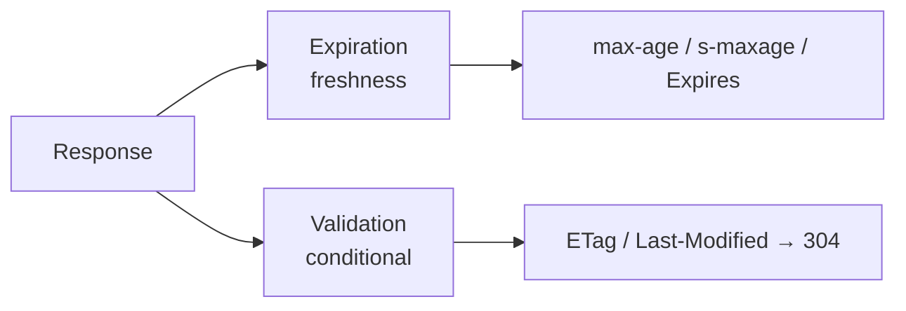

# HTTP Caching

!!! tip "🧪 Practice this area"
    Prêt à le construire vous-même ? Faites le lab pratique : **[Cache Headers](../labs/http-caching.md)** — un TD pas à pas guidé par les tests, avec une solution de référence.

Le cache HTTP est le moyen par lequel Symfony rend une application *plus rapide*
sans toucher à la logique métier : au lieu de régénérer une response, un
**cache** renvoie une copie stockée. Symfony parle nativement le modèle de cache
HTTP — l'objet `Response` transporte `Cache-Control`, `Expires`, `ETag` et
`Last-Modified`, et Symfony fournit un **reverse proxy cache** complet
(`HttpCache`) écrit en PHP, ainsi que le support **ESI** pour mettre en cache
des *fragments* de page à des rythmes différents.

Cette étape prolonge ce que vous avez appris dans [HTTP](../http/index.md)
(l'objet `Response`) et [Controllers](../controllers/index.md) (où vous
définissez les headers de cache). Elle se divise en deux familles qu'il ne faut
jamais confondre : l'**expiration** (« ceci est frais jusqu'à *T* ») et la
**validation** (« demandez-moi si ça a changé »).

!!! info "Stage at a glance"
    | Property | Value |
    |---|---|
    | **Prerequisites** | [HTTP](../http/index.md), [Controllers](../controllers/index.md) |
    | **Level** | Advanced → Expert |
    | **Difficulty** | ★★☆ |
    | **Dependencies** | Stage 2 (HTTP), Stage 5 (Controllers) |
    | **Revision priority** | **Medium** (down-weighted in Symfony 8) |
    | **Est. time** | 2–3 h |

!!! note "Revision priority"
    Le cache HTTP est **moins pondéré** dans l'examen Symfony 8. La couverture
    ici est complète, mais si votre budget de révision est serré, étudiez-le
    *après* les étapes Critical (Architecture, DI, Security). Priorisez les
    trois faits à haut rendement : **`s-maxage` vs `max-age`**, **ETag vs
    Last-Modified**, et le **flux 304**.

## Why this stage matters

Deux headers de response décident de presque tout, et ils se comportent
différemment pour les caches **privés** (navigateur) et **partagés** (proxy).
L'examen sonde les règles de précédence exactes (`s-maxage` > `max-age` >
`Expires` pour les caches partagés), la différence entre `no-cache`, `no-store`
et `must-revalidate`, et l'aller-retour 304 « Not Modified ». Il teste aussi
l'outillage propre à Symfony : l'attribut `#[Cache]`,
`Response::isNotModified()`, et le reverse proxy intégré. Les Edge Side
Includes sont couverts ici par souci d'exhaustivité mais sont **exclus de la
certification Symfony 8**.

## Micro-chapters

Parcourez-les dans l'ordre :

- [ ] [Cache Types](cache-types.md) — caches privés vs partagés vs reverse
  proxy ; `public`/`private` ; les bases de `Cache-Control` ; le header `Vary`.
- [ ] [Expiration](expiration.md) — `Expires` vs `Cache-Control`, `max-age`,
  `s-maxage`, `stale-while-revalidate`, `no-store`/`no-cache`, l'attribut
  `#[Cache]`.
- [ ] [Validation](validation.md) — `ETag`, `Last-Modified`,
  `If-None-Match`/`If-Modified-Since`, `304 Not Modified`, `isNotModified()`.
- [ ] [Client-Side Caching](client-side.md) — le comportement du navigateur et
  les directives `Cache-Control` de **request**.
- [ ] [Server-Side Caching](server-side.md) — le reverse proxy Symfony (le
  kernel `HttpCache`), `Store`, son activation, comparaison avec Varnish.
- [ ] [Edge Side Includes (ESI)](../appendices/out-of-syllabus/esi.md) — `<esi:include>`, `render_esi`, quand
  le cache de fragments l'emporte sur le cache de page entière, l'alternative
  SSI. **Exclu de la certification Symfony 8.**

## How to study it

1. Apprenez la **carte** dans [Cache Types](cache-types.md) : qui met quoi en
   cache, et comment `public`/`private`/`Vary` en contrôlent l'accès.
2. Maîtrisez les deux modèles — [Expiration](expiration.md) puis
   [Validation](validation.md) — et la façon dont ils se **combinent**.
3. Voyez les deux **côtés** du fil : [Client-Side](client-side.md) et
   [Server-Side](server-side.md).
4. Terminez par [ESI](../appendices/out-of-syllabus/esi.md) pour les pages à fraîcheur mixte.

---

<small>Related: [HTTP](../http/index.md) ·
[Caching Overview](../http/caching.md) ·
[Controllers](../controllers/index.md) ·
[Controller Rendering (Twig)](../twig/controller-rendering.md)</small>

## 🧠 Pour les nuls

**C'est quoi cette étape ?** Le cache HTTP permet de réutiliser une réponse déjà calculée au lieu de tout refaire à chaque visite — sans jamais toucher à la logique métier de l'application.

**Pourquoi ça existe ?** Recalculer la même page pour chaque visiteur gaspille du temps serveur. Le cache HTTP répond directement depuis une copie stockée quand c'est possible.

**🏠 Analogie de la vraie vie :** Un plat déjà préparé au frigo avec une date de péremption. Tant que la date n'est pas dépassée, tu le sers directement (fraîcheur). Une fois périmé, tu demandes d'abord "c'est toujours bon ?" avant de tout refaire (validation).

**Symfony dans la vraie vie :** `$response->setMaxAge(3600)` active la fraîcheur (aucune requête au serveur pendant une heure) ; `$response->setEtag($hash)` active la validation (une requête légère qui répond parfois "rien n'a changé", en 304).

**⚠️ Erreur fréquente :** confondre "fraîcheur" et "validation" — la fraîcheur ne pose aucune question au serveur, la validation en pose une, mais très bon marché (pas de corps de réponse renvoyé si rien n'a changé).

**🧠 Comment le mémoriser :** "Fraîcheur = pas de question du tout. Validation = question posée, réponse parfois vide (304)."

## Official References

- [Symfony documentation — HTTP Cache](https://symfony.com/doc/8.0/http_cache.html)
- [Symfony documentation home](https://symfony.com/doc/8.0/)
- [Official certification syllabus](https://certification.symfony.com/exams/symfony.html)
