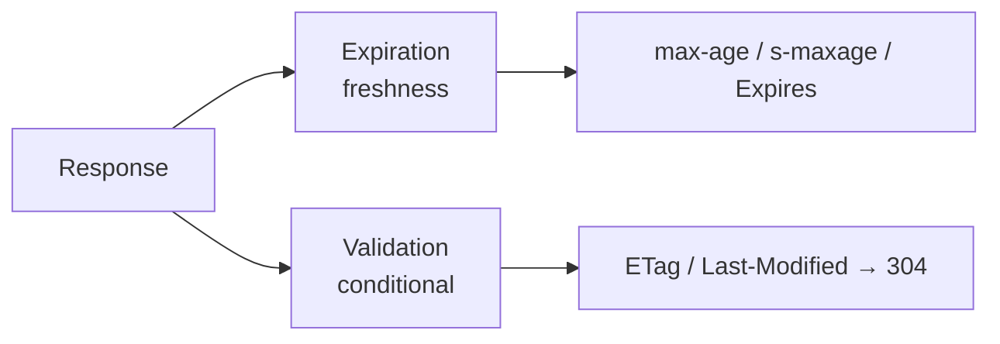

# HTTP Caching

HTTP caching is how Symfony makes an application *faster* without touching the
domain logic: instead of regenerating a response, a **cache** returns a stored
copy. Symfony speaks the HTTP caching model natively — the `Response` object
carries `Cache-Control`, `Expires`, `ETag` and `Last-Modified`, and Symfony ships
a full **reverse-proxy cache** (`HttpCache`) written in PHP, plus **ESI** support
for caching page *fragments* at different rates.

This stage extends what you learned in [HTTP](../http/index.md) (the
`Response` object) and [Controllers](../controllers/index.md) (where you set
cache headers). It splits into two families you must never confuse:
**expiration** ("this is fresh until *T*") and **validation** ("ask me if it
changed").

!!! info "Stage at a glance"
    | Property | Value |
    |---|---|
    | **Prerequisites** | [HTTP](../http/index.md), [Controllers](../controllers/index.md) |
    | **Level** | Advanced → Expert |
    | **Difficulty** | ★★☆ |
    | **Dependencies** | Stage 2 (HTTP), Stage 5 (Controllers) |
    | **Revision priority** | **Medium** (down-weighted in Symfony 8) |
    | **Est. time** | 2–3 h |

!!! note "Revision priority"
    HTTP caching is **down-weighted** in the Symfony 8 exam. Coverage here is
    complete, but on a tight revision budget study it *after* the Critical stages
    (Architecture, DI, Security). Prioritise the three high-yield facts:
    **`s-maxage` vs `max-age`**, **ETag vs Last-Modified**, and the **304 flow**.

## Why this stage matters

Two response headers decide almost everything, and they behave differently for
**private** (browser) and **shared** (proxy) caches. The exam probes the exact
precedence rules (`s-maxage` > `max-age` > `Expires` for shared caches), the
difference between `no-cache`, `no-store` and `must-revalidate`, and the 304
"Not Modified" round-trip. It also tests Symfony-specific tooling: the
`#[Cache]` attribute, `Response::isNotModified()`, the built-in reverse proxy
and Edge Side Includes.

## Micro-chapters

Work through them in order:

- [ ] [Cache Types](cache-types.md) — private vs shared vs reverse-proxy caches;
  `public`/`private`; `Cache-Control` basics; the `Vary` header.
- [ ] [Expiration](expiration.md) — `Expires` vs `Cache-Control`, `max-age`,
  `s-maxage`, `stale-while-revalidate`, `no-store`/`no-cache`, the `#[Cache]`
  attribute.
- [ ] [Validation](validation.md) — `ETag`, `Last-Modified`,
  `If-None-Match`/`If-Modified-Since`, `304 Not Modified`, `isNotModified()`.
- [ ] [Client-Side Caching](client-side.md) — browser behaviour and
  `Cache-Control` **request** directives.
- [ ] [Server-Side Caching](server-side.md) — the Symfony reverse proxy
  (`HttpCache` kernel), `Store`, enabling it, Varnish comparison.
- [ ] [Edge Side Includes (ESI)](esi.md) — `<esi:include>`, `render_esi`, when
  fragment caching beats full-page caching, the SSI alternative.

## How to study it

1. Learn the **map** in [Cache Types](cache-types.md): who caches what, and how
   `public`/`private`/`Vary` gate it.
2. Master the two models — [Expiration](expiration.md) then
   [Validation](validation.md) — and how they **combine**.
3. See both **sides** of the wire: [Client-Side](client-side.md) and
   [Server-Side](server-side.md).
4. Finish with [ESI](esi.md) for mixed-freshness pages.

---

<small>Related: [HTTP](../http/index.md) ·
[Caching Overview](../http/caching.md) ·
[Controllers](../controllers/index.md) ·
[Controller Rendering (Twig)](../twig/controller-rendering.md)</small>

## Official References

- [Symfony documentation — HTTP Cache](https://symfony.com/doc/current/http_cache.html)
- [Symfony documentation home](https://symfony.com/doc/current/)
- [Official certification syllabus](https://certification.symfony.com/exams/symfony.html)
