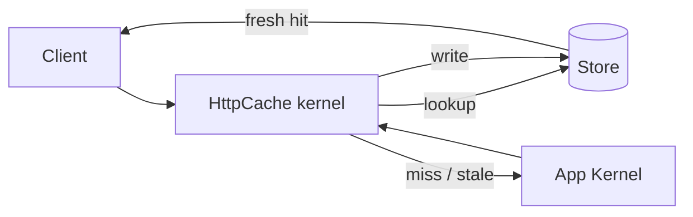
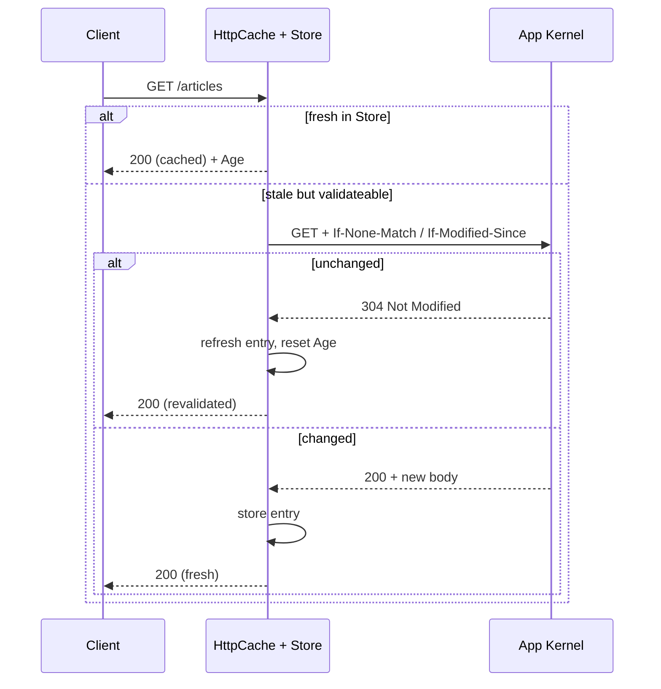

# Server-Side Caching

!!! tip "In a nutshell"
    Symfony fournit un reverse proxy écrit en PHP, `HttpCache`, qui **enveloppe**
    votre kernel et sert les hits du cache partagé avant que l'application ne
    s'exécute. Activez-le avec `framework.http_cache: true` ; il respecte
    `s-maxage`, maintient un `Store` sur le système de fichiers et rapporte
    chaque hit/miss dans le header de trace `X-Symfony-Cache`.

!!! example "Real-world analogy"
    Imaginez un agent d'accueil posté dans le hall, devant les spécialistes à l'étage. Aux
    questions courantes (« quels sont vos horaires d'ouverture ? »), l'agent répond
    directement depuis une fiche posée sur le comptoir, sans jamais déranger les
    spécialistes — c'est un hit du cache partagé servi avant même que l'application ne
    s'exécute. Seules les questions nouvelles ou expirées montent à l'étage. Si un visiteur
    présente un badge personnel ou une lettre privée (un `Cookie` de session ou un header
    `Authorization`), l'agent refuse de donner une réponse toute faite et le fait toujours
    monter, car la réponse serait personnelle. L'agent tamponne aussi chaque réponse d'une
    note indiquant si elle vient de la fiche du comptoir ou de l'étage — cette note est la
    trace `X-Symfony-Cache`.

!!! abstract "Learning objectives"
    À la fin de ce chapitre, vous saurez :

    - [ ] Expliquer ce qu'est le reverse proxy Symfony (`HttpCache`) et où il se place.
    - [ ] L'activer via `framework.http_cache` ou en enveloppant le kernel.
    - [ ] Décrire le `Store`, le flux lookup/write et la trace `X-Symfony-Cache`.
    - [ ] Décider quand utiliser le reverse proxy PHP plutôt que Varnish.

    **Syllabus:** `HTTP Caching → Server-side (reverse proxy)` ·
    **Level:** Expert ·
    **Est. time:** 25 min ·
    **Prerequisites:** [Cache Types](cache-types.md), [Expiration](expiration.md)

---

## Theory

Un **reverse proxy** (gateway cache) est un cache partagé qui vous appartient,
placé **devant** l'application. Il répond lui-même aux hits du cache et ne
transmet au backend que les miss. Symfony en fournit un écrit en PHP :
`Symfony\Component\HttpKernel\HttpCache\HttpCache`. C'est un
`HttpKernelInterface` prêt à l'emploi qui **enveloppe** votre vrai kernel, de
sorte qu'une request atteint d'abord le kernel de cache.

Il obéit aux headers standards que vous connaissez déjà — `Cache-Control` (en
particulier `s-maxage`, puisque c'est un cache *partagé*), `Expires`, `ETag`,
`Last-Modified`, `Vary` — sans langage de configuration maison. Il comprend
aussi [ESI](esi.md).

!!! info "Development convenience, not always production"
    Le reverse proxy PHP est un vrai cache HTTP/1.1 correct — pratique en dev et
    suffisant pour les petits sites. En production à fort trafic, on place
    généralement un cache dédié devant l'application (Varnish, un CDN à cache
    HTTP) ; les mêmes headers de response pilotent les deux.

!!! question "Predict first"
    Un utilisateur connecté demande une page marquée `s-maxage=60` à travers le
    reverse proxy Symfony. Obtient-il un hit du cache partagé ?

??? note "Reveal"
    Non. Sa request transporte un `Cookie` de session, qui figure dans les
    `private_headers` du proxy (par défaut `Authorization, Cookie`), donc
    `HttpCache` la traite comme **privée** — il ne sert pas depuis le cache
    partagé et n'y stocke pas non plus. Les requests anonymes (sans cookie),
    elles, *sont* mises en cache ; déplacez les parties par utilisateur dans de
    l'[ESI](esi.md).

## Deep Dive — how it works internally

### The wrapping model



`HttpCache` implémente `HttpKernelInterface` **et** `TerminableInterface`. Son
constructeur est :

```php
public function __construct(
    HttpKernelInterface $kernel,
    StoreInterface $store,
    ?SurrogateInterface $surrogate = null,
    array $options = [],
)
```

- `$kernel` — le kernel de votre application (le backend qu'il protège).
- `$store` — où vivent les entrées ; le défaut est
  `Symfony\Component\HttpKernel\HttpCache\Store`, un store sur le système de
  fichiers indexé par URL + `Vary`, utilisant des fichiers de digest et des
  fichiers de lock.
- `$surrogate` — une instance `Esi` ou `Ssi` pour le traitement des
  [fragments](esi.md).
- `$options` — les réglages de comportement (ci-dessous).

!!! note "Source reference"
    `Symfony\Component\HttpKernel\HttpCache\HttpCache`,
    `...\HttpCache\Store` et `...\HttpCache\StoreInterface` —
    [symfony/symfony `8.0`](https://github.com/symfony/symfony/blob/8.0/src/Symfony/Component/HttpKernel/HttpCache/HttpCache.php).

### The lookup → validate → store flow

1. **Seuls `GET`/`HEAD`** sont candidats au cache ; les méthodes non sûres
   passent au travers et invalident les entrées correspondantes.
2. **Garde privée :** si la request transporte un header présent dans
   `private_headers` (par défaut `Authorization`, `Cookie`), elle est traitée
   comme privée — ni servie depuis le cache partagé, ni stockée dedans.
3. **Lookup** dans le `Store` par URL + headers `Vary`.
4. **Hit frais** → retourner la response stockée, en ajoutant un header `Age`.
5. **Périmé/miss** → transmettre au backend ; si l'entrée est *validable*
   (`ETag`/`Last-Modified`), envoyer une request conditionnelle et transformer
   un `304` du backend en entrée de store rafraîchie.
6. **Store** : stocker la response du backend si elle est cachable, puis la
   servir.

Pour une entrée périmée *validable*, le proxy émet un **GET conditionnel** vers
le backend et transforme un `304` en hit rafraîchi — le client ne voit jamais
l'aller-retour supplémentaire :



### Options that shape behaviour

| Option | Défaut | Effet |
|---|---|---|
| `debug` | `false` | Lève une exception en cas d'erreur ; trace verbeuse |
| `default_ttl` | `0` | TTL quand la response ne donne aucune information de fraîcheur |
| `private_headers` | `Authorization, Cookie` | Headers qui marquent une request comme privée |
| `allow_reload` | `false` | Respecter le `Cache-Control: no-cache` du client (rechargement forcé) |
| `allow_revalidate` | `false` | Respecter le `max-age=0` du client (revalidation forcée) |
| `stale_while_revalidate` | `2` | Fenêtre par défaut de revalidation en arrière-plan |
| `stale_if_error` | `60` | Fenêtre par défaut de service du périmé en cas d'erreur |
| `trace_header` | `X-Symfony-Cache` | Header portant la trace hit/miss |
| `trace_level` | `full` (debug) / `short` | Verbosité de la trace (`none`, `short`, `full`) |

### The `X-Symfony-Cache` trace

Chaque response transporte un header de trace (par défaut `X-Symfony-Cache`)
décrivant ce qui s'est passé : `fresh`, `stale`, `miss`, `store`, `invalid`,
p. ex. `X-Symfony-Cache: GET /: fresh`. C'est votre principal outil de débogage
— inspectez-le pour confirmer les hits.

!!! danger "`allow_reload`/`allow_revalidate` are off by default"
    Parce que laisser n'importe quel client forcer un contournement du cache
    invite aux abus, `allow_reload` et `allow_revalidate` sont à **false** par
    défaut. Le rechargement forcé d'un visiteur ne traverse **pas** le cache
    partagé sauf si vous l'autorisez explicitement.

## Configuration & code

=== "framework.http_cache (recommended)"

    ```yaml
    # config/packages/framework.yaml
    framework:
        # Boolean, or a map of the options above.
        http_cache:
            enabled: true
            trace_header: X-Symfony-Cache
            default_ttl: 0
    ```

    Symfony enveloppe automatiquement le kernel avec `HttpCache` — aucune
    modification de `public/index.php` n'est nécessaire. Activez-le par
    environnement (typiquement prod).

=== "Wrap the kernel (index.php)"

    ```php
    <?php
    // public/index.php
    declare(strict_types=1);

    use App\Kernel;
    use Symfony\Bundle\FrameworkBundle\HttpCache\HttpCache;
    use Symfony\Component\HttpKernel\HttpKernelInterface;

    require_once dirname(__DIR__).'/vendor/autoload_runtime.php';

    return function (array $context): HttpKernelInterface {
        $kernel = new Kernel($context['APP_ENV'], (bool) $context['APP_DEBUG']);

        // Only wrap in prod; the FrameworkBundle subclass wires Store + options.
        if ('prod' === $context['APP_ENV']) {
            return new HttpCache($kernel);
        }

        return $kernel;
    };
    ```

=== "Console (debug)"

    ```console
    $ curl -sI https://localhost/articles | grep -i x-symfony-cache
    X-Symfony-Cache: GET /articles: fresh
    ```

!!! info "Which HttpCache class?"
    `Symfony\Bundle\FrameworkBundle\HttpCache\HttpCache` est une **sous-classe**
    de commodité du `HttpCache` du composant. Elle lit le chemin du `Store`
    depuis le répertoire de cache du kernel et expose `getOptions()`,
    `createStore()` et `createSurrogate()` à surcharger. Utilisez-la pour
    l'enveloppement manuel ; le drapeau `framework.http_cache` utilise la classe
    du composant sous le capot.

## Best practices & anti-patterns

| ✅ Do | ❌ Avoid |
|---|---|
| Le piloter avec des headers standards (`s-maxage`, `ETag`) | Attendre d'une config maison qu'elle force le cache |
| L'activer en **prod** uniquement | Envelopper le kernel en dev (masque les changements) |
| Lire `X-Symfony-Cache` pour vérifier les hits | Deviner si une response a été mise en cache |
| Fronter le trafic réel avec Varnish/CDN à grande échelle | Compter sur le proxy PHP pour de très fortes charges |

## When (not) to use it / alternatives

Utilisez le reverse proxy PHP pour le développement local, les sites de taille
petite ou moyenne, et quand vous voulez du cache sans infrastructure
supplémentaire. Tournez-vous vers **Varnish** ou un **CDN** à cache HTTP en cas
de fort trafic ou de besoin de distribution en périphérie — ils parlent les
mêmes headers HTTP, donc votre code Symfony reste inchangé. Pour une fraîcheur
par fragment sur une page majoritairement cachable, ajoutez [ESI](esi.md)
(pris en charge à la fois par le proxy PHP et par Varnish).

!!! danger "Certification traps"
    - `HttpCache` est un cache **partagé**, il privilégie donc `s-maxage` sur
      `max-age`.
    - Il implémente `HttpKernelInterface` **et** `TerminableInterface` et
      **enveloppe** votre kernel — ce n'est pas un bundle activable par de
      simples services.
    - Une request avec un **cookie de session/`Authorization`** est traitée comme
      **privée** par défaut (`private_headers`) et contourne le cache partagé.
    - `allow_reload`/`allow_revalidate` sont à **false** par défaut — les clients
      ne peuvent pas forcer un contournement sans activation explicite.
    - Le `Store` par défaut est un store **sur le système de fichiers** ; il n'y
      a pas de store distribué partagé intégré.

!!! warning "Common mistakes"
    - Activer le proxy en `dev` puis se demander pourquoi les modifications
      n'apparaissent pas.
    - Croire que le reverse proxy nécessite Varnish — le `HttpCache` PHP
      fonctionne dès l'installation.

## Exercises

1. **(Advanced)** Activez le reverse proxy Symfony en prod uniquement et
   confirmez qu'une route est servie depuis le cache.
2. **(Expert)** Une page définit `s-maxage=60` mais n'obtient jamais de hit du
   cache partagé pour les utilisateurs connectés. Expliquez pourquoi, et comment
   mettre quand même en cache la version anonyme.

??? success "Solutions"

    **1.** Définissez `framework.http_cache: true` dans
    `config/packages/framework.yaml` (protégez avec `when@prod` si vous le
    réservez à la prod), puis faites un `curl -sI` sur la route et vérifiez
    `X-Symfony-Cache: ...: fresh` à la seconde request.

    **2.** Les requests des utilisateurs connectés envoient un `Cookie` de
    session, qui figure dans les `private_headers` du proxy ; elles sont donc
    traitées comme privées et contournent le cache partagé. Les requests
    anonymes (sans cookie de session), elles, *sont* mises en cache. Pour mettre
    aussi en cache la coquille des pages connectées, déplacez les parties par
    utilisateur dans des fragments [ESI](esi.md) afin que la page externe reste
    anonyme/cachable.

## Certification questions

??? question "Q1. What is `Symfony\Component\HttpKernel\HttpCache\HttpCache`?"
    - [ ] A. A Twig extension for cache tags
    - [x] B. A reverse-proxy kernel that wraps your app kernel ✅
    - [ ] C. A PSR-6 cache pool
    - [ ] D. A compiler pass

    **Why:** Il implémente `HttpKernelInterface`/`TerminableInterface` et
    enveloppe le vrai kernel, agissant comme un gateway cache en PHP.
    **Ref:** [Symfony reverse proxy](https://symfony.com/doc/current/http_cache.html#symfony-reverse-proxy).

??? question "Q2. Which request header, by default, makes `HttpCache` treat a request as private?"
    - [x] A. `Cookie` (and `Authorization`) ✅
    - [ ] B. `Accept`
    - [ ] C. `User-Agent`
    - [ ] D. `Referer`

    **Why:** L'option `private_headers` vaut par défaut `Authorization, Cookie` ;
    de telles requests contournent le cache partagé.
    **Ref:** [HttpCache options](https://github.com/symfony/symfony/blob/8.0/src/Symfony/Component/HttpKernel/HttpCache/HttpCache.php).

??? question "Q3. How do you inspect whether the reverse proxy served a hit?"
    - [ ] A. `X-Cache-Status`
    - [x] B. The `X-Symfony-Cache` trace header ✅
    - [ ] C. The `Age` header must be 0
    - [ ] D. `X-Debug-Cache`

    **Why:** `HttpCache` écrit une trace (header par défaut `X-Symfony-Cache`)
    telle que `GET /: fresh`/`miss`/`store`.
    **Ref:** [Debugging HttpCache](https://symfony.com/doc/current/http_cache.html).

??? question "Q4. The easiest way to enable the reverse proxy in Symfony 8 is…"
    - [x] A. `framework.http_cache: true` in config ✅
    - [ ] B. Registering a compiler pass
    - [ ] C. Installing Varnish
    - [ ] D. Adding `#[AsHttpCache]` to the kernel

    **Why:** Le drapeau de configuration du framework enveloppe le kernel
    automatiquement ; l'enveloppement manuel dans `public/index.php` est
    l'alternative.
    **Ref:** [Symfony reverse proxy](https://symfony.com/doc/current/http_cache.html#symfony-reverse-proxy).

## Key takeaways

- Le reverse proxy Symfony est `HttpCache`, un gateway cache PHP qui
  **enveloppe** le kernel et obéit aux headers HTTP standards (cache partagé ⇒
  `s-maxage`).
- Activez-le avec `framework.http_cache: true` ou en enveloppant dans
  `public/index.php`.
- Le `Store` par défaut est sur le système de fichiers ; les `private_headers`
  (Cookie/Authorization) gardent les requests authentifiées hors du cache
  partagé.
- `X-Symfony-Cache` est le header de trace ; `allow_reload`/`allow_revalidate`
  sont désactivés par défaut.
- Varnish/CDN sont des alternatives interchangeables pilotées par les mêmes
  headers.

## Last-minute revision

!!! tip "Cheat sheet"
    - Classe : `Symfony\Component\HttpKernel\HttpCache\HttpCache` (impl.
      `HttpKernelInterface` + `TerminableInterface`).
    - Activation : `framework.http_cache: true` **ou** envelopper le kernel avec
      `Symfony\Bundle\FrameworkBundle\HttpCache\HttpCache`.
    - Constructeur : `(kernel, store, ?surrogate, options)` ; `Store` par défaut =
      système de fichiers.
    - Header de trace `X-Symfony-Cache` ; `private_headers` = Cookie,
      Authorization.
    - Cache partagé → respecte `s-maxage` ; prend en charge [ESI](esi.md).

## Connections

- **Depends on:** [Request Handling](../architecture/request-handling.md) —
  `HttpCache` est un `HttpKernelInterface` qui enveloppe le kernel avant son
  exécution.
- **Reused in:** [Edge Side Includes](esi.md) — le reverse proxy est le surrogate
  qui récupère et assemble les fragments ESI.
- **Confused with:** [Client-Side Caching](client-side.md) — ceci est un cache
  *partagé* qui vous appartient ; le cache du navigateur est privé et par
  utilisateur.

## Official References
- [Symfony docs — Symfony reverse proxy](https://symfony.com/doc/current/http_cache.html#symfony-reverse-proxy)
- [Symfony source — HttpCache](https://github.com/symfony/symfony/blob/8.0/src/Symfony/Component/HttpKernel/HttpCache/HttpCache.php)
- [Symfony source — Store](https://github.com/symfony/symfony/blob/8.0/src/Symfony/Component/HttpKernel/HttpCache/Store.php)

## Video references

!!! tip "Watch & learn"
    Voici des chaînes vidéo officielles, mises à jour en continu — cherchez-y
    "HTTP caching" pour consolider ce chapitre. Nous lions des chaînes stables
    plutôt que des vidéos individuelles pour que les références ne se périment
    jamais.

    - [SymfonyCasts screencasts](https://symfonycasts.com/tracks/symfony) — tutoriels scénarisés à suivre en codant.
    - [Symfony official YouTube](https://www.youtube.com/@SymfonyOfficial) — conférences et keynotes SymfonyCon.
    - [Official docs for this topic](https://symfony.com/doc/current/http_cache.html#symfony-reverse-proxy) — certaines pages de la doc Symfony intègrent un screencast.

## Confidence check

Je suis prêt quand je peux :

- [ ] expliquer **pourquoi** un gateway cache existe — servir les hits partagés avant que l'application ne s'exécute
- [ ] l'activer avec `framework.http_cache` ou en enveloppant le kernel en Symfony 8
- [ ] déboguer « les modifications n'apparaissent pas » (proxy activé en dev) via la trace `X-Symfony-Cache`
- [ ] repérer les pièges : les `private_headers` excluent les requests authentifiées ; `allow_reload` est désactivé par défaut
- [ ] décrire le flux `Store` lookup → validate → store et le constructeur de `HttpCache`

---

<small>Related: [Cache Types](cache-types.md) · [Expiration](expiration.md) ·
[Edge Side Includes](esi.md) · [Architecture](../architecture/index.md)</small>
