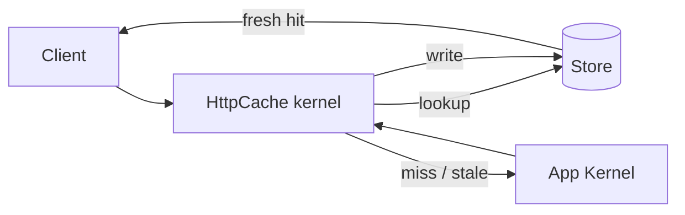
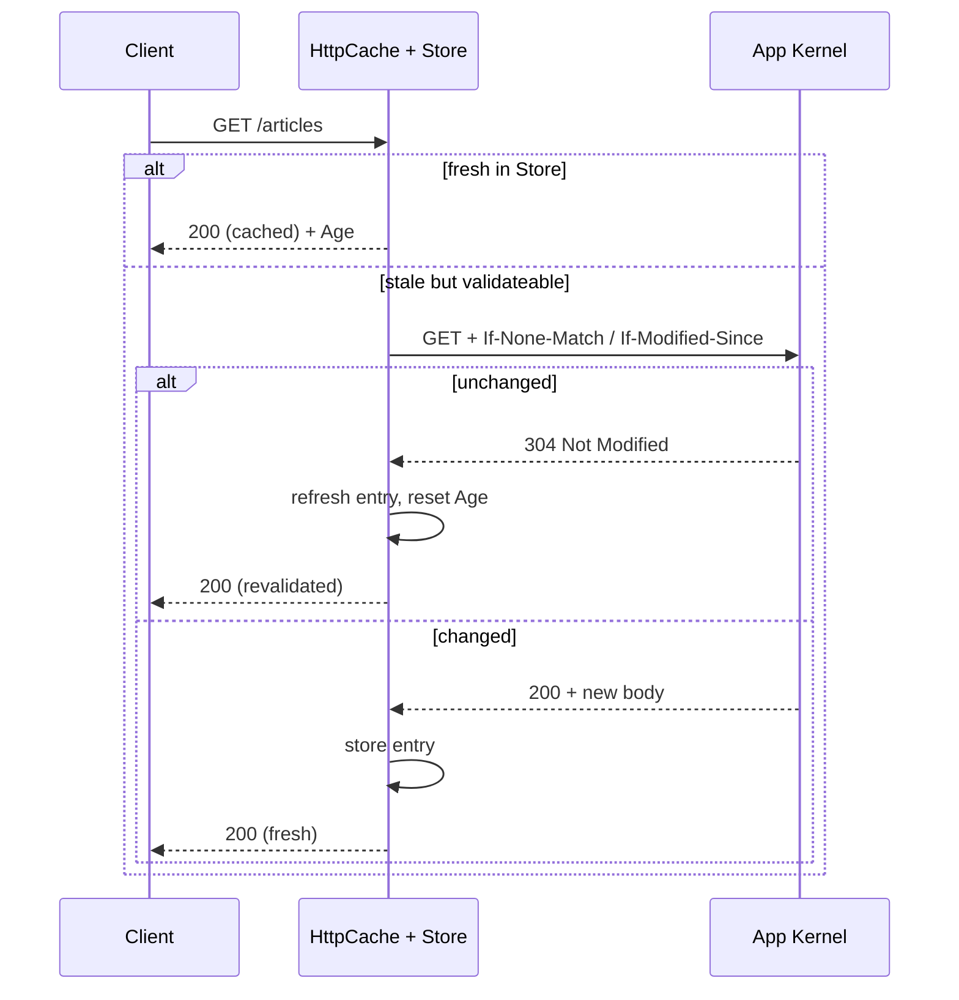

# Server-Side Caching

!!! tip "In a nutshell"
    Symfony ships a reverse proxy written in PHP, `HttpCache`, that **wraps** your
    kernel and serves shared-cache hits before the app runs. Enable it with
    `framework.http_cache: true`; it honours `s-maxage`, keeps a filesystem
    `Store`, and reports each hit/miss in the `X-Symfony-Cache` trace header.

!!! example "Real-world analogy"
    Picture a front-desk clerk stationed in the lobby, in front of the specialists upstairs.
    Common questions ("what are your opening hours?") the clerk answers straight from a card
    on the desk, never bothering the specialists — that is a shared-cache hit served before
    the app even runs. Only new or expired questions get passed up the stairs. If a visitor
    shows a personal ID badge or a private letter (a session `Cookie` or `Authorization`
    header), the clerk refuses to give a canned answer and always sends them up, because the
    reply would be personal. The clerk also stamps every answer with a note saying whether
    it came from the desk card or from upstairs — that note is the `X-Symfony-Cache` trace.

!!! abstract "Learning objectives"
    By the end of this chapter you can:

    - [ ] Explain what the Symfony reverse proxy (`HttpCache`) is and where it sits.
    - [ ] Enable it via `framework.http_cache` or by wrapping the kernel.
    - [ ] Describe `Store`, the lookup/write flow and the `X-Symfony-Cache` trace.
    - [ ] Decide when to use the PHP reverse proxy vs Varnish.

    **Syllabus:** `HTTP Caching → Server-side (reverse proxy)` ·
    **Level:** Expert ·

    **Est. time:** 25 min ·
    **Prerequisites:** [Cache Types](cache-types.md), [Expiration](expiration.md)
    **Examen Symfony 8 :** OUI
---

## Pour les nuls

### L'idée en une phrase
Symfony fournit son propre reverse proxy écrit en PHP (`HttpCache`) qui répond directement aux requêtes fréquentes sans jamais réveiller ton application.

### Imagine dans la vraie vie
Un employé d'accueil posté dans le hall, devant les spécialistes à l'étage. Les questions courantes ("quels sont vos horaires ?"), l'employé répond directement depuis une fiche sur le bureau, sans jamais déranger les spécialistes.

### Dans Symfony
Une page d'accueil publique, identique pour tous les visiteurs anonymes, peut être servie des milliers de fois par seconde par `HttpCache` sans jamais réveiller le kernel Symfony complet — un gain de performance énorme.

### Exemple simple
```yaml
framework:
    http_cache: { enabled: true }
```

### Comment le mémoriser 🧠
Si un visiteur présente un cookie de session ou un header `Authorization`, `HttpCache` **refuse toujours** de servir une réponse en cache — ces requêtes remontent systématiquement jusqu'à l'application.

---

## Theory

A **reverse proxy** (gateway cache) is a shared cache you own, placed **in front
of** the application. It answers cache hits itself and only forwards misses to
the backend. Symfony ships one written in PHP:
`Symfony\Component\HttpKernel\HttpCache\HttpCache`. It is a drop-in
`HttpKernelInterface` that **wraps** your real kernel, so a request hits the
cache kernel first.

```php
use Symfony\Component\HttpKernel\HttpCache\HttpCache;
use Symfony\Component\HttpKernel\HttpKernelInterface;

// HttpCache is itself an HttpKernelInterface that wraps the real kernel
$cachingKernel = new HttpCache($appKernel, $store);
$response = $cachingKernel->handle($request); // on a fresh hit, the app never runs
```

It obeys the standard headers you already know — `Cache-Control` (especially
`s-maxage`, since it is a *shared* cache), `Expires`, `ETag`, `Last-Modified`,
`Vary` — no bespoke config language. It also understands [ESI](../appendices/out-of-syllabus/esi.md).

```http
HTTP/1.1 200 OK
Cache-Control: public, s-maxage=3600
Expires: Tue, 07 Jul 2026 12:00:00 GMT
ETag: "v42"
Last-Modified: Mon, 06 Jul 2026 10:00:00 GMT
Vary: Accept-Encoding

# Standard headers only -- as a shared cache it prefers s-maxage over max-age
```

!!! info "Development convenience, not always production"
    The PHP reverse proxy is a real, correct HTTP/1.1 cache — handy in dev and
    fine for small sites. High-traffic production usually fronts the app with a
    dedicated cache (Varnish, an HTTP-caching CDN); the same response headers
    drive both.

!!! question "Predict first"
    A logged-in user requests a page marked `s-maxage=60` through the Symfony
    reverse proxy. Do they get a shared-cache hit?

??? note "Reveal"
    No. Their request carries a session `Cookie`, which is in the proxy's
    `private_headers` (default `Authorization, Cookie`), so `HttpCache` treats it as
    **private** — it neither serves from nor stores in the shared cache. Anonymous
    requests (no cookie) *do* get cached; move per-user bits into [ESI](../appendices/out-of-syllabus/esi.md).

## Deep Dive — how it works internally

### The wrapping model



`HttpCache` implements `HttpKernelInterface` **and** `TerminableInterface`. Its
constructor is:

```php
public function __construct(
    HttpKernelInterface $kernel,
    StoreInterface $store,
    ?SurrogateInterface $surrogate = null,
    array $options = [],
)
```

- `$kernel` — your application kernel (the backend it protects).
- `$store` — where entries live; the default is
  `Symfony\Component\HttpKernel\HttpCache\Store`, a filesystem store keyed by URL
  + `Vary`, using digest files and lock files.
- `$surrogate` — an `Esi` or `Ssi` instance for [fragment](../appendices/out-of-syllabus/esi.md) processing.
- `$options` — behavioural knobs (below).

```php
use Symfony\Component\HttpKernel\HttpCache\Esi;
use Symfony\Component\HttpKernel\HttpCache\HttpCache;
use Symfony\Component\HttpKernel\HttpCache\Store;

$store = new Store(__DIR__.'/../var/cache/http_cache'); // filesystem Store
$cache = new HttpCache(
    $kernel,              // the backend app kernel it protects
    $store,               // entries keyed by URL + Vary
    new Esi(),            // $surrogate: Esi (or new Ssi())
    ['default_ttl' => 0], // $options: behavioural knobs
);
```

!!! note "Source reference"
    `Symfony\Component\HttpKernel\HttpCache\HttpCache`,
    `...\HttpCache\Store` and `...\HttpCache\StoreInterface` —
    [symfony/symfony `8.0`](https://github.com/symfony/symfony/blob/8.0/src/Symfony/Component/HttpKernel/HttpCache/HttpCache.php).

### The lookup → validate → store flow

1. **Only `GET`/`HEAD`** are cache candidates; unsafe methods pass through and
   invalidate matching entries.
2. **Private guard:** if the request carries a header in `private_headers`
   (default `Authorization`, `Cookie`), it is treated as private — not served
   from nor stored in the shared cache.
3. **Lookup** in the `Store` by URL + `Vary` headers.
4. **Fresh hit** → return the stored response, adding an `Age` header.
5. **Stale/miss** → forward to the backend; if the entry is *validateable*
   (`ETag`/`Last-Modified`), send a conditional request and turn a backend `304`
   into a refreshed store entry.
6. **Store** the backend response if it is cacheable, then serve it.

For a *validateable* stale entry, the proxy issues a **conditional GET** to the
backend and turns a `304` into a refreshed hit — the client never sees the extra
round-trip:



### Options that shape behaviour

| Option | Default | Effect |
|---|---|---|
| `debug` | `false` | Throw on errors; verbose trace |
| `default_ttl` | `0` | TTL when the response gives no freshness info |
| `private_headers` | `Authorization, Cookie` | Headers that mark a request private |
| `allow_reload` | `false` | Honour client `Cache-Control: no-cache` (force reload) |
| `allow_revalidate` | `false` | Honour client `max-age=0` (force revalidate) |
| `stale_while_revalidate` | `2` | Default background-revalidation window |
| `stale_if_error` | `60` | Default serve-stale-on-error window |
| `trace_header` | `X-Symfony-Cache` | Header carrying the hit/miss trace |
| `trace_level` | `full` (debug) / `short` | Verbosity of the trace (`none`, `short`, `full`) |

### The `X-Symfony-Cache` trace

Every response carries a trace header (default `X-Symfony-Cache`) describing what
happened: `fresh`, `stale`, `miss`, `store`, `invalid`, e.g.
`X-Symfony-Cache: GET /: fresh`. It is your primary debugging tool — inspect it
to confirm hits.

```http
# First request: nothing stored yet, response written to the Store
HTTP/1.1 200 OK
X-Symfony-Cache: GET /articles: miss, store

# Second request within the TTL: served without running the app
HTTP/1.1 200 OK
X-Symfony-Cache: GET /articles: fresh

# Other values you may see: stale, invalid
```

!!! danger "`allow_reload`/`allow_revalidate` are off by default"
    Because letting any client force a cache bypass invites abuse, `allow_reload`
    and `allow_revalidate` default to **false**. A visitor's hard-reload does
    **not** blow past the shared cache unless you opt in.

## Configuration & code

=== "framework.http_cache (recommended)"

    ```yaml
    # config/packages/framework.yaml
    framework:
        # Boolean, or a map of the options above.
        http_cache:
            enabled: true
            trace_header: X-Symfony-Cache
            default_ttl: 0
    ```

    Symfony wraps the kernel with `HttpCache` automatically — no `public/index.php`
    changes needed. Enable it per-environment (typically prod).

=== "Wrap the kernel (index.php)"

    ```php
    <?php
    // public/index.php
    declare(strict_types=1);

    use App\Kernel;
    use Symfony\Bundle\FrameworkBundle\HttpCache\HttpCache;
    use Symfony\Component\HttpKernel\HttpKernelInterface;

    require_once dirname(__DIR__).'/vendor/autoload_runtime.php';

    return function (array $context): HttpKernelInterface {
        $kernel = new Kernel($context['APP_ENV'], (bool) $context['APP_DEBUG']);

        // Only wrap in prod; the FrameworkBundle subclass wires Store + options.
        if ('prod' === $context['APP_ENV']) {
            return new HttpCache($kernel);
        }

        return $kernel;
    };
    ```

=== "Console (debug)"

    ```console
    $ curl -sI https://localhost/articles | grep -i x-symfony-cache
    X-Symfony-Cache: GET /articles: fresh
    ```

!!! info "Which HttpCache class?"
    `Symfony\Bundle\FrameworkBundle\HttpCache\HttpCache` is a convenience
    **subclass** of the component's `HttpCache`. It reads the `Store` path from
    the kernel's cache dir and exposes `getOptions()`, `createStore()` and
    `createSurrogate()` to override. Use it when wrapping manually; the
    `framework.http_cache` flag uses the component class under the hood.

## Best practices & anti-patterns

| ✅ Do | ❌ Avoid |
|---|---|
| Drive it with standard headers (`s-maxage`, `ETag`) | Expecting custom config to force caching |
| Enable it in **prod** only | Wrapping the kernel in dev (masks changes) |
| Read `X-Symfony-Cache` to verify hits | Guessing whether a response was cached |
| Front real traffic with Varnish/CDN at scale | Relying on the PHP proxy for very high load |

## When (not) to use it / alternatives

Use the PHP reverse proxy for local development, small/medium sites, and when you
want caching without extra infrastructure. Reach for **Varnish** or a caching
**CDN** at high traffic or when you need edge distribution — they speak the same
HTTP headers, so your Symfony code is unchanged. For per-fragment freshness on a
mostly-cacheable page, add [ESI](../appendices/out-of-syllabus/esi.md) (supported by both the PHP proxy and
Varnish).

!!! danger "Certification traps"
    - `HttpCache` is a **shared** cache, so it obeys `s-maxage` over `max-age`.
    - It implements `HttpKernelInterface` **and** `TerminableInterface` and
      **wraps** your kernel — it is not a bundle you enable with services alone.
    - A request with a **session cookie/`Authorization`** is treated as
      **private** by default (`private_headers`) and skips the shared cache.
    - `allow_reload`/`allow_revalidate` default to **false** — clients cannot
      force a bypass unless enabled.
    - The default `Store` is a **filesystem** store; there is no built-in shared
      distributed store.

!!! warning "Common mistakes"
    - Enabling the proxy in `dev` and then wondering why edits don't show up.
    - Assuming the reverse proxy needs Varnish — the PHP `HttpCache` works out of
      the box.

## Exercises

1. **(Advanced)** Enable the Symfony reverse proxy in prod only and confirm a
   route is being served from cache.
2. **(Expert)** A page sets `s-maxage=60` but never gets a shared-cache hit for
   logged-in users. Explain why, and how to still cache the anonymous version.

??? success "Solutions"

    **1.** Set `framework.http_cache: true` in `config/packages/framework.yaml`
    (guard with `when@prod` if you keep it prod-only), then
    `curl -sI` the route and check `X-Symfony-Cache: ...: fresh` on the second
    request.

    **2.** Logged-in requests send a session `Cookie`, which is in the proxy's
    `private_headers`, so they are treated as private and bypass the shared cache.
    Anonymous requests (no session cookie) *are* cached. To also cache the
    logged-in shell, move the per-user parts into [ESI](../appendices/out-of-syllabus/esi.md) fragments so the
    outer page stays anonymous/cacheable.

## Certification questions

*Question d'entraînement inspirée du syllabus — jamais une question officielle de l'examen.*

??? question "Q1. What is `Symfony\Component\HttpKernel\HttpCache\HttpCache`?"
    - [ ] A. A Twig extension for cache tags
    - [x] B. A reverse-proxy kernel that wraps your app kernel ✅
    - [ ] C. A PSR-6 cache pool
    - [ ] D. A compiler pass

    **Why:** It implements `HttpKernelInterface`/`TerminableInterface` and wraps
    the real kernel, acting as an in-PHP gateway cache.
    **Ref:** [Symfony reverse proxy](https://symfony.com/doc/8.0/http_cache.html#symfony-reverse-proxy).

??? question "Q2. Which request header, by default, makes `HttpCache` treat a request as private?"
    - [x] A. `Cookie` (and `Authorization`) ✅
    - [ ] B. `Accept`
    - [ ] C. `User-Agent`
    - [ ] D. `Referer`

    **Why:** The `private_headers` option defaults to `Authorization, Cookie`;
    such requests skip the shared cache.
    **Ref:** [HttpCache options](https://github.com/symfony/symfony/blob/8.0/src/Symfony/Component/HttpKernel/HttpCache/HttpCache.php).

??? question "Q3. How do you inspect whether the reverse proxy served a hit?"
    - [ ] A. `X-Cache-Status`
    - [x] B. The `X-Symfony-Cache` trace header ✅
    - [ ] C. The `Age` header must be 0
    - [ ] D. `X-Debug-Cache`

    **Why:** `HttpCache` writes a trace (default header `X-Symfony-Cache`) like
    `GET /: fresh`/`miss`/`store`.
    **Ref:** [Debugging HttpCache](https://symfony.com/doc/8.0/http_cache.html).

??? question "Q4. The easiest way to enable the reverse proxy in Symfony 8 is…"
    - [x] A. `framework.http_cache: true` in config ✅
    - [ ] B. Registering a compiler pass
    - [ ] C. Installing Varnish
    - [ ] D. Adding `#[AsHttpCache]` to the kernel

    **Why:** The framework config flag wraps the kernel automatically; manual
    wrapping in `public/index.php` is the alternative.
    **Ref:** [Symfony reverse proxy](https://symfony.com/doc/8.0/http_cache.html#symfony-reverse-proxy).

## Key takeaways

- The Symfony reverse proxy is `HttpCache`, a PHP gateway cache that **wraps** the
  kernel and obeys standard HTTP headers (shared cache ⇒ `s-maxage`).
- Enable it with `framework.http_cache: true` or by wrapping in `public/index.php`.
- The default `Store` is filesystem; `private_headers` (Cookie/Authorization)
  keep authenticated requests out of the shared cache.
- `X-Symfony-Cache` is the trace header; `allow_reload`/`allow_revalidate` are off
  by default.
- Varnish/CDN are drop-in alternatives driven by the same headers.

## Last-minute revision

!!! tip "Cheat sheet"
    - Class: `Symfony\Component\HttpKernel\HttpCache\HttpCache` (impl.
      `HttpKernelInterface` + `TerminableInterface`).
    - Enable: `framework.http_cache: true` **or** wrap kernel with
      `Symfony\Bundle\FrameworkBundle\HttpCache\HttpCache`.
    - Ctor: `(kernel, store, ?surrogate, options)`; default `Store` = filesystem.
    - Trace header `X-Symfony-Cache`; `private_headers` = Cookie, Authorization.
    - Shared cache → honours `s-maxage`; supports [ESI](../appendices/out-of-syllabus/esi.md).

## Connections

- **Depends on:** [Request Handling](../architecture/request-handling.md) —
  `HttpCache` is an `HttpKernelInterface` that wraps the kernel before it runs.
- **Reused in:** [Edge Side Includes](../appendices/out-of-syllabus/esi.md) — the reverse proxy is the surrogate
  that fetches and stitches ESI fragments.
- **Confused with:** [Client-Side Caching](client-side.md) — this is a *shared*
  cache you own; the browser cache is private and per-user.

## Official References
- [Symfony docs — Symfony reverse proxy](https://symfony.com/doc/8.0/http_cache.html#symfony-reverse-proxy)
- [Symfony source — HttpCache](https://github.com/symfony/symfony/blob/8.0/src/Symfony/Component/HttpKernel/HttpCache/HttpCache.php)
- [Symfony source — Store](https://github.com/symfony/symfony/blob/8.0/src/Symfony/Component/HttpKernel/HttpCache/Store.php)

## Video references

!!! tip "Watch & learn"
    These are official, continuously-updated video channels — search them for
    "HTTP caching" to reinforce this chapter. We link stable channels rather than
    individual videos so the references never rot.

    - [SymfonyCasts screencasts](https://symfonycasts.com/tracks/symfony) — scripted, code-along tutorials.
    - [Symfony official YouTube](https://www.youtube.com/@SymfonyOfficial) — SymfonyCon conference talks & keynotes.
    - [Official docs for this topic](https://symfony.com/doc/8.0/http_cache.html#symfony-reverse-proxy) — some Symfony doc pages embed a screencast.

## Confidence check

I'm ready when I can:

- [ ] explain **why** a gateway cache exists — serve shared hits before the app runs
- [ ] enable it with `framework.http_cache` or by wrapping the kernel in Symfony 8
- [ ] debug "edits don't show up" (proxy enabled in dev) via the `X-Symfony-Cache` trace
- [ ] spot the traps: `private_headers` skip auth requests; `allow_reload` is off by default
- [ ] describe the `Store` lookup → validate → store flow and the `HttpCache` constructor

---

<small>Related: [Cache Types](cache-types.md) · [Expiration](expiration.md) ·
[Edge Side Includes](../appendices/out-of-syllabus/esi.md) · [Architecture](../architecture/index.md)</small>
