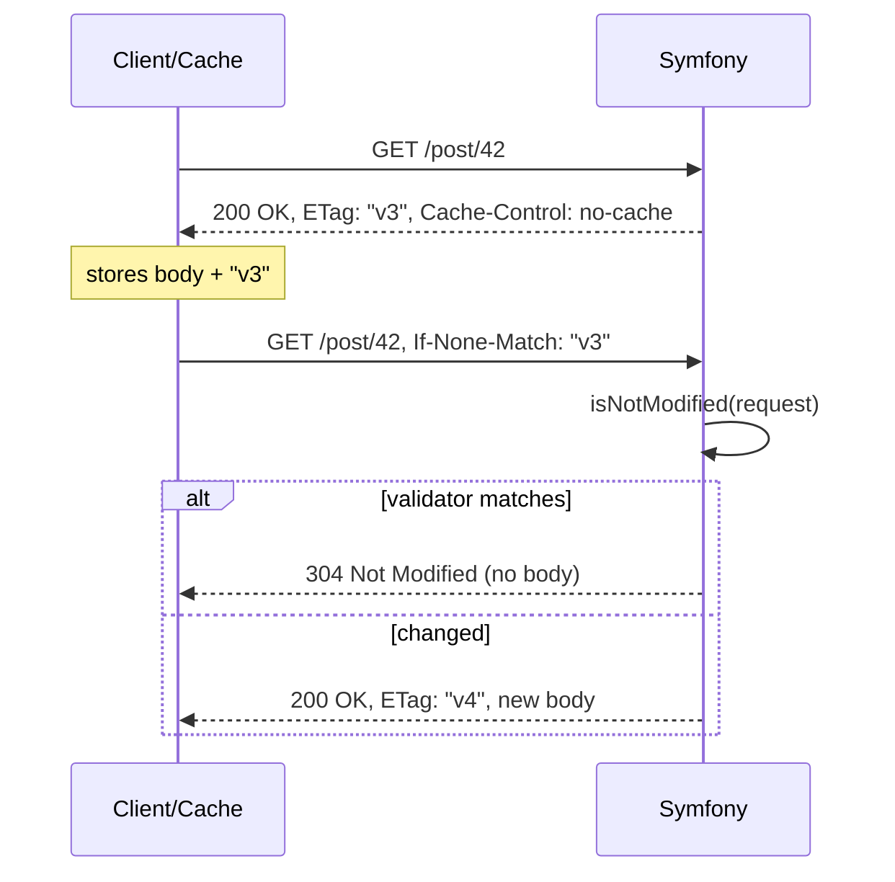

# Validation (ETag, Last-Modified)

!!! tip "In a nutshell"
    La validation attache une empreinte (`ETag` ou `Last-Modified`) pour qu'un
    cache puisse demander « toujours à jour ? » et recevoir un `304` sans corps
    quand rien n'a changé. Fait clé : calculez le validateur à moindre coût,
    appelez `Response::isNotModified($request)` (elle mute la response en 304 et
    supprime le corps), et retenez que l'ETag l'emporte sur Last-Modified quand
    les deux sont envoyés.

!!! example "Real-world analogy"
    Imaginez que vous conservez la photocopie d'un document de politique interne et que,
    avant de vous y fier, vous téléphonez au bureau en citant le numéro de version imprimé
    sur votre copie : « J'ai la version v3 — toujours à jour ? ». Si rien n'a changé, on vous
    répond simplement « oui, gardez la vôtre » au lieu de renvoyer tout le document par
    courrier — cette réponse est le `304` sans corps. Ce n'est que s'il a changé qu'on vous
    poste la nouvelle copie. Le tampon de version (`ETag`) ou la date de « dernière
    modification » (`Last-Modified`) est l'empreinte qui rend cette vérification peu
    coûteuse possible, et un numéro de version imprimé fait davantage foi que la date de
    modification quand votre copie porte les deux.

!!! abstract "Learning objectives"
    À la fin de ce chapitre, vous saurez :

    - [ ] Expliquer le modèle de validation et l'aller-retour `304 Not Modified`.
    - [ ] Définir des validateurs avec `setEtag()` (weak/strong) et `setLastModified()`.
    - [ ] Utiliser `Response::isNotModified()` pour court-circuiter une request.
    - [ ] Combiner validation et expiration pour une revalidation peu coûteuse.

    **Syllabus:** `HTTP Caching → Validation model` ·
    **Level:** Advanced → Expert ·
    **Est. time:** 25 min ·
    **Prerequisites:** [Expiration](expiration.md)

---

## Theory

Le modèle de **validation** ne prédit pas de durée de vie. À la place, la
response transporte un **validateur** — une empreinte de son contenu — que le
client renvoie à la request suivante pour demander « toujours à jour ? ». Si
oui, l'origine répond `304 Not Modified` **sans aucun corps**, économisant la
bande passante et le coût de rendu.

Deux validateurs existent :

| Validateur | Header de response | Header de request conditionnelle |
|---|---|---|
| **ETag** | `ETag: "abc"` | `If-None-Match: "abc"` |
| **Last-Modified** | `Last-Modified: <date>` | `If-Modified-Since: <date>` |

- **ETag** est un hash de contenu opaque — précis, granularité arbitraire.
- **Last-Modified** est un horodatage — peu coûteux si vous suivez déjà un
  `updatedAt`, mais avec une résolution d'une seconde seulement.

### Strong vs weak ETags

`ETag: "abc"` est **strong** (identique octet par octet). `ETag: W/"abc"` est
**weak** (sémantiquement équivalent — p. ex. même contenu, compression
différente). Les GET conditionnels (`If-None-Match`) utilisent la *comparaison
faible*, donc les weak ETags conviennent parfaitement au cache.

!!! question "Predict first"
    `Response::isNotModified($request)` retourne `true`. Que contient désormais
    `$response`, et que devez-vous encore faire ?

??? note "Reveal"
    Elle a **muté la response sur place** : le statut est `304`, et le corps ainsi
    que les headers de contenu (`Content-Type`, `Content-Length`, `Last-Modified`, …)
    sont supprimés. Le booléen n'est qu'un signal — vous devez encore faire
    `return $response` vous-même pour court-circuiter le rendu.

## Deep Dive — how it works internally

### The 304 round-trip



### `Response::isNotModified()`

`Response::isNotModified(Request $request): bool` est la méthode centrale. Elle
compare les `ETag`/`Last-Modified` de la response aux `If-None-Match`/
`If-Modified-Since` de la request. Quand elle retourne `true`, elle **mute la
response sur place** : elle définit le statut `304` et **supprime le corps et
les headers de contenu** (`Allow`, `Content-Encoding`, `Content-Language`,
`Content-Length`, `Content-MD5`, `Content-Type`, `Last-Modified`), afin que vous
puissiez la retourner en toute sécurité.

Règle de priorité : si la request transporte `If-None-Match`, **l'ETag
l'emporte** ; `If-Modified-Since` n'est décisif qu'en l'absence d'ETag. Quand les
deux sont envoyés, les deux doivent concorder pour obtenir un 304.

!!! note "Source reference"
    `Symfony\Component\HttpFoundation\Response::isNotModified()` et
    `Response::setEtag()` —
    [symfony/symfony `8.0`](https://github.com/symfony/symfony/blob/8.0/src/Symfony/Component/HttpFoundation/Response.php).

### Compute the validator *before* the heavy work

La validation n'économise le coût de rendu que si vous pouvez produire le
validateur **à moindre coût** — p. ex. à partir du `updatedAt` d'une entité —
*avant* de construire la response complète. Définissez le validateur, appelez
`isNotModified()`, puis faites un `return` anticipé en cas de correspondance.
L'attribut `#[Cache]` automatise exactement cela : ses **expressions**
`etag`/`lastModified` sont évaluées lors de `kernel.controller_arguments`, si
bien qu'une request correspondante produit un 304 **sans jamais entrer dans le
corps du controller**.

!!! info "ETag expressions are hashed"
    `#[Cache(etag: "post.getContent()")]` n'envoie **pas** la valeur brute : le
    `CacheAttributeListener` passe le résultat de l'expression par **SHA-256** et
    utilise ce hash comme ETag. L'attribut peut donc pointer sans risque vers un
    contenu volumineux.

### Combining validation with expiration

Ils ne sont pas exclusifs — les meilleures configurations utilisent **les
deux** :

- `s-maxage=60` (ou `max-age`) pour que les caches servent sans aucune request
  tant que la response est fraîche.
- `ETag`/`Last-Modified` pour que, *quand* elle devient périmée, le cache
  revalide via un GET conditionnel peu coûteux et obtienne généralement un 304
  sans corps.

`Cache-Control: no-cache` seul signifie « toujours revalider » — associez-le à un
`ETag` pour que la revalidation soit un 304 rapide plutôt qu'un
retéléchargement complet.

## Configuration & code

=== "Response API (manual)"

    ```php
    <?php
    declare(strict_types=1);

    namespace App\Controller;

    use App\Repository\PostRepository;
    use Symfony\Bundle\FrameworkBundle\Controller\AbstractController;
    use Symfony\Component\HttpFoundation\Request;
    use Symfony\Component\HttpFoundation\Response;
    use Symfony\Component\Routing\Attribute\Route;

    final class PostController extends AbstractController
    {
        #[Route('/post/{id}', name: 'post_show')]
        public function show(int $id, Request $request, PostRepository $posts): Response
        {
            $post = $posts->find($id) ?? throw $this->createNotFoundException();

            $response = new Response();
            $response->setLastModified($post->getUpdatedAt());   // \DateTimeInterface
            $response->setEtag(sha1($post->getContent()));        // strong ETag

            // Short-circuit: no rendering if the client is up to date.
            if ($response->isNotModified($request)) {
                return $response;                                  // 304, no body
            }

            return $this->render('post/show.html.twig', ['post' => $post], $response);
        }
    }
    ```

=== "#[Cache] attribute (expressions)"

    ```php
    <?php
    declare(strict_types=1);

    namespace App\Controller;

    use App\Entity\Post;
    use Symfony\Bundle\FrameworkBundle\Controller\AbstractController;
    use Symfony\Component\HttpFoundation\Response;
    use Symfony\Component\HttpKernel\Attribute\Cache;
    use Symfony\Component\Routing\Attribute\Route;

    final class PostController extends AbstractController
    {
        // Expressions run against resolved arguments (here: $post).
        // A match returns 304 before this method body executes.
        #[Route('/post/{id}', name: 'post_show')]
        #[Cache(lastModified: 'post.getUpdatedAt()', etag: 'post.getContent()')]
        public function show(Post $post): Response
        {
            return $this->render('post/show.html.twig', ['post' => $post]);
        }
    }
    ```

=== "Raw HTTP"

    ```http
    GET /post/42 HTTP/1.1
    If-None-Match: "9f3ab..."
    If-Modified-Since: Sun, 06 Jul 2026 10:00:00 GMT

    HTTP/1.1 304 Not Modified
    ETag: "9f3ab..."
    Cache-Control: no-cache, private
    ```

## Best practices & anti-patterns

| ✅ Do | ❌ Avoid |
|---|---|
| Calculer le validateur à moindre coût, avant le rendu | Rendre la page, puis calculer un ETag |
| Utiliser `updatedAt` pour `Last-Modified` | Utiliser `now()` (ne correspond jamais) |
| `return $response` juste après un `isNotModified()` à `true` | Continuer le rendu après un 304 |
| Combiner un TTL court avec un ETag | `no-cache` sans validateur (retéléchargement complet à chaque fois) |

## When (not) to use it / alternatives

Utilisez la validation quand la durée de vie est imprévisible mais que le
changement est peu coûteux à détecter (entités avec un `updatedAt`, fichiers
avec un mtime). Utilisez l'[expiration](expiration.md) pure quand une durée de
vie fixe est acceptable et que vous voulez éviter *tout* aller-retour vers
l'origine. Pour les pages lourdes dont seule une partie change, mettez en cache
la coquille par expiration et revalidez le reste via [ESI](esi.md).

!!! danger "Certification traps"
    - `isNotModified()` **mute** la response (statut 304, suppression du corps et
      des headers de contenu) et retourne un `bool` — vous devez toujours faire
      `return $response`.
    - Quand `If-None-Match` et `If-Modified-Since` sont tous deux présents,
      **l'ETag a la priorité** ; une correspondance Last-Modified seule est
      ignorée si l'ETag diffère.
    - Les expressions ETag de `#[Cache]` sont **hachées en SHA-256** ; la valeur
      brute n'est jamais l'ETag.
    - `setEtag($v, weak: true)` émet `W/"..."` ; le GET conditionnel utilise la
      **comparaison faible** dans les deux cas.
    - Un `304` ne doit avoir **aucun corps de message** — Symfony l'applique pour
      vous.

!!! warning "Common mistakes"
    - Définir `Last-Modified` sur `new \DateTime()` (heure courante), qui ne
      correspond donc jamais — utilisez la vraie date de modification de la
      ressource.
    - Construire la response complète *avant* de vérifier `isNotModified()`, ce
      qui fait perdre les économies de CPU/rendu que le modèle est censé offrir.

## Exercises

1. **(Advanced)** Ajoutez une validation par ETag à une action `/post/{id}` pour
   que les posts inchangés retournent un 304 sans nouveau rendu. Calculez l'ETag
   à partir du contenu.
2. **(Expert)** Réécrivez-la avec `#[Cache]` pour que le 304 se produise *avant*
   le corps du controller, et expliquez où l'expression est évaluée.

??? success "Solutions"

    **1.** Voir l'onglet "Response API" : définissez
    `setEtag(sha1($post->getContent()))` (et éventuellement
    `setLastModified($post->getUpdatedAt())`), puis
    `if ($response->isNotModified($request)) { return $response; }` avant le
    rendu.

    **2.** Voir l'onglet "#[Cache] attribute" : `#[Cache(etag: 'post.getContent()')]`.
    `CacheAttributeListener` évalue l'expression lors de
    `KernelEvents::CONTROLLER_ARGUMENTS` (priorité 10) sur l'argument `$post`
    résolu, la hache en SHA-256, appelle `isNotModified()`, et en cas de
    correspondance remplace le controller par une closure retournant le 304 — le
    corps de la méthode ne s'exécute donc jamais.

## Certification questions

??? question "Q1. What does `Response::isNotModified()` do when it returns `true`?"
    - [ ] A. Nothing to the response; just returns a bool
    - [x] B. Sets status 304 and removes the body and content headers ✅
    - [ ] C. Throws a `NotModifiedHttpException`
    - [ ] D. Sends the response immediately

    **Why:** Elle mute la response sur place (304, sans corps ni headers de
    contenu) ; vous devez tout de même la retourner vous-même.
    **Ref:** [Validation](https://symfony.com/doc/current/http_cache/validation.html).

??? question "Q2. Request has both `If-None-Match` and `If-Modified-Since`. Which decides?"
    - [x] A. The ETag (`If-None-Match`) takes precedence ✅
    - [ ] B. The date (`If-Modified-Since`) takes precedence
    - [ ] C. Whichever is larger
    - [ ] D. Both are ignored; a 200 is always sent

    **Why:** Quand un ETag est fourni, c'est lui qui décide ; Last-Modified seul
    n'est utilisé qu'en l'absence d'ETag.
    **Ref:** [Response](https://github.com/symfony/symfony/blob/8.0/src/Symfony/Component/HttpFoundation/Response.php).

??? question "Q3. `#[Cache(etag: 'post.id')]` sends which ETag?"
    - [ ] A. The literal string `post.id`
    - [ ] B. The raw value of `$post->getId()`
    - [x] C. The SHA-256 hash of the evaluated expression ✅
    - [ ] D. A weak ETag of the whole response body

    **Why:** `CacheAttributeListener` hache le résultat de l'expression évaluée
    avec SHA-256 avant de l'utiliser comme ETag.
    **Ref:** [#[Cache] attribute](https://symfony.com/doc/current/http_cache.html#the-cache-attribute).

??? question "Q4. Which produces a weak ETag?"
    - [ ] A. `$response->setEtag('abc')`
    - [x] B. `$response->setEtag('abc', weak: true)` ✅
    - [ ] C. `$response->setWeakEtag('abc')`
    - [ ] D. `$response->setCache(['etag' => 'W/abc'])`

    **Why:** Le second argument `weak` de `setEtag()` préfixe `W/`. Il n'existe
    pas de `setWeakEtag()`.
    **Ref:** [Response API](https://symfony.com/doc/current/http_cache/validation.html).

## Key takeaways

- La validation transporte une empreinte (`ETag`/`Last-Modified`) pour que les
  caches demandent « changé ? » et reçoivent un `304` sans corps sinon.
- `isNotModified()` mute la response en 304 et supprime le corps ; c'est vous
  qui la retournez.
- L'ETag l'emporte sur Last-Modified quand les deux headers conditionnels sont
  présents.
- Les expressions `#[Cache]` s'exécutent avant le controller et hachent l'ETag
  en SHA-256.
- Combinez un TTL court et un validateur pour une revalidation peu coûteuse.

## Last-minute revision

!!! tip "Cheat sheet"
    - `setEtag($v, weak?)` → `ETag`/`W/"..."` ; `setLastModified(\DateTimeInterface)`.
    - `isNotModified(Request)` → 304 + suppression du corps ; **toujours la
      `return`**.
    - Headers conditionnels : `If-None-Match` (ETag) · `If-Modified-Since` (date).
    - L'ETag l'emporte sur Last-Modified quand les deux sont présents.
    - `#[Cache(etag:, lastModified:)]` → 304 avant le controller ; l'ETag est
      haché en SHA-256.

## Connections

- **Depends on:** [Expiration](expiration.md) — la validation est l'autre moitié
  du modèle de cache ; les meilleures configurations associent un TTL court à un
  validateur.
- **Reused in:** [Server-Side Caching](server-side.md) — le reverse proxy émet le
  GET conditionnel et transforme un `304` du backend en hit rafraîchi.
- **Confused with:** [Cache Types](cache-types.md) — les validateurs disent *si
  cela a changé*, pas *qui peut le stocker*.

## Official References
- [Symfony docs — Validation](https://symfony.com/doc/current/http_cache/validation.html)
- [Symfony docs — The #[Cache] attribute](https://symfony.com/doc/current/http_cache.html#the-cache-attribute)
- [MDN — Conditional requests](https://developer.mozilla.org/en-US/docs/Web/HTTP/Conditional_requests)
- [Symfony source — Response](https://github.com/symfony/symfony/blob/8.0/src/Symfony/Component/HttpFoundation/Response.php)

## Video references

!!! tip "Watch & learn"
    Voici des chaînes vidéo officielles, mises à jour en continu — cherchez-y
    "HTTP caching" pour consolider ce chapitre. Nous lions des chaînes stables
    plutôt que des vidéos individuelles pour que les références ne se périment
    jamais.

    - [SymfonyCasts screencasts](https://symfonycasts.com/tracks/symfony) — tutoriels scénarisés à suivre en codant.
    - [Symfony official YouTube](https://www.youtube.com/@SymfonyOfficial) — conférences et keynotes SymfonyCon.
    - [Official docs for this topic](https://symfony.com/doc/current/http_cache/validation.html) — certaines pages de la doc Symfony intègrent un screencast.

## Confidence check

Je suis prêt quand je peux :

- [ ] expliquer **pourquoi** la validation existe — un `304` sans corps économise bande passante et rendu
- [ ] définir `setEtag`/`setLastModified` et court-circuiter avec `isNotModified()` en Symfony 8
- [ ] déboguer un validateur qui ne correspond jamais (p. ex. `Last-Modified` défini sur `now()`)
- [ ] repérer que l'ETag l'emporte sur Last-Modified quand les deux headers conditionnels sont présents
- [ ] expliquer comment les expressions `#[Cache]` s'évaluent avant le controller et hachent l'ETag en SHA-256

---

<small>Related: [Expiration](expiration.md) · [Cache Types](cache-types.md) ·
[Client-Side Caching](client-side.md) · [Server-Side Caching](server-side.md)</small>
