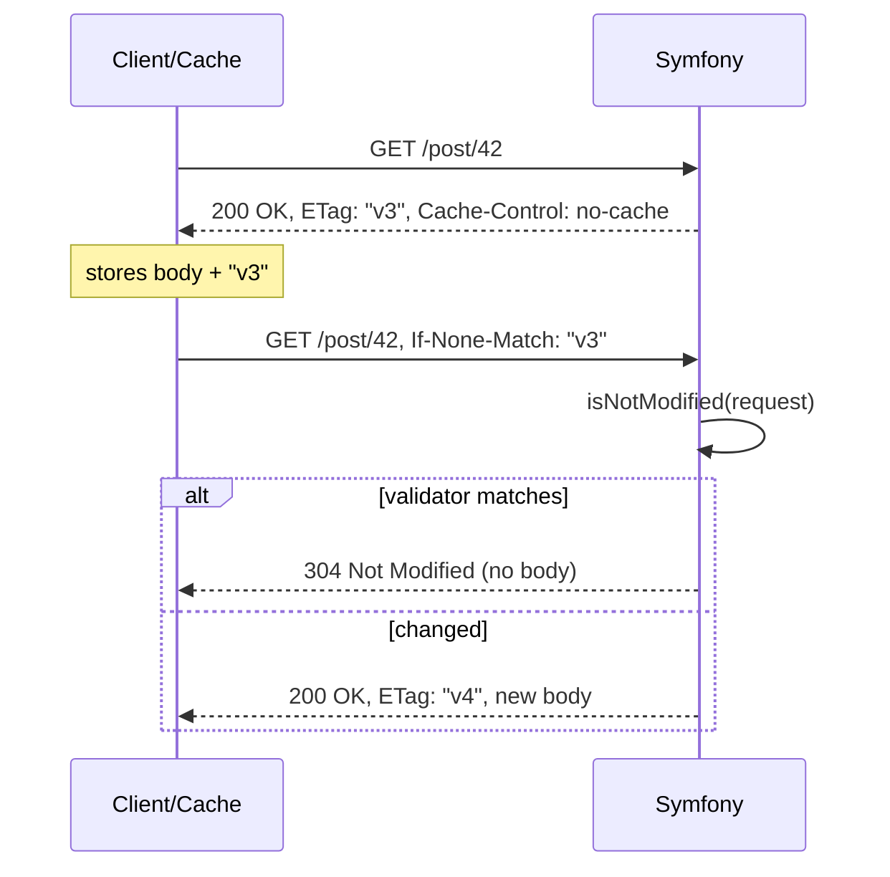

# Validation (ETag, Last-Modified)

!!! tip "In a nutshell"
    Validation attaches a fingerprint (`ETag` or `Last-Modified`) so a cache can
    ask "still current?" and get a bodyless `304` when nothing changed. Key fact:
    compute the validator cheaply, call `Response::isNotModified($request)` (it
    mutates the response to 304 and strips the body), and remember ETag wins over
    Last-Modified when both are sent.

!!! example "Real-world analogy"
    Imagine you keep a photocopy of a policy document and, before relying on it, you phone
    the office quoting the version number printed on your copy: "I've got version v3 — still
    current?". If nothing has changed they simply say "yes, keep using yours" instead of
    posting the whole document again — that reply is the bodyless `304`. Only if it changed
    do they mail the new copy. The version stamp (`ETag`) or the "last edited on" date
    (`Last-Modified`) is the fingerprint that makes this cheap check possible, and a printed
    version number is trusted over the edit date when your copy carries both.

!!! abstract "Learning objectives"
    By the end of this chapter you can:

    - [ ] Explain the validation model and the `304 Not Modified` round-trip.
    - [ ] Set validators with `setEtag()` (weak/strong) and `setLastModified()`.
    - [ ] Use `Response::isNotModified()` to short-circuit a request.
    - [ ] Combine validation with expiration for cheap revalidation.

    **Syllabus:** `HTTP Caching → Validation model` ·
    **Level:** Advanced → Expert ·
    **Est. time:** 25 min ·
    **Prerequisites:** [Expiration](expiration.md)

---

## Theory

The **validation** model does not predict a lifetime. Instead the response
carries a **validator** — a fingerprint of its content — and the client sends it
back on the next request to ask "still current?". If yes, the origin replies
`304 Not Modified` **with no body**, saving bandwidth and rendering cost.

Two validators exist:

| Validator | Response header | Conditional request header |
|---|---|---|
| **ETag** | `ETag: "abc"` | `If-None-Match: "abc"` |
| **Last-Modified** | `Last-Modified: <date>` | `If-Modified-Since: <date>` |

- **ETag** is an opaque content hash — precise, arbitrary granularity.
- **Last-Modified** is a timestamp — cheap if you already track an `updatedAt`,
  but only 1-second resolution.

### Strong vs weak ETags

`ETag: "abc"` is **strong** (byte-for-byte identical). `ETag: W/"abc"` is **weak**
(semantically equivalent — e.g. same content, different compression). Conditional
GETs (`If-None-Match`) use *weak comparison*, so weak tags are fine for caching.

```http
HTTP/1.1 200 OK
ETag: "abc"

HTTP/1.1 200 OK
ETag: W/"abc"

GET /post/42 HTTP/1.1
If-None-Match: W/"abc"
```

!!! question "Predict first"
    `Response::isNotModified($request)` returns `true`. What is now in `$response`,
    and what must you still do?

??? note "Reveal"
    It has **mutated the response in place**: status is `304`, and the body plus
    content headers (`Content-Type`, `Content-Length`, `Last-Modified`, …) are
    stripped. The boolean is just a signal — you must still `return $response`
    yourself to short-circuit rendering.

## Deep Dive — how it works internally

### The 304 round-trip



### `Response::isNotModified()`

`Response::isNotModified(Request $request): bool` is the workhorse. It compares
the response's `ETag`/`Last-Modified` against the request's `If-None-Match`/
`If-Modified-Since`. When it returns `true` it **mutates the response in place**:
sets status `304`, and **removes the body and content headers**
(`Allow`, `Content-Encoding`, `Content-Language`, `Content-Length`,
`Content-MD5`, `Content-Type`, `Last-Modified`) so you can safely `return` it.

Precedence rule: if the request carries `If-None-Match`, the **ETag wins**;
`If-Modified-Since` is only decisive when no ETag is supplied. When both are sent,
both must agree for a 304.

```php
// Compares ETag vs If-None-Match and Last-Modified vs If-Modified-Since;
// when both conditional headers are sent, the ETag comparison wins.
if ($response->isNotModified($request)) {
    // Mutated in place: status 304, body and content headers stripped
    return $response;
}
```

!!! note "Source reference"
    `Symfony\Component\HttpFoundation\Response::isNotModified()` and
    `Response::setEtag()` —
    [symfony/symfony `8.0`](https://github.com/symfony/symfony/blob/8.0/src/Symfony/Component/HttpFoundation/Response.php).

### Compute the validator *before* the heavy work

Validation only saves rendering cost if you can produce the validator **cheaply**
— e.g. from an entity's `updatedAt` — *before* building the full response. Set the
validator, call `isNotModified()`, and `return` early on a match. The
`#[Cache]` attribute automates exactly this: its `etag`/`lastModified`
**expressions** are evaluated on `kernel.controller_arguments`, so a matching
request yields a 304 **without ever entering the controller body**.

```php
// Manual: cheap validator first, heavy work only on a miss
$response = new Response();
$response->setLastModified($post->getUpdatedAt());   // from the entity's updatedAt

if ($response->isNotModified($request)) {
    return $response;   // 304 — rendering is skipped entirely
}

// Automated: etag/lastModified expressions run on kernel.controller_arguments
#[Cache(etag: 'post.getContent()', lastModified: 'post.getUpdatedAt()')]
public function show(Post $post): Response { /* not entered on a 304 */ }
```

!!! info "ETag expressions are hashed"
    `#[Cache(etag: "post.getContent()")]` does **not** send the raw value: the
    `CacheAttributeListener` runs the expression result through **SHA-256** and
    uses that as the ETag. So the attribute is safe to point at large content.

### Combining validation with expiration

They are not exclusive — the best setups use **both**:

- `s-maxage=60` (or `max-age`) so caches serve without any request while fresh.
- `ETag`/`Last-Modified` so that *when* it goes stale, the cache revalidates with
  a cheap conditional GET and usually gets a bodyless 304.

`Cache-Control: no-cache` on its own says "always revalidate" — pair it with an
`ETag` so the revalidation is a fast 304 rather than a full re-download.

```http
HTTP/1.1 200 OK
Cache-Control: public, max-age=0, s-maxage=60
ETag: "v3"
Last-Modified: Mon, 06 Jul 2026 10:00:00 GMT

HTTP/1.1 200 OK
Cache-Control: no-cache
ETag: "v3"
```

## Configuration & code

=== "Response API (manual)"

    ```php
    <?php
    declare(strict_types=1);

    namespace App\Controller;

    use App\Repository\PostRepository;
    use Symfony\Bundle\FrameworkBundle\Controller\AbstractController;
    use Symfony\Component\HttpFoundation\Request;
    use Symfony\Component\HttpFoundation\Response;
    use Symfony\Component\Routing\Attribute\Route;

    final class PostController extends AbstractController
    {
        #[Route('/post/{id}', name: 'post_show')]
        public function show(int $id, Request $request, PostRepository $posts): Response
        {
            $post = $posts->find($id) ?? throw $this->createNotFoundException();

            $response = new Response();
            $response->setLastModified($post->getUpdatedAt());   // \DateTimeInterface
            $response->setEtag(sha1($post->getContent()));        // strong ETag

            // Short-circuit: no rendering if the client is up to date.
            if ($response->isNotModified($request)) {
                return $response;                                  // 304, no body
            }

            return $this->render('post/show.html.twig', ['post' => $post], $response);
        }
    }
    ```

=== "#[Cache] attribute (expressions)"

    ```php
    <?php
    declare(strict_types=1);

    namespace App\Controller;

    use App\Entity\Post;
    use Symfony\Bundle\FrameworkBundle\Controller\AbstractController;
    use Symfony\Component\HttpFoundation\Response;
    use Symfony\Component\HttpKernel\Attribute\Cache;
    use Symfony\Component\Routing\Attribute\Route;

    final class PostController extends AbstractController
    {
        // Expressions run against resolved arguments (here: $post).
        // A match returns 304 before this method body executes.
        #[Route('/post/{id}', name: 'post_show')]
        #[Cache(lastModified: 'post.getUpdatedAt()', etag: 'post.getContent()')]
        public function show(Post $post): Response
        {
            return $this->render('post/show.html.twig', ['post' => $post]);
        }
    }
    ```

=== "Raw HTTP"

    ```http
    GET /post/42 HTTP/1.1
    If-None-Match: "9f3ab..."
    If-Modified-Since: Sun, 06 Jul 2026 10:00:00 GMT

    HTTP/1.1 304 Not Modified
    ETag: "9f3ab..."
    Cache-Control: no-cache, private
    ```

## Best practices & anti-patterns

| ✅ Do | ❌ Avoid |
|---|---|
| Compute the validator cheaply, before rendering | Rendering the page, then computing an ETag |
| Use `updatedAt` for `Last-Modified` | Using `now()` (never matches) |
| `return $response` right after a `true` `isNotModified()` | Continuing to render after a 304 |
| Combine a short TTL with an ETag | `no-cache` with no validator (full refetch each time) |

## When (not) to use it / alternatives

Use validation when the lifetime is unpredictable but change is cheap to detect
(entities with an `updatedAt`, files with an mtime). Use pure
[expiration](expiration.md) when a fixed lifetime is acceptable and you want to
avoid *any* origin round-trip. For heavy pages where only part changes, cache the
shell by expiration and revalidate the rest via [ESI](esi.md).

!!! danger "Certification traps"
    - `isNotModified()` **mutates** the response (sets 304, strips the body and
      content headers) and returns `bool` — you still must `return $response`.
    - When both `If-None-Match` and `If-Modified-Since` are present, the **ETag
      takes precedence**; a Last-Modified match alone is ignored if the ETag differs.
    - `#[Cache]` ETag expressions are **SHA-256 hashed**; the raw value is never
      the ETag.
    - `setEtag($v, weak: true)` emits `W/"..."`; conditional GET uses **weak
      comparison** either way.
    - A `304` must have **no message body** — Symfony enforces this for you.

!!! warning "Common mistakes"
    - Setting `Last-Modified` to `new \DateTime()` (current time) so it never
      matches — use the resource's real modification time.
    - Building the full response *before* checking `isNotModified()`, losing the
      CPU/render savings the model exists to provide.

## Exercises

1. **(Advanced)** Add ETag-based validation to a `/post/{id}` action so unchanged
   posts return 304 without re-rendering. Compute the ETag from the content.
2. **(Expert)** Rewrite it with `#[Cache]` so the 304 happens *before* the
   controller body, and explain where the expression is evaluated.

??? success "Solutions"

    **1.** See the "Response API" tab: set `setEtag(sha1($post->getContent()))`
    (and optionally `setLastModified($post->getUpdatedAt())`), then
    `if ($response->isNotModified($request)) { return $response; }` before
    rendering.

    **2.** See the "#[Cache] attribute" tab: `#[Cache(etag: 'post.getContent()')]`.
    `CacheAttributeListener` evaluates the expression on
    `KernelEvents::CONTROLLER_ARGUMENTS` (priority 10) against the resolved
    `$post` argument, SHA-256-hashes it, calls `isNotModified()`, and if it
    matches replaces the controller with a closure returning the 304 — so the
    method body never runs.

## Certification questions

??? question "Q1. What does `Response::isNotModified()` do when it returns `true`?"
    - [ ] A. Nothing to the response; just returns a bool
    - [x] B. Sets status 304 and removes the body and content headers ✅
    - [ ] C. Throws a `NotModifiedHttpException`
    - [ ] D. Sends the response immediately

    **Why:** It mutates the response in place (304, no body/content headers); you
    still return it yourself.
    **Ref:** [Validation](https://symfony.com/doc/current/http_cache/validation.html).

??? question "Q2. Request has both `If-None-Match` and `If-Modified-Since`. Which decides?"
    - [x] A. The ETag (`If-None-Match`) takes precedence ✅
    - [ ] B. The date (`If-Modified-Since`) takes precedence
    - [ ] C. Whichever is larger
    - [ ] D. Both are ignored; a 200 is always sent

    **Why:** When an ETag is supplied it governs; Last-Modified alone is only used
    without an ETag.
    **Ref:** [Response](https://github.com/symfony/symfony/blob/8.0/src/Symfony/Component/HttpFoundation/Response.php).

??? question "Q3. `#[Cache(etag: 'post.id')]` sends which ETag?"
    - [ ] A. The literal string `post.id`
    - [ ] B. The raw value of `$post->getId()`
    - [x] C. The SHA-256 hash of the evaluated expression ✅
    - [ ] D. A weak ETag of the whole response body

    **Why:** `CacheAttributeListener` hashes the evaluated expression result with
    SHA-256 before using it as the ETag.
    **Ref:** [#[Cache] attribute](https://symfony.com/doc/current/http_cache.html#the-cache-attribute).

??? question "Q4. Which produces a weak ETag?"
    - [ ] A. `$response->setEtag('abc')`
    - [x] B. `$response->setEtag('abc', weak: true)` ✅
    - [ ] C. `$response->setWeakEtag('abc')`
    - [ ] D. `$response->setCache(['etag' => 'W/abc'])`

    **Why:** The second `weak` argument to `setEtag()` prefixes `W/`. There is no
    `setWeakEtag()`.
    **Ref:** [Response API](https://symfony.com/doc/current/http_cache/validation.html).

## Key takeaways

- Validation carries a fingerprint (`ETag`/`Last-Modified`) so caches ask "changed?"
  and get a bodyless `304` when not.
- `isNotModified()` mutates the response to 304 and strips the body; you return it.
- ETag beats Last-Modified when both conditional headers are present.
- `#[Cache]` expressions run pre-controller and SHA-256-hash the ETag.
- Combine a short TTL with a validator for cheap revalidation.

## Last-minute revision

!!! tip "Cheat sheet"
    - `setEtag($v, weak?)` → `ETag`/`W/"..."`; `setLastModified(\DateTimeInterface)`.
    - `isNotModified(Request)` → 304 + strips body; **still `return`** it.
    - Conditional headers: `If-None-Match` (ETag) · `If-Modified-Since` (date).
    - ETag wins over Last-Modified when both present.
    - `#[Cache(etag:, lastModified:)]` → 304 before controller; ETag is SHA-256'd.

## Connections

- **Depends on:** [Expiration](expiration.md) — validation is the other half of the
  cache model; the best setups pair a short TTL with a validator.
- **Reused in:** [Server-Side Caching](server-side.md) — the reverse proxy issues
  the conditional GET and turns a backend `304` into a refreshed hit.
- **Confused with:** [Cache Types](cache-types.md) — validators say *whether it
  changed*, not *who may store it*.

## Official References
- [Symfony docs — Validation](https://symfony.com/doc/current/http_cache/validation.html)
- [Symfony docs — The #[Cache] attribute](https://symfony.com/doc/current/http_cache.html#the-cache-attribute)
- [MDN — Conditional requests](https://developer.mozilla.org/en-US/docs/Web/HTTP/Conditional_requests)
- [Symfony source — Response](https://github.com/symfony/symfony/blob/8.0/src/Symfony/Component/HttpFoundation/Response.php)

## Video references

!!! tip "Watch & learn"
    These are official, continuously-updated video channels — search them for
    "HTTP caching" to reinforce this chapter. We link stable channels rather than
    individual videos so the references never rot.

    - [SymfonyCasts screencasts](https://symfonycasts.com/tracks/symfony) — scripted, code-along tutorials.
    - [Symfony official YouTube](https://www.youtube.com/@SymfonyOfficial) — SymfonyCon conference talks & keynotes.
    - [Official docs for this topic](https://symfony.com/doc/current/http_cache/validation.html) — some Symfony doc pages embed a screencast.

## Confidence check

I'm ready when I can:

- [ ] explain **why** validation exists — a bodyless `304` saves bandwidth and rendering
- [ ] set `setEtag`/`setLastModified` and short-circuit with `isNotModified()` in Symfony 8
- [ ] debug a validator that never matches (e.g. `Last-Modified` set to `now()`)
- [ ] spot that ETag beats Last-Modified when both conditional headers are present
- [ ] explain how `#[Cache]` expressions evaluate pre-controller and SHA-256-hash the ETag

---

<small>Related: [Expiration](expiration.md) · [Cache Types](cache-types.md) ·
[Client-Side Caching](client-side.md) · [Server-Side Caching](server-side.md)</small>
