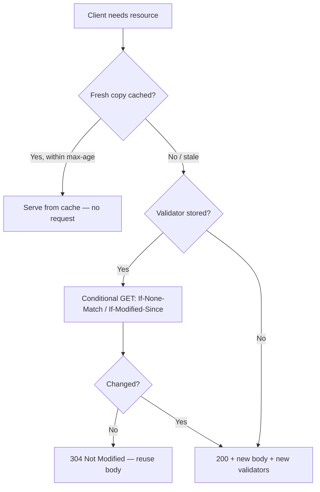

# Caching Overview

!!! tip "In a nutshell"
    Le cache HTTP permet aux navigateurs/proxies de réutiliser une response via
    deux modèles : la **fraîcheur** (sauter la request tant que la copie est
    fraîche) et la **validation** (demander, mais recevoir éventuellement un
    **304** sans corps). Piège d'examen : `max-age`/`s-maxage` relèvent de la
    fraîcheur ; `ETag`/`Last-Modified` de la validation.

!!! example "Real-world analogy"
    Il y a deux façons de décider si les restes d'hier soir sont encore bons. La
    première est la date « à consommer avant » sur la boîte : tant qu'elle n'est pas
    dépassée, vous les mangez sans hésiter — c'est la **fraîcheur**, où aucune
    question n'est posée. La seconde est de demander à la personne qui a cuisiné
    « est-ce que ça a changé ? » ; vous prenez toujours la décision, mais si la
    réponse est « non, comme avant », vous vous épargnez de re-cuisiner tout le
    repas — c'est la **validation**, et la réponse laconique « pas de changement »
    est le `304` sans corps.

!!! abstract "Learning objectives"
    À la fin de ce chapitre, vous saurez :

    - [ ] Distinguer le cache par **fraîcheur** (expiration) du cache par **validation**.
    - [ ] Nommer les headers utilisés par chaque modèle.
    - [ ] Définir des headers de cache basiques sur une `Response` Symfony.
    - [ ] Savoir où trouver le traitement complet du sujet.

    **Syllabus:** `HTTP → Caching (overview)` ·
    **Level:** Advanced ·
    **Est. time:** 12 min ·
    **Prerequisites:** [HTTP Response](response.md) · [Status Codes](status-codes.md)

---

!!! info "Scope"
    Ce chapitre est une **carte, pas le territoire**. Le cache HTTP est un stage
    entier. Pour la profondeur — reverse proxies, ESI, `s-maxage`,
    `stale-while-revalidate`, `Vary`, le kernel HttpCache de Symfony — lisez le
    stage dédié : [HTTP Caching](../http-caching/index.md).

## Theory

Le cache HTTP permet à un magasin (navigateur, CDN, reverse proxy) de réutiliser
une response au lieu de solliciter à nouveau votre application. Il existe **deux
modèles complémentaires** :

| Model | Question it answers | Key headers |
|---|---|---|
| **Expiration (fraîcheur)** | « Cette copie est-elle encore fraîche ? » | `Cache-Control: max-age`, `s-maxage`, `Expires` |
| **Validation** | « La ressource a-t-elle changé depuis ? » | `ETag` + `If-None-Match`, `Last-Modified` + `If-Modified-Since` |

- La **fraîcheur** évite entièrement la request jusqu'à expiration de la copie —
  le plus rapide.
- La **validation** interroge toujours le serveur, mais celui-ci peut répondre
  **`304 Not Modified`** sans corps si rien n'a changé — économise bande passante
  et rendu.

!!! question "Predict first"
    Un client détient une copie en cache avec `max-age=60` vieille de 20 secondes,
    et il a aussi stocké un `ETag`. La récupérer à nouveau touche-t-elle votre
    serveur ?

??? note "Reveal"
    Non. Tant que la copie est **fraîche** (dans `max-age`), elle est servie
    *sans aucune request* — la fraîcheur gagne d'abord. L'`ETag` n'entre en jeu
    qu'une fois la copie périmée, quand un GET conditionnel peut retourner un
    **304** sans corps.

## Deep Dive — how it works internally



`Symfony\Component\HttpFoundation\Response` expose toute la surface :

- Fraîcheur : `setMaxAge()`, `setSharedMaxAge()` (→ `s-maxage`, pour les caches
  partagés), `setPublic()`, `setPrivate()`, `setExpires()`.
- Validation : `setEtag()`, `setLastModified()`, et
  `isNotModified(Request $request)` qui compare les headers conditionnels de la
  request et, si rien n'a changé, transforme la response en **304** sans corps.
- `setCache([...])` en définit plusieurs à la fois.

```php
// Freshness: how long may caches reuse this response?
$response->setMaxAge(600);        // Cache-Control: max-age=600 (any cache)
$response->setSharedMaxAge(3600); // Cache-Control: s-maxage=3600 (shared caches)
$response->setPublic();           // opposite: setPrivate()
$response->setExpires(new \DateTimeImmutable('+1 hour')); // Expires header

// Validation: has the resource changed since?
$response->setEtag('"v3"');
$response->setLastModified(new \DateTimeImmutable('2026-01-01'));
if ($response->isNotModified($request)) {
    return $response; // mutated into a bodyless 304
}

// Or set several directives at once
$response->setCache(['public' => true, 'max_age' => 600, 's_maxage' => 3600]);
```

`Cache-Control: public` autorise les caches **partagés** (CDN/proxy) à la
stocker ; `private` la réserve au navigateur de l'utilisateur final. Une response
par défaut est `no-cache, private` — voir [HTTP Response](response.md).

```http
HTTP/1.1 200 OK
Cache-Control: public, max-age=600, s-maxage=3600

HTTP/1.1 200 OK
Cache-Control: no-cache, private
```

!!! note "Source reference"
    `Response::setCache()`, `isNotModified()`, `setSharedMaxAge()` —
    [symfony/symfony `8.0`](https://github.com/symfony/symfony/blob/8.0/src/Symfony/Component/HttpFoundation/Response.php).

## Configuration & code

=== "PHP Attributes"

    ```php
    <?php
    declare(strict_types=1);

    namespace App\Controller;

    use Symfony\Bundle\FrameworkBundle\Controller\AbstractController;
    use Symfony\Component\HttpFoundation\Request;
    use Symfony\Component\HttpFoundation\Response;
    use Symfony\Component\HttpKernel\Attribute\Cache;
    use Symfony\Component\Routing\Attribute\Route;

    final class ReportController extends AbstractController
    {
        // Declarative freshness via the #[Cache] attribute.
        #[Route('/report/{id}')]
        #[Cache(public: true, maxage: 3600, smaxage: 3600)]
        public function show(Request $request, string $id): Response
        {
            $response = new Response("Report {$id}");
            $response->setEtag(\md5("report-{$id}-v3")); // validation
            $response->setPublic();

            if ($response->isNotModified($request)) {
                return $response; // 304, empty body
            }

            return $response;
        }
    }
    ```

=== "Console"

    ```console
    $ curl -i -H 'If-None-Match: "abc"' https://localhost/report/7
    HTTP/1.1 304 Not Modified
    ETag: "abc"
    Cache-Control: public, s-maxage=3600
    ```

## Best practices & anti-patterns

| ✅ Do | ❌ Avoid |
|---|---|
| Utiliser la fraîcheur pour les assets stables | `no-cache` partout par réflexe |
| Ajouter des validateurs aux pages dynamiques | Mettre en cache des pages par utilisateur en `public` |
| `s-maxage` pour le CDN, `max-age` pour le navigateur | Confondre partagé et privé |

## When (not) to use it / alternatives

Ne marquez jamais `public` les responses propres à un utilisateur. Utilisez la
validation quand le contenu change de façon imprévisible mais coûte cher à
rendre ; utilisez l'expiration pour un contenu à durée de vie connue. Les
patterns complets (ESI, reverse proxy, `Vary`) vivent dans le stage
[HTTP Caching](../http-caching/index.md).

!!! danger "Certification traps"
    - **Fraîcheur ≠ validation.** `max-age` évite la request ; `ETag`/
      `Last-Modified` interrogent toujours mais peuvent produire un **304**.
    - **`s-maxage` ne cible que les caches partagés** et y prime sur `max-age`.
    - `public` vs `private` décide si un cache **partagé** peut la stocker.
    - `isNotModified()` transforme la response en **304 sans corps** quand les
      validateurs du client correspondent encore.

!!! warning "Common mistakes"
    - Envoyer un `ETag` faible/fort et oublier `isNotModified()`.
    - Marquer `public` des pages authentifiées — fuite de données entre
      utilisateurs.

## Exercises

1. **(Advanced)** Quelle paire de headers implémente le cache par *validation*,
   et quel status une correspondance produit-elle ?
2. **(Expert)** Mettre en cache une page publique dans un CDN pendant 10 minutes
   mais pas dans le navigateur. Quel setter unique ?

??? success "Solutions"

    **1.** `ETag`/`If-None-Match` (ou `Last-Modified`/`If-Modified-Since`) ; une
    correspondance produit **304 Not Modified**.

    **2.** `$response->setSharedMaxAge(600)` (définit `s-maxage`, honoré par les
    caches partagés uniquement) plus `setPublic()` ; laissez `max-age` non défini
    (les défauts empêchent le navigateur de mettre en cache à long terme).

## Certification questions

??? question "Q1. Which model can avoid contacting the server entirely?"
    - [x] A. Expiration (freshness) ✅
    - [ ] B. Validation
    - [ ] C. Both always
    - [ ] D. Neither

    **Why:** Tant que la copie est fraîche (`max-age`), le cache sert sans aucune
    request ; la validation envoie toujours une request conditionnelle.
    **Ref:** [Symfony HTTP cache](https://symfony.com/doc/current/http_cache.html).

??? question "Q2. `s-maxage` applies to…"
    - [ ] A. the browser cache only
    - [x] B. shared caches (proxies/CDN) only ✅
    - [ ] C. both equally
    - [ ] D. nothing without ESI

    **Why:** `s-maxage` n'est honoré que par les caches partagés et y prime sur
    `max-age`.
    **Ref:** [Cache expiration](https://symfony.com/doc/current/http_cache/expiration.html).

??? question "Q3. What does `Response::isNotModified()` return/produce on a match?"
    - [x] A. true, and turns the response into a bodyless 304 ✅
    - [ ] B. a 200 with the full body
    - [ ] C. a 412 Precondition Failed
    - [ ] D. nothing; it only reads headers

    **Why:** Elle compare les headers conditionnels et, en cas de correspondance,
    passe au 304 et vide le corps.
    **Ref:** [Symfony source — Response](https://github.com/symfony/symfony/blob/8.0/src/Symfony/Component/HttpFoundation/Response.php).

## Key takeaways

- Deux modèles : expiration (fraîcheur) et validation.
- Fraîcheur = `Cache-Control`/`Expires` ; validation = `ETag`/`Last-Modified`.
- `public`/`private` et `s-maxage` contrôlent les caches partagés.
- La profondeur vit dans le stage [HTTP Caching](../http-caching/index.md).

## Last-minute revision

!!! tip "Cheat sheet"
    - Frais → pas de request. Valider → GET conditionnel → peut-être **304**.
    - `setMaxAge` (navigateur), `setSharedMaxAge` (CDN), `setPublic/Private`.
    - `setEtag` + `isNotModified($request)` → 304.
    - Stage complet : `../http-caching/`.

## Connections

- **Depends on:** [HTTP Response](response.md) — chaque header de cache est un setter sur l'objet `Response`.
- **Reused in:** [HTTP Caching stage](../http-caching/index.md) — reverse proxies, ESI, `Vary` et `s-maxage` reposent tous sur ces deux modèles.
- **Confused with:** [Status Codes](status-codes.md) — la validation se termine en **304**, la fraîcheur en **200** servi ; ne mélangez pas les deux modèles.

## Official References
- [Symfony docs — HTTP Cache](https://symfony.com/doc/current/http_cache.html)
- [MDN — HTTP caching](https://developer.mozilla.org/en-US/docs/Web/HTTP/Caching)
- [Symfony source — Response](https://github.com/symfony/symfony/blob/8.0/src/Symfony/Component/HttpFoundation/Response.php)

## Video references

!!! tip "Watch & learn"
    Voici des chaînes vidéo officielles, mises à jour en continu — cherchez-y
    "HTTP foundation" pour consolider ce chapitre. Nous lions des chaînes stables
    plutôt que des vidéos individuelles pour que les références ne périment jamais.

    - [SymfonyCasts screencasts](https://symfonycasts.com/tracks/symfony) — tutoriels scénarisés à suivre en codant.
    - [Symfony official YouTube](https://www.youtube.com/@SymfonyOfficial) — conférences et keynotes SymfonyCon.
    - [Official docs for this topic](https://symfony.com/doc/current/http_cache.html) — certaines pages de la doc Symfony intègrent un screencast.

## Confidence check

Je suis prêt quand je peux :

- [ ] expliquer **pourquoi** le cache HTTP existe et en quoi la fraîcheur diffère de la validation
- [ ] définir des headers de cache sur une `Response` Symfony (`setMaxAge`, `setSharedMaxAge`, `setEtag`)
- [ ] déboguer une page qui refuse d'être mise en cache ou qui sert des données périmées
- [ ] repérer le piège : `max-age` vs `s-maxage`, `public` vs `private`
- [ ] expliquer ce que fait `isNotModified()` en interne (transforme la response en 304 sans corps)

---

<small>Related: [HTTP Response](response.md) · [Status Codes](status-codes.md) ·
[HTTP Caching stage](../http-caching/index.md) · [Validation (ETag)](../http-caching/validation.md)</small>
