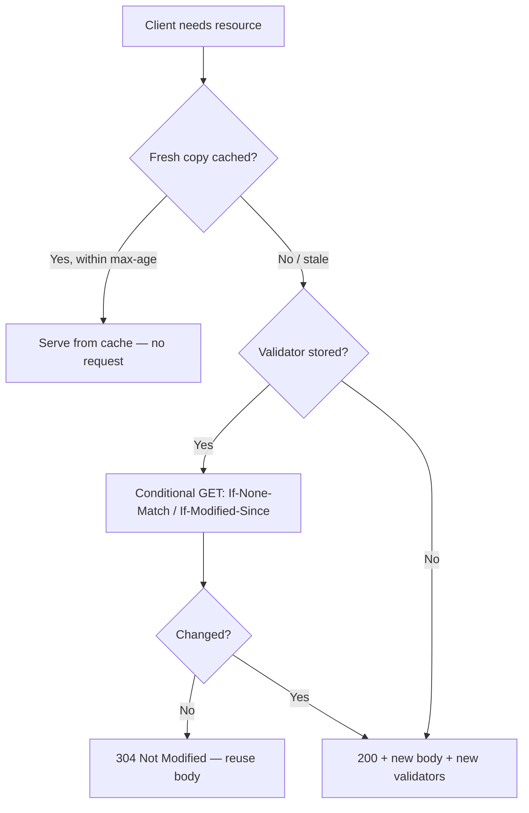

# Caching Overview

!!! tip "In a nutshell"
    HTTP caching lets browsers/proxies reuse a response via two models:
    **freshness** (skip the request while fresh) and **validation** (ask, but maybe
    get a bodyless **304**). Exam hook: `max-age`/`s-maxage` are freshness;
    `ETag`/`Last-Modified` are validation.

!!! example "Real-world analogy"
    There are two ways to decide whether last night's leftovers are still good. One is the
    "best before" date on the container: while it hasn't passed you eat them without a second
    thought — that is **freshness**, where no question is asked at all. The other is asking
    whoever cooked them "has this changed?"; you still make the call, but if the answer is
    "no, same as before" you are spared re-cooking the whole meal — that is **validation**,
    and the terse "no change" answer is the bodyless `304`.

!!! abstract "Learning objectives"
    By the end of this chapter you can:

    - [ ] Distinguish **freshness** (expiration) from **validation** caching.
    - [ ] Name the headers each model uses.
    - [ ] Set basic cache headers on a Symfony `Response`.
    - [ ] Know where to go for the full treatment.

    **Syllabus:** `HTTP → Caching (overview)` ·
    **Level:** Advanced ·
    **Est. time:** 12 min ·
    **Prerequisites:** [HTTP Response](response.md) · [Status Codes](status-codes.md)

    **Examen Symfony 8 :** OUI

---

## Pour les nuls

### L'idée en une phrase
Il y a deux façons d'éviter de refaire un travail déjà fait : ne rien redemander tant que c'est "encore bon" (fraîcheur), ou redemander mais recevoir un "rien de neuf" ultra-rapide (validation).

### Imagine dans la vraie vie
Un plat au frigo porte une date limite : tant qu'elle n'est pas dépassée, tu le manges sans te poser de question — c'est la **fraîcheur**, aucune question posée. L'autre option : tu appelles la personne qui a cuisiné et demandes "c'est toujours pareil ?" — si la réponse est "oui, rien n'a changé", tu t'épargnes de tout recuisiner — c'est la **validation**, et cette réponse courte "rien de neuf" est le fameux `304` sans corps.

### Dans Symfony
`$response->setPublic()->setMaxAge(3600)` active la fraîcheur (aucune requête au serveur pendant une heure) ; `$response->setETag($hash)` active la validation (le serveur est recontacté, mais répond en 304 si rien n'a changé).

### Exemple simple
```php
$response->setLastModified($article->getUpdatedAt());
$response->setEtag(md5($article->getContent()));
// Symfony renvoie 304 tout seul si le navigateur montre qu'il a déjà la bonne version
```

### Comment le mémoriser 🧠
**Fraîcheur = pas de question du tout** (`max-age`/`s-maxage`). **Validation = question posée, réponse parfois vide** (`ETag`/`Last-Modified` → `304`).

!!! info "Scope"
    This chapter is a **map, not the territory**. HTTP caching is a whole stage.
    For depth — reverse proxies, ESI, `s-maxage`, `stale-while-revalidate`,
    `Vary`, the Symfony HttpCache kernel — read the dedicated stage:
    [HTTP Caching](../http-caching/index.md).

## Theory

HTTP caching lets a store (browser, CDN, reverse proxy) reuse a response instead
of hitting your app again. There are **two complementary models**:

| Model | Question it answers | Key headers |
|---|---|---|
| **Expiration (freshness)** | "Is this copy still fresh?" | `Cache-Control: max-age`, `s-maxage`, `Expires` |
| **Validation** | "Has the resource changed since?" | `ETag` + `If-None-Match`, `Last-Modified` + `If-Modified-Since` |

- **Freshness** avoids the request entirely until the copy expires — fastest.
- **Validation** still asks the server, but the server can answer **`304 Not
  Modified`** with no body if nothing changed — saves bandwidth and rendering.

!!! question "Predict first"
    A client holds a cached copy with `max-age=60` that is 20 seconds old, and it
    also stored an `ETag`. Does fetching it again hit your server?

??? note "Reveal"
    No. While the copy is **fresh** (inside `max-age`) it is served with *no
    request at all* — freshness wins first. The `ETag` only comes into play once
    the copy goes stale, when a conditional GET may return a bodyless **304**.

## Deep Dive — how it works internally



`Symfony\Component\HttpFoundation\Response` exposes the whole surface:

- Freshness: `setMaxAge()`, `setSharedMaxAge()` (→ `s-maxage`, for shared caches),
  `setPublic()`, `setPrivate()`, `setExpires()`.
- Validation: `setEtag()`, `setLastModified()`, and
  `isNotModified(Request $request)` which compares the request's conditional
  headers and, if unchanged, mutates the response into a bodyless **304**.
- `setCache([...])` sets several at once.

```php
// Freshness: how long may caches reuse this response?
$response->setMaxAge(600);        // Cache-Control: max-age=600 (any cache)
$response->setSharedMaxAge(3600); // Cache-Control: s-maxage=3600 (shared caches)
$response->setPublic();           // opposite: setPrivate()
$response->setExpires(new \DateTimeImmutable('+1 hour')); // Expires header

// Validation: has the resource changed since?
$response->setEtag('"v3"');
$response->setLastModified(new \DateTimeImmutable('2026-01-01'));
if ($response->isNotModified($request)) {
    return $response; // mutated into a bodyless 304
}

// Or set several directives at once
$response->setCache(['public' => true, 'max_age' => 600, 's_maxage' => 3600]);
```

`Cache-Control: public` allows **shared** caches (CDN/proxy) to store it;
`private` restricts to the end user's browser. A default response is
`no-cache, private` — see [HTTP Response](response.md).

```http
HTTP/1.1 200 OK
Cache-Control: public, max-age=600, s-maxage=3600

HTTP/1.1 200 OK
Cache-Control: no-cache, private
```

!!! note "Source reference"
    `Response::setCache()`, `isNotModified()`, `setSharedMaxAge()` —
    [symfony/symfony `8.0`](https://github.com/symfony/symfony/blob/8.0/src/Symfony/Component/HttpFoundation/Response.php).

## Configuration & code

=== "PHP Attributes"

    ```php
    <?php
    declare(strict_types=1);

    namespace App\Controller;

    use Symfony\Bundle\FrameworkBundle\Controller\AbstractController;
    use Symfony\Component\HttpFoundation\Request;
    use Symfony\Component\HttpFoundation\Response;
    use Symfony\Component\HttpKernel\Attribute\Cache;
    use Symfony\Component\Routing\Attribute\Route;

    final class ReportController extends AbstractController
    {
        // Declarative freshness via the #[Cache] attribute.
        #[Route('/report/{id}')]
        #[Cache(public: true, maxage: 3600, smaxage: 3600)]
        public function show(Request $request, string $id): Response
        {
            $response = new Response("Report {$id}");
            $response->setEtag(\md5("report-{$id}-v3")); // validation
            $response->setPublic();

            if ($response->isNotModified($request)) {
                return $response; // 304, empty body
            }

            return $response;
        }
    }
    ```

=== "Console"

    ```console
    $ curl -i -H 'If-None-Match: "abc"' https://localhost/report/7
    HTTP/1.1 304 Not Modified
    ETag: "abc"
    Cache-Control: public, s-maxage=3600
    ```

## Best practices & anti-patterns

| ✅ Do | ❌ Avoid |
|---|---|
| Use freshness for stable assets | `no-cache` on everything by reflex |
| Add validators for dynamic pages | Caching per-user pages as `public` |
| `s-maxage` for CDN, `max-age` for browser | Mixing up shared vs private |

## When (not) to use it / alternatives

Never mark user-specific responses `public`. Use validation when content changes
unpredictably but is expensive to render; use expiration for content with a known
shelf life. Full patterns (ESI, reverse proxy, `Vary`) live in the
[HTTP Caching](../http-caching/index.md) stage.

!!! danger "Certification traps"
    - **Freshness ≠ validation.** `max-age` avoids the request; `ETag`/
      `Last-Modified` still ask but may yield **304**.
    - **`s-maxage` targets shared caches only** and overrides `max-age` there.
    - `public` vs `private` decides whether a **shared** cache may store it.
    - `isNotModified()` turns the response into a **304 with no body** when the
      client's validators still match.

!!! warning "Common mistakes"
    - Sending both a weak/strong `ETag` and forgetting `isNotModified()`.
    - Marking authenticated pages `public` — leaks data across users.

## Exercises

1. **(Advanced)** Which header pair implements *validation* caching, and what
   status does a match produce?
2. **(Expert)** Cache a public page in a CDN for 10 minutes but not in the
   browser. Which single setter?

??? success "Solutions"

    **1.** `ETag`/`If-None-Match` (or `Last-Modified`/`If-Modified-Since`); a match
    yields **304 Not Modified**.

    **2.** `$response->setSharedMaxAge(600)` (sets `s-maxage`, honoured by shared
    caches only) plus `setPublic()`; leave `max-age` unset (defaults keep the
    browser from long-term caching).

## Certification questions

*Question d'entraînement inspirée du syllabus — jamais une question officielle de l'examen.*

??? question "Q1. Which model can avoid contacting the server entirely?"
    - [x] A. Expiration (freshness) ✅
    - [ ] B. Validation
    - [ ] C. Both always
    - [ ] D. Neither

    **Why:** While fresh (`max-age`), the cache serves without any request;
    validation always sends a conditional request.
    **Ref:** [Symfony HTTP cache](https://symfony.com/doc/8.0/http_cache.html).

??? question "Q2. `s-maxage` applies to…"
    - [ ] A. the browser cache only
    - [x] B. shared caches (proxies/CDN) only ✅
    - [ ] C. both equally
    - [ ] D. nothing without ESI

    **Why:** `s-maxage` is honoured only by shared caches and overrides `max-age`
    there.
    **Ref:** [Cache expiration](https://symfony.com/doc/8.0/http_cache/expiration.html).

??? question "Q3. What does `Response::isNotModified()` return/produce on a match?"
    - [x] A. true, and turns the response into a bodyless 304 ✅
    - [ ] B. a 200 with the full body
    - [ ] C. a 412 Precondition Failed
    - [ ] D. nothing; it only reads headers

    **Why:** It compares conditional headers and, on a match, sets 304 and clears
    the body.
    **Ref:** [Symfony source — Response](https://github.com/symfony/symfony/blob/8.0/src/Symfony/Component/HttpFoundation/Response.php).

## Key takeaways

- Two models: expiration (freshness) and validation.
- Freshness = `Cache-Control`/`Expires`; validation = `ETag`/`Last-Modified`.
- `public`/`private` and `s-maxage` control shared caches.
- Depth lives in the [HTTP Caching](../http-caching/index.md) stage.

## Last-minute revision

!!! tip "Cheat sheet"
    - Fresh → no request. Validate → conditional GET → maybe **304**.
    - `setMaxAge` (browser), `setSharedMaxAge` (CDN), `setPublic/Private`.
    - `setEtag` + `isNotModified($request)` → 304.
    - Full stage: `../http-caching/`.

## Connections

- **Depends on:** [HTTP Response](response.md) — every cache header is a setter on the `Response` object.
- **Reused in:** [HTTP Caching stage](../http-caching/index.md) — reverse proxies, ESI, `Vary` and `s-maxage` all build on these two models.
- **Confused with:** [Status Codes](status-codes.md) — validation ends in **304**, freshness in a served **200**; don't mix the two models.

## Official References
- [Symfony docs — HTTP Cache](https://symfony.com/doc/8.0/http_cache.html)
- [MDN — HTTP caching](https://developer.mozilla.org/en-US/docs/Web/HTTP/Caching)
- [Symfony source — Response](https://github.com/symfony/symfony/blob/8.0/src/Symfony/Component/HttpFoundation/Response.php)

## Video references

!!! tip "Watch & learn"
    These are official, continuously-updated video channels — search them for
    "HTTP foundation" to reinforce this chapter. We link stable channels rather than
    individual videos so the references never rot.

    - [SymfonyCasts screencasts](https://symfonycasts.com/tracks/symfony) — scripted, code-along tutorials.
    - [Symfony official YouTube](https://www.youtube.com/@SymfonyOfficial) — SymfonyCon conference talks & keynotes.
    - [Official docs for this topic](https://symfony.com/doc/8.0/http_cache.html) — some Symfony doc pages embed a screencast.

## Confidence check

I'm ready when I can:

- [ ] explain **why** HTTP caching exists and how freshness differs from validation
- [ ] set cache headers on a Symfony `Response` (`setMaxAge`, `setSharedMaxAge`, `setEtag`)
- [ ] debug a page that won't cache or keeps serving stale data
- [ ] spot the trick: `max-age` vs `s-maxage`, `public` vs `private`
- [ ] explain what `isNotModified()` does internally (turns the response into a bodyless 304)

---

<small>Related: [HTTP Response](response.md) · [Status Codes](status-codes.md) ·
[HTTP Caching stage](../http-caching/index.md) · [Validation (ETag)](../http-caching/validation.md)</small>
