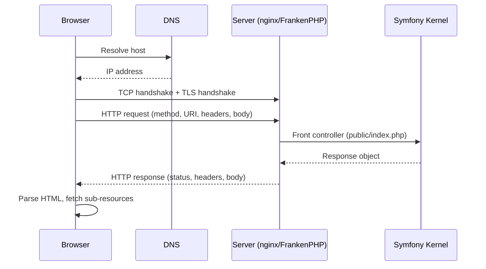

# Client / Server Interaction

!!! tip "In a nutshell"
    HTTP est un protocole request/response sans état qui repose sur DNS → TCP → TLS,
    et le chargement d'une seule page représente de nombreux échanges indépendants.
    Piège d'examen : c'est le serveur web / reverse proxy (pas PHP) qui choisit la
    version HTTP et termine TLS.

!!! example "Real-world analogy"
    HTTP, c'est comme correspondre par courrier avec une société de vente par
    correspondance. Chaque lettre que vous envoyez (une **request**) reçoit exactement
    une réponse (une **response**), et la société ne garde aucun souvenir de vous entre
    deux lettres, sauf si vous rappelez votre numéro de client sur chacune d'elles
    (cookies/sessions) — c'est cela, être « stateless ». Avant d'arriver, chaque lettre
    traverse le système postal : vous cherchez l'adresse (DNS), un itinéraire de
    livraison est établi (TCP), et une enveloppe scellée inviolable peut être utilisée
    (TLS). Charger une seule page web revient à poster des dizaines de ces lettres en
    même temps — une pour la page et une distincte pour chaque image et chaque feuille
    de style.

!!! abstract "Learning objectives"
    À la fin de ce chapitre, vous saurez :

    - [ ] Décrire le cycle request/response complet, de l'URL à la page rendue.
    - [ ] Expliquer où se situent TCP, TLS et DNS sous HTTP.
    - [ ] Comparer HTTP/1.1, HTTP/2 et HTTP/3 et leur impact sur les applications Symfony.
    - [ ] Projeter l'échange brut sur le front controller et le kernel de Symfony.

    **Syllabus:** `HTTP → Client/server interaction` ·
    **Level:** Advanced ·
    **Est. time:** 20 min ·
    **Prerequisites:** [Web Security Fundamentals](../php-web-security/web-security.md)

---

## Theory

HTTP est un protocole **request/response, textuel et sans état**. Un *client*
(navigateur, application mobile, `curl`, un autre service) ouvre une connexion vers
un *serveur*, envoie une **request** et reçoit une **response**. Le serveur ne garde
aucun souvenir des requests précédentes, sauf si l'application ajoute de l'état par
dessus (cookies, sessions, tokens).

Un seul « chargement de page » correspond à de nombreux échanges HTTP : un pour le
document HTML, puis un pour chaque fichier CSS, JS, image et appel d'API. Chaque
échange est une paire request/response indépendante.

### The layers below HTTP

HTTP est un protocole de **couche application**. Il s'appuie sur des couches
inférieures :

| Couche | Rôle | Exemple |
|---|---|---|
| DNS | Nom → IP | `example.com` → `93.184.216.34` |
| TCP | Octets fiables et ordonnés | Poignée de main en 3 temps (SYN/SYN-ACK/ACK) |
| TLS | Chiffrement + identité | Certificat, négociation des ciphers |
| HTTP | Sémantique request/response | `GET /`, `200 OK` |

TLS enveloppe la connexion TCP pour que HTTP circule chiffré (c'est *HTTPS* — HTTP
sur TLS, conventionnellement sur le port 443 ; HTTP en clair sur le port 80).

!!! question "Predict first"
    Qui décide si une request est servie en HTTP/2 — PHP, ou autre chose ?

??? note "Reveal"
    Le **serveur web / reverse proxy**, via ALPN pendant la poignée de main TLS. PHP
    ne fait qu'*observer* la version négociée via `$request->getProtocolVersion()` ;
    il ne choisit pas la version et ne termine pas TLS.

## Deep Dive — how it works internally

### The full cycle



1. La **résolution DNS** transforme le nom d'hôte en adresse IP.
2. La **poignée de main TCP** établit un flux d'octets fiable.
3. La **poignée de main TLS** (pour HTTPS) négocie les clés et valide le
   certificat du serveur.
4. Le client écrit une **request HTTP** : une ligne de requête
   (`GET /path HTTP/1.1`), des headers, une ligne vide, puis un body optionnel.
5. Le serveur web (nginx, Apache, Caddy/FrankenPHP) transmet la request au
   front controller PHP `public/index.php`.
6. Symfony construit une `Symfony\Component\HttpFoundation\Request` via
   `Request::createFromGlobals()`, le kernel produit une
   `Symfony\Component\HttpFoundation\Response`, et `Response::send()` réécrit la
   ligne de statut, les headers et le body sur la socket.

```php
// public/index.php (simplified): the raw exchange becomes objects
$request = Request::createFromGlobals();  // wraps $_GET, $_POST, $_SERVER…
$response = $kernel->handle($request);    // kernel produces a Response
$response->send();                        // writes status line, headers, body
```

!!! note "Source reference"
    `Symfony\Component\HttpFoundation\Request::createFromGlobals()` et
    `Symfony\Component\HttpKernel\HttpKernel::handle()` —
    [symfony/symfony `8.0`](https://github.com/symfony/symfony/blob/8.0/src/Symfony/Component/HttpFoundation/Request.php).

### Anatomy of the raw exchange

```http
GET /products?page=2 HTTP/1.1
Host: shop.example.com
Accept: text/html
Accept-Language: fr-FR,fr;q=0.9,en;q=0.8
Cookie: PHPSESSID=abc123

```

```http
HTTP/1.1 200 OK
Content-Type: text/html; charset=UTF-8
Cache-Control: private, max-age=0
Set-Cookie: PHPSESSID=abc123; Path=/; HttpOnly; SameSite=lax

<!DOCTYPE html>...
```

La request comporte une **ligne de requête**, des **headers** et un **body**
optionnel. La response comporte une **ligne de statut**, des **headers** et un
**body**.

### HTTP versions

| Version | Transport | Trait clé |
|---|---|---|
| HTTP/1.1 | 1 connexion TCP, texte | Keep-alive ; head-of-line blocking |
| HTTP/2 | 1 connexion TCP, binaire | Streams multiplexés, compression des headers (HPACK), server push (déprécié) |
| HTTP/3 | QUIC sur UDP | Pas de head-of-line blocking TCP, 0-RTT |

- **HTTP/1.1** envoie une request à la fois par connexion ; les navigateurs
  ouvrent plusieurs connexions pour paralléliser. Le head-of-line blocking pénalise
  les nombreux petits assets.
- **HTTP/2** multiplexe de nombreux streams sur une seule connexion et compresse
  les headers avec HPACK — gain majeur pour de nombreuses petites requests. Le
  server *push* est de fait mort (les navigateurs l'ont abandonné) ; préférez
  `103 Early Hints`.
- **HTTP/3** fonctionne sur QUIC (UDP), éliminant le head-of-line blocking au
  niveau TCP et permettant un établissement de connexion plus rapide.

La version est choisie par le serveur web / reverse proxy, **pas** par PHP. Symfony
voit le protocole négocié via `$request->getProtocolVersion()` (depuis la variable
serveur `SERVER_PROTOCOL`) mais ne termine lui-même ni TLS ni HTTP/2.

```php
// PHP only *observes* the version negotiated by the web server
$request->getProtocolVersion(); // e.g. "HTTP/2.0"
$_SERVER['SERVER_PROTOCOL'];    // raw source of that value
```

### Statelessness and state

HTTP étant sans état, la continuité de session est ajoutée par dessus avec des
**cookies** ([Cookies](cookies.md)) et des **sessions** côté serveur. C'est
pourquoi la paire de headers `Set-Cookie`/`Cookie` est centrale pour
l'authentification.

```http
HTTP/1.1 200 OK
Set-Cookie: PHPSESSID=abc123; Path=/; HttpOnly; SameSite=lax
```

```http
GET /account HTTP/1.1
Cookie: PHPSESSID=abc123
```

## Configuration & code

=== "PHP Attributes"

    ```php
    <?php
    declare(strict_types=1);

    namespace App\Controller;

    use Symfony\Bundle\FrameworkBundle\Controller\AbstractController;
    use Symfony\Component\HttpFoundation\Request;
    use Symfony\Component\HttpFoundation\Response;
    use Symfony\Component\Routing\Attribute\Route;

    final class DiagnosticsController extends AbstractController
    {
        #[Route('/whoami', name: 'whoami')]
        public function __invoke(Request $request): Response
        {
            return $this->json([
                'scheme'   => $request->getScheme(),        // http | https
                'secure'   => $request->isSecure(),         // bool
                'host'     => $request->getHost(),
                'port'     => $request->getPort(),
                'protocol' => $request->getProtocolVersion(), // e.g. HTTP/2
                'clientIp' => $request->getClientIp(),
            ]);
        }
    }
    ```

=== "Console"

    ```console
    $ curl -v --http2 https://localhost/whoami
    * ALPN: server accepted h2
    > GET /whoami HTTP/2
    < HTTP/2 200
    < content-type: application/json
    ```

## Best practices & anti-patterns

| ✅ À faire | ❌ À éviter |
|---|---|
| Terminer TLS en bordure (reverse proxy) | Terminer TLS dans PHP |
| Ne faire confiance au protocole/à l'IP que via `setTrustedProxies()` | Lire `X-Forwarded-*` aveuglément |
| Servir les assets en HTTP/2/3 | Le domain sharding (une astuce HTTP/1.1) |
| Traiter chaque request comme indépendante | Supposer une mémoire côté serveur entre les requests |

## When (not) to use it / alternatives

HTTP n'est pas optionnel pour les applications web, mais la *version* et le
*transport* sont une affaire d'ops. Pour du push temps réel, le modèle
request/response de HTTP est inadapté — utilisez SSE (`text/event-stream`, voir
[HttpClient](httpclient.md)) ou les WebSockets (hors périmètre) plutôt que du
polling.

!!! danger "Certification traps"
    - **PHP ne choisit pas la version HTTP et ne termine pas TLS** — c'est le
      serveur web/reverse proxy qui le fait. `$request->isSecure()` reflète
      `HTTPS`/un `X-Forwarded-Proto` de confiance, pas une décision de PHP.
    - Le **server push HTTP/2 est déprécié** ; `103 Early Hints` est le
      remplacement moderne.
    - HTTP est **stateless** — les sessions sont une construction de la couche
      applicative bâtie sur les cookies, pas une fonctionnalité du protocole.
    - Le port par défaut de HTTPS est **443**, celui de HTTP est **80** ;
      `getPort()` reflète le port effectif (ou transmis par un proxy de confiance).

!!! warning "Common mistakes"
    - Lire `$_SERVER['HTTP_X_FORWARDED_FOR']` directement au lieu de configurer
      les trusted proxies et d'utiliser `$request->getClientIp()`.
    - Confondre `getProtocolVersion()` (version HTTP) et `getScheme()`
      (http/https).

## Exercises

1. **(Advanced)** Écrivez une action de controller qui indique si la request
   courante est arrivée sur une connexion sécurisée et sur quelle version du
   protocole HTTP.
2. **(Expert)** Expliquez, dans la séquence d'un chargement de page, pourquoi la
   première request est plus lente que les suivantes sur la même connexion.

??? success "Solutions"

    **1.** Injectez `Request` et retournez
    `['secure' => $request->isSecure(), 'protocol' => $request->getProtocolVersion()]`
    en JSON (voir l'onglet de code ci-dessus). `isSecure()` respecte le
    `X-Forwarded-Proto` des trusted proxies.

    **2.** La première request paie la résolution DNS + la poignée de main TCP +
    la poignée de main TLS avant que le moindre octet HTTP ne circule. Les
    requests suivantes réutilisent la connexion déjà chaude (keep-alive /
    multiplexée), et évitent donc ces allers-retours d'initialisation.

## Certification questions

??? question "Q1. Which component chooses whether a request is served over HTTP/2?"
    - [ ] A. `Symfony\Component\HttpFoundation\Request`
    - [x] B. The web server / reverse proxy ✅
    - [ ] C. `public/index.php`
    - [ ] D. The PHP engine

    **Why:** La négociation du protocole (ALPN) se passe au niveau du serveur
    web/de la couche TLS. PHP ne fait qu'*observer* la version négociée.
    **Ref:** [HTTP fundamentals](https://developer.mozilla.org/en-US/docs/Web/HTTP/Overview).

??? question "Q2. HTTP is best described as…"
    - [ ] A. A stateful, binary-only protocol
    - [x] B. A stateless request/response protocol ✅
    - [ ] C. A transport-layer protocol
    - [ ] D. A protocol that requires TLS

    **Why:** HTTP est un protocole de couche application sans état ; l'état est
    ajouté via cookies/sessions et TLS est optionnel (HTTPS).
    **Ref:** [MDN HTTP overview](https://developer.mozilla.org/en-US/docs/Web/HTTP/Overview).

??? question "Q3. Which method reports the negotiated HTTP protocol version?"
    - [ ] A. `$request->getScheme()`
    - [ ] B. `$request->getMethod()`
    - [x] C. `$request->getProtocolVersion()` ✅
    - [ ] D. `$request->getContentTypeFormat()`

    **Why:** `getScheme()` retourne `http`/`https` ; `getProtocolVersion()`
    retourne par exemple `HTTP/1.1` depuis `SERVER_PROTOCOL`.
    **Ref:** [HttpFoundation](https://symfony.com/doc/8.0/components/http_foundation.html).

## Key takeaways

- Un chargement de page, ce sont de nombreuses paires request/response
  indépendantes sur DNS→TCP→TLS→HTTP.
- Symfony enveloppe l'échange brut dans `Request`/`Response` ; `Response::send()`
  le réécrit vers le client.
- HTTP/2 multiplexe ; HTTP/3 utilise QUIC ; le server push est mort — utilisez
  Early Hints.
- HTTP est stateless — les cookies/sessions ajoutent l'état.

## Last-minute revision

!!! tip "Cheat sheet"
    - Ports : HTTP **80**, HTTPS **443**. Scheme via `getScheme()`, version via
      `getProtocolVersion()`.
    - Cycle : DNS → TCP → TLS → request HTTP → front controller → Response → send.
    - HTTP/2 = binaire + multiplexage + HPACK ; HTTP/3 = QUIC/UDP ; push déprécié.
    - IP client derrière un proxy → `setTrustedProxies()` + `getClientIp()`.

## Connections

- **Depends on:** [Web Security Fundamentals](../php-web-security/web-security.md) — TLS/HTTPS sous-tend le transport sécurisé sur lequel repose HTTP.
- **Reused in:** [Request Handling](../architecture/request-handling.md) — le front controller et le kernel transforment l'échange brut en `Request`→`Response`.
- **Confused with:** [Cookies](cookies.md) — HTTP est stateless ; les cookies sont le complément de la couche applicative qui transporte l'état.

## Official References
- [MDN — HTTP overview](https://developer.mozilla.org/en-US/docs/Web/HTTP/Overview)
- [Symfony docs — HttpFoundation](https://symfony.com/doc/8.0/components/http_foundation.html)
- [Symfony source — Request](https://github.com/symfony/symfony/blob/8.0/src/Symfony/Component/HttpFoundation/Request.php)

## Video references

!!! tip "Watch & learn"
    Voici des chaînes vidéo officielles, mises à jour en continu — cherchez-y
    « HTTP foundation » pour consolider ce chapitre. Nous lions des chaînes stables
    plutôt que des vidéos individuelles pour que les références ne périment jamais.

    - [SymfonyCasts screencasts](https://symfonycasts.com/tracks/symfony) — tutoriels scénarisés à suivre en codant.
    - [Symfony official YouTube](https://www.youtube.com/@SymfonyOfficial) — conférences et keynotes SymfonyCon.
    - [Official docs for this topic](https://symfony.com/doc/8.0/components/http_foundation.html) — certaines pages de la doc Symfony intègrent un screencast.

## Confidence check

Je suis prêt quand je sais :

- [ ] expliquer **pourquoi** HTTP est stateless et en quoi un chargement de page est une multitude d'échanges indépendants
- [ ] retracer le cycle complet DNS → TCP → TLS → HTTP → front controller → `Response`
- [ ] déboguer une IP client / un protocole erroné derrière un proxy (`setTrustedProxies()`)
- [ ] repérer le piège : PHP ne choisit pas la version HTTP et ne termine pas TLS ; le server push est mort
- [ ] expliquer ce que rapportent respectivement `getScheme()`, `isSecure()` et `getProtocolVersion()`

---

<small>Related: [HTTP Request](request.md) · [HTTP Response](response.md) ·
[Status Codes](status-codes.md) · [Request Handling](../architecture/request-handling.md)</small>
