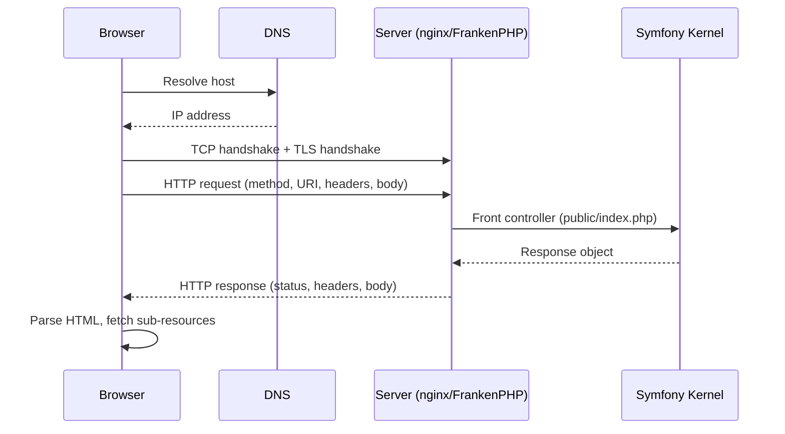

# Client / Server Interaction

!!! tip "In a nutshell"
    HTTP is a stateless request/response protocol riding on DNS → TCP → TLS, and a
    single page load is many independent exchanges. Exam hook: the web server /
    reverse proxy (not PHP) picks the HTTP version and terminates TLS.

!!! example "Real-world analogy"
    HTTP is like corresponding with a mail-order company by letter. Each letter you send (a
    **request**) gets exactly one reply (a **response**), and the company keeps no memory of
    you between letters unless you quote your account number on each one (cookies/sessions) —
    that is what "stateless" means. Before any letter arrives it travels through the postal
    system: you look up the address (DNS), a delivery route is established (TCP), and a
    tamper-proof sealed envelope may be used (TLS). Loading a single web page is like mailing
    dozens of these letters at once — one for the page and separate ones for every image and
    stylesheet.

!!! abstract "Learning objectives"
    By the end of this chapter you can:

    - [ ] Describe the full request/response cycle from URL to rendered page.
    - [ ] Explain where TCP, TLS and DNS sit under HTTP.
    - [ ] Contrast HTTP/1.1, HTTP/2 and HTTP/3 and their impact on Symfony apps.
    - [ ] Map the raw exchange onto Symfony's front controller and kernel.

    **Syllabus:** `HTTP → Client/server interaction` ·
    **Level:** Advanced ·
    **Est. time:** 20 min ·
    **Prerequisites:** [Web Security Fundamentals](../php-web-security/web-security.md)

---

## Theory

HTTP is a **stateless, text-based, request/response** protocol. A *client*
(browser, mobile app, `curl`, another service) opens a connection to a *server*,
sends a **request**, and receives a **response**. The server keeps no memory of
previous requests unless the application layers state on top (cookies, sessions,
tokens).

A single "page load" is many HTTP exchanges: one for the HTML document, then one
each for CSS, JS, images and API calls. Each exchange is an independent
request/response pair.

### The layers below HTTP

HTTP is an **application-layer** protocol. It relies on lower layers:

| Layer | Job | Example |
|---|---|---|
| DNS | Name → IP | `example.com` → `93.184.216.34` |
| TCP | Reliable, ordered bytes | 3-way handshake (SYN/SYN-ACK/ACK) |
| TLS | Encryption + identity | Certificate, cipher negotiation |
| HTTP | Request/response semantics | `GET /`, `200 OK` |

TLS wraps the TCP connection so HTTP travels encrypted (that is *HTTPS* — HTTP
over TLS, conventionally on port 443; plain HTTP on port 80).

!!! question "Predict first"
    Who decides whether a request is served over HTTP/2 — PHP, or something else?

??? note "Reveal"
    The **web server / reverse proxy**, via ALPN during the TLS handshake. PHP only
    *observes* the negotiated version through `$request->getProtocolVersion()`; it
    neither picks the version nor terminates TLS.

## Deep Dive — how it works internally

### The full cycle



1. **DNS resolution** turns the host name into an IP address.
2. **TCP handshake** establishes a reliable byte stream.
3. **TLS handshake** (for HTTPS) negotiates keys and validates the server
   certificate.
4. The client writes an **HTTP request**: a request line (`GET /path HTTP/1.1`),
   headers, a blank line, then an optional body.
5. The web server (nginx, Apache, Caddy/FrankenPHP) hands the request to the
   PHP front controller `public/index.php`.
6. Symfony builds a `Symfony\Component\HttpFoundation\Request` via
   `Request::createFromGlobals()`, the kernel produces a
   `Symfony\Component\HttpFoundation\Response`, and `Response::send()` writes the
   status line, headers and body back over the socket.

!!! note "Source reference"
    `Symfony\Component\HttpFoundation\Request::createFromGlobals()` and
    `Symfony\Component\HttpKernel\HttpKernel::handle()` —
    [symfony/symfony `8.0`](https://github.com/symfony/symfony/blob/8.0/src/Symfony/Component/HttpFoundation/Request.php).

### Anatomy of the raw exchange

```http
GET /products?page=2 HTTP/1.1
Host: shop.example.com
Accept: text/html
Accept-Language: fr-FR,fr;q=0.9,en;q=0.8
Cookie: PHPSESSID=abc123

```

```http
HTTP/1.1 200 OK
Content-Type: text/html; charset=UTF-8
Cache-Control: private, max-age=0
Set-Cookie: PHPSESSID=abc123; Path=/; HttpOnly; SameSite=lax

<!DOCTYPE html>...
```

The request has a **request line**, **headers**, and an optional **body**. The
response has a **status line**, **headers**, and a **body**.

### HTTP versions

| Version | Transport | Key trait |
|---|---|---|
| HTTP/1.1 | 1 TCP conn, text | Keep-alive; head-of-line blocking |
| HTTP/2 | 1 TCP conn, binary | Multiplexed streams, header compression (HPACK), server push (deprecated) |
| HTTP/3 | QUIC over UDP | No TCP head-of-line blocking, 0-RTT |

- **HTTP/1.1** sends one request at a time per connection; browsers open several
  connections to parallelise. Head-of-line blocking hurts many small assets.
- **HTTP/2** multiplexes many streams over one connection and compresses headers
  with HPACK — big win for many small requests. Server *push* is effectively dead
  (browsers dropped it); prefer `103 Early Hints`.
- **HTTP/3** runs over QUIC (UDP), eliminating TCP-level head-of-line blocking and
  enabling faster connection setup.

The version is chosen by the web server / reverse proxy, **not** by PHP. Symfony
sees the negotiated protocol via `$request->getProtocolVersion()` (from the
`SERVER_PROTOCOL` server variable) but does not itself terminate TLS or HTTP/2.

### Statelessness and state

Because HTTP is stateless, session continuity is layered on top with **cookies**
([Cookies](cookies.md)) and server-side **sessions**. This is why the
`Set-Cookie`/`Cookie` header pair is central to authentication.

## Configuration & code

=== "PHP Attributes"

    ```php
    <?php
    declare(strict_types=1);

    namespace App\Controller;

    use Symfony\Bundle\FrameworkBundle\Controller\AbstractController;
    use Symfony\Component\HttpFoundation\Request;
    use Symfony\Component\HttpFoundation\Response;
    use Symfony\Component\Routing\Attribute\Route;

    final class DiagnosticsController extends AbstractController
    {
        #[Route('/whoami', name: 'whoami')]
        public function __invoke(Request $request): Response
        {
            return $this->json([
                'scheme'   => $request->getScheme(),        // http | https
                'secure'   => $request->isSecure(),         // bool
                'host'     => $request->getHost(),
                'port'     => $request->getPort(),
                'protocol' => $request->getProtocolVersion(), // e.g. HTTP/2
                'clientIp' => $request->getClientIp(),
            ]);
        }
    }
    ```

=== "Console"

    ```console
    $ curl -v --http2 https://localhost/whoami
    * ALPN: server accepted h2
    > GET /whoami HTTP/2
    < HTTP/2 200
    < content-type: application/json
    ```

## Best practices & anti-patterns

| ✅ Do | ❌ Avoid |
|---|---|
| Terminate TLS at the edge (reverse proxy) | Terminating TLS in PHP |
| Trust protocol/IP only via `setTrustedProxies()` | Reading `X-Forwarded-*` blindly |
| Serve assets over HTTP/2/3 | Domain sharding (an HTTP/1.1 hack) |
| Treat every request as independent | Assuming server-side memory between requests |

## When (not) to use it / alternatives

HTTP is not optional for web apps, but the *version* and *transport* are an ops
concern. For real-time push, HTTP request/response is the wrong shape — use SSE
(`text/event-stream`, see [HttpClient](httpclient.md)) or WebSockets (out of
scope) instead of polling.

!!! danger "Certification traps"
    - **PHP does not choose the HTTP version or terminate TLS** — the web
      server/reverse proxy does. `$request->isSecure()` reflects `HTTPS`/trusted
      `X-Forwarded-Proto`, not a PHP decision.
    - HTTP/2 **server push is deprecated**; `103 Early Hints` is the modern
      replacement.
    - HTTP is **stateless** — sessions are an application-layer construct built on
      cookies, not a protocol feature.
    - HTTPS default port is **443**, HTTP is **80**; `getPort()` reflects the
      effective (or trusted-proxy-forwarded) port.

!!! warning "Common mistakes"
    - Reading `$_SERVER['HTTP_X_FORWARDED_FOR']` directly instead of configuring
      trusted proxies and using `$request->getClientIp()`.
    - Confusing `getProtocolVersion()` (HTTP version) with `getScheme()`
      (http/https).

## Exercises

1. **(Advanced)** Write a controller action that returns whether the current
   request arrived over a secure connection and on which HTTP protocol version.
2. **(Expert)** Explain, in the sequence of a page load, why the first
   request is slower than subsequent ones on the same connection.

??? success "Solutions"

    **1.** Inject `Request` and return
    `['secure' => $request->isSecure(), 'protocol' => $request->getProtocolVersion()]`
    as JSON (see the code tab above). `isSecure()` honours trusted-proxy
    `X-Forwarded-Proto`.

    **2.** The first request pays for DNS resolution + TCP handshake + TLS
    handshake before any HTTP bytes flow. Subsequent requests reuse the warm
    (keep-alive / multiplexed) connection, so they skip those setup round-trips.

## Certification questions

??? question "Q1. Which component chooses whether a request is served over HTTP/2?"
    - [ ] A. `Symfony\Component\HttpFoundation\Request`
    - [x] B. The web server / reverse proxy ✅
    - [ ] C. `public/index.php`
    - [ ] D. The PHP engine

    **Why:** Protocol negotiation (ALPN) happens at the web server/TLS layer.
    PHP only *observes* the negotiated version.
    **Ref:** [HTTP fundamentals](https://developer.mozilla.org/en-US/docs/Web/HTTP/Overview).

??? question "Q2. HTTP is best described as…"
    - [ ] A. A stateful, binary-only protocol
    - [x] B. A stateless request/response protocol ✅
    - [ ] C. A transport-layer protocol
    - [ ] D. A protocol that requires TLS

    **Why:** HTTP is a stateless application-layer protocol; state is added via
    cookies/sessions and TLS is optional (HTTPS).
    **Ref:** [MDN HTTP overview](https://developer.mozilla.org/en-US/docs/Web/HTTP/Overview).

??? question "Q3. Which method reports the negotiated HTTP protocol version?"
    - [ ] A. `$request->getScheme()`
    - [ ] B. `$request->getMethod()`
    - [x] C. `$request->getProtocolVersion()` ✅
    - [ ] D. `$request->getContentTypeFormat()`

    **Why:** `getScheme()` returns `http`/`https`; `getProtocolVersion()` returns
    e.g. `HTTP/1.1` from `SERVER_PROTOCOL`.
    **Ref:** [HttpFoundation](https://symfony.com/doc/current/components/http_foundation.html).

## Key takeaways

- A page load is many independent request/response pairs over DNS→TCP→TLS→HTTP.
- Symfony wraps the raw exchange in `Request`/`Response`; `Response::send()`
  writes it back.
- HTTP/2 multiplexes; HTTP/3 uses QUIC; server push is dead — use Early Hints.
- HTTP is stateless — cookies/sessions add state.

## Last-minute revision

!!! tip "Cheat sheet"
    - Ports: HTTP **80**, HTTPS **443**. Scheme via `getScheme()`, version via
      `getProtocolVersion()`.
    - Cycle: DNS → TCP → TLS → HTTP request → front controller → Response → send.
    - HTTP/2 = binary + multiplex + HPACK; HTTP/3 = QUIC/UDP; push deprecated.
    - Client IP behind a proxy → `setTrustedProxies()` + `getClientIp()`.

## Connections

- **Depends on:** [Web Security Fundamentals](../php-web-security/web-security.md) — TLS/HTTPS underpins the secure transport HTTP rides on.
- **Reused in:** [Request Handling](../architecture/request-handling.md) — the front controller and kernel turn the raw exchange into `Request`→`Response`.
- **Confused with:** [Cookies](cookies.md) — HTTP is stateless; cookies are the application-layer add-on that carries state.

## Official References
- [MDN — HTTP overview](https://developer.mozilla.org/en-US/docs/Web/HTTP/Overview)
- [Symfony docs — HttpFoundation](https://symfony.com/doc/current/components/http_foundation.html)
- [Symfony source — Request](https://github.com/symfony/symfony/blob/8.0/src/Symfony/Component/HttpFoundation/Request.php)

## Video references

!!! tip "Watch & learn"
    These are official, continuously-updated video channels — search them for
    "HTTP foundation" to reinforce this chapter. We link stable channels rather than
    individual videos so the references never rot.

    - [SymfonyCasts screencasts](https://symfonycasts.com/tracks/symfony) — scripted, code-along tutorials.
    - [Symfony official YouTube](https://www.youtube.com/@SymfonyOfficial) — SymfonyCon conference talks & keynotes.
    - [Official docs for this topic](https://symfony.com/doc/current/components/http_foundation.html) — some Symfony doc pages embed a screencast.

## Confidence check

I'm ready when I can:

- [ ] explain **why** HTTP is stateless and how a page load is many independent exchanges
- [ ] trace the full cycle DNS → TCP → TLS → HTTP → front controller → `Response`
- [ ] debug a wrong client IP / protocol behind a proxy (`setTrustedProxies()`)
- [ ] spot the trick: PHP neither picks the HTTP version nor terminates TLS; server push is dead
- [ ] explain what `getScheme()`, `isSecure()` and `getProtocolVersion()` each report

---

<small>Related: [HTTP Request](request.md) · [HTTP Response](response.md) ·
[Status Codes](status-codes.md) · [Request Handling](../architecture/request-handling.md)</small>
