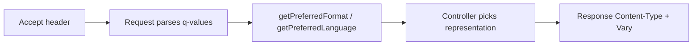

# Content Negotiation

!!! tip "In a nutshell"
    La négociation de contenu sert différentes représentations d'une même URL selon
    les headers `Accept*` du client et leurs poids `q`. Piège d'examen :
    `getPreferredFormat()` retourne un *format* Symfony (pas un type MIME brut), et
    vous devez définir `Vary` pour que les caches partagés ne servent pas la
    mauvaise variante.

!!! example "Real-world analogy"
    La négociation de contenu, c'est une lettre qui dit **« répondez en français si
    possible, sinon en anglais ; je préférerais une page imprimée mais un PDF fera
    l'affaire »**. Les headers `Accept*` sont ces préférences classées (les valeurs
    `q`), et le bureau choisit la meilleure représentation qu'il sait produire,
    puis tamponne la réponse avec son choix (`Content-Type`, `Content-Language`)
    plus une note `Vary` pour que la salle de tri classe chaque variante
    séparément.

!!! abstract "Learning objectives"
    À la fin de ce chapitre, vous saurez :

    - [ ] Expliquer comment `Accept`, `Accept-Language` et `Accept-Encoding`
      pilotent la négociation, y compris les valeurs de qualité (`q`).
    - [ ] Utiliser `Request::getAcceptableContentTypes()`, `getPreferredFormat()`
      et consorts.
    - [ ] Faire correspondre les types MIME aux *formats* Symfony et définir le
      format de la response.
    - [ ] Utiliser le parseur `AcceptHeader`.

    **Syllabus:** `HTTP → Content negotiation` ·
    **Level:** Advanced → Expert ·
    **Est. time:** 25 min ·
    **Prerequisites:** [HTTP Request](request.md) · [HTTP Response](response.md)

---

## Theory

La **négociation de contenu** permet à une seule URL de servir différentes
représentations. Le client annonce ses préférences via les headers de request
`Accept*` ; le serveur choisit la meilleure correspondance et reflète son choix
dans la response (`Content-Type`, `Content-Language`, `Content-Encoding`) plus un
header `Vary` pour que les caches indexent correctement.

```http
GET /articles/7 HTTP/1.1
Accept: application/json
Accept-Language: fr-FR, en;q=0.5
Accept-Encoding: gzip, br

HTTP/1.1 200 OK
Content-Type: application/json
Content-Language: fr
Content-Encoding: gzip
Vary: Accept, Accept-Language
```

| Request header | Negotiates | Response header |
|---|---|---|
| `Accept` | Type de média (`application/json`) | `Content-Type` |
| `Accept-Language` | Locale (`fr-FR`) | `Content-Language` |
| `Accept-Encoding` | Compression (`gzip`, `br`) | `Content-Encoding` |
| `Accept-Charset` | Charset (largement obsolète ; UTF-8) | — |

### Quality values

Chaque option porte un poids `q` optionnel de 0 à 1 (défaut 1) :

```http
Accept: text/html;q=0.9, application/json;q=1.0, */*;q=0.1
Accept-Language: fr-FR, fr;q=0.8, en;q=0.5
```

Le `q` le plus élevé gagne ; `q=0` signifie « inacceptable ». Les égalités se
départagent par spécificité.

!!! question "Predict first"
    Étant donné `Accept: application/xml;q=0.8, application/json;q=0.9`, quel
    format `getPreferredFormat()` retourne-t-il ?

??? note "Reveal"
    `json` — le `q` le plus élevé (0.9 > 0.8) gagne. Notez qu'il retourne un **nom
    de format** Symfony, pas un type MIME, et que vous devez définir
    `Vary: Accept` pour que les caches partagés indexent chaque représentation
    séparément.

## Deep Dive — how it works internally

### Request-side API

`Symfony\Component\HttpFoundation\Request` parse ces headers pour vous :

| Method | Returns |
|---|---|
| `getAcceptableContentTypes()` | Types MIME, du meilleur au moins bon |
| `getPreferredFormat(?string $default = 'html')` | *Format* Symfony correspondant le mieux à `Accept` |
| `getLanguages()` | Locales issues d'`Accept-Language`, de la meilleure à la moins bonne |
| `getPreferredLanguage(?array $locales = null)` | Meilleure correspondance parmi vos locales supportées |
| `getCharsets()` / `getEncodings()` | Depuis `Accept-Charset` / `Accept-Encoding` |
| `getRequestFormat(?string $default = 'html')` | Format issu de l'attribut `_format` |
| `setRequestFormat(string $format)` | Force le format |

`getPreferredLanguage(['en', 'fr'])` croise les langues ordonnées du client avec
*votre* liste blanche et retourne la meilleure — voir
[Language Detection](language-detection.md).

```php
// Accept: application/json;q=0.9, text/html;q=0.8
$request->getAcceptableContentTypes(); // ['application/json', 'text/html']
$request->getPreferredFormat();        // 'json' ('html' default if no match)

// Accept-Language: fr-FR, fr;q=0.8, en;q=0.5
$request->getLanguages();                     // ['fr_FR', 'fr', 'en']
$request->getPreferredLanguage(['en', 'fr']); // 'fr' — best within your list

$request->getCharsets();  // from Accept-Charset
$request->getEncodings(); // from Accept-Encoding, e.g. ['gzip', 'br']

$request->getRequestFormat();       // '_format' attribute, default 'html'
$request->setRequestFormat('json'); // force it for this request
```

### Formats ↔ MIME types

Symfony fait correspondre des noms de **format** courts (`html`, `json`, `xml`,
`csv`, …) aux types MIME via un registre statique sur `Request` :

```php
Request::getMimeTypes('json');   // ['application/json', 'application/x-json']
$request->getFormat('application/json'); // 'json'
$request->getMimeType('json');   // 'application/json'
```

L'attribut de route `_format` (p. ex. `/api/users.{_format}`) alimente
`getRequestFormat()`, et le kernel s'en sert pour choisir le `Content-Type` de la
response.

```php
// route: #[Route('/api/users.{_format}', defaults: ['_format' => 'json'])]
// incoming URL: GET /api/users.xml
$request->attributes->get('_format'); // 'xml'
$request->getRequestFormat();         // 'xml' — kernel derives the Content-Type
```



### The `AcceptHeader` parser

Pour un contrôle fin, `Symfony\Component\HttpFoundation\AcceptHeader` parse
n'importe quel header `Accept*` en objets
`Symfony\Component\HttpFoundation\AcceptHeaderItem` triés (valeur, qualité,
attributs) :

```php
<?php
declare(strict_types=1);

use Symfony\Component\HttpFoundation\AcceptHeader;

$accept = AcceptHeader::fromString('text/html;q=0.9, application/json;q=1.0');
$accept->has('application/json'); // true
$best = $accept->first();          // AcceptHeaderItem for application/json
$best?->getQuality();              // 1.0
```

!!! note "Source reference"
    `Request::getPreferredFormat()`, `getAcceptableContentTypes()`,
    `AcceptHeader`, `AcceptHeaderItem` —
    [symfony/symfony `8.0`](https://github.com/symfony/symfony/blob/8.0/src/Symfony/Component/HttpFoundation/AcceptHeader.php).

### Compression & `Vary`

`Accept-Encoding` (gzip/br) est normalement géré par le **serveur web ou le
reverse proxy**, pas par PHP. Dès qu'une response varie selon un header de
request, ajoutez `$response->setVary(['Accept', 'Accept-Language'])` pour que les
caches partagés stockent une entrée par variante — sinon un cache peut servir du
JSON à un client HTML.

```php
// gzip/br negotiation itself is done by nginx/Apache/CDN, not PHP;
// your job is to declare which request headers the response depends on
$response->setVary(['Accept', 'Accept-Language']);
$response->headers->get('Vary'); // 'Accept, Accept-Language'
```

### Null behavior

Quand le client n'envoie **aucun header `Accept`**, il n'y a rien à négocier —
Symfony l'interprète comme « accepte tout ». `getPreferredFormat()` retourne
alors le **défaut** que vous passez (`getPreferredFormat('html')` → `'html'`). Sa
signature est `getPreferredFormat(?string $default = 'html')` : passez `null` et
une request vraiment sans correspondance produit **`null`**, que vous devez alors
gérer. `getPreferredLanguage()` appelée sans argument et sans header retourne
`null` aussi.

```php
$format = $request->getPreferredFormat('json') ?? 'json';
$locale = $request->getPreferredLanguage(['en', 'fr']) ?? 'en';
```

`AcceptHeader::first()` retourne `?AcceptHeaderItem` : sur un header vide, c'est
`null`, donc chaînez avec l'opérateur nullsafe —
`$accept->first()?->getQuality()`. Le bug classique consiste à passer `null`
comme défaut à `getPreferredFormat()` puis à utiliser un `match` sans branche de
repli, déclenchant une `UnhandledMatchError` dès qu'un client omet `Accept`.

```php
$item = AcceptHeader::fromString($request->headers->get('Accept'))->first();
$quality = $item?->getQuality(); // null-safe: header may be empty

// keep a default arm when the negotiated format may be null
$response = match ($request->getPreferredFormat(null)) {
    'json' => $this->json($data),
    default => $this->render('show.html.twig'), // no UnhandledMatchError
};
```

!!! note "Null in real life"
    Aucun header `Accept`, c'est une lettre qui **n'exprime aucune préférence de
    langue** — le bureau ne peut pas lire dans vos pensées, alors il se rabat sur
    le défaut de la maison plutôt que de laisser la réponse en blanc.

## Configuration & code

=== "PHP Attributes"

    ```php
    <?php
    declare(strict_types=1);

    namespace App\Controller;

    use Symfony\Bundle\FrameworkBundle\Controller\AbstractController;
    use Symfony\Component\HttpFoundation\Request;
    use Symfony\Component\HttpFoundation\Response;
    use Symfony\Component\Routing\Attribute\Route;

    final class ArticleController extends AbstractController
    {
        #[Route('/articles/{id}', name: 'article_show')]
        public function show(Request $request, int $id): Response
        {
            $format = $request->getPreferredFormat('html'); // html | json | xml ...

            $response = match ($format) {
                'json' => $this->json(['id' => $id]),
                default => $this->render('article/show.html.twig', ['id' => $id]),
            };
            $response->setVary(['Accept']); // cache per representation

            return $response;
        }
    }
    ```

=== "Console"

    ```console
    $ curl -H 'Accept: application/json' https://localhost/articles/7
    {"id":7}
    $ curl -H 'Accept: text/html' https://localhost/articles/7
    <!DOCTYPE html>...
    ```

## Best practices & anti-patterns

| ✅ Do | ❌ Avoid |
|---|---|
| `getPreferredFormat()` / `getPreferredLanguage()` | Parser `Accept` à la main |
| Définir `Vary` sur les responses négociées | Une seule entrée de cache pour toutes les variantes |
| Prévoir un repli raisonnable (`html`, locale par défaut) | Retourner 406 pour `*/*` |
| Laisser le proxy gérer gzip/br | Compresser en PHP inutilement |

## When (not) to use it / alternatives

Pour les API, beaucoup d'équipes préfèrent des représentations **explicites** via
un suffixe `.json` (`_format`) ou un chemin versionné plutôt que la négociation
par headers, car c'est plus pratique pour le cache et le débogage. Utilisez la
négociation basée sur `Accept` quand la même URL doit servir plusieurs clients de
façon transparente.

!!! danger "Certification traps"
    - **`getPreferredLanguage($locales)` retourne la meilleure correspondance
      *dans votre liste*** ; sans argument, elle retourne la langue préférée du
      client.
    - `getPreferredFormat()` mappe `Accept` vers un **format Symfony**, pas un
      type MIME brut ; `getAcceptableContentTypes()` retourne des types MIME
      bruts.
    - **`q=0` signifie « inacceptable »**, pas « priorité la plus basse mais
      acceptable ».
    - Les responses négociées exigent **`Vary`**, sinon les caches partagés
      serviront la mauvaise variante.
    - `Accept-Encoding` (gzip) est typiquement le travail du **serveur web**, pas
      de PHP.

!!! warning "Common mistakes"
    - Oublier `Vary`, si bien qu'un proxy sert du JSON à un navigateur.
    - Confondre `getRequestFormat()` (attribut `_format`) et
      `getPreferredFormat()` (`Accept` du client).

## Exercises

1. **(Advanced)** Étant donné `Accept: application/xml;q=0.8,
   application/json;q=0.9`, quel format `getPreferredFormat()` choisit-il et
   pourquoi ?
2. **(Expert)** Servez `/data` en JSON ou CSV selon `Accept`, et rendez-le
   cacheable par représentation.

??? success "Solutions"

    **1.** `json` — il porte le `q` le plus élevé (0.9 contre 0.8), il gagne donc
    le classement.

    **2.**
    ```php
    $format = $request->getPreferredFormat('json');
    $response = $format === 'csv'
        ? new Response($csv, 200, ['Content-Type' => 'text/csv'])
        : $this->json($data);
    $response->setVary(['Accept']);
    return $response;
    ```

## Certification questions

??? question "Q1. `getPreferredLanguage(['en','de'])` returns…"
    - [ ] A. the client's overall top language
    - [x] B. the best of `en`/`de` for this client ✅
    - [ ] C. always `en`
    - [ ] D. all acceptable languages

    **Why:** Avec une liste blanche, elle croise les langues ordonnées du client
    avec votre liste et retourne la meilleure correspondance.
    **Ref:** [HttpFoundation](https://symfony.com/doc/current/components/http_foundation.html).

??? question "Q2. `getAcceptableContentTypes()` returns…"
    - [x] A. MIME types ordered by preference ✅
    - [ ] B. Symfony format names
    - [ ] C. locales
    - [ ] D. encodings

    **Why:** Elle retourne des types MIME bruts (du meilleur au moins bon) ;
    utilisez `getPreferredFormat()` pour les noms de format Symfony.
    **Ref:** [Symfony source — Request](https://github.com/symfony/symfony/blob/8.0/src/Symfony/Component/HttpFoundation/Request.php).

??? question "Q3. What does `q=0` mean in an Accept header?"
    - [ ] A. Highest priority
    - [x] B. Not acceptable ✅
    - [ ] C. Default weight
    - [ ] D. Wildcard

    **Why:** `q=0` rejette explicitement cette option.
    **Ref:** [MDN — quality values](https://developer.mozilla.org/en-US/docs/Glossary/Quality_values).

??? question "Q4. Which header must you set so a shared cache stores per-representation?"
    - [ ] A. `Content-Type`
    - [ ] B. `Cache-Control: private`
    - [x] C. `Vary` ✅
    - [ ] D. `Accept`

    **Why:** `Vary` indique aux caches quels headers de request font varier la
    response.
    **Ref:** [MDN — Vary](https://developer.mozilla.org/en-US/docs/Web/HTTP/Headers/Vary).

## Key takeaways

- Le client annonce `Accept*` avec des valeurs `q` ; le serveur choisit et
  reflète via `Content-*`.
- `getPreferredFormat()` → format ; `getAcceptableContentTypes()` → types MIME ;
  `getPreferredLanguage($list)` → meilleure locale.
- `AcceptHeader`/`AcceptHeaderItem` parsent n'importe quel header `Accept*`.
- Toujours `Vary` sur les responses négociées ; gzip est le travail du proxy.

## Last-minute revision

!!! tip "Cheat sheet"
    - `Accept`→type, `Accept-Language`→locale, `Accept-Encoding`→compression.
    - `q=0` = inacceptable ; le `q` le plus élevé gagne.
    - Formats : `getPreferredFormat`, `getRequestFormat`(`_format`),
      `getMimeTypes`.
    - Négocier → définir `Vary`.

## Connections

- **Depends on:** [HTTP Request](request.md) — le parsing des `Accept*` et le registre de formats vivent sur `Request`.
- **Reused in:** [Language Detection](language-detection.md) — `getPreferredLanguage()` est la même mécanique de valeurs `q` appliquée aux locales.
- **Confused with:** [HTTP Response](response.md) — le choix négocié est reflété via `Content-Type` + `Vary` sur la response.

## Official References
- [MDN — Content negotiation](https://developer.mozilla.org/en-US/docs/Web/HTTP/Content_negotiation)
- [Symfony docs — HttpFoundation](https://symfony.com/doc/current/components/http_foundation.html)
- [Symfony source — AcceptHeader](https://github.com/symfony/symfony/blob/8.0/src/Symfony/Component/HttpFoundation/AcceptHeader.php)

## Video references

!!! tip "Watch & learn"
    Voici des chaînes vidéo officielles, mises à jour en continu — cherchez-y
    "HTTP foundation" pour consolider ce chapitre. Nous lions des chaînes stables
    plutôt que des vidéos individuelles pour que les références ne périment jamais.

    - [SymfonyCasts screencasts](https://symfonycasts.com/tracks/symfony) — tutoriels scénarisés à suivre en codant.
    - [Symfony official YouTube](https://www.youtube.com/@SymfonyOfficial) — conférences et keynotes SymfonyCon.
    - [Official docs for this topic](https://symfony.com/doc/current/components/http_foundation.html) — certaines pages de la doc Symfony intègrent un screencast.

## Confidence check

Je suis prêt quand je peux :

- [ ] expliquer **pourquoi** la négociation de contenu existe et comment les valeurs `q` classent les options
- [ ] utiliser `getPreferredFormat()`, `getAcceptableContentTypes()` et `getPreferredLanguage($list)`
- [ ] déboguer un proxy qui sert du JSON à un navigateur (un `Vary` manquant)
- [ ] repérer le piège : `q=0` signifie inacceptable ; nom de format vs type MIME brut
- [ ] expliquer comment fonctionnent le parseur `AcceptHeader` et le registre format↔MIME

---

<small>Related: [Language Detection](language-detection.md) · [HTTP Request](request.md) ·
[HTTP Response](response.md) · [Internationalization (Intl)](../miscellaneous/intl.md)</small>
